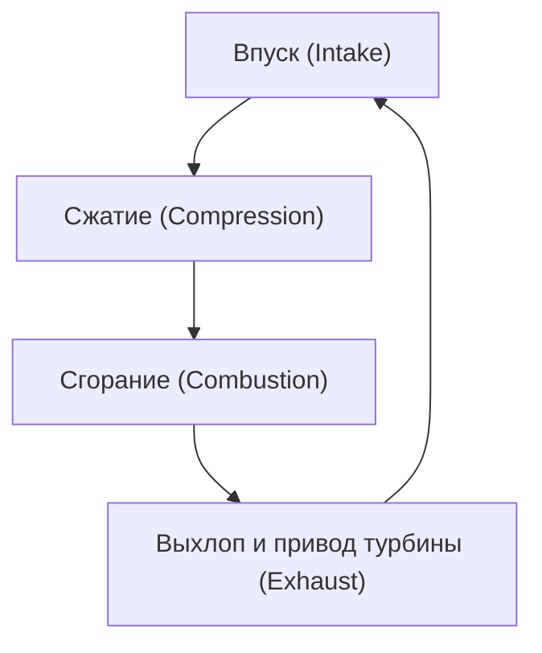
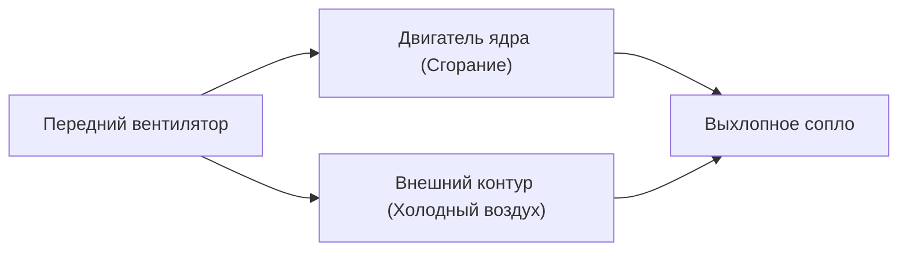

## Введение: источник энергии, изменивший воздушные путешествия

Одним из важнейших технологических прорывов, обеспечивающих современные воздушные перевозки, стала разработка турбовентиляторного двигателя. Пассажирские самолеты, которыми мы пользуемся как чем-то само собой разумеющимся, летают в суровых условиях на высоте 10 000 метров, безопасно и экономично со скоростью, близкой к скорости звука. Это стало возможным благодаря турбовентиляторному двигателю, который сочетает в себе огромную тягу и потрясающую топливную эффективность.

В этой статье мы подробно рассмотрим базовые принципы работы реактивного двигателя, исходя из термодинамического цикла «впуск-сжатие-сгорание-выхлоп», и проследим, как первые турбореактивные двигатели эволюционировали в современные турбовентиляторные. Особое внимание уделим магии «степени двухконтурности» (bypass ratio), лежащей в основе этой эволюции. Кроме того, мы затронем инженерные достижения, позволяющие двигателям работать в условиях сверхвысоких температур (в тысячи градусов), включая технологии охлаждения лопаток турбины и применение передовых материалов, таких как монокристаллические сплавы.

---

## Базовый принцип реактивного двигателя: цикл Брайтона

Принцип работы реактивного двигателя моделируется в термодинамике как «цикл Брайтона» (Brayton cycle). Это цикл тепловой машины, предполагающий непрерывный поток жидкости или газа, который состоит из следующих четырех процессов:

1. **Впуск (Intake)**: Всасывание воздуха спереди.
2. **Сжатие (Compression)**: Сжатие всосанного воздуха до высокого давления с помощью компрессора.
3. **Сгорание (Combustion)**: Впрыск топлива в воздух под высоким давлением и его сжигание для создания высокотемпературных газов высокого давления.
4. **Выхлоп (Exhaust)**: Выброс расширяющихся газов назад для получения тяги (и одновременное вращение турбины, приводящей в действие компрессор).

Эта последовательность процессов похожа на работу поршневых двигателей, используемых в автомобилях, но главным отличием реактивного двигателя является их «непрерывность». В то время как поршневой двигатель получает мощность за счет прерывистых взрывов, реактивный двигатель непрерывно всасывает воздух, сжигает топливо и выбрасывает газы. Это позволяет достичь чрезвычайно высокой удельной мощности и плавного вращательного движения.

### Важность сжатия
Зачем нужно сжимать воздух? Сжатие воздуха до высокого давления резко повышает эффективность сгорания, позволяя извлечь больше энергии. В передней части реактивного двигателя расположено множество ступеней лопаток компрессора (комбинация статоров и роторов), которые постепенно сжимают воздух. В современных двигателях объем всасываемого воздуха может сжиматься в десятки раз, а давление может превышать атмосферное более чем в 40 раз.

---

## Эволюция от турбореактивного к турбовентиляторному двигателю

Ранние реактивные двигатели имели форму, известную как «турбореактивный двигатель». Турбореактивный двигатель имеет простую конструкцию, при которой весь всасываемый воздух направляется в камеру сгорания, и тяга создается исключительно за счет силы высокотемпературных выхлопных газов, выходящих под высоким давлением.

### Ограничения турбореактивных двигателей
Турбореактивные двигатели подходят для высокоскоростных полетов (особенно сверхзвуковых), но в дозвуковом диапазоне (от Маха 0.8 до 0.9), на котором летают коммерческие авиалайнеры, у них было несколько серьезных недостатков.

1. **Низкая тяговая эффективность**: Поскольку скорость выхлопных газов слишком высока по сравнению со скоростью полета, большая часть кинетической энергии тратится впустую. Чтобы повысить тяговую эффективность, нужно приблизить скорость выхлопа к скорости полета, выбрасывая при этом назад больший объем воздуха.
2. **Плохая топливная эффективность**: Из-за высокой зависимости тяги от процесса сгорания расход топлива очень велик.
3. **Проблема шума**: Сильное столкновение высокоскоростных выхлопных газов с окружающим неподвижным воздухом вызывает оглушительный реактивный шум (шум сдвига).

### Рождение турбовентиляторного двигателя и магия «степени двухконтурности»
Для решения этих проблем был разработан «турбовентиляторный двигатель». Его главная особенность — наличие огромного «вентилятора», похожего на пропеллер, в самом начале двигателя.

Не весь воздух, всасываемый вентилятором, попадает в ядро двигателя (компрессор, камера сгорания, турбина). Воздушный поток разделяется на две части:
- **Внутренний контур (Core flow)**: Воздух, поступающий в ядро двигателя и используемый для сгорания.
- **Внешний контур (Bypass flow)**: Воздух, проходящий мимо ядра и выбрасываемый прямо назад.

Соотношение «количества воздуха, проходящего мимо ядра» к «количеству воздуха, проходящего через ядро», называется **степенью двухконтурности (Bypass Ratio)**.

#### Почему выгодно повышать степень двухконтурности?
В современных двигателях для коммерческих самолетов преобладают «турбовентиляторные двигатели с высокой степенью двухконтурности», превышающей 10:1. Это означает, что более 90% всасываемого воздуха не используется для сгорания, а напрямую создает тягу.

Высокая степень двухконтурности дает следующие огромные преимущества:
1. **Кардинальное улучшение топливной экономичности**: Согласно закону сохранения импульса, гораздо эффективнее использовать вентилятор для выталкивания большого количества воздуха с относительно небольшой скоростью, чем сжигать топливо и выбрасывать небольшое количество газов с огромной скоростью. Это резко улучшило топливную экономичность и сделало возможными массовые дальние перевозки.
2. **Значительное снижение шума**: Низкотемпературный и низкоскоростной воздушный поток от вентилятора как бы обволакивает высокотемпературные и высокоскоростные выхлопные газы, выходящие из ядра. Это сглаживает разницу в скоростях между выхлопными газами и внешним воздухом, что значительно снижает сдвиг воздуха, вызывающий шум. Именно благодаря этому «эффекту звукоизоляции» потока во внешнем контуре окрестности современных аэропортов стали намного тише.

---

## Вызов пределам: сверхвысокие температуры и технологии охлаждения

Для повышения производительности (особенно теплового КПД) реактивного двигателя необходимо максимально повысить температуру в камере сгорания (температуру на входе в турбину, TIT). В соответствии с принципом цикла Карно, чем выше температура источника тепла, тем выше КПД двигателя.

Температура на входе в турбину современных высокопроизводительных турбовентиляторных двигателей достигает поразительных **1500°C – 1700°C**.
Но здесь возникает серьезная проблема. Температура плавления жаропрочных сплавов на основе никеля, из которых делают лопатки турбины, составляет примерно **1300°C – 1400°C**. То есть лопатки подвергаются воздействию газов с **температурой, превышающей температуру их плавления**. При обычных условиях они бы мгновенно расплавились, но этого не происходит благодаря передовым технологиям охлаждения и материаловедения.

### Технология пленочного охлаждения
Внутри лопатки турбины полые, и туда подается относительно холодный воздух, отбираемый от компрессора (до процесса сгорания). Этот воздух проходит внутри лопатки, охлаждая ее, а затем выходит наружу через множество крошечных отверстий, проделанных лазером на поверхности лопатки.
Выходящий воздух формирует тонкую пленку на поверхности, не позволяя газам с температурой в тысячи градусов напрямую контактировать с металлической поверхностью лопатки. Это называется «пленочным охлаждением».

### Монокристаллические сплавы (Single Crystal Superalloys)
Помимо технологий охлаждения, необходима эволюция самих металлов. Обычно металл имеет «поликристаллическую» структуру, состоящую из множества крошечных кристаллов. Однако в условиях турбины, где действуют высокие температуры и огромная центробежная сила, на границах кристаллов легко возникает так называемая «ползучесть» (деформация и разрыв металла).

Чтобы предотвратить это, инженеры разработали технологию отливки целой лопатки в виде «одного единственного кристалла». Это называется «монокристаллическим сплавом» (SC). Благодаря отсутствию границ кристаллов они сохраняют невероятную прочность даже в условиях экстремальных температур и напряжений. В настоящее время разрабатываются 5-е и 6-е поколения монокристаллических сплавов, жаропрочность которых еще больше повышена за счет добавления таких редких металлов, как рений и рутений.

---

## Будущее и устойчивость авиационных двигателей

Турбовентиляторные двигатели продолжают развиваться и сегодня. От двигателей следующего поколения требуется еще большее повышение степени двухконтурности, и для этого внедряются такие технологии, как «редукторный турбовентиляторный двигатель» (Geared Turbofan, GTF), который позволяет вентилятору вращаться с оптимальной скоростью, отличной от скорости ядра двигателя. Благодаря этому вентилятор может вращаться медленнее (тише и эффективнее), а турбина ядра — быстрее (с высокой эффективностью).

Кроме того, в качестве ответа на глобальные экологические проблемы, ускоренными темпами ведется внедрение экологически чистого авиационного топлива (Sustainable Aviation Fuel, SAF), а также разработка водородных двигателей и гибридных силовых установок, сочетающих в себе электродвигатели.

История реактивного двигателя — это история человеческих усилий, раздвигающих границы термодинамики, гидродинамики и материаловедения. Когда мы летим по небу, под крыльями тихо, но мощно пульсирует сплав пламени в тысячи градусов и сверхточной инженерии.
