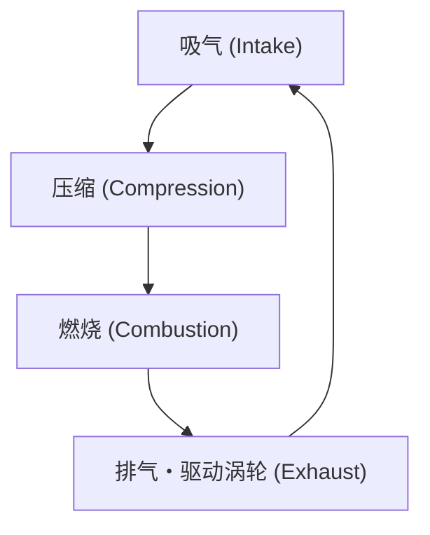
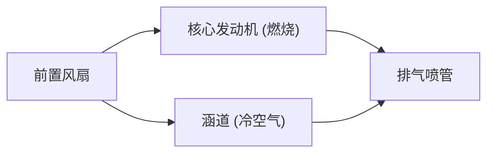

## 引言：改变空中旅行的动力源

支撑现代航空运输的最重要技术突破之一，就是涡轮风扇发动机的开发。我们日常乘坐的客机，能够在高度1万米的严酷环境下，以接近音速的速度安全且经济地飞行。使这一切成为可能的，正是兼顾了巨大推力与惊人燃油效率的涡轮风扇发动机。

本文将从喷气式发动机的基本原理——“吸气、压缩、燃烧、排气”的热力学循环出发，深入探讨早期的涡轮喷气发动机是如何演变为现代的涡轮风扇发动机的，以及作为其进化核心的“涵道比（Bypass Ratio）”的魔法。此外，我们还将探索能够承受数千度超高温环境的涡轮叶片冷却技术，以及单晶合金等最尖端材料工程，揭开汇聚工程学精华的喷气式发动机的全貌。

---

## 喷气式发动机的基本原理：布雷顿循环

喷气式发动机的工作原理，在热力学中被模型化为“布雷顿循环（Brayton cycle）”。这是一种以连续流体流动为前提的热机循环，由以下4个过程组成：

1. **吸气（Intake）**: 从前方吸入空气。
2. **压缩（Compression）**: 用压缩机（Compressor）将吸入的空气压缩至高压。
3. **燃烧（Combustion）**: 向高压空气喷射燃料并使其燃烧，生成高温高压气体。
4. **排气（Exhaust）**: 将膨胀的气体向后方喷出，通过其反作用力获得推力（同时驱动涡轮以带动压缩机）。

这一系列过程与汽车等使用的往复式发动机（活塞发动机）相似，但喷气式发动机的最大特点在于这些过程是“连续”进行的。往复式发动机通过断续的爆炸获取动力，而喷气式发动机则是不断地吸入空气、燃烧并排出。由此实现了极高的功率密度和顺畅的旋转运动。

### 压缩的重要性
为什么必须压缩空气呢？这是因为将空气加压能显著提高燃烧效率，从而提取出更多的能量。喷气式发动机的前段排列着多级压缩机叶片（静子和转子的组合），空气会被逐渐压缩。在现代发动机中，吸入空气的体积会被压缩到几十分之一，压力有时可达外部空气的40倍以上。

---

## 从涡轮喷气到涡轮风扇的演变

早期的喷气式发动机被称为“涡轮喷气发动机（Turbojet）”。涡轮喷气发动机结构简单，将吸入的空气全部送入燃烧室，仅靠由此产生的高温高压排气气流的动量来获取推力。

### 涡轮喷气发动机的局限性
虽然涡轮喷气发动机适合高速飞行（尤其是超音速飞行），但在民航客机巡航的亚音速（约0.8到0.9马赫）领域，它存在几个严重的缺点。

1. **推进效率低**: 排气速度相对于飞行速度过快，导致大量动能被浪费。为了提高推进效率，需要使排气速度接近飞行速度，同时将大量空气向后推。
2. **燃油效率差**: 高度依赖燃烧产生的推力，导致燃油消耗极大。
3. **噪音问题**: 高速排气气体与周围静止空气剧烈碰撞，会引发极大的喷气噪音（剪切噪音）。

### 涡轮风扇的诞生与“涵道比”的魔法
为了解决这些问题，“涡轮风扇发动机（Turbofan）”应运而生。涡轮风扇发动机最大的特点是，在发动机的最前端配备了一个类似巨大风扇的部件。

由风扇吸入的空气，并不会全部进入发动机中心的核心机（压缩机、燃烧室、涡轮）。气流被分为两部分：
- **核心流（Core flow）**: 进入发动机中心并用于燃烧的空气。
- **涵道流（Bypass flow）**: 绕过核心机外侧，直接向后排出的空气。

这个“不经过核心机的空气量”与“经过核心机的空气量”的比例，被称为**涵道比（Bypass Ratio）**。

#### 为什么提高涵道比更好？
现代客机用发动机的主流是涵道比超过10:1的“高涵道比涡轮风扇发动机”。这意味着吸入的空气中有90%以上未被用于燃烧，而是直接作为推力利用。

高涵道比具有以下巨大的优势：
1. **燃油效率的绝对提升**: 根据动量守恒定律，利用风扇推动大量空气以相对较慢的速度排出，比燃烧燃料以高速喷出少量气体能更有效地获得推力。这极大地改善了燃油经济性，使得长距离、大规模运输成为可能。
2. **噪音的显著降低**: 核心机排出的高温高速气体，被风扇排出的低温低速涵道气流包裹着流动。这缓解了排气气体与外部空气之间的速度差，大幅减少了导致噪音的空气剪切效应。现代机场周边比过去更安静，正是得益于这种涵道流的“隔音效果”。

---

## 挑战极限：超高温与冷却技术

为了提高喷气式发动机的性能（尤其是热效率），必须尽可能提高燃烧室的温度（涡轮进口温度：TIT）。根据卡诺循环原理，热源温度越高，发动机效率就越高。

现代高性能涡轮风扇发动机的涡轮进口温度高达 **1,500℃至1,700℃**。
然而，随之而来的是一个严重的问题。用于制造涡轮叶片的镍基超高温合金的熔点大约在 **1,300℃至1,400℃** 之间。也就是说，叶片**暴露在比自身熔点更高的气体中**。按常理来说，它们会瞬间熔化，但为了防止这种情况，采用了高度发达的冷却技术和材料技术。

### 气膜冷却技术
涡轮叶片内部是中空的，从压缩机抽取的（燃烧前）相对较冷的空气会被送入其中。这些空气流经叶片内部进行冷却，随后通过叶片表面开出的无数微小激光孔渗出到外部。
渗出的空气在叶片表面形成一层薄膜（气膜），防止数千度的高温气体直接接触叶片的金属表面。这被称为“气膜冷却（Film Cooling）”。

### 单晶高温合金（Single Crystal Superalloys）
除了冷却技术外，金属本身的进化也不可或缺。通常金属具有由大量微小晶体聚集而成的“多晶”结构。但在高温且承受强大离心力的涡轮环境中，金属容易从晶体交界处（晶界）变形并断裂，产生“蠕变（Creep）现象”。

为了防止这种情况，工程师们开发出将整个叶片铸造成“单一个晶体”的技术。这就是“单晶合金（SC）”。由于不存在晶界，即使在极限的高温应力环境下，它也能保持惊人的强度。如今，通过添加铼、钌等稀有金属，进一步提高耐热性的第五代、第六代单晶合金已经开发出来。

---

## 航空发动机的未来与可持续性

涡轮风扇发动机至今仍在不断演进。下一代发动机要求进一步提高涵道比，为此，“齿轮传动涡轮风扇（GTF）”等技术已投入实用，该技术能让风扇以与发动机核心机不同的最佳转速旋转。由此，风扇可以转得更慢（降低噪音并提高效率），而核心机的涡轮可以转得更快（高效运转）。

此外，为了应对全球环境问题，引入可持续航空燃料（SAF: Sustainable Aviation Fuel），以及开发氢燃烧发动机、甚至结合电动机的混合动力推进系统的工作也在紧锣密鼓地进行中。

喷气式发动机的历史，是人类不断拓宽热力学、流体力学和材料工程极限的挑战史。当我们在天空中飞行时，机翼之下，数千度的烈焰与超精密工程的结晶正静谧而充满力量地跳动着。
