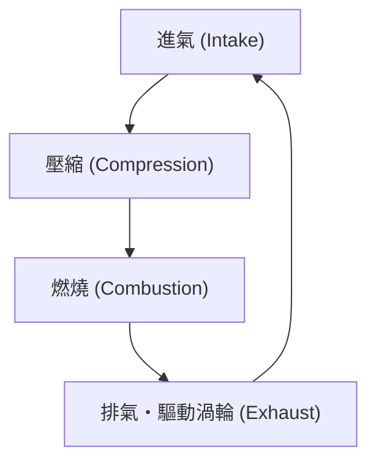
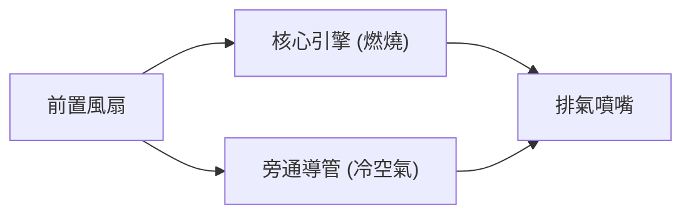

## 前言：改變空中旅行的動力來源

支撐現代航空運輸最重要的技術突破之一，就是渦輪扇引擎（Turbofan engine）的開發。我們習以為常搭乘的客機，能夠在高度一萬公尺的嚴酷環境下，以接近音速的速度安全且具備經濟效益地飛行。使這一切成為可能的，正是兼具巨大推力與驚人燃油效率的渦輪扇引擎。

本文將從噴射引擎的基本原理——「進氣、壓縮、燃燒、排氣」的熱力學循環出發，深入探討早期的渦輪噴射引擎（Turbojet engine）是如何演進成現代的渦輪扇引擎，並詳細解說作為此演進核心的「旁通比（Bypass Ratio）」魔法。此外，我們也將一窺噴射引擎的全貌，了解其如何集結工程學的精粹，包含能承受數千度超高溫環境的渦輪葉片冷卻技術，以及單晶合金等最尖端的材料工程。

---

## 噴射引擎的基本原理：布雷頓循環

噴射引擎的運作原理，在熱力學中被模型化為「布雷頓循環（Brayton cycle）」。這是一種以連續流體流動為前提的熱機循環，由以下四個過程組成：

1. **進氣（Intake）**: 從前方吸入空氣。
2. **壓縮（Compression）**: 利用壓縮機（Compressor）將吸入的空氣加壓。
3. **燃燒（Combustion）**: 將燃料噴入高壓空氣中並使其燃燒，產生高溫高壓的氣體。
4. **排氣（Exhaust）**: 將膨脹的氣體向後方噴出，利用其反作用力獲得推力（同時推動渦輪以驅動壓縮機）。

這一連串的過程，與汽車等所使用的往復式引擎（活塞引擎）相似，但噴射引擎最大的特徵在於這些過程是「連續」進行的。往復式引擎是透過斷續的爆炸來獲得動力，而噴射引擎則是持續不斷地吸入空氣、燃燒並排出。這使得它能夠實現極高的功率密度與平順的旋轉運動。

### 壓縮的重要性
為什麼必須壓縮空氣呢？這是因為將空氣加壓後，能大幅提升燃燒效率，進而萃取出更多的能量。噴射引擎的前段配置了多層疊加的壓縮機葉片（靜子葉片與轉子葉片的組合），將空氣逐漸壓縮。在現代的引擎中，吸入空氣的體積會被壓縮至數十分之一，壓力甚至可能達到外界氣壓的 40 倍以上。

---

## 從渦輪噴射到渦輪扇的演進

早期的噴射引擎被稱為「渦輪噴射引擎（Turbojet engine）」。渦輪噴射引擎的構造很簡單，它將吸入的空氣全數送入燃燒室，僅靠燃燒後產生的高溫高壓排氣的動能來獲得推力。

### 渦輪噴射引擎的極限
雖然渦輪噴射引擎適合高速飛行（特別是超音速飛行），但在民航客機飛行的次音速（大約 0.8 到 0.9 馬赫）領域中，存在幾個嚴重的缺點：

1. **較低的推進效率**: 由於排氣速度相較於飛行速度實在太快了，導致許多動能被白白浪費。為了提升推進效率，必須在讓排氣速度接近飛行速度的同時，將更大量的空氣向後推。
2. **極差的燃油效率**: 因為推力高度依賴燃燒過程，使得燃料消耗非常劇烈。
3. **噪音問題**: 高速的排氣與周圍靜止的空氣產生激烈碰撞，會引發極度巨大的噴射噪音（剪切噪音）。

### 渦輪扇引擎的誕生與「旁通比」的魔法
為了解決這些課題而開發出來的，就是「渦輪扇引擎」。渦輪扇引擎最大的特徵，在於引擎的最前端具備了一個宛如巨大電風扇的「風扇（Fan）」。

由風扇吸入的空氣，並不會全部進入引擎中心的「核心（包含壓縮機、燃燒室、渦輪）」。氣流會被分成兩部分：
- **核心氣流（Core flow）**: 進入引擎中心，用於燃燒的空氣。
- **旁通氣流（Bypass flow）**: 通過核心外側，直接向後方排出的空氣。

這個「不通過核心的空氣量」與「通過核心的空氣量」的比例，就被稱為**旁通比（Bypass Ratio）**。

#### 為什麼提高旁通比會比較好？
現代的客機引擎，主流是旁通比超過 10:1 的「高旁通比渦輪扇引擎」。這意味著吸入的空氣中有 90% 以上並未被用於燃燒，而是直接轉化為推力來使用。

高旁通比具有以下極大的優勢：
1. **壓倒性的燃油效率提升**: 根據動量守恆定律，比起燃燒燃料並高速噴出少量的氣體，利用風扇將大量空氣以較慢的速度向後推，能更有效率地獲得推力。這大幅改善了燃油效率，使得長距離的大量運輸成為可能。
2. **噪音的劇烈降低**: 從核心排出高溫、高速的排氣，會被從風扇排出低溫、低速的旁通氣流所包覆。這減緩了排氣與外界空氣之間的速度差，大幅減少了造成噪音的空氣剪切作用。現代機場周邊能比過去更為安靜，正是拜這層旁通氣流的「防音效果」所賜。

---

## 挑戰極限：超高溫與冷卻技術

為了提升噴射引擎的性能（特別是熱效率），必須盡可能提高燃燒室的溫度（渦輪進氣溫度：TIT, Turbine Inlet Temperature）。根據卡諾循環（Carnot cycle）的原理，熱源溫度越高，引擎的效率就越好。

現代高性能渦輪扇引擎的渦輪進氣溫度，竟然高達 **1,500℃ 至 1,700℃**。
然而，這引發了一個嚴重的問題。用於製造渦輪葉片的鎳基超合金，其熔點（融化的溫度）大約只有 **1,300℃ 至 1,400℃** 左右。也就是說，葉片是**暴露在比自身熔點還要高的氣體之中**。照理說它應該會瞬間熔毀，但為了防止這種情況發生，有著高度的冷卻技術與材料技術在背後支撐。

### 薄膜冷卻技術（Film Cooling）
渦輪葉片的內部是空心的，從壓縮機抽取（尚未燃燒）的相對冷空氣會被送入其中。這些空氣除了在葉片內部流通進行冷卻外，還會從葉片表面佈滿的無數微小雷射孔中滲透出來。
滲出的空氣會在葉片表面形成一層薄膜（Film），防止數千度的高溫氣體直接接觸到葉片的金屬表面。這被稱為「薄膜冷卻」。

### 單晶合金（Single Crystal Superalloys）
除了冷卻技術，金屬本身的進化也不可或缺。金屬通常是由許多微小結晶聚集而成的「多晶」結構。但在高溫且承受強大離心力的渦輪環境下，金屬很容易從結晶與結晶的交界處（晶界）發生變形甚至被撕裂，這種現象稱為「潛變（Creep）」。

為了防止這種情況，工程師開發出將整個葉片鑄造成「單一結晶」的技術。這就是「單晶合金（SC）」。因為不存在結晶交界，所以在極端的高溫應力環境下依然能保持驚人的強度。目前，透過添加錸（Rhenium）或釕（Ruthenium）等稀有金屬，已經開發出耐熱性更高的第五代、第六代單晶合金。

---

## 航空引擎的未來與永續性

渦輪扇引擎至今仍持續在進化。次世代引擎被要求進一步提升旁通比，為為此，讓風扇以不同於引擎核心的最佳轉速運轉的「齒輪傳動渦輪扇（GTF, Geared Turbofan）」等技術已投入實用。這使得風扇可以轉得更慢（抑制噪音且更有效率），而核心渦輪可以轉得更快（高效率）。

此外，為了因應全球環境問題，導入永續航空燃料（SAF, Sustainable Aviation Fuel）、開發氫燃燒引擎，甚至是結合電動馬達的混合動力推進系統，都在緊鑼密鼓地進行中。

噴射引擎的歷史，就是人類不斷拓展熱力學、流體力學與材料工程極限的挑戰史。當我們在空中飛行時，機翼之下，那數千度的烈焰與超精密工程的結晶，正靜靜地、卻充滿力量地跳動著。
