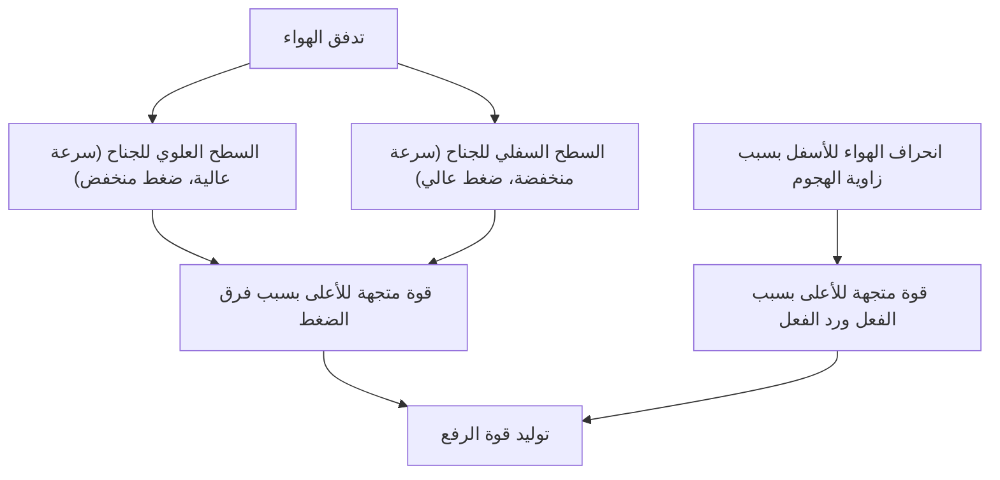
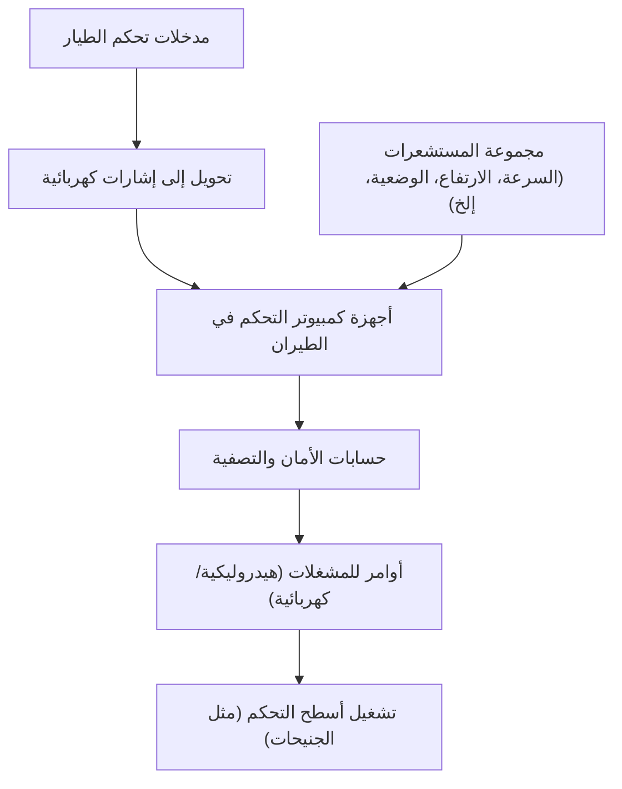

## مقدمة: لماذا تطفو هذه الكتلة الحديدية الطائرة؟

كيف يمكن لطائرة جامبو نفاثة ضخمة تزن مئات الأطنان أن تحلق بخفة في السماء وتطير بسرعة 900 كيلومتر في الساعة على ارتفاع 10,000 متر؟ وراء ذلك تكمن قرون من التطور في ديناميكا الموائع، الديناميكا الحرارية، هندسة المواد، وعلوم الكمبيوتر المتقدمة الحديثة.

في هذا المقال، سنشرح بالتفصيل آليات تحليق الطائرات الضخمة، بدءاً من مبادئ توليد قوة الرفع، وأنظمة زيادة الرفع، والمحركات، وأنظمة الضغط، وصولاً إلى أحدث أنظمة التحكم الإلكتروني المعروفة بـ "الطيران بالأسلاك" (Fly-by-wire).

## 1. شكل المقطع العرضي للجناح ومبدأ توليد قوة الرفع

القوة الأساسية التي تمكن الطائرة من الطيران هي "قوة الرفع" (Lift). يكمن مفتاح توليد هذه القوة في شكل المقطع العرضي للجناح المعروف باسم "الجنيح" (Airfoil).

### مبدأ برنولي وقانون نيوتن الثالث للحركة

يرتبط توليد قوة الرفع بشكل أساسي بقانونين فيزيائيين:

1. **مبدأ برنولي**: ينص على أنه كلما زادت سرعة المائع، قل ضغطه. عادة ما تكون أجنحة الطائرات مصممة بحيث يكون سطحها العلوي منتفخاً والسفلي مسطحاً نسبياً (جناح غير متماثل). عند تدفق الهواء حول الجناح، تم تصميم السطح العلوي بحيث يتدفق الهواء فوقه بسرعة أكبر من السطح السفلي. هذا يقلل من ضغط الهواء على السطح العلوي، مما يولد قوة دفع (قوة رفع) بسبب الضغط المرتفع نسبياً من الأسفل.
2. **قانون نيوتن الثالث للحركة (قانون الفعل ورد الفعل)**: تميل الأجنحة لتدفع الهواء إلى الأسفل (زاوية الهجوم). وكنتيجة لدفع الهواء للأسفل (فعل)، يتم دفع الجناح للأعلى كرد فعل.

في هندسة الطيران الحديثة، يُفسر توليد قوة الرفع التي ترفع الهيكل الضخم بالجمع بين هذين التأثيرين.

## 2. أجهزة زيادة الرفع باستخدام القلابات والسدفات

تحلق الطائرة النفاثة بسرعة عالية أثناء الطيران، لذا يمكنها الحصول على قوة رفع كافية بزاوية هجوم صغيرة نسبياً ومساحة جناح عادية. ومع ذلك، عند الإقلاع والهبوط، تحتاج إلى تقليل السرعة، مما قد يؤدي إلى نقص في قوة الرفع والتسبب في "الانهيار" (Stall). لمنع ذلك، تم تجهيزها بـ "أجهزة زيادة الرفع" (High-lift devices).

### السدفات الأمامية (Slats) والقلابات الخلفية (Flaps)

- **السدفات الأمامية (Slats)**: أجهزة تمتد للأمام وللأسفل من الحافة الأمامية للجناح. تعمل على زيادة مساحة الجناح وتسمح للهواء النقي بالتدفق فوق السطح العلوي، مما يمنع انفصال الهواء (انفصال تدفق الهواء عن سطح الجناح) ويسمح بزاوية هجوم أكبر.
- **القلابات الخلفية (Flaps)**: أجهزة تمتد للأسفل من الحافة الخلفية للجناح. تعمل على زيادة تقوس الجناح (Camber) وتوسيع مساحة الجناح لتوليد قوة رفع هائلة حتى عند السرعات المنخفضة.

يتم نشر هذه الأجهزة بشكل معتدل أثناء الإقلاع لزيادة قوة الرفع، وتُفرد إلى أقصى حد أثناء الهبوط للحفاظ على الرفع وزيادة مقاومة الهواء (السحب) لإبطاء الطائرة.

## 3. المحرك التوربيني المروحي: مصدر الدفع القوي

يتم توليد القوة (الدفع) التي تدفع طائرة الجامبو النفاثة للأمام بواسطة "المحرك التوربيني المروحي" (Turbofan engine). وهو المحرك السائد في طائرات الركاب الحديثة، حيث يجمع بين الدفع العالي وكفاءة استهلاك الوقود.

### أهمية نسبة التجاوز

يسحب المحرك التوربيني المروحي كمية كبيرة من الهواء من خلال مروحة ضخمة في المقدمة. ينقسم هذا الهواء إلى مسارين:
1. **الهواء المار عبر المحرك الأساسي**: يتم ضغطه بضغط عالٍ بواسطة الضاغط، ويُمزج بالوقود في غرفة الاحتراق لينفجر ويحترق. تقوم غازات العادم ذات درجة الحرارة والضغط العاليين بتدوير التوربين الذي يشغل المروحة والضاغط.
2. **الهواء الذي يتجاوز المحرك الأساسي (التدفق الالتفافي)**: يتم تسريعه بواسطة المروحة وطرده للخلف مباشرة.

في الطائرات الحديثة، تكون نسبة التدفق الالتفافي إلى تدفق المحرك الأساسي (نسبة التجاوز) عالية جداً (مثل 10 إلى 1). في الواقع، يتولد معظم الدفع (حوالي 80%) بواسطة هذا التدفق الالتفافي. وهذا يؤدي إلى تقليل الضوضاء وتحسين كبير في كفاءة استهلاك الوقود.

## 4. البيئة القاسية على ارتفاع 10,000 متر ونظام الضغط

البيئة على ارتفاع التحليق البالغ حوالي 10,000 متر (حوالي 33,000 قدم) قاسية جداً على البشر:
- **درجة الحرارة**: حوالي 50 درجة مئوية تحت الصفر.
- **الضغط الجوي**: حوالي ربع الضغط عند مستوى سطح البحر.
- **تركيز الأكسجين**: خفيف جداً بحيث لا يمكن للإنسان التنفس.

### الضغط وتكييف الهواء لحماية الركاب

لحماية الركاب من هذه البيئة شديدة البرودة والضغط المنخفض، تعمل "أنظمة الضغط" و "نظام التحكم البيئي" (ECS).

يتم استخدام الهواء عالي الحرارة والضغط المسحوب من المحركات (Bleed air)، حيث يُضبط إلى درجة حرارة وضغط مناسبين من خلال وحدات تكييف الهواء قبل إرساله إلى المقصورة. من خلال فتح وإغلاق صمام التدفق الخارجي (صمام العادم) الموجود في الجزء الخلفي من الطائرة تلقائياً، يتم الحفاظ على ضغط المقصورة بما يعادل ارتفاع حوالي 2400 متر (8000 قدم). تم بناء جسم الطائرة بهيكل أسطواني قوي جداً (حاجز الضغط) لتحمل الضغط الذي يدفع من الداخل للخارج.

## 5. الطيران بالأسلاك: شبكة التحكم الإلكتروني في الطيران الحديثة

في الماضي، كانت حركات عصا التحكم في الطائرات تُنقل مباشرة إلى الأنظمة الهيدروليكية وأسطح التحكم في الطيران (الجنيحات، الروافع، الدفات) عبر كابلات معدنية وبكرات. لكن طائرات الجامبو النفاثة الحديثة تستخدم نظام تحكم إلكتروني يُعرف باسم "الطيران بالأسلاك" (Fly-by-wire: FBW).

### تصميم أمان يتدخل فيه الكمبيوتر

في نظام FBW، تُحول مدخلات الطيار إلى إشارات كهربائية تُرسل إلى عدة أجهزة كمبيوتر تتحكم في الطيران. تقوم أجهزة الكمبيوتر بمقارنة هذه البيانات ببيانات من مستشعرات مختلفة مثل سرعة الطائرة، وارتفاعها، ووضعيتها، وتحسب في أجزاء من الثانية "ما إذا كانت هذه الحركة آمنة".

- **حماية غلاف الطيران**: حتى إذا حاول الطيار عن طريق الخطأ القيام بحركة عنيفة قد تؤدي إلى انهيار الطائرة أو تجاوز الحدود الهيكلية، فإن الكمبيوتر يقوم تلقائياً بالتصحيح والتقييد لمنع الوقوع في حالة خطرة.
- **ضمان التكرار**: يتم تكرار الأنظمة الحيوية ثلاث أو أربع مرات، بحيث إذا تعطل أحد أجهزة الكمبيوتر أو المستشعرات، يمكن للطائرة مواصلة الطيران بأمان.

## الخاتمة: ذروة العلم والهندسة

طائرة الجامبو النفاثة التي نستخدمها دون التفكير كثيراً في تفاصيلها، هي تجسيد للحكمة البشرية، حيث تم حساب كل جزء ونظام فيها بدقة متناهية. في المرة القادمة التي تستقل فيها طائرة، لما لا تحاول ملاحظة حركة الأجنحة خارج النافذة والاختلافات الطفيفة في أصوات المحرك، لتشعر بهذه الآليات المعقدة والدقيقة؟ بالتأكيد ستصبح رحلتك الجوية أكثر إثارة وإلهاماً.
