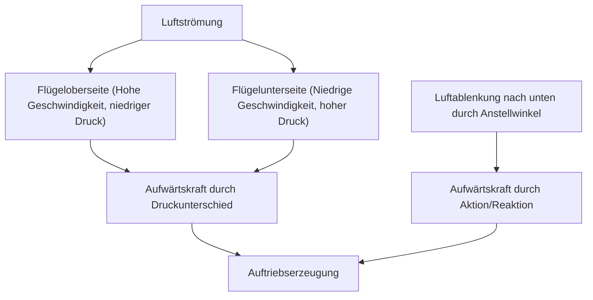
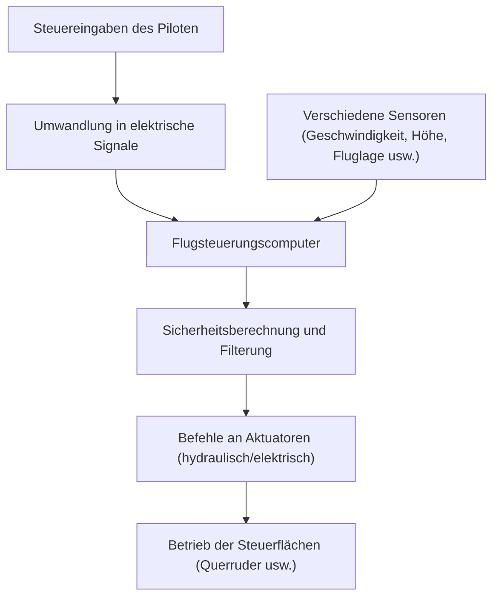

## Einleitung: Warum können fliegende Eisenklumpen fliegen?

Wie kann ein riesiger Jumbo-Jet mit einem Gewicht von hunderten von Tonnen sanft in die Luft aufsteigen und in 10.000 Metern Höhe mit einer halsbrecherischen Geschwindigkeit von 900 Stundenkilometern kreuzen? Dahinter verbirgt sich das Ergebnis jahrhundertelanger Fluiddynamik, Thermodynamik, Materialwissenschaft und moderner fortschrittlicher Informatik.

In diesem Artikel werden wir die Mechanismen, die riesige Flugzeuge zum Fliegen bringen, von den Prinzipien der Auftriebserzeugung bis hin zu Hochauftriebssystemen, Triebwerken, Druckkabinen und den neuesten elektronischen Steuerungssystemen, genannt Fly-by-Wire, im Detail erläutern.

## 1. Flügelquerschnitt und das Prinzip der Auftriebserzeugung

Die grundlegendste Kraft, die ein Flugzeug fliegen lässt, ist der „Auftrieb (Lift)“. Der Schlüssel zur Erzeugung von Auftrieb liegt in der Form des Flügelquerschnitts, dem „Tragflächenprofil (Airfoil)“.

### Bernoullis Theorem und das dritte Newtonsche Gesetz

Hauptsächlich zwei physikalische Gesetze sind an der Erzeugung von Auftrieb beteiligt.

1. **Bernoullis Theorem**: Das Gesetz besagt, dass bei einer Erhöhung der Strömungsgeschwindigkeit eines Fluids der Druck abnimmt. Flugzeugflügel haben im Allgemeinen eine Ausbuchtung auf der Oberseite und eine relativ flache Unterseite (asymmetrisches Profil). Wenn Luft um den Flügel strömt, ist die Luft, die über die Oberseite strömt, so konstruiert, dass sie schneller strömt als die über die Unterseite. Dies senkt den Luftdruck auf der Oberseite des Flügels und erzeugt eine Kraft (Auftrieb), die durch den relativ höheren Luftdruck auf der Unterseite nach oben drückt.
2. **Newtons drittes Bewegungsgesetz (Aktions-Reaktions-Prinzip)**: Der Flügel ist so geneigt (Anstellwinkel), dass er die Luft nach unten ablenkt. Als Reaktionskraft auf das Ablenken der Luft nach unten (Aktion) wird der Flügel nach oben gedrückt (Reaktion).

In der modernen Luftfahrttechnik wird erklärt, dass die Kombination dieser beiden Effekte den Auftrieb erzeugt, der das riesige Flugzeug anhebt.

## 2. Hochauftriebssysteme durch Klappen und Vorflügel

Da Jet-Flugzeuge während des Reiseflugs mit hoher Geschwindigkeit fliegen, können sie mit einem relativ kleinen Anstellwinkel und einer kleinen Flügelfläche ausreichend Auftrieb erhalten. Beim Start und bei der Landung müssen sie jedoch die Geschwindigkeit reduzieren. Andernfalls reicht der Auftrieb nicht aus und sie würden einen Strömungsabriss (Stall) erleiden. Um dies zu verhindern, sind „Hochauftriebssysteme (High-lift devices)“ installiert.

### Vorflügel (Slats) an der Vorderkante und Klappen (Flaps) an der Hinterkante

- **Vorflügel**: Dies sind Vorrichtungen, bei denen die Vorderkante des Flügels nach vorne und unten ausfährt. Dies vergrößert die Flügelfläche, lässt frische Luft über die Flügeloberseite strömen, verhindert die Strömungsablösung (ein Phänomen, bei dem sich der Luftstrom von der Flügeloberfläche löst) und ermöglicht einen größeren Anstellwinkel.
- **Klappen**: Vorrichtungen, die sich am hinteren Rand des Flügels nach unten entfalten. Durch die Vergrößerung der Wölbung (Camber) des gesamten Flügels und die weitere Ausdehnung der Flügelfläche erzeugen sie auch bei niedrigen Geschwindigkeiten extrem großen Auftrieb.

Beim Start werden diese Vorrichtungen moderat ausgefahren, um den Auftrieb zu erhöhen, und bei der Landung werden sie maximal ausgefahren, um den Auftrieb zu erhalten und gleichzeitig den Luftwiderstand (Drag) zu erhöhen, um das Flugzeug abzubremsen.

## 3. Turbofan-Triebwerk: Die Quelle gewaltigen Schubs

Die Kraft (Schub), die einen Jumbo-Jet vorwärtsbewegt, wird vom „Turbofan-Triebwerk“ erzeugt. Es ist der Mainstream der modernen Passagierflugzeugtriebwerke und kombiniert hohen Schub mit hervorragender Treibstoffeffizienz.

### Die Bedeutung des Nebenstromverhältnisses

Turbofan-Triebwerke saugen große Mengen Luft mit einem riesigen Fan (Gebläse) an der Vorderseite an. Die angesaugte Luft wird in zwei Pfade geteilt.
1. **Luft durch das Kerntriebwerk**: Wird im Kompressor auf hohen Druck verdichtet, in der Brennkammer mit Treibstoff gemischt, entzündet und verbrannt. Die heißen Hochdruck-Abgase drehen die Turbine, die wiederum den Fan und den Kompressor antreibt.
2. **Luft, die das Kerntriebwerk umgeht (Bypass-Strom)**: Wird vom Fan beschleunigt und direkt nach hinten ausgestoßen.

In modernen Passagierflugzeugen ist das Verhältnis zwischen dem Bypass-Strom und dem Kerntriebwerksstrom (Nebenstromverhältnis) sehr hoch eingestellt (z. B. 10:1). Tatsächlich wird der Großteil des Schubs (etwa 80 %) von diesem Bypass-Strom erzeugt. Dies reduziert den Lärm erheblich und verbessert die Treibstoffeffizienz drastisch.

## 4. Die raue Umgebung in 10.000 Metern Höhe und das Drucksystem

Der Himmel auf einer Reiseflughöhe von etwa 10.000 Metern (ca. 33.000 Fuß) ist eine extrem raue Umgebung für Menschen.
- **Temperatur**: Etwa minus 50 Grad Celsius
- **Luftdruck**: Etwa ein Viertel des Drucks auf Meereshöhe
- **Sauerstoffkonzentration**: Zu dünn für Menschen zum Atmen

### Druckbeaufschlagung und Klimatisierung zum Schutz der Passagiere

Um die Passagiere vor dieser extrem kalten und niederdruckbelasteten Umgebung zu schützen, sind das „Drucksystem“ und das „Environmental Control System (ECS)“ in Betrieb.

Unter Verwendung von Hochtemperatur- und Hochdruckluft, die den Triebwerken entnommen wird (Bleed Air), wird diese durch Klimaanlagenpakete (Packs) auf eine geeignete Temperatur und einen geeigneten Druck eingestellt, bevor sie in die Kabine geleitet wird. Ein Ausströmventil (Outflow Valve) im hinteren Teil des Flugzeugs öffnet und schließt automatisch, um den Kabinendruck auf einem Äquivalent von etwa 2.400 Metern (8.000 Fuß) Höhe zu halten. Der Rumpf des Flugzeugs ist mit einer sehr starken zylindrischen Struktur (Druckschott) gebaut, um dem Druck standzuhalten, der versucht, ihn von innen aufzublähen.

## 5. Fly-by-Wire: Modernes elektronisches Flugsteuerungsnetzwerk

Flugzeuge der Vergangenheit übertrugen Bewegungen des Steuerknüppels direkt über Metallkabel und Umlenkrollen auf Hydrauliksysteme und Steuerflächen (Querruder, Höhenruder, Seitenruder). Moderne Jumbo-Jets verwenden jedoch ein elektronisches Steuerungssystem namens „Fly-by-Wire (FBW)“.

### Sicherheitsdesign mit Computer-Intervention

Bei FBW werden die Steuereingaben des Piloten in elektrische Signale umgewandelt und an mehrere Flugsteuerungscomputer gesendet. Die Computer vergleichen die Daten von verschiedenen Sensoren wie Fluggeschwindigkeit, Höhe und Fluglage und berechnen sofort, „ob das Manöver sicher ist“.

- **Flight Envelope Protection (Flugbereichsschutz)**: Selbst wenn der Pilot versehentlich versucht, ein extremes Manöver durchzuführen, das zu einem Strömungsabriss führen oder die strukturellen Grenzen des Flugzeugs überschreiten könnte, korrigiert und begrenzt der Computer dies automatisch und verhindert, dass das Flugzeug in einen gefährlichen Zustand gerät.
- **Sicherstellung von Redundanz**: Wichtige Systeme sind drei- oder vierfach multiplexiert, so dass das Flugzeug auch bei Ausfall einiger Computer oder Sensoren sicher weiterfliegen kann.

## Fazit: Der Höhepunkt von Wissenschaft und Technik

Die Jumbo-Jets, die wir beiläufig nutzen, sind die Kristallisation der menschlichen Weisheit, wobei jedes Teil und System bis zum Äußersten berechnet wurde. Das nächste Mal, wenn Sie an Bord eines Flugzeugs sind, nehmen Sie sich einen Moment Zeit, um diese komplexen und ausgeklügelten Mechanismen anhand der Bewegungen der Flügel außerhalb des Fensters oder der feinen Unterschiede im Geräusch der Triebwerke wahrzunehmen. Dies wird Ihre Flugreise noch faszinierender und inspirierender machen.
