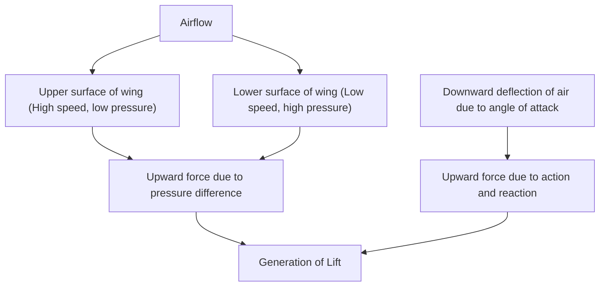
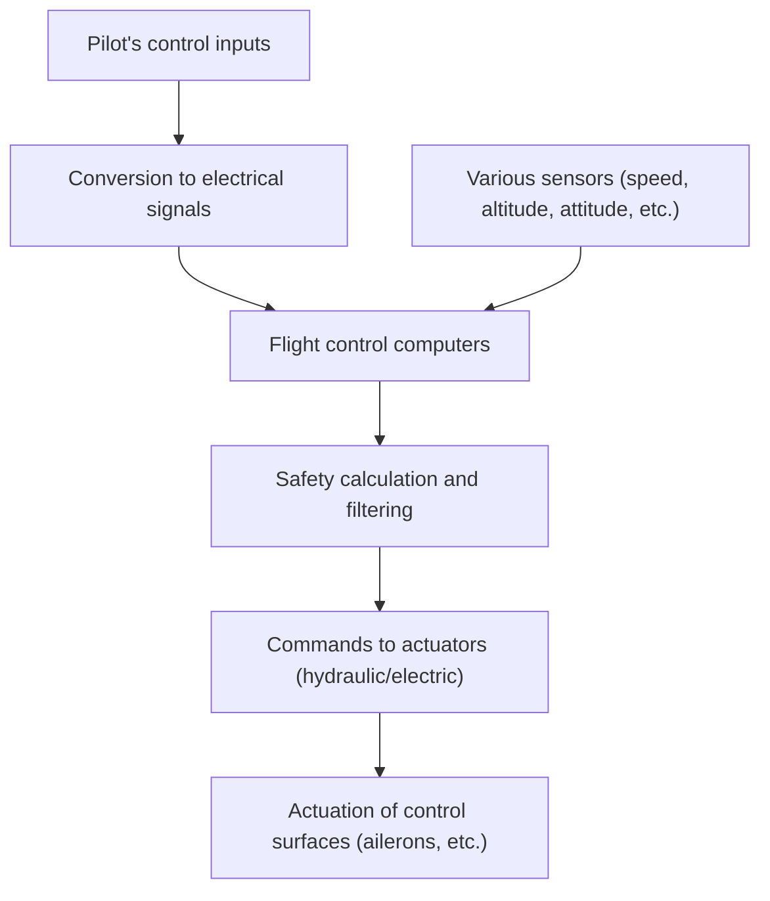

## Introduction: Why Do Flying Lumps of Iron Stay Aloft?

How can a massive jumbo jet, weighing hundreds of tons, gently soar into the sky and cruise at an altitude of 10,000 meters at a breakneck speed of 900 kilometers per hour? Behind this lies the culmination of centuries of fluid dynamics, thermodynamics, materials engineering, and modern advanced computer science.

In this article, we will thoroughly explain the mechanisms that allow massive aircraft to fly, from the principles of lift generation to high-lift devices, engines, pressurization systems, and the latest electronic control systems called fly-by-wire.

## 1. Wing Cross-Section and the Principle of Lift Generation

The most fundamental force for an airplane to fly in the sky is "Lift". The key to generating lift lies in the wing's cross-sectional shape, known as an "Airfoil".

### Bernoulli's Principle and Newton's Third Law of Motion

Two main physical laws are deeply involved in the generation of lift.

1. **Bernoulli's Principle**: A law stating that as the speed of a fluid increases, its pressure decreases. An airplane's wing typically has a shape with a curved upper surface and a relatively flat lower surface (asymmetrical wing). When air flows around the wing, it is designed so that the air flowing over the upper surface flows faster than the lower surface. This lowers the air pressure on the upper surface of the wing, generating an upward pushing force (lift) from the relatively higher pressure on the lower surface.
2. **Newton's Third Law of Motion (Action and Reaction)**: The wings are tilted to push the air downwards (angle of attack). As a reaction force against pushing the air downwards (action), the wing is pushed upwards (reaction).

In modern aeronautical engineering, it is explained that the combination of both effects generates the lift that raises the massive aircraft.

## 2. High-Lift Devices with Flaps and Slats

Since a cruising jet flies at high speeds, it can obtain sufficient lift with a relatively small angle of attack and wing area. However, it needs to slow down during takeoff and landing, and if left as is, it would lack lift and stall. To prevent this, "High-lift devices" are equipped.

### Leading Edge Slats and Trailing Edge Flaps

- **Leading Edge Slats**: Devices where the leading edge of the wing extends forward and downward. This expands the wing area and at the same time channels fresh air over the upper surface of the wing, preventing airflow separation (a phenomenon where the airflow detaches from the wing surface) and enabling a higher angle of attack.
- **Trailing Edge Flaps**: Devices where the trailing edge of the wing deploys downwards. By increasing the overall camber (curvature) of the wing and further expanding the wing area, it generates very large lift even at low speeds.

During takeoff, these devices are moderately deployed to increase lift, and during landing, they are maximally deployed to maintain lift while increasing air resistance (drag) to decelerate the aircraft.

## 3. Turbofan Engines: The Source of Mighty Thrust

The force (thrust) that propels a jumbo jet forward is generated by "Turbofan engines". They are the mainstream of modern passenger aircraft engines, balancing high thrust with excellent fuel efficiency.

### The Importance of Bypass Ratio

A turbofan engine takes in a massive amount of air with a huge fan at the front. The intake air is split into two paths.
1. **Air passing through the core engine**: It is highly compressed by the compressor, mixed with fuel in the combustion chamber, and explodes/burns. This high-temperature, high-pressure exhaust gas turns the turbine, which drives the fan and compressor.
2. **Air bypassing the core engine (Bypass flow)**: It is accelerated by the fan and exhausted to the rear as is.

In modern passenger aircraft, the ratio of the bypass flow to the core engine flow (bypass ratio) is set very high (e.g., 10 to 1). In fact, the majority of the thrust (about 80%) is generated by this bypass flow. This has achieved noise reduction and a dramatic improvement in fuel efficiency.

## 4. The Harsh Environment 10,000 Meters Above and the Pressurization System

The cruising altitude of about 10,000 meters (about 33,000 feet) is a very harsh environment for humans.
- **Temperature**: Around minus 50 degrees Celsius
- **Atmospheric Pressure**: About one-fourth of that on the ground
- **Oxygen Concentration**: Too thin for humans to breathe

### Pressurization and Air Conditioning to Protect Passengers

To protect passengers from this extremely cold and low-pressure environment, the "Pressurization System" and "Environmental Control System (ECS)" are in operation.

High-temperature, high-pressure air (bleed air) extracted from the engine is adjusted to appropriate temperature and pressure through air conditioning packs before being sent into the cabin. The outflow valve (exhaust valve) located at the rear of the aircraft automatically opens and closes to maintain the cabin pressure equivalent to an altitude of about 2,400 meters (8,000 feet). The fuselage of the aircraft is made with a very strong cylindrical structure (pressure bulkhead) to withstand the pressure trying to expand from the inside.

## 5. Fly-by-Wire: The Modern Electronic Flight Control Network

Aircraft in the past transmitted the movement of the control column directly to the hydraulic systems and control surfaces (ailerons, elevators, rudder) via metal cables and pulleys. However, modern jumbo jets employ an electronic control system called "Fly-by-wire (FBW)".

### Safety Design Mediated by Computers

In FBW, the pilot's control inputs are converted into electrical signals and sent to multiple flight control computers. The computers compare the inputs with data from various sensors such as the aircraft's speed, altitude, and attitude, and instantly calculate "whether the operation is safe".

- **Flight Envelope Protection**: Even if the pilot mistakenly attempts extreme operations that would exceed the stall or structural limits of the aircraft, the computer automatically applies corrections and limitations to prevent it from falling into a dangerous state.
- **Ensuring Redundancy**: Crucial systems are multiplexed three or four times, designed so that even if some computers or sensors fail, safe flight can be continued.

## Conclusion: The Pinnacle of Science and Engineering

The jumbo jets we casually use are the culmination of human wisdom, with every single part and system calculated to the limit. The next time you board an airplane, why not try to sense these complex and elaborate mechanisms from the movement of the wings seen outside the window and the subtle differences in the sound of the engines? Your journey in the sky is bound to become even more fascinating and moving.
