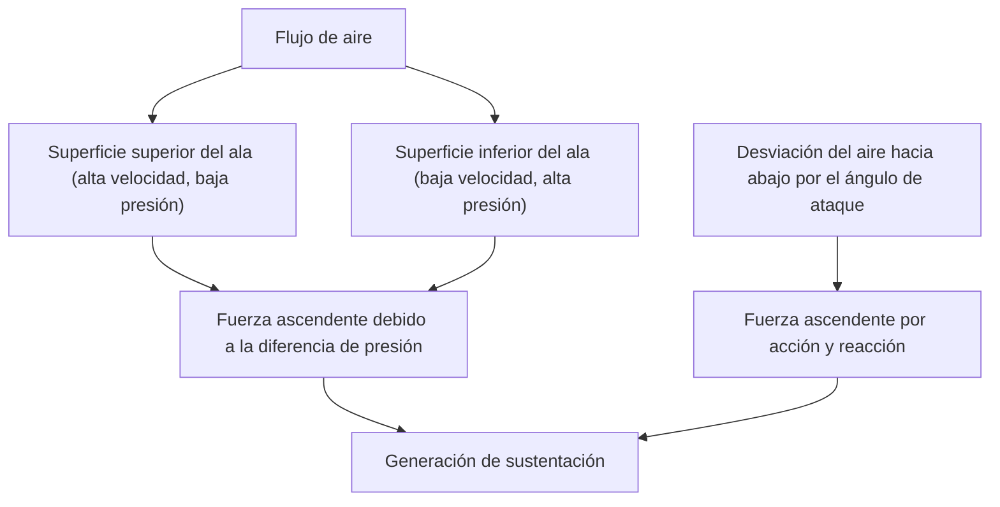
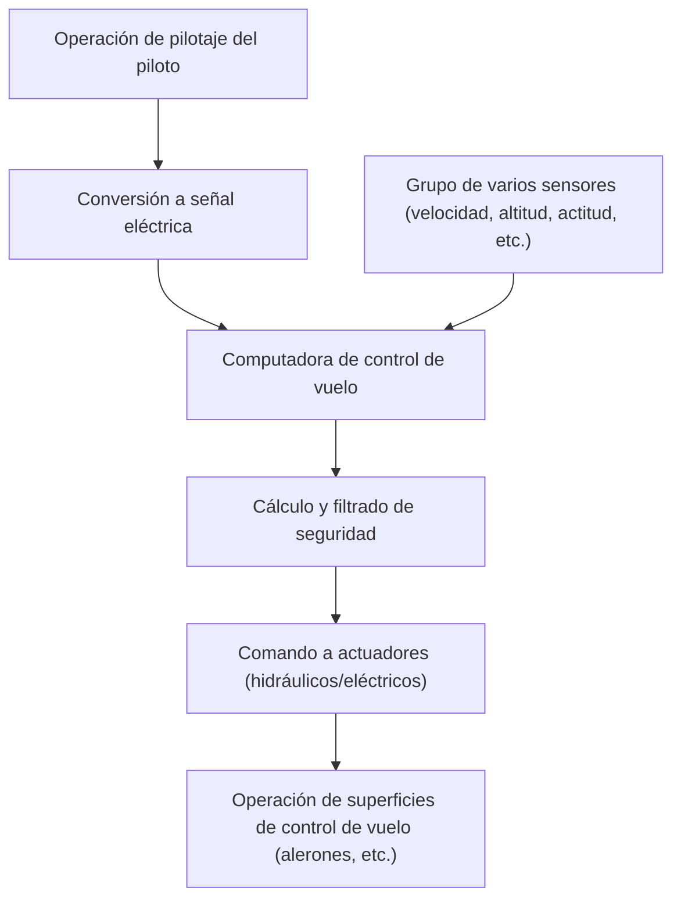

## Introducción: ¿Por qué flota una masa de hierro voladora?

¿Por qué un enorme avión jumbo, que pesa cientos de toneladas, puede elevarse suavemente en el aire y alcanzar una velocidad de crucero de 900 kilómetros por hora a 10.000 metros de altitud? Detrás de esto se encuentra la culminación de siglos de dinámica de fluidos, termodinámica, ingeniería de materiales y ciencia informática avanzada moderna.

En este artículo, explicaremos exhaustivamente los mecanismos que permiten volar a una aeronave gigante, desde el principio de generación de sustentación hasta los dispositivos hipersustentadores, los motores, el sistema de presurización y el último sistema de control electrónico llamado fly-by-wire.

## 1. Forma de la sección transversal del ala y principio de generación de sustentación

La fuerza más fundamental que permite que un avión vuele es la "sustentación" (Lift). La clave para generar sustentación reside en la forma de la sección transversal del ala, conocida como "perfil alar" (Airfoil).

### El teorema de Bernoulli y la tercera ley del movimiento de Newton

Dos leyes de la física están profundamente involucradas en la generación de sustentación:

1. **Teorema de Bernoulli**: Esta ley establece que a medida que aumenta la velocidad de un fluido, su presión disminuye. Las alas de los aviones generalmente están diseñadas de modo que la superficie superior sea convexa y la superficie inferior sea relativamente plana (perfil asimétrico). Cuando el aire fluye alrededor del ala, el aire que fluye sobre la superficie superior está diseñado para fluir más rápido que el de la superficie inferior. Esto reduce la presión del aire en la superficie superior del ala, generando una fuerza (sustentación) que es empujada hacia arriba por la presión relativamente más alta en la superficie inferior.
2. **Tercera ley del movimiento de Newton (ley de acción y reacción)**: El ala está inclinada de manera que empuja el aire hacia abajo (ángulo de ataque). Como fuerza de repulsión contra empujar el aire hacia abajo (acción), el ala es empujada hacia arriba (reacción).

En la ingeniería aeronáutica moderna, se explica que la combinación de ambos efectos crea la sustentación que levanta el enorme fuselaje.

## 2. Dispositivos hipersustentadores mediante flaps y slats

Dado que un avión a reacción vuela a altas velocidades durante la fase de crucero, puede obtener suficiente sustentación con un ángulo de ataque y una superficie alar relativamente pequeños. Sin embargo, durante el despegue y el aterrizaje, es necesario reducir la velocidad, y si las alas permanecen igual, la sustentación será insuficiente y se producirá una pérdida (stall). Para evitar esto, están equipados con "dispositivos hipersustentadores" (High-lift devices).

### Slats del borde de ataque (Slats) y flaps del borde de salida (Flaps)

- **Slats del borde de ataque**: Son dispositivos en los que la parte del borde de ataque del ala se extiende hacia adelante y hacia abajo. Esto expande el área del ala mientras permite que el aire fresco fluya sobre la superficie superior, evitando la separación del aire (un fenómeno donde el flujo de aire se separa de la superficie del ala) y permitiendo un mayor ángulo de ataque.
- **Flaps del borde de salida**: Son dispositivos en los que la parte del borde de salida del ala se despliega hacia abajo. Al aumentar la curvatura (camber) de toda el ala y expandir aún más la superficie alar, generan una sustentación muy grande incluso a bajas velocidades.

Durante el despegue, estos dispositivos se despliegan moderadamente para aumentar la sustentación, y durante el aterrizaje, se despliegan al máximo para mantener la sustentación mientras se aumenta la resistencia del aire (resistencia), desacelerando la aeronave.

## 3. Motor turbofán: la fuente de un empuje inmenso

El "motor turbofán" genera la fuerza (empuje) que impulsa al avión jumbo hacia adelante. Es la corriente principal de los motores de aviones de pasajeros modernos, combinando un alto empuje y una excelente eficiencia de combustible.

### La importancia de la relación de derivación

Un motor turbofán aspira una gran cantidad de aire mediante un ventilador gigante en la parte delantera. El aire aspirado se divide en dos caminos.
1. **Aire que pasa por el motor central**: Es presurizado a alta presión por un compresor, mezclado con combustible en la cámara de combustión, para luego explotar y arder. Estos gases de escape de alta temperatura y alta presión hacen girar la turbina e impulsan el ventilador y el compresor.
2. **Aire que pasa por alto el motor central (flujo de derivación)**: Es acelerado por el ventilador y expulsado directamente hacia atrás.

En los aviones de pasajeros modernos, la relación entre el flujo de derivación y el flujo del motor central (relación de derivación) es muy alta (por ejemplo, 10 a 1). De hecho, la mayor parte del empuje (aproximadamente el 80%) es generada por este flujo de derivación. Esto ha logrado una reducción del ruido y una mejora espectacular en la eficiencia del combustible.

## 4. El duro entorno a 10.000 metros de altitud y el sistema de presurización

La altitud de crucero de aproximadamente 10.000 metros (alrededor de 33.000 pies) es un entorno extremadamente duro para los humanos.
- **Temperatura**: Alrededor de 50 grados bajo cero.
- **Presión atmosférica**: Aproximadamente una cuarta parte de la del nivel del suelo.
- **Concentración de oxígeno**: Demasiado baja para que los humanos puedan respirar.

### Presurización y aire acondicionado para proteger a los pasajeros

Para proteger a los pasajeros de este entorno de frío extremo y baja presión, operan un "sistema de presurización" y un "sistema de control ambiental (ECS)".

Utilizando aire a alta temperatura y alta presión (aire de sangrado) extraído del motor, se ajusta a la temperatura y presión adecuadas a través de equipos de aire acondicionado antes de ser enviado a la cabina. Una válvula de salida (outflow valve) en la parte trasera del fuselaje se abre y se cierra automáticamente para mantener la presión de aire en la cabina equivalente a una altitud de aproximadamente 2.400 metros (8.000 pies). El fuselaje está fabricado con una estructura cilíndrica muy fuerte (mamparo de presión) para resistir la presión que intenta expandirse desde el interior.

## 5. Fly-by-wire: red de vuelo de control electrónico moderna

Los aviones del pasado transmitían directamente el movimiento de la palanca de control a los sistemas hidráulicos y a las superficies de control de vuelo (alerones, timón de profundidad y timón de dirección) a través de cables de metal y poleas. Sin embargo, los aviones jumbo modernos emplean un sistema de control electrónico llamado "fly-by-wire (FBW)".

### Diseño de seguridad mediado por ordenador

En el FBW, las operaciones de pilotaje del piloto se convierten en señales eléctricas y se envían a múltiples computadoras de control de vuelo. Las computadoras comparan esto con los datos de varios sensores, como la velocidad, la altitud y la actitud de la aeronave, y calculan instantáneamente "si la operación es segura o no".

- **Protección de la envolvente de vuelo**: Incluso si el piloto intenta realizar una operación extrema que podría causar una pérdida o exceder los límites estructurales de la aeronave por error, la computadora la corrige y limita automáticamente, evitando que caiga en una situación peligrosa.
- **Garantizar la redundancia**: Los sistemas importantes están triplicados o cuadruplicados para que, en el improbable caso de que alguna computadora o sensor falle, el vuelo pueda continuar de manera segura.

## Conclusión: El pináculo de la ciencia y la ingeniería

El avión jumbo que utilizamos de manera casual es la cristalización de la sabiduría humana, con cada pieza y sistema calculados hasta el límite. La próxima vez que subas a un avión, ¿por qué no intentas percibir estos mecanismos complejos y precisos a través del movimiento de las alas visibles fuera de la ventana o las sutiles diferencias en el sonido del motor? El viaje aéreo seguramente será aún más interesante y conmovedor.
