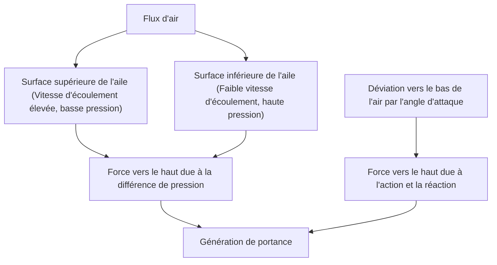
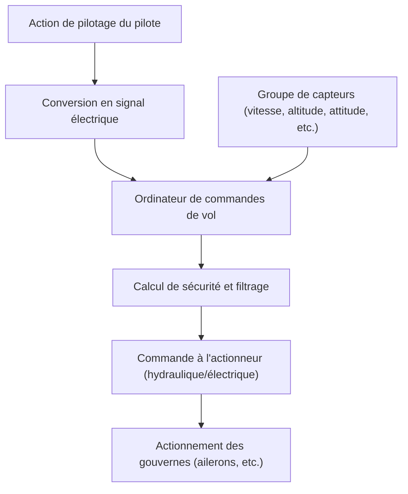

## Introduction : Pourquoi un bloc de métal volant flotte-t-il ?

Comment un avion de ligne géant pesant des centaines de tonnes peut-il s'élever doucement dans les airs et voler à une vitesse vertigineuse de 900 kilomètres à l'heure à 10 000 mètres d'altitude ? Derrière cela se cachent des siècles d'efforts en mécanique des fluides, thermodynamique, ingénierie des matériaux, et la cristallisation de l'informatique moderne avancée.

Dans cet article, nous expliquerons en profondeur les mécanismes qui permettent aux avions géants de voler, du principe de génération de la portance aux dispositifs hypersustentateurs, en passant par les moteurs, les systèmes de pressurisation, et le système de contrôle électronique moderne appelé commandes de vol électriques (fly-by-wire).

## 1. Forme de la section transversale de l'aile et principe de génération de la portance

La force la plus fondamentale pour qu'un avion vole est la "portance" (Lift). La clé de la génération de la portance réside dans le "profil aérodynamique" (Airfoil), qui est la forme de la section transversale de l'aile.

### Le théorème de Bernoulli et la troisième loi du mouvement de Newton

Deux principes physiques principaux sont profondément impliqués dans la génération de la portance.

1. **Théorème de Bernoulli** : Une loi selon laquelle la pression diminue lorsque la vitesse d'un fluide augmente. Les ailes d'avion ont généralement une surface supérieure bombée et une surface inférieure relativement plate (profil asymétrique). Lorsque l'air circule autour de l'aile, l'air s'écoulant sur la surface supérieure est conçu pour s'écouler plus rapidement que celui de la surface inférieure. Cela abaisse la pression atmosphérique sur la surface supérieure de l'aile, et génère une force (portance) poussée vers le haut par la pression atmosphérique relativement élevée sur la surface inférieure.
2. **Troisième loi du mouvement de Newton (loi d'action-réaction)** : L'aile est inclinée de manière à pousser l'air vers le bas (angle d'attaque). En tant que force de réaction à la poussée de l'air vers le bas (action), l'aile est poussée vers le haut (réaction).

Dans l'ingénierie aéronautique moderne, il est expliqué que la combinaison de ces deux effets crée la portance qui soulève le fuselage géant.

## 2. Dispositifs hypersustentateurs avec volets et becs

Parce qu'un avion à réaction en croisière vole à grande vitesse, un angle d'attaque et une surface alaire relativement petits sont suffisants pour obtenir une portance adéquate. Cependant, il est nécessaire de réduire la vitesse pendant le décollage et l'atterrissage, et si rien n'est fait, la portance sera insuffisante et l'avion décrochera (stall). Ce sont les "dispositifs hypersustentateurs" (High-lift devices) qui sont équipés pour éviter cela.

### Becs de bord d'attaque (Slats) et Volets de bord de fuite (Flaps)

- **Becs de bord d'attaque** : Un dispositif dans lequel le bord d'attaque de l'aile s'étend vers l'avant et vers le bas. Cela augmente la surface de l'aile, tout en permettant à l'air frais de s'écouler sur la surface supérieure de l'aile, empêchant le décollement de l'air (un phénomène où le flux d'air se sépare de la surface de l'aile) et permettant de prendre un angle d'attaque plus important.
- **Volets de bord de fuite** : Un dispositif dans lequel le bord de fuite de l'aile se déploie vers le bas. En augmentant la courbure (camber) de l'ensemble de l'aile et en élargissant davantage la surface de l'aile, il génère une très grande portance même à basse vitesse.

Au décollage, ces dispositifs sont modérément déployés pour augmenter la portance, et à l'atterrissage, ils sont déployés au maximum pour maintenir la portance tout en augmentant la résistance de l'air (traînée) et en ralentissant l'avion.

## 3. Moteur turbofan : source d'une poussée puissante

Le "moteur turbofan" génère la force (poussée) qui fait avancer l'avion de ligne géant. Il s'agit du courant dominant des moteurs d'avions de ligne modernes, combinant à la fois une poussée élevée et un excellent rendement énergétique.

### L'importance du taux de dilution

Le moteur turbofan aspire une grande quantité d'air avec une soufflante géante à l'avant. L'air aspiré est divisé en deux voies.
1. **L'air passant par le moteur central (flux primaire)** : Il est mis sous haute pression par un compresseur, mélangé à du carburant dans une chambre de combustion pour exploser et brûler. Ces gaz d'échappement à haute température et haute pression font tourner la turbine, qui entraîne la soufflante et le compresseur.
2. **Air contournant le moteur central (flux secondaire ou bypass)** : Il est accéléré par la soufflante et expulsé directement vers l'arrière.

Dans les avions de ligne modernes, le rapport entre le flux secondaire et le flux du moteur central (taux de dilution) est très élevé (par exemple, 10 pour 1). En fait, la majeure partie de la poussée (environ 80 %) est générée par ce flux secondaire. Cela permet d'obtenir une réduction du bruit et une amélioration spectaculaire du rendement énergétique.

## 4. L'environnement rude à 10 000 mètres d'altitude et le système de pressurisation

L'altitude de croisière d'environ 10 000 mètres (environ 33 000 pieds) est un environnement extrêmement rude pour les humains.
- **Température** : Autour de moins 50 degrés
- **Pression atmosphérique** : Environ un quart de celle au sol
- **Concentration en oxygène** : Trop faible pour que les humains puissent respirer

### Pressurisation et climatisation pour protéger les passagers

Pour protéger les passagers de cet environnement de froid extrême et de basse pression, le "système de pressurisation" et le "système de contrôle environnemental (ECS)" sont en fonctionnement.

L'air à haute température et haute pression (air de prélèvement) extrait du moteur est utilisé, et après avoir été ajusté à une température et une pression appropriées par le système de climatisation, il est envoyé dans la cabine. La soupape de décharge (outflow valve) située à l'arrière du fuselage s'ouvre et se ferme automatiquement, maintenant la pression de la cabine équivalente à une altitude d'environ 2 400 mètres (8 000 pieds). Le fuselage de l'avion est constitué d'une structure cylindrique très solide (cloison de pressurisation) pour résister à la pression qui tente de le gonfler de l'intérieur.

## 5. Commandes de vol électriques (Fly-by-wire) : Le réseau de vol électronique moderne

Les avions du passé transmettaient directement les mouvements du manche aux systèmes hydrauliques et aux surfaces de contrôle (ailerons, gouvernes de profondeur, gouverne de direction) via des câbles métalliques et des poulies. Cependant, les avions gros porteurs modernes utilisent un système de contrôle électronique appelé "commandes de vol électriques" (Fly-by-wire : FBW).

### Conception de sécurité intermédiée par ordinateur

Avec le FBW, les actions de pilotage du pilote sont converties en signaux électriques et envoyées à plusieurs ordinateurs de commandes de vol. Les ordinateurs comparent cela avec les données de divers capteurs, tels que la vitesse de l'avion, l'altitude, et l'attitude, et calculent instantanément "si l'action est sûre".

- **Protection du domaine de vol (Flight envelope protection)** : Même si le pilote tente par erreur d'effectuer une manœuvre radicale qui dépasserait les limites structurelles de l'avion ou provoquerait un décrochage, l'ordinateur corrige et limite automatiquement, l'empêchant de tomber dans une situation dangereuse.
- **Assurer la redondance** : Les systèmes importants sont multiplexés trois ou quatre fois, de sorte que même dans le cas improbable où certains ordinateurs ou capteurs tomberaient en panne, l'avion est conçu pour pouvoir continuer à voler en toute sécurité.

## Conclusion : Le summum de la science et de l'ingénierie

L'avion gros porteur que nous utilisons avec désinvolture est une cristallisation de la sagesse humaine, chaque pièce et chaque système ayant été calculés à la limite extrême. La prochaine fois que vous prendrez un avion, pourquoi ne pas essayer de ressentir ces mécanismes complexes et exquis à travers les mouvements des ailes que vous voyez par la fenêtre ou la légère différence dans le son du moteur ? Le voyage aérien sera certainement encore plus intéressant et émouvant.
