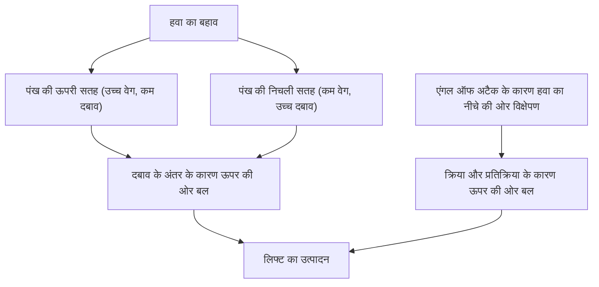
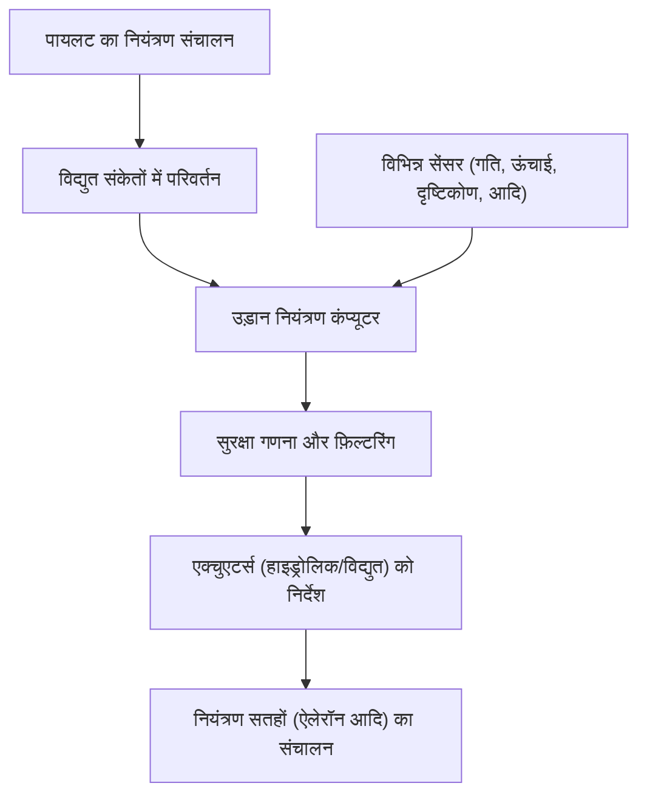

## परिचय: हवा में उड़ने वाला लोहे का विशाल टुकड़ा कैसे तैरता है?

सैकड़ों टन वजन वाला एक विशाल जंबो जेट विमान कैसे धीरे से हवा में उड़ता है और 10,000 मीटर की ऊंचाई पर 900 किलोमीटर प्रति घंटे की तेज गति से क्रूज़ कर सकता है? इसके पीछे सदियों की द्रव गतिकी (fluid dynamics), उष्मागतिकी (thermodynamics), सामग्री इंजीनियरिंग (materials engineering) और आधुनिक उन्नत कंप्यूटर विज्ञान (computer science) का निष्कर्ष है।

इस लेख में, हम एक विशाल विमान के उड़ान भरने के तंत्र को विस्तार से समझाएंगे, लिफ्ट (lift) उत्पन्न करने के सिद्धांत से लेकर हाई-लिफ्ट उपकरणों (high-lift devices), इंजन, दबाव प्रणाली (pressurization system) और फ्लाई-बाय-वायर (fly-by-wire) नामक नवीनतम इलेक्ट्रॉनिक नियंत्रण प्रणाली तक।

## 1. पंख का क्रॉस-सेक्शन आकार और लिफ्ट उत्पादन का सिद्धांत

विमान को हवा में उड़ने के लिए जो सबसे बुनियादी बल चाहिए, वह है "लिफ्ट" (Lift)। लिफ्ट उत्पन्न करने की कुंजी पंख के क्रॉस-सेक्शनल आकार में है, जिसे "एयरफॉइल" (Airfoil) कहा जाता है।

### बर्नौली का सिद्धांत और न्यूटन की गति का तीसरा नियम

लिफ्ट के उत्पादन में मुख्य रूप से दो भौतिक नियम गहराई से शामिल हैं।

1. **बर्नौली का सिद्धांत (Bernoulli's principle)**: यह नियम कहता है कि जब किसी तरल पदार्थ की गति बढ़ती है, तो उसका दबाव कम हो जाता है। हवाई जहाज के पंखों का आकार आम तौर पर ऐसा होता है कि ऊपरी सतह उभरी हुई होती है और निचली सतह अपेक्षाकृत सपाट होती है (असममित पंख)। जब हवा पंख के चारों ओर बहती है, तो ऊपरी सतह के ऊपर बहने वाली हवा को निचली सतह की तुलना में तेजी से बहने के लिए डिज़ाइन किया जाता है। इससे पंख की ऊपरी सतह पर हवा का दबाव कम हो जाता है और निचली सतह के अपेक्षाकृत उच्च दबाव द्वारा ऊपर की ओर धकेलने वाला बल (लिफ्ट) उत्पन्न होता है।
2. **न्यूटन की गति का तीसरा नियम (क्रिया और प्रतिक्रिया का नियम)**: पंखों को इस तरह झुकाया जाता है कि वे हवा को नीचे की ओर धकेलें (एंगल ऑफ अटैक - Angle of attack)। हवा को नीचे धकेलने (क्रिया) की प्रतिक्रिया के रूप में, पंख ऊपर की ओर धकेला जाता है (प्रतिक्रिया)।

आधुनिक विमानन इंजीनियरिंग में, यह समझाया गया है कि इन दोनों प्रभावों के संयोजन से एक विशाल विमान को उठाने के लिए आवश्यक लिफ्ट उत्पन्न होती है।

## 2. फ्लैप और स्लैट्स के माध्यम से हाई-लिफ्ट उपकरण

क्रूज़िंग के दौरान, जेट विमान तेज गति से उड़ते हैं, इसलिए अपेक्षाकृत छोटा एंगल ऑफ अटैक और पंख का क्षेत्र पर्याप्त लिफ्ट प्राप्त करने के लिए पर्याप्त होता है। हालांकि, टेकऑफ़ और लैंडिंग के दौरान, गति को कम करना आवश्यक है, और यदि इसे ऐसे ही छोड़ दिया जाए, तो लिफ्ट अपर्याप्त होगी और विमान स्टॉल (stall) हो जाएगा। इसे रोकने के लिए "हाई-लिफ्ट उपकरण" (High-lift devices) लगाए जाते हैं।

### लीडिंग एज स्लैट्स (Slats) और ट्रेलिंग एज फ्लैप्स (Flaps)

- **लीडिंग एज स्लैट्स**: यह एक ऐसा उपकरण है जो पंख के आगे के किनारे (leading edge) को आगे और नीचे की ओर धकेलता है। यह पंख के क्षेत्र को बढ़ाता है और साथ ही ताजी हवा को पंख की ऊपरी सतह पर प्रवाहित करने की अनुमति देता है, हवा के अलगाव (air separation) को रोकता है और एक बड़ा एंगल ऑफ अटैक लेना संभव बनाता है।
- **ट्रेलिंग एज फ्लैप्स**: यह एक ऐसा उपकरण है जहां पंख का पिछला किनारा (trailing edge) नीचे की ओर खुलता है। यह पूरे पंख के कैम्बर (वक्रता) को बढ़ाता है और पंख के क्षेत्र का और विस्तार करता है, जिससे कम गति पर भी बहुत बड़ी लिफ्ट उत्पन्न होती है।

टेकऑफ़ के दौरान, इन उपकरणों को लिफ्ट बढ़ाने के लिए मध्यम रूप से तैनात किया जाता है, और लैंडिंग के दौरान, उन्हें लिफ्ट बनाए रखते हुए वायु प्रतिरोध (ड्रैग) बढ़ाने और विमान को धीमा करने के लिए अधिकतम रूप से तैनात किया जाता है।

## 3. टर्बोफैन इंजन: शक्तिशाली थ्रस्ट का स्रोत

"टर्बोफैन इंजन" (Turbofan engine) वह बल (थ्रस्ट - Thrust) उत्पन्न करता है जो जंबो जेट को आगे की ओर धकेलता है। यह आधुनिक यात्री विमान इंजनों की मुख्य धारा है, जो उच्च थ्रस्ट और उत्कृष्ट ईंधन दक्षता दोनों को प्राप्त करता है।

### बायपास अनुपात का महत्व

टर्बोफैन इंजन अपने सामने मौजूद विशाल पंखे के जरिए भारी मात्रा में हवा खींचता है। खींची गई हवा दो रास्तों में बंट जाती है:
1. **कोर इंजन से गुजरने वाली हवा**: इसे कंप्रेसर द्वारा उच्च दबाव में संपीड़ित किया जाता है, दहन कक्ष में ईंधन के साथ मिलाया जाता है, और फिर विस्फोट और जलाया जाता है। यह उच्च तापमान और उच्च दबाव वाली निकास गैस टरबाइन को घुमाती है, जो पंखे और कंप्रेसर को चलाती है।
2. **कोर इंजन को बायपास करने वाली हवा (बायपास फ्लो)**: यह पंखे द्वारा त्वरित की जाती है और सीधे पीछे की ओर निकल जाती है।

आधुनिक यात्री विमानों में, बायपास फ्लो और कोर इंजन फ्लो (बायपास अनुपात) का अनुपात बहुत अधिक सेट किया जाता है (उदा. 10:1)। वास्तव में, अधिकांश थ्रस्ट (लगभग 80%) इस बायपास फ्लो द्वारा उत्पन्न होता है। इसके परिणामस्वरूप शोर में कमी और ईंधन दक्षता में नाटकीय सुधार हुआ है।

## 4. 10,000 मीटर की ऊंचाई पर कठोर वातावरण और दबाव प्रणाली

लगभग 10,000 मीटर (लगभग 33,000 फीट) की क्रूज़िंग ऊंचाई का वातावरण इंसानों के लिए बहुत कठोर है।
- **तापमान**: लगभग माइनस 50 डिग्री सेल्सियस
- **हवा का दबाव**: जमीन के दबाव का लगभग एक चौथाई
- **ऑक्सीजन सांद्रता**: इंसानों के सांस लेने के लिए बहुत कम

### यात्रियों की सुरक्षा के लिए दबाव और एयर कंडीशनिंग

इस अत्यधिक ठंडे और कम दबाव वाले वातावरण से यात्रियों की रक्षा के लिए "दबाव प्रणाली" (Pressurization system) और "पर्यावरण नियंत्रण प्रणाली" (ECS) काम करती हैं।

यह इंजन से निकाली गई उच्च तापमान और उच्च दबाव वाली हवा (ब्लीड एयर) का उपयोग करता है, इसे एयर कंडीशनिंग पैक के माध्यम से उचित तापमान और दबाव में समायोजित करता है, और फिर इसे केबिन में भेजता है। विमान के पिछले हिस्से में आउटफ्लो वाल्व (निकास वाल्व) स्वचालित रूप से खुलता और बंद होता है, जिससे केबिन के अंदर हवा का दबाव लगभग 2,400 मीटर (8,000 फीट) की ऊंचाई के बराबर बना रहता है। विमान के धड़ को एक बहुत मजबूत बेलनाकार संरचना (प्रेशर बल्कहेड) के साथ बनाया गया है ताकि वह अंदर से फैलने वाले दबाव का सामना कर सके।

## 5. फ्लाई-बाय-वायर: आधुनिक इलेक्ट्रॉनिक नियंत्रण उड़ान नेटवर्क

अतीत में, विमान धातु के केबल और पुली के माध्यम से नियंत्रण छड़ी (control stick) के आंदोलन को सीधे हाइड्रोलिक सिस्टम और नियंत्रण सतहों (ऐलेरॉन, एलीवेटर, रडर) तक पहुंचाते थे। हालांकि, आधुनिक जंबो जेट विमान एक इलेक्ट्रॉनिक नियंत्रण प्रणाली का उपयोग करते हैं जिसे "फ्लाई-बाय-वायर" (Fly-by-wire: FBW) कहा जाता है।

### कंप्यूटर द्वारा मध्यस्थता से सुरक्षा डिजाइन

FBW में, पायलट के नियंत्रण संचालन को विद्युत संकेतों में बदल दिया जाता है और कई उड़ान नियंत्रण कंप्यूटरों को भेजा जाता है। कंप्यूटर विमान की गति, ऊंचाई, और दृष्टिकोण (attitude) जैसे विभिन्न सेंसरों से प्राप्त डेटा के साथ इसकी तुलना करते हैं और तुरंत गणना करते हैं कि "क्या वह संचालन सुरक्षित है।"

- **फ्लाइट एनवेलप प्रोटेक्शन**: यदि पायलट गलती से स्टॉल या विमान की संरचनात्मक सीमाओं को पार करने वाला कोई चरम संचालन करने का प्रयास करता है, तो कंप्यूटर स्वचालित रूप से इसे ठीक और सीमित कर देगा, जिससे खतरनाक स्थिति को रोका जा सके।
- **अतिरिक्तता सुनिश्चित करना (Redundancy)**: महत्वपूर्ण प्रणालियों को तीन या चार बार दोहराया जाता है, ताकि यदि कुछ कंप्यूटर या सेंसर विफल हो जाएं, तो भी सुरक्षित उड़ान जारी रखने के लिए इसे डिज़ाइन किया गया है।

## निष्कर्ष: विज्ञान और इंजीनियरिंग का शिखर

जिस जंबो जेट विमान का हम अनजाने में उपयोग करते हैं, वह मानव ज्ञान का निष्कर्ष है, जहां हर हिस्से और प्रणाली की गणना चरम सीमा तक की गई है। अगली बार जब आप किसी विमान में उड़ें, तो खिड़की के बाहर पंखों की गति और इंजन की सूक्ष्म ध्वनि में अंतर देखकर इन जटिल और परिष्कृत तंत्रों को महसूस करने का प्रयास करें। आपकी हवाई यात्रा निश्चित रूप से और अधिक रोचक और प्रेरणादायक होगी।
