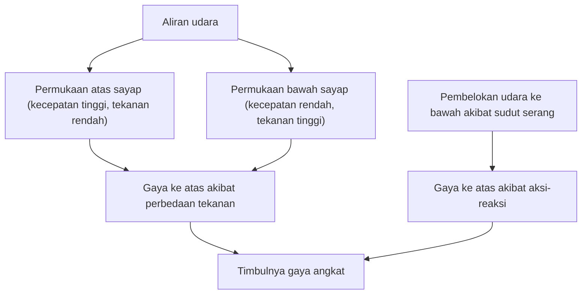
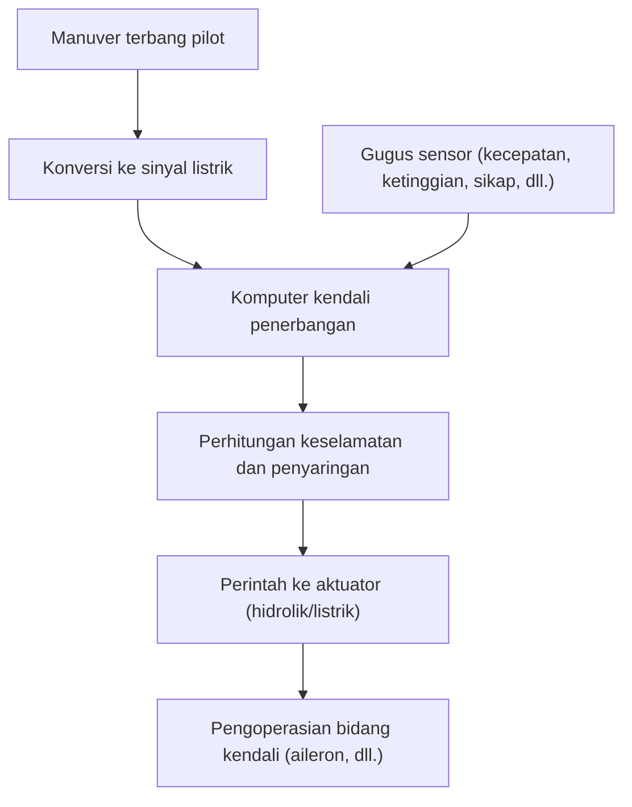

## Pengantar: Mengapa Gumpalan Besi Terbang Bisa Mengudara?

Mengapa pesawat jumbo jet raksasa dengan berat ratusan ton dapat dengan lembut melayang di udara dan terbang di ketinggian 10.000 meter dengan kecepatan 900 kilometer per jam? Di baliknya terdapat kristalisasi berabad-abad dinamika fluida, termodinamika, rekayasa material, dan ilmu komputer canggih modern.

Artikel ini akan secara menyeluruh menjelaskan mekanisme pesawat terbang raksasa untuk terbang di udara, mulai dari prinsip munculnya gaya angkat (lift), perangkat penambah gaya angkat tinggi, mesin, sistem tekanan, hingga sistem kontrol elektronik terbaru yang disebut fly-by-wire.

## 1. Bentuk Penampang Sayap dan Prinsip Timbulnya Gaya Angkat

Gaya paling dasar agar pesawat dapat terbang adalah "Gaya Angkat" (Lift). Kunci untuk menghasilkan gaya angkat terletak pada bentuk penampang sayap, yang disebut "Airfoil".

### Teorema Bernoulli dan Hukum Gerak Newton Ketiga

Terdapat dua hukum fisika utama yang sangat terkait dengan timbulnya gaya angkat.

1. **Teorema Bernoulli**: Hukum yang menyatakan bahwa saat kecepatan fluida meningkat, tekanannya menurun. Sayap pesawat umumnya dirancang asimetris, dengan permukaan atas yang cembung dan permukaan bawah yang relatif datar. Saat udara mengalir di sekitar sayap, udara yang mengalir di atas dirancang untuk mengalir lebih cepat daripada udara di bawah. Hal ini menyebabkan tekanan udara di permukaan atas sayap turun, dan gaya yang didorong ke atas oleh tekanan relatif tinggi di permukaan bawah (gaya angkat) pun dihasilkan.
2. **Hukum Gerak Newton Ketiga (Hukum Aksi-Reaksi)**: Sayap dimiringkan untuk menekan udara ke bawah (sudut serang/angle of attack). Sebagai gaya tolak atas penekanan udara ke bawah (aksi), sayap terdorong ke atas (reaksi).

Dalam rekayasa penerbangan modern, dijelaskan bahwa kombinasi dari kedua efek inilah yang menghasilkan gaya angkat yang mampu mengangkat badan pesawat yang raksasa.

## 2. Perangkat Penambah Gaya Angkat Menggunakan Flap dan Slat

Karena pesawat jet yang sedang menjelajah terbang dengan kecepatan tinggi, sudut serang yang relatif kecil dan luas sayap sudah cukup untuk menghasilkan gaya angkat yang memadai. Namun, saat lepas landas dan mendarat, kecepatan harus dikurangi, yang jika dibiarkan akan menyebabkan kekurangan gaya angkat dan stall. Untuk mencegah hal ini, pesawat dilengkapi dengan "Perangkat Gaya Angkat Tinggi" (High-lift devices).

### Slat Tepi Depan (Leading-edge Slats) dan Flap Tepi Belakang (Trailing-edge Flaps)

- **Slat Tepi Depan**: Perangkat yang memanjangkan tepi depan sayap ke arah depan-bawah. Hal ini memperluas area sayap sekaligus mengalirkan udara segar ke permukaan atas sayap, mencegah terpisahnya udara (fenomena di mana aliran udara terlepas dari permukaan sayap), dan memungkinkan sudut serang yang lebih besar.
- **Flap Tepi Belakang**: Perangkat di mana bagian belakang sayap dikembangkan ke bawah. Dengan meningkatkan kelengkungan (camber) seluruh sayap dan semakin memperluas area sayap, perangkat ini menghasilkan gaya angkat yang sangat besar bahkan pada kecepatan rendah.

Saat lepas landas, perangkat ini dikembangkan secukupnya untuk meningkatkan gaya angkat, dan saat mendarat, dikembangkan secara maksimal untuk mempertahankan gaya angkat sembari meningkatkan hambatan udara (drag) guna memperlambat pesawat.

## 3. Mesin Turbofan: Sumber Gaya Dorong yang Kuat

Gaya yang mendorong pesawat jumbo jet ke depan (thrust/gaya dorong) dihasilkan oleh "Mesin Turbofan". Ini adalah arus utama mesin pesawat komersial modern, yang menggabungkan gaya dorong tinggi dengan efisiensi bahan bakar yang sangat baik.

### Pentingnya Rasio Bypass

Mesin turbofan mengambil sejumlah besar udara menggunakan kipas raksasa di bagian depan. Udara yang masuk terbagi menjadi dua jalur.
1. **Udara yang melalui mesin inti**: Dikompresi ke tekanan tinggi oleh kompresor, kemudian dicampur dengan bahan bakar dan diledakkan/dibakar di ruang bakar. Gas buang bersuhu dan bertekanan tinggi ini memutar turbin, yang menggerakkan kipas dan kompresor.
2. **Udara yang melewati mesin inti (aliran bypass)**: Dipercepat oleh kipas dan langsung dikeluarkan ke belakang.

Pada pesawat komersial modern, rasio antara aliran bypass dan aliran mesin inti (rasio bypass) diatur sangat tinggi (misalnya: 10 banding 1). Faktanya, sebagian besar gaya dorong (sekitar 80%) dihasilkan oleh aliran bypass ini. Hal ini mewujudkan pengurangan kebisingan dan peningkatan efisiensi bahan bakar yang dramatis.

## 4. Lingkungan Ekstrem di Ketinggian 10.000 Meter dan Sistem Tekanan

Ketinggian jelajah sekitar 10.000 meter (sekitar 33.000 kaki) adalah lingkungan yang sangat ekstrem bagi manusia.
- **Suhu**: Sekitar minus 50 derajat Celcius
- **Tekanan Udara**: Sekitar seperempat dari tekanan di permukaan tanah
- **Konsentrasi Oksigen**: Terlalu tipis untuk dihirup manusia

### Tekanan dan Pendingin Udara untuk Melindungi Penumpang

Untuk melindungi penumpang dari lingkungan yang sangat dingin dan bertekanan rendah ini, "Sistem Tekanan" dan "Sistem Pengendalian Lingkungan (ECS)" dioperasikan.

Sistem ini memanfaatkan udara bersuhu dan bertekanan tinggi (bleed air) yang diambil dari mesin, lalu menyesuaikannya ke suhu dan tekanan yang tepat melalui paket AC sebelum dikirim ke kabin. Katup aliran keluar (outflow valve) di bagian belakang pesawat membuka dan menutup secara otomatis untuk mempertahankan tekanan udara di dalam kabin setara dengan ketinggian sekitar 2.400 meter (8.000 kaki). Badan pesawat terbuat dari struktur silinder yang sangat kuat (sekat tekanan/pressure bulkhead) agar tahan terhadap tekanan yang berusaha mengembang dari dalam.

## 5. Fly-by-Wire: Jaringan Penerbangan Kendali Elektronik Modern

Pesawat di masa lalu menyalurkan gerakan tuas kendali langsung ke sistem hidrolik dan bidang kendali (aileron, elevator, rudder) melalui kabel logam dan katrol. Namun, pesawat jumbo jet modern mengadopsi sistem kendali elektronik yang disebut "Fly-by-wire (FBW)".

### Desain Keselamatan dengan Intervensi Komputer

Dalam FBW, manuver terbang pilot diubah menjadi sinyal listrik dan dikirim ke beberapa komputer kendali penerbangan. Komputer mencocokkan data dari berbagai sensor seperti kecepatan, ketinggian, dan sikap pesawat, lalu seketika menghitung "apakah manuver tersebut aman".

- **Flight Envelope Protection**: Bahkan jika pilot secara tidak sengaja mencoba melakukan manuver ekstrem yang dapat menyebabkan stall atau melebihi batas struktural pesawat, komputer akan secara otomatis mengoreksi dan membatasinya untuk mencegah kondisi berbahaya.
- **Memastikan Redundansi**: Sistem-sistem penting digandakan menjadi tiga atau empat lapis (redundansi), sehingga jika sebagian komputer atau sensor gagal, pesawat dirancang untuk dapat terus terbang dengan aman.

## Kesimpulan: Puncak Sains dan Rekayasa

Pesawat jumbo jet yang sering kita gunakan tanpa pikir panjang adalah kristalisasi kebijaksanaan umat manusia, di mana setiap bagian dan sistemnya telah diperhitungkan secara maksimal. Saat Anda naik pesawat berikutnya, cobalah rasakan mekanisme rumit dan presisi ini dari gerakan sayap yang terlihat di luar jendela atau dari perbedaan halus dalam suara mesin. Perjalanan udara Anda pasti akan menjadi lebih menarik dan mengharukan.
