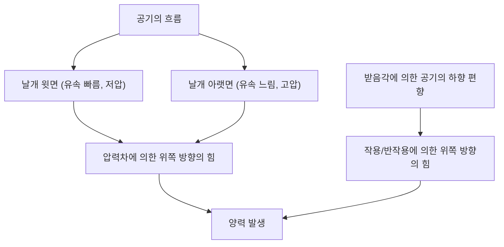
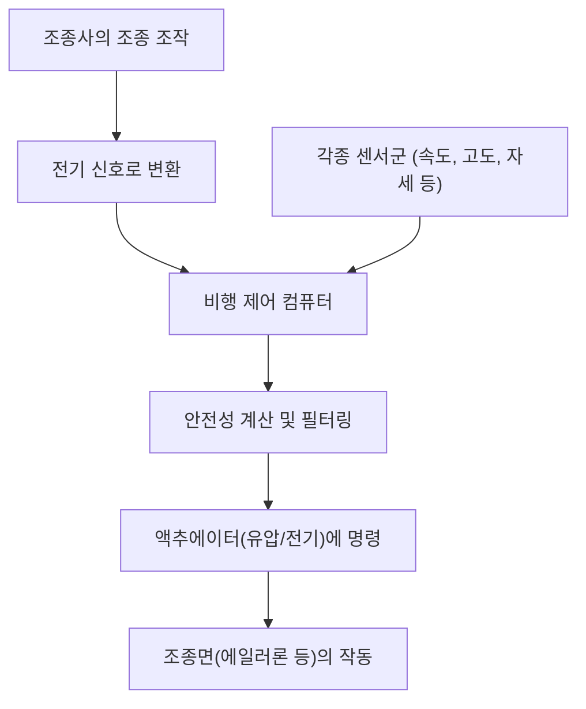

## 서론: 하늘을 나는 쇳덩어리가 어떻게 떠오를까?

수백 톤의 무게를 가진 거대한 점보 제트기가 어떻게 사뿐히 하늘로 날아올라 상공 1만 미터의 하늘을 시속 900킬로미터라는 맹렬한 속도로 순항할 수 있을까요? 그 이면에는 수세기에 걸친 유체역학, 열역학, 재료공학, 그리고 현대의 고도화된 컴퓨터 과학의 결정체가 있습니다.

본 기사에서는 거대한 항공기가 하늘을 날기 위한 메커니즘을 양력의 발생 원리부터 고양력 장치, 엔진, 여압 시스템, 그리고 플라이 바이 와이어라고 불리는 최신 전자 제어 시스템에 이르기까지 철저하게 해설합니다.

## 1. 날개의 단면 형상과 양력의 발생 원리

비행기가 하늘을 날기 위한 가장 기본적인 힘, 그것이 '양력(Lift)'입니다. 양력을 만들어내는 열쇠는 날개의 단면 형상인 '익형(에어포일: Airfoil)'에 있습니다.

### 베르누이의 정리와 뉴턴의 운동 제3법칙

양력의 발생에는 주로 두 가지 물리 법칙이 깊이 관여하고 있습니다.

1. **베르누이의 정리**: 유체의 속도가 증가하면 압력이 낮아진다는 법칙입니다. 비행기의 날개는 일반적으로 윗면이 부풀어 오르고 아랫면이 비교적 평평한 형상을 하고 있습니다(비대칭 익형). 날개 주위로 공기가 흐를 때, 윗면을 흐르는 공기는 아랫면보다 빠르게 흐르도록 설계되어 있습니다. 이로 인해 날개 윗면의 기압이 낮아지고, 아랫면의 상대적으로 높은 기압에 의해 위로 밀어 올려지는 힘(양력)이 발생합니다.
2. **뉴턴의 운동 제3법칙(작용·반작용의 법칙)**: 날개는 공기를 아래쪽으로 밀어내도록 기울어져 있습니다(받음각). 공기를 아래쪽으로 밀어내는(작용) 것에 대한 반발력으로, 날개는 위쪽으로 밀려 올라갑니다(반작용).

현대의 항공 공학에서는 이 두 가지 효과가 결합되어 거대한 기체를 들어 올리는 양력이 발생한다고 설명하고 있습니다.

## 2. 플랩이나 슬랫에 의한 고양력 장치

순항 중인 제트기는 고속으로 비행하기 때문에 비교적 작은 받음각과 날개 면적으로도 충분한 양력을 얻을 수 있습니다. 하지만 이착륙 시에는 속도를 줄여야 하며, 그대로 두면 양력이 부족해져 실속(스톨)하고 맙니다. 이를 방지하기 위해 장착되어 있는 것이 '고양력 장치(High-lift devices)'입니다.

### 앞전 슬랫(Slats)과 뒷전 플랩(Flaps)

- **앞전 슬랫**: 날개의 앞전 부분이 앞쪽 아래로 돌출되는 장치입니다. 이를 통해 날개의 면적을 넓히는 동시에, 날개 윗면에 신선한 공기를 흘려보내 공기의 박리(기류가 날개 표면에서 떨어져 나가는 현상)를 방지하고 더 큰 받음각을 취할 수 있게 합니다.
- **뒷전 플랩**: 날개의 뒷전 부분이 아래쪽으로 전개되는 장치입니다. 날개 전체의 캠버(만곡)를 크게 하고 날개 면적을 더욱 확대함으로써, 저속에서도 매우 큰 양력을 만들어냅니다.

이륙 시에는 이러한 장치들을 적절히 전개하여 양력을 증가시키고, 착륙 시에는 최대한 전개하여 양력을 유지하면서 공기 저항(항력)을 늘려 기체를 감속시킵니다.

## 3. 터보팬 엔진: 강력한 추력의 원천

점보 제트기를 앞으로 나아가게 하는 힘(추력)을 만들어내는 것이 '터보팬 엔진'입니다. 현대 여객기 엔진의 주류이며, 높은 추력과 뛰어난 연비 효율을 양립하고 있습니다.

### 바이패스 비의 중요성

터보팬 엔진은 앞쪽의 거대한 팬으로 대량의 공기를 빨아들입니다. 빨아들인 공기는 두 가지 경로로 나뉩니다.
1. **코어 엔진을 통과하는 공기**: 압축기에서 고압이 되고, 연소실에서 연료와 혼합되어 폭발·연소합니다. 이 고온 고압의 배기가스가 터빈을 돌려 팬이나 압축기를 구동합니다.
2. **코어 엔진을 우회하는 공기(바이패스 류)**: 팬에 의해 가속되어 그대로 뒤쪽으로 배출됩니다.

현대의 여객기에서는 바이패스 류와 코어 엔진 류의 비율(바이패스 비)이 매우 높게 설정되어 있습니다(예: 10대 1 등). 사실 추력의 대부분(약 80%)은 이 바이패스 류에 의해 만들어집니다. 이를 통해 소음 감소와 연비의 극적인 향상이 실현되었습니다.

## 4. 상공 1만 미터의 가혹한 환경과 여압 시스템

순항 고도인 약 1만 미터(약 33,000피트)의 상공은 인간에게 매우 가혹한 환경입니다.
- **기온**: 영하 50도 전후
- **기압**: 지상의 약 4분의 1
- **산소 농도**: 인간이 호흡하기에는 너무 희박함

### 승객을 보호하는 여압과 공조

이 혹한·저압의 환경으로부터 승객을 보호하기 위해 '여압 시스템'과 '환경 제어 시스템(ECS)'이 가동되고 있습니다.

엔진에서 추출된 고온·고압의 공기(블리드 에어)를 이용하여, 에어컨 팩을 통해 적절한 온도와 기압으로 조절한 후 객실로 보냅니다. 기체 후방에 있는 아웃플로우 밸브(배기 밸브)가 자동으로 개폐됨으로써, 객실 내의 기압을 고도 약 2,400미터(8,000피트) 상당으로 유지합니다. 기체의 동체는 안쪽에서 부풀어 오르려는 압력을 견딜 수 있도록 매우 견고한 원통형 구조(압력 격벽)로 만들어져 있습니다.

## 5. 플라이 바이 와이어: 현대의 전자 제어 비행망

과거의 항공기는 조종간의 움직임을 금속 케이블이나 도르래를 통해 직접 유압 시스템이나 조종면(에일러론, 엘리베이터, 러더)에 전달했습니다. 하지만 현대의 점보 제트기는 '플라이 바이 와이어(Fly-by-wire: FBW)'라는 전자 제어 시스템을 채택하고 있습니다.

### 컴퓨터가 개입하는 안전 설계

FBW에서는 조종사의 조종 조작이 전기 신호로 변환되어 여러 대의 비행 제어 컴퓨터로 전송됩니다. 컴퓨터는 기체의 속도, 고도, 자세 등 각종 센서로부터의 데이터와 대조하여 '그 조작이 안전한지'를 순식간에 계산합니다.

- **비행 포락선 보호(Flight Envelope Protection)**: 조종사가 실수로 실속이나 기체의 구조적 한계를 넘어서는 과격한 조작을 하려고 해도, 컴퓨터가 자동으로 보정 및 제한을 걸어 위험한 상태에 빠지는 것을 방지합니다.
- **여분성 확보**: 중요한 시스템은 3중, 4중으로 다중화되어 있어, 만에 하나 일부 컴퓨터나 센서가 고장 나더라도 안전하게 비행을 계속할 수 있도록 설계되어 있습니다.

## 결론: 과학과 공학의 극치

우리가 무심코 이용하는 점보 제트기는 하나하나의 부품과 시스템이 극한까지 치밀하게 계산된 인류 영지의 결정체입니다. 다음에 비행기를 탈 때는 창밖으로 보이는 날개의 움직임이나 엔진의 미세한 소리 차이에서 이런 복잡하고 정교한 메커니즘을 느껴보는 것은 어떨까요? 하늘 여행이 한층 더 흥미롭고 감동적인 것이 될 것입니다.
