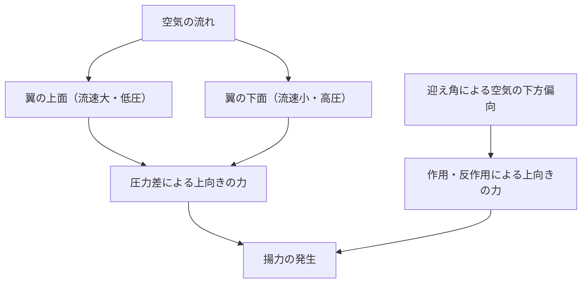
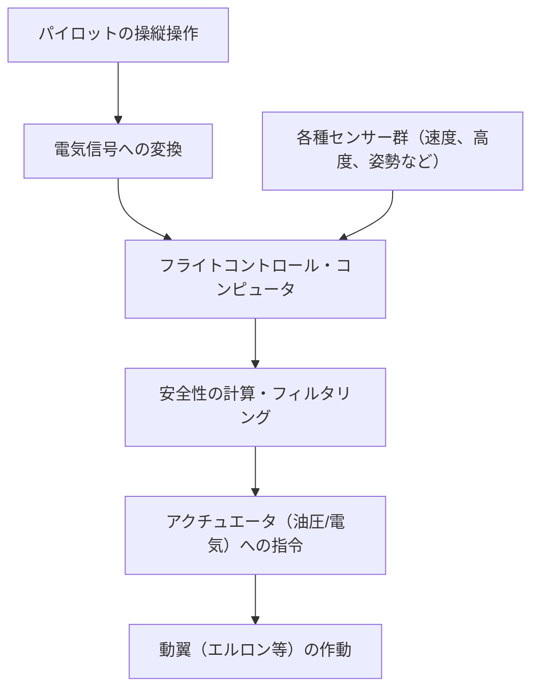

## はじめに：空飛ぶ鉄の塊がなぜ浮かぶのか？

数百トンもの重さを持つ巨大なジャンボジェット機が、なぜふわりと空に舞い上がり、上空1万メートルの空を時速900キロメートルという猛スピードで巡航できるのでしょうか。その背後には、何世紀にもわたる流体力学、熱力学、材料工学、そして現代の高度なコンピュータサイエンスの結晶があります。

本記事では、巨大な航空機が空を飛ぶためのメカニズムを、揚力の発生原理から高揚力装置、エンジン、与圧システム、そしてフライ・バイ・ワイヤと呼ばれる最新の電子制御システムに至るまで、徹底的に解説します。

## 1. 翼の断面形状と揚力の発生原理

飛行機が空を飛ぶための最も基本的な力、それが「揚力（Lift）」です。揚力を生み出す鍵は、翼の断面形状である「翼型（エアフォイル：Airfoil）」にあります。

### ベルヌーイの定理とニュートンの運動の第3法則

揚力の発生には、主に2つの物理法則が深く関わっています。

1. **ベルヌーイの定理**: 流体の速度が上がると圧力が下がるという法則です。飛行機の翼は一般的に上面が膨らみ、下面が比較的平らな形状をしています（非対称翼）。翼の周囲を空気が流れる際、上面を流れる空気は下面よりも速く流れるように設計されています。これにより翼の上面の気圧が下がり、下面の相対的に高い気圧に押し上げられる力（揚力）が発生します。
2. **ニュートンの運動の第3法則（作用・反作用の法則）**: 翼は空気を下方に押し下げるように傾けられています（迎え角）。空気を下方に押し下げる（作用）ことに対する反発力として、翼は上方に押し上げられます（反作用）。

現代の航空工学においては、この両方の効果が組み合わさることで巨大な機体を持ち上げる揚力が生まれると説明されています。

## 2. フラップやスラットによる高揚力装置

巡航中のジェット機は高速で飛ぶため、比較的小さな迎え角と翼面積で十分な揚力を得ることができます。しかし、離着陸時は速度を落とす必要があり、そのままでは揚力が不足して失速（ストール）してしまいます。これを防ぐために装備されているのが「高揚力装置（High-lift devices）」です。

### 前縁スラット（Slats）と後縁フラップ（Flaps）

- **前縁スラット**: 翼の前縁部分が前下方にせり出す装置です。これにより翼の面積を広げると同時に、翼の上面に新鮮な空気を流し込み、空気の剥離（気流が翼の表面から離れてしまう現象）を防ぎ、より大きな迎え角を取ることを可能にします。
- **後縁フラップ**: 翼の後縁部分が下方に展開する装置です。翼全体のキャンバー（湾曲）を大きくし、さらに翼面積を拡大することで、低速でも非常に大きな揚力を生み出します。

離陸時にはこれらの装置を適度に展開して揚力を増し、着陸時には最大限に展開して揚力を保ちながら空気抵抗（抗力）を増やし、機体を減速させます。

## 3. ターボファンエンジン：強大な推力の源

ジャンボジェット機を前進させる力（推力）を生み出すのが「ターボファンエンジン」です。現代の旅客機エンジンの主流であり、高い推力と優れた燃費効率を両立しています。

### バイパス比の重要性

ターボファンエンジンは、前方の巨大なファンで大量の空気を取り込みます。取り込まれた空気は2つの経路に分かれます。
1. **コアエンジンを通る空気**: 圧縮機で高圧にされ、燃焼室で燃料と混合されて爆発・燃焼します。この高温高圧の排気ガスがタービンを回し、ファンや圧縮機を駆動します。
2. **コアエンジンを迂回する空気（バイパス流）**: ファンによって加速され、そのまま後方へ排出されます。

現代の旅客機では、バイパス流とコアエンジン流の比率（バイパス比）が非常に高く設定されています（例：10対1など）。実は推力の大部分（約80%）は、このバイパス流によって生み出されています。これにより、騒音の低減と燃費の劇的な向上が実現されています。

## 4. 上空1万メートルの過酷な環境と与圧システム

巡航高度である約1万メートル（約33,000フィート）の上空は、人間にとって非常に過酷な環境です。
- **気温**: マイナス50度前後
- **気圧**: 地上の約4分の1
- **酸素濃度**: 人間が呼吸するには薄すぎる

### 乗客を守る与圧と空調

この極寒・低圧の環境から乗客を守るために「与圧システム」と「環境制御システム（ECS）」が稼働しています。

エンジンから抽出された高温・高圧の空気（ブリードエア）を利用し、エアコンパックを通じて適温・適圧に調整してから客室に送り込みます。機体の後部にあるアウトフローバルブ（排気弁）が自動的に開閉することで、客室内の気圧を高度約2,400メートル（8,000フィート）相当に保ちます。機体の胴体は、内側から膨らもうとする圧力に耐えられるよう、非常に強固な円筒形の構造（圧力隔壁）で作られています。

## 5. フライ・バイ・ワイヤ：現代の電子制御飛行網

かつての航空機は、操縦桿の動きを金属製のケーブルや滑車を介して直接、油圧システムや動翼（エルロン、エレベーター、ラダー）に伝達していました。しかし現代のジャンボジェット機は、「フライ・バイ・ワイヤ（Fly-by-wire: FBW）」という電子制御システムを採用しています。

### コンピュータが介在する安全設計

FBWでは、パイロットの操縦操作は電気信号に変換され、複数のフライトコントロール・コンピュータに送られます。コンピュータは、機体の速度、高度、姿勢などの各種センサーからのデータと照らし合わせ、「その操作が安全かどうか」を瞬時に計算します。

- **フライトエンベロープ・プロテクション**: パイロットが誤って失速や機体の構造限界を超えるような過激な操作を行おうとしても、コンピュータが自動的に補正・制限をかけ、危険な状態に陥るのを防ぎます。
- **冗長性の確保**: 重要なシステムは3重、4重に多重化されており、万が一一部のコンピュータやセンサーが故障しても、安全に飛行を継続できるよう設計されています。

## 結論：科学と工学の極致

私たちが何気なく利用しているジャンボジェット機は、一つひとつのパーツやシステムが極限まで計算され尽くした、人類の英知の結晶です。次に飛行機に乗る際には、窓の外に見える翼の動きや、エンジンのかすかな音の違いから、これらの複雑で精巧なメカニズムを感じ取ってみてはいかがでしょうか。空の旅が、より一層興味深く、そして感動的なものになるはずです。
