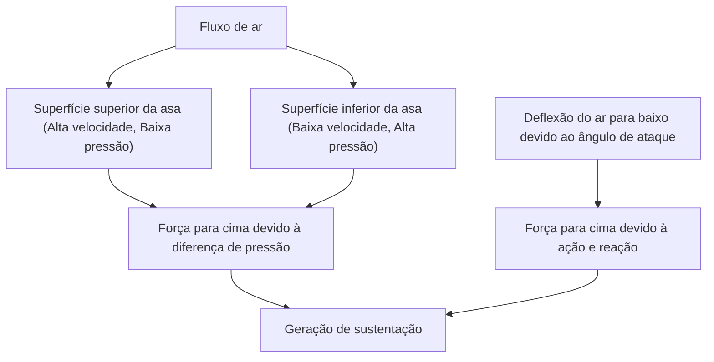
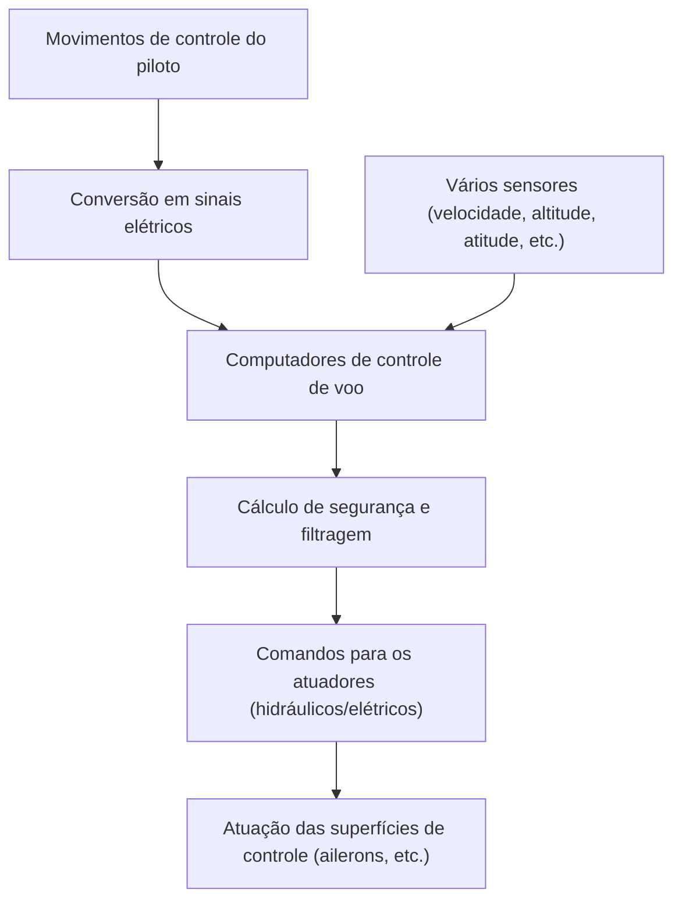

## Introdução: Por que um pedaço de ferro voador flutua?

Como pode um gigantesco avião a jato Jumbo, pesando centenas de toneladas, subir suavemente no ar e cruzar os céus a 10.000 metros de altitude a uma velocidade vertiginosa de 900 quilômetros por hora? Por trás disso, está a culminação de séculos de dinâmica dos fluidos, termodinâmica, engenharia de materiais e a avançada ciência da computação moderna.

Neste artigo, explicaremos de forma minuciosa os mecanismos que permitem a uma aeronave gigante voar, desde os princípios de geração de sustentação, passando por dispositivos hiper-sustentadores, motores, sistemas de pressurização, até o mais moderno sistema de controle eletrônico chamado fly-by-wire.

## 1. O formato da seção transversal da asa e o princípio de geração de sustentação

A força mais fundamental para um avião voar é a "Sustentação (Lift)". A chave para gerar sustentação está no "perfil aerodinâmico (Airfoil)", que é o formato da seção transversal da asa.

### O Teorema de Bernoulli e a Terceira Lei do Movimento de Newton

A geração de sustentação está profundamente relacionada principalmente a duas leis da física.

1. **Teorema de Bernoulli**: A lei de que a pressão diminui quando a velocidade de um fluido aumenta. As asas de um avião geralmente têm um formato onde a superfície superior é convexa e a superfície inferior é relativamente plana (perfil assimétrico). Quando o ar flui ao redor da asa, o ar que passa pela superfície superior é projetado para fluir mais rápido do que na inferior. Isso diminui a pressão do ar na superfície superior da asa, e a pressão relativamente alta na superfície inferior gera uma força que empurra a asa para cima (sustentação).
2. **Terceira Lei do Movimento de Newton (Lei da Ação e Reação)**: A asa é inclinada de forma a empurrar o ar para baixo (ângulo de ataque). Como força de repulsão (reação) contra empurrar o ar para baixo (ação), a asa é empurrada para cima.

Na engenharia aeronáutica moderna, explica-se que a combinação desses dois efeitos gera a sustentação que levanta a fuselagem gigante.

## 2. Dispositivos hiper-sustentadores como flaps e slats

Como os jatos voam em alta velocidade durante o cruzeiro, podem obter sustentação suficiente com um ângulo de ataque e área de asa relativamente pequenos. No entanto, durante a decolagem e o pouso, é necessário reduzir a velocidade e, se permanecerem assim, faltará sustentação e entrarão em perda (stall). Para evitar isso, estão equipados com "Dispositivos hiper-sustentadores (High-lift devices)".

### Slats de bordo de ataque (Slats) e Flaps de bordo de fuga (Flaps)

- **Slats de bordo de ataque**: Dispositivos nos quais a parte do bordo de ataque da asa se estende para frente e para baixo. Isso aumenta a área da asa e, ao mesmo tempo, permite que ar fresco flua sobre a superfície superior da asa, evitando a separação do ar (o fenômeno em que o fluxo de ar se descola da superfície da asa), possibilitando um ângulo de ataque maior.
- **Flaps de bordo de fuga**: Dispositivos nos quais a parte do bordo de fuga da asa se desdobra para baixo. Aumentam a curvatura (camber) de toda a asa e, ao expandir ainda mais a área da asa, geram uma sustentação muito grande, mesmo em baixas velocidades.

Na decolagem, esses dispositivos são moderadamente desdobrados para aumentar a sustentação e, no pouso, são totalmente desdobrados para aumentar a resistência do ar (arrasto) enquanto mantêm a sustentação, desacelerando a aeronave.

## 3. Motor turbofan: A fonte de um impulso poderoso

A força (empuxo) que impulsiona o jato Jumbo para frente é gerada pelo "motor turbofan". É o pilar dos motores de aviões de passageiros modernos, combinando alto empuxo com excelente eficiência de combustível.

### A importância da taxa de derivação (bypass ratio)

Os motores turbofan aspiram grandes quantidades de ar com um enorme ventilador frontal. O ar aspirado é dividido em duas rotas.
1. **Ar que passa pelo motor central (core)**: É altamente pressurizado pelo compressor, misturado com combustível na câmara de combustão, e explode e queima. Esses gases de escape de alta temperatura e alta pressão giram a turbina, que aciona o ventilador e o compressor.
2. **Ar que contorna o motor central (fluxo de derivação/bypass)**: É acelerado pelo ventilador e exaurido diretamente para trás.

Nos aviões de passageiros modernos, a proporção entre o fluxo de derivação e o fluxo do motor central (taxa de derivação) é configurada para ser muito alta (ex: 10 para 1). Na verdade, a maior parte do empuxo (cerca de 80%) é gerada por esse fluxo de derivação. Isso consegue uma redução drástica de ruído e melhoria na eficiência do combustível.

## 4. O ambiente hostil a 10.000 metros de altitude e o sistema de pressurização

O céu a uma altitude de cruzeiro de cerca de 10.000 metros (cerca de 33.000 pés) é um ambiente extremamente hostil para os humanos.
- **Temperatura**: Cerca de 50 graus Celsius negativos
- **Pressão atmosférica**: Cerca de um quarto da pressão ao nível do mar
- **Concentração de oxigênio**: Muito rarefeita para a respiração humana

### Pressurização e ar condicionado para proteger os passageiros

Para proteger os passageiros deste ambiente de frio extremo e baixa pressão, operam o "sistema de pressurização" e o "sistema de controle ambiental (ECS)".

Usando ar de alta temperatura e alta pressão extraído dos motores (bleed air), ele é ajustado para a temperatura e pressão adequadas através de pacotes de ar condicionado (air conditioning packs) antes de ser enviado para a cabine. A válvula de saída (outflow valve) na parte traseira da aeronave abre e fecha automaticamente, mantendo a pressão do ar na cabine equivalente a uma altitude de cerca de 2.400 metros (8.000 pés). A fuselagem da aeronave é construída com uma estrutura cilíndrica muito forte (antepara de pressão) para suportar a pressão que tenta expandir por dentro.

## 5. Fly-by-wire: A moderna rede de controle de voo eletrônico

As aeronaves do passado transmitiam o movimento do manche diretamente para os sistemas hidráulicos e superfícies de controle (ailerons, profundores, leme) através de cabos metálicos e polias. No entanto, os modernos jatos Jumbo adotam um sistema de controle eletrônico chamado "Fly-by-wire (FBW)".

### Projeto de segurança mediado por computadores

No FBW, os movimentos de controle do piloto são convertidos em sinais elétricos e enviados a vários computadores de controle de voo. Os computadores cruzam dados de vários sensores, como velocidade da aeronave, altitude, atitude, etc., e calculam instantaneamente "se essa operação é segura ou não".

- **Proteção do envelope de voo (Flight envelope protection)**: Mesmo que o piloto tente acidentalmente realizar manobras extremas que excedam os limites estruturais da aeronave ou que causem estol, o computador automaticamente corrige e limita a ação, evitando que caia em um estado perigoso.
- **Garantia de redundância**: Sistemas importantes são triplicados ou quadruplicados, de forma que, caso alguns computadores ou sensores falhem, o sistema é projetado para continuar voando com segurança.

## Conclusão: O auge da ciência e engenharia

O jato Jumbo que usamos casualmente é a cristalização da sabedoria humana, onde cada peça e sistema foi calculado ao extremo. Da próxima vez que você voar, que tal tentar sentir esses mecanismos complexos e requintados observando os movimentos das asas do lado de fora da janela ou notando as sutis diferenças no som dos motores? Isso certamente tornará sua viagem aérea ainda mais fascinante e inspiradora.
