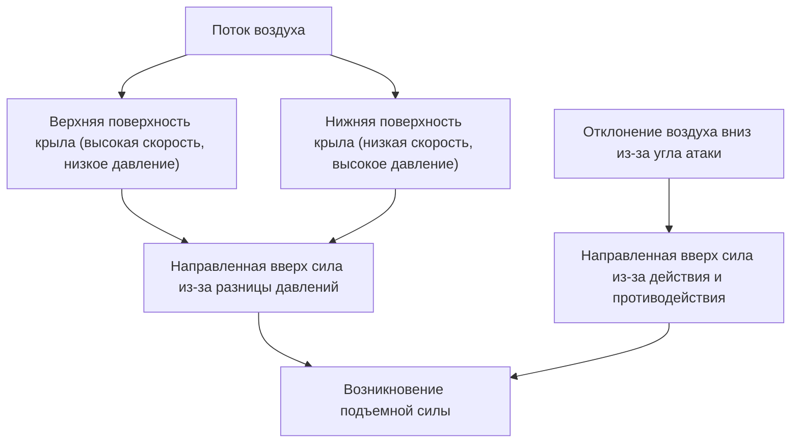
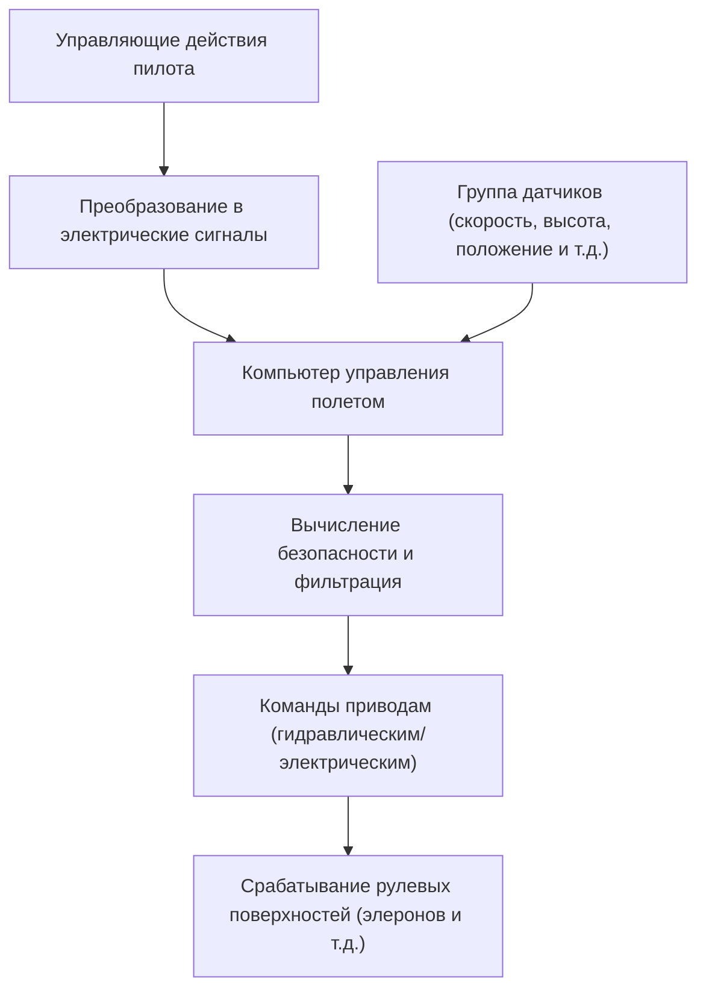

## Введение: почему этот летающий кусок железа держится в воздухе?

Как огромный джамбо-джет весом в сотни тонн может легко подняться в небо и лететь на высоте 10 000 метров со скоростью 900 километров в час? За этим стоят века развития гидродинамики, термодинамики, материаловедения и кульминация современной высокотехнологичной информатики.

В этой статье мы подробно рассмотрим механизмы, позволяющие огромным самолетам летать: от принципов возникновения подъемной силы до механизации крыла, двигателей, систем герметизации и новейшей электронной системы управления полетом, известной как Fly-by-wire.

## 1. Профиль крыла и принцип возникновения подъемной силы

Самая базовая сила, позволяющая самолету летать — это «подъемная сила» (Lift). Ключ к созданию подъемной силы кроется в форме поперечного сечения крыла, называемой «профилем крыла» (Airfoil).

### Закон Бернулли и третий закон Ньютона

Возникновение подъемной силы тесно связано с двумя основными законами физики.

1. **Закон Бернулли**: принцип, согласно которому с увеличением скорости жидкости или газа давление снижается. Крылья самолета обычно имеют выпуклую верхнюю поверхность и относительно плоскую нижнюю (несимметричный профиль). Конструкция такова, что воздух, обтекающий крыло, движется над верхней поверхностью быстрее, чем под нижней. Это приводит к падению давления над верхней поверхностью крыла, и относительно высокое давление снизу выталкивает крыло вверх (возникает подъемная сила).
2. **Третий закон Ньютона (закон действия и противодействия)**: Крыло наклонено так, чтобы отклонять поток воздуха вниз (угол атаки). В качестве реакции на отклонение воздуха вниз (действие) крыло выталкивается вверх (противодействие).

В современной аэронавтике считается, что сочетание обоих этих эффектов создает подъемную силу, способную поднять огромный самолет.

## 2. Механизация крыла: закрылки и предкрылки

Во время крейсерского полета реактивный самолет летит с высокой скоростью, поэтому относительно небольшого угла атаки и площади крыла достаточно для получения необходимой подъемной силы. Однако при взлете и посадке необходимо снизить скорость, и в этом случае подъемной силы становится недостаточно, что может привести к сваливанию (Stall). Чтобы предотвратить это, самолет оснащен «устройствами увеличения подъемной силы» (High-lift devices - механизация крыла).

### Предкрылки (Slats) и закрылки (Flaps)

- **Предкрылки**: устройства на передней кромке крыла, которые выдвигаются вперед и вниз. Они увеличивают площадь крыла и одновременно направляют свежий поток воздуха на верхнюю поверхность крыла, предотвращая отрыв потока (явление, при котором воздушный поток отрывается от поверхности крыла), что позволяет лететь с бóльшим углом атаки.
- **Закрылки**: устройства, которые выдвигаются вниз из задней кромки крыла. Они увеличивают кривизну (камбер) всего крыла и дополнительно расширяют его площадь, создавая очень большую подъемную силу даже на низких скоростях.

При взлете эти устройства выдвигаются умеренно для увеличения подъемной силы, а при посадке выпускаются максимально, чтобы сохранить подъемную силу, одновременно увеличивая аэродинамическое сопротивление для замедления самолета.

## 3. Турбовентиляторный двигатель: источник мощной тяги

Сила, толкающая джамбо-джет вперед (тяга), создается «турбовентиляторными двигателями». Они являются основным типом двигателей современных пассажирских самолетов, сочетая в себе высокую тягу и отличную топливную экономичность.

### Важность степени двухконтурности

Турбовентиляторный двигатель забирает огромное количество воздуха с помощью гигантского вентилятора спереди. Втянутый воздух разделяется на два потока.
1. **Воздух, проходящий через внутренний контур (газогенератор)**: сжимается компрессором, смешивается с топливом в камере сгорания, воспламеняется и сгорает. Выхлопные газы с высокой температурой и давлением вращают турбину, которая, в свою очередь, приводит в движение вентилятор и компрессор.
2. **Воздух, обходящий внутренний контур (внешний или байпасный контур)**: ускоряется вентилятором и выбрасывается прямо назад.

В современных пассажирских самолетах соотношение байпасного потока к потоку внутреннего контура (степень двухконтурности) устанавливается очень высоким (например, 10 к 1). На самом деле бóльшая часть тяги (около 80%) создается именно этим внешним контуром. Благодаря этому достигается значительное снижение уровня шума и кардинальное улучшение топливной экономичности.

## 4. Экстремальные условия на высоте 10 000 метров и система герметизации

На крейсерской высоте около 10 000 метров (примерно 33 000 футов) условия чрезвычайно суровы для человека.
- **Температура**: около минус 50 градусов
- **Атмосферное давление**: примерно четверть от давления на уровне моря
- **Уровень кислорода**: слишком низкий для дыхания человека

### Герметизация и кондиционирование воздуха для защиты пассажиров

Чтобы защитить пассажиров от этой экстремально холодной среды с низким давлением, работают «система герметизации» и «система кондиционирования воздуха (ECS)».

Горячий воздух под высоким давлением (отбираемый воздух), отбираемый от двигателей, используется и доводится до оптимальной температуры и давления через установки кондиционирования перед подачей в кабину. Выпускной клапан (Outflow valve) в хвостовой части фюзеляжа автоматически открывается и закрывается, поддерживая давление в кабине эквивалентным высоте около 2400 метров (8000 футов). Фюзеляж самолета представляет собой очень прочную цилиндрическую конструкцию (гермокабину), способную выдерживать давление, распирающее ее изнутри.

## 5. Fly-by-wire: современная электронная сеть управления полетом

Раньше в самолетах движения штурвала передавались непосредственно на гидравлические системы или рулевые поверхности (элероны, рули высоты, руль направления) с помощью металлических тросов и шкивов. Однако современные джамбо-джеты используют электронную систему управления, называемую «Fly-by-wire (FBW)».

### Безопасность благодаря компьютерам

В системе FBW управляющие действия пилота преобразуются в электрические сигналы и отправляются в несколько компьютеров управления полетом (Flight control computers). Компьютеры сверяют эти данные с информацией от различных датчиков скорости, высоты и пространственного положения самолета, мгновенно вычисляя, «является ли это действие безопасным».

- **Защита эксплуатационных ограничений (Flight envelope protection)**: Даже если пилот по ошибке попытается выполнить слишком резкий маневр, который может привести к сваливанию или превышению конструктивных ограничений самолета, компьютер автоматически скорректирует и ограничит действия, предотвращая попадание в опасную ситуацию.
- **Обеспечение избыточности**: Важные системы имеют тройное или четверное дублирование, поэтому даже если некоторые компьютеры или датчики выйдут из строя, самолет сможет безопасно продолжать полет.

## Заключение: вершина науки и техники

Джамбо-джет, которым мы так привычно пользуемся — это кристаллизация человеческой мудрости, где каждая деталь и система рассчитаны до абсолютных пределов. В следующий раз, когда вы полетите на самолете, попробуйте ощутить эти сложные и точные механизмы, наблюдая за движением крыла из окна или прислушиваясь к тонким изменениям в звуке двигателя. Путешествие по воздуху наверняка станет еще более увлекательным и впечатляющим.
