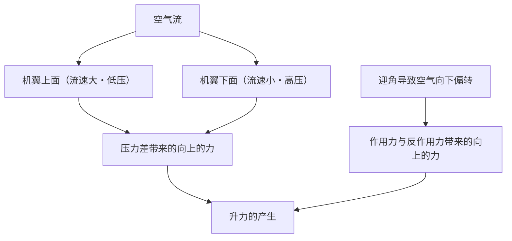
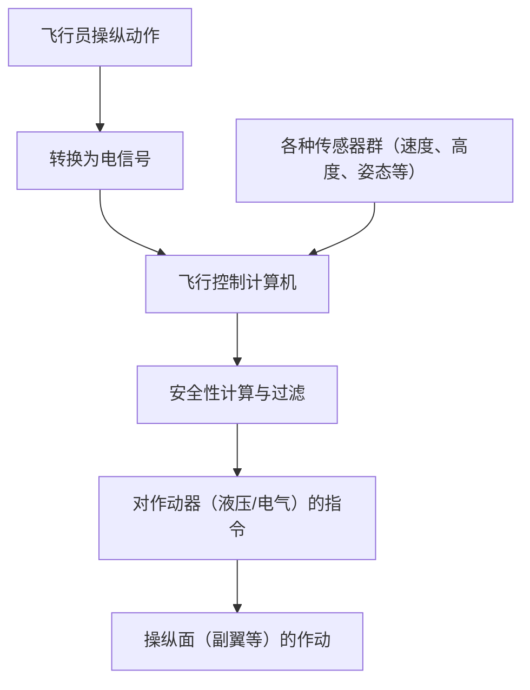

## 引言：飞行的铁块为何能升空？

重达数百吨的巨大喷气式客机，究竟为何能轻盈地腾空而起，并在1万米的高空以900公里的时速巡航？其背后是几个世纪以来流体力学、热力学、材料工程以及现代高级计算机科学的结晶。

本文将从升力的产生原理，到高升力装置、发动机、增压系统，再到被称为电传操纵的最新电子控制系统，全面解析巨大航空器翱翔天际的机制。

## 1. 机翼剖面形状与升力产生原理

飞机能够在空中飞行的最基本的力，就是“升力（Lift）”。产生升力的关键，在于机翼的剖面形状——“翼型（Airfoil）”。

### 伯努利定律与牛顿第三运动定律

升力的产生主要与两个物理定律密切相关。

1. **伯努利定律**: 流体速度增加，压力就会降低的定律。飞机的机翼通常被设计成上面凸起、下面相对平坦的形状（非对称翼）。当空气流过机翼周围时，流经机翼上面的空气速度会被设计得比下面更快。这导致机翼上面的气压降低，从而产生被下面相对较高的气压向上推的力（升力）。
2. **牛顿第三运动定律（作用力与反作用力定律）**: 机翼被倾斜放置，以将空气向下推（迎角）。作为将空气向下推（作用力）的反抗力，机翼会被向上推（反作用力）。

在现代航空工程中，通常解释为这两种效应的结合产生了托起巨大机身的升力。

## 2. 襟翼和缝翼等高升力装置

由于巡航中的喷气式飞机飞行速度快，凭借相对较小的迎角和机翼面积就能获得足够的升力。但是在起降时需要减速，如果不做任何改变，升力就会不足导致失速（Stall）。为了防止这种情况发生而装备的设备就是“高升力装置（High-lift devices）”。

### 前缘缝翼（Slats）与后缘襟翼（Flaps）

- **前缘缝翼**: 从机翼前缘部分向前下方伸出的装置。这不仅扩大了机翼面积，同时能让新鲜空气流入机翼上面，防止空气分离（气流脱离机翼表面的现象），从而允许采用更大的迎角。
- **后缘襟翼**: 从机翼后缘部分向下展开的装置。通过增大整个机翼的弯度，并进一步扩大机翼面积，即使在低速下也能产生非常大的升力。

在起飞时，这些装置会适度展开以增加升力；在降落时，则会最大限度地展开，在保持升力的同时增加空气阻力（阻力），使飞机减速。

## 3. 涡轮风扇发动机：强大推力的源泉

推动巨型喷气式飞机前进的力（推力）是由“涡轮风扇发动机”产生的。这是现代客机发动机的主流，兼顾了高推力和优异的燃油效率。

### 涵道比的重要性

涡轮风扇发动机通过前方巨大的风扇吸入大量空气。吸入的空气分为两条路径。
1. **通过核心机的空气**: 在压气机中被高压化，在燃烧室中与燃料混合并爆炸燃烧。这种高温高压的排气气体驱动涡轮，进而带动风扇和压气机。
2. **绕过核心机的空气（外涵道气流）**: 被风扇加速，直接向后排出。

在现代客机中，外涵道气流与核心机气流的比例（涵道比）被设定得非常高（例如10比1等）。事实上，大部分推力（约80%）是由这个外涵道气流产生的。这不仅降低了噪音，还大幅提高了燃油效率。

## 4. 1万米高空的严酷环境与增压系统

巡航高度约1万米（约33,000英尺）的高空，对人类来说是一个极为严酷的环境。
- **气温**: 零下50度左右
- **气压**: 地面的约四分之一
- **氧气浓度**: 太稀薄，无法让人类呼吸

### 保护乘客的增压与空调

为了保护乘客免受这种极寒和低压环境的伤害，“增压系统”和“环境控制系统（ECS）”在持续运转。

利用从发动机抽出的高温高压空气（引气），通过空调组件调节至合适的温度和压力后送入客舱。位于机身后部的外流活门（排气阀）自动开闭，将客舱内的气压保持在相当于海拔约2,400米（8,000英尺）的高度。机身的圆筒形结构（压力舱壁）被制造得非常坚固，以承受从内向外膨胀的压力。

## 5. 电传操纵：现代电子控制飞行网络

过去的飞机是通过金属线缆和滑轮，将驾驶杆的动作直接传递给液压系统或操纵面（副翼、升降舵、方向舵）。然而，现代的巨型喷气式客机采用了被称为“电传操纵（Fly-by-wire: FBW）”的电子控制系统。

### 计算机介入的安全设计

在FBW系统中，飞行员的操纵动作被转换为电信号，并发送给多台飞行控制计算机。计算机将这些信号与来自速度、高度、姿态等各种传感器的数据进行比对，瞬间计算出“该操作是否安全”。

- **飞行包线保护**: 即使飞行员错误地试图进行导致失速或超过机体结构极限的剧烈操作，计算机也会自动进行修正和限制，防止飞机陷入危险状态。
- **确保冗余度**: 关键系统采用了三重或四重的多重化设计，即使部分计算机或传感器发生故障，也能确保安全继续飞行。

## 结论：科学与工程的极致

我们平时不经意间乘坐的巨型喷气式客机，每一个零部件和系统都被计算到了极致，是人类智慧的结晶。下次乘坐飞机时，不妨通过窗外机翼的动作，或者发动机微弱声音的变化，去感受一下这些复杂而精密的机制。相信您的空中之旅会变得更加有趣和令人感动。
