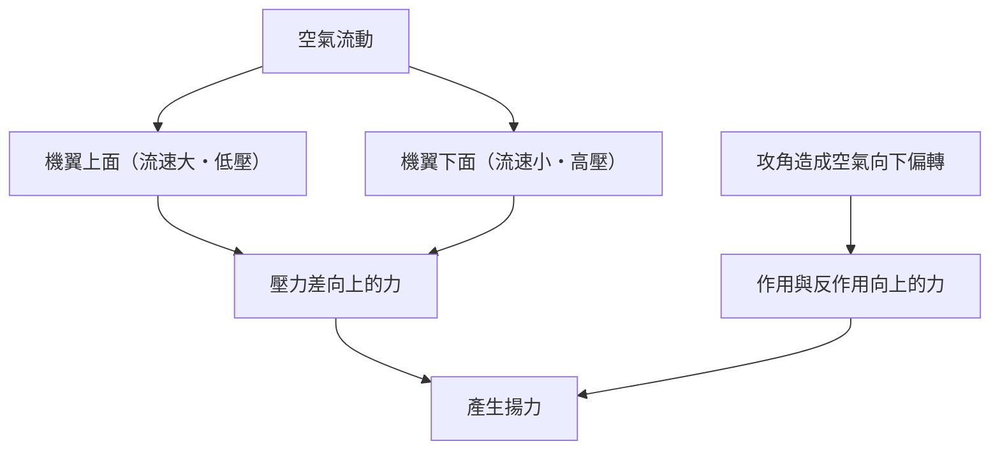
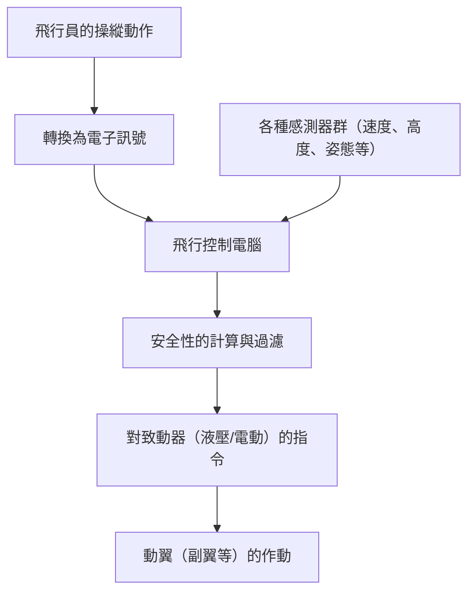

## 前言：為何會飛的鐵塊能浮在空中？

重達數百噸的巨大巨無霸客機，為何能輕盈地飛上天空，並在1萬公尺的高空以時速900公里的極快速度巡航呢？其背後是數個世紀以來的流體力學、熱力學、材料工程，以及現代高度電腦科學的結晶。

本文將徹底解說巨大飛機在空中飛行的機制，從揚力的產生原理到高增升裝置、引擎、加壓系統，以及被稱為線傳飛控的最新電子控制系統。

## 1. 機翼的剖面形狀與揚力的產生原理

飛機在空中飛行的最基本力量，那就是「揚力（Lift）」。產生揚力的關鍵在於機翼的剖面形狀，即「翼型（Airfoil）」。

### 伯努利定理與牛頓第三運動定律

揚力的產生主要與兩個物理定律密切相關。

1. **伯努利定理**：流體速度增加時壓力下降的定律。飛機的機翼通常被設計成上面凸起，下面相對平坦的形狀（不對稱翼）。當空氣流經機翼周圍時，流經上面的空氣會被設計成比下面的空氣流動得更快。這會使得機翼上面的氣壓下降，並產生被下面相對高氣壓向上推的力量（揚力）。
2. **牛頓第三運動定律（作用力與反作用力定律）**：機翼被傾斜以將空氣向下推（攻角）。作為將空氣向下推（作用力）的反彈力，機翼會被向上推（反作用力）。

在現代航空工程中，這兩種效應的結合被解釋為產生抬起巨大機體的揚力。

## 2. 襟翼與縫翼等高增升裝置

巡航中的噴射機因為高速飛行，只需要相對較小的攻角與機翼面積就能獲得足夠的揚力。然而，起降時必須減速，若保持原狀揚力會不足而導致失速（Stall）。為了防止這種情況而裝備的就是「高增升裝置（High-lift devices）」。

### 前緣縫翼（Slats）與後緣襟翼（Flaps）

- **前緣縫翼**：機翼前緣部分向前下方伸出的裝置。這能擴大機翼面積的同時，讓新鮮空氣流入機翼上面，防止空氣剝離（氣流離開機翼表面的現象），並允許採取更大的攻角。
- **後緣襟翼**：機翼後緣部分向下展開的裝置。透過增大整個機翼的弧度（Camber）並進一步擴大機翼面積，即使在低速下也能產生非常大的揚力。

起飛時適度展開這些裝置以增加揚力，降落時則最大限度展開以保持揚力的同時增加空氣阻力（阻力），使機體減速。

## 3. 渦輪扇發動機：強大推力的來源

產生推動巨無霸客機前進力量（推力）的就是「渦輪扇發動機」。這是現代客機發動機的主流，兼具高推力與優異的燃油效率。

### 旁通比的重要性

渦輪扇發動機透過前方巨大的風扇吸入大量空氣。吸入的空氣會分成兩條路徑：
1. **通過核心發動機的空氣**：被壓縮機加壓，在燃燒室中與燃料混合後爆炸、燃燒。這種高溫高壓的排氣氣體會推動渦輪，進而驅動風扇和壓縮機。
2. **繞過核心發動機的空氣（旁通流）**：被風扇加速，直接向後方排出。

在現代客機中，旁通流與核心發動機流的比例（旁通比）被設定得非常高（例如：10比1等）。事實上，大部分的推力（約80%）都是由這種旁通流產生的。這實現了降低噪音與大幅提升燃油效率。

## 4. 1萬公尺高空的嚴苛環境與加壓系統

巡航高度約1萬公尺（約33,000英呎）的高空，對人類來說是非常嚴苛的環境。
- **氣溫**：零下50度左右
- **氣壓**：大約是地面的四分之一
- **氧氣濃度**：稀薄到人類無法呼吸

### 保護乘客的加壓與空調

為了保護乘客免受這種極寒、低壓環境的影響，「加壓系統」和「環境控制系統（ECS）」正在運作。

利用從發動機抽取的高溫、高壓空氣（引氣），透過空調組件調整至適當的溫度與壓力後送入客艙。位於機體後部的排氣閥（Outflow valve）會自動開關，將客艙內的氣壓保持在相當於高度約2,400公尺（8,000英呎）的狀態。機體的機身被製成非常堅固的圓筒形結構（壓力艙壁），以承受從內部膨脹的壓力。

## 5. 線傳飛控：現代電子控制飛行網

過去的飛機是透過金屬纜線或滑輪，將操縱桿的動作直接傳遞給液壓系統或動翼（副翼、升降舵、方向舵）。然而，現代的巨無霸客機採用了一種被稱為「線傳飛控（Fly-by-wire: FBW）」的電子控制系統。

### 電腦介入的安全設計

在FBW中，飛行員的操縱動作會被轉換成電子訊號，並傳送給多個飛行控制電腦。電腦會與來自機體速度、高度、姿態等各種感測器的數據進行比對，瞬間計算出「該操作是否安全」。

- **飛行包線保護（Flight envelope protection）**：即使飛行員錯誤地進行了會導致失速或超出機體結構極限的激烈操作，電腦也會自動進行補償與限制，防止陷入危險狀態。
- **確保冗餘性**：重要的系統採用了三重、四重的多重化設計，即使部分電腦或感測器發生故障，也能確保安全地繼續飛行。

## 結論：科學與工程的極致

我們平時不經意搭乘的巨無霸客機，其每一個零件和系統都經過了極限的計算，是人類智慧的結晶。下次搭飛機時，不妨透過窗外機翼的動作，或是發動機細微的聲音變化，來感受這些複雜而精巧的機制。相信這會讓您的空中之旅變得更加有趣，且令人感動。
