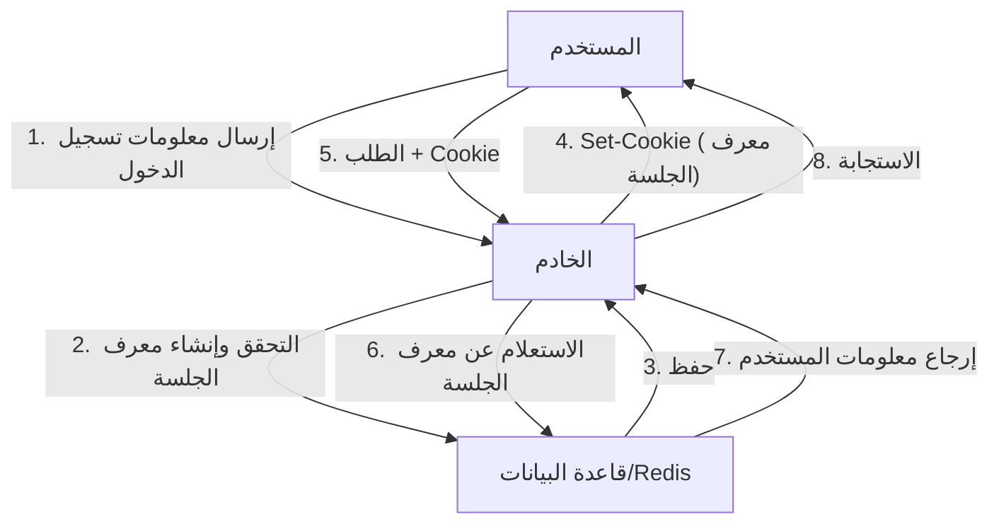
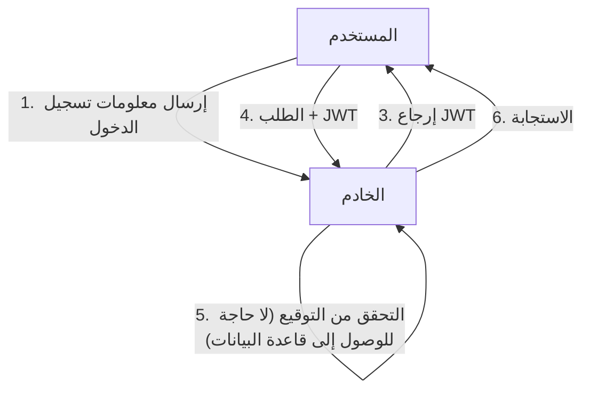
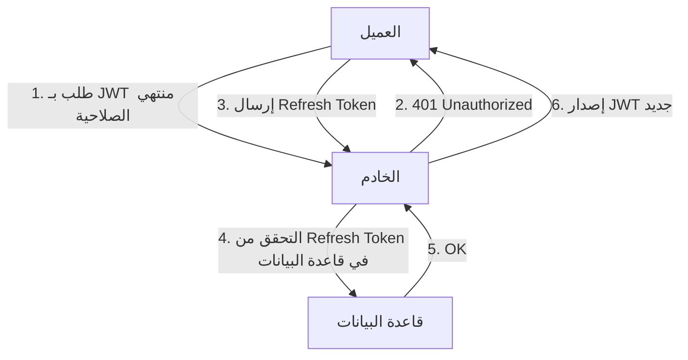

مع تطور تطبيقات الويب، خضعت أنظمة المصادقة أيضًا لتحولات كبيرة. في هذا السياق، انتشر استخدام JSON Web Token (JWT) بشكل هائل كوسيلة مصادقة عديمة الحالة (Stateless) في التطبيقات الحديثة، وخاصة تطبيقات الصفحة الواحدة (SPA) وهندسة الخدمات المصغرة (Microservices).

ومع ذلك، يدق العديد من خبراء الأمن ناقوس الخطر بشأن التعامل مع JWT كـ "حل سحري لإدارة الجلسات". فلماذا يوجد رأي مفاده أنه "لا ينبغي استخدام JWT لإدارة الجلسات"؟ في هذه المقالة، سنقارن بين إدارة الجلسات التقليدية القائمة على ملفات تعريف الارتباط (Cookie) و JWT، ونتعمق في المخاطر الكامنة في JWT والتحديات المعمارية المرتبطة بها.

## آلية إدارة الجلسات التقليدية (ذات الحالة)

قبل مناقشة JWT، دعونا نراجع إدارة الجلسات التقليدية ذات الحالة (Stateful) التي تم استخدامها لسنوات عديدة.

في إدارة الجلسات التقليدية، عندما يسجل المستخدم دخوله بنجاح، يقوم الخادم بإنشاء "معرف جلسة" (Session ID) فريد، ويحفظه في قاعدة بيانات أو مخزن بيانات في الذاكرة (مثل Redis). يتم إرجاع معرف الجلسة هذا فقط إلى العميل كملف تعريف ارتباط (Cookie).

### المزايا
- **سهولة الإبطال (Revocation)**: بمجرد حذف الجلسة من جانب الخادم، يمكن تسجيل خروج المستخدم على الفور، أو إبطال الجلسات المخترقة.
- **صغر حجم البيانات**: ما يتم وضعه في الـ Cookie هو مجرد سلسلة عشوائية (معرف الجلسة)، مما لا يضغط على النطاق الترددي (Bandwidth).
- **قوة الأمان**: يتم تخزين معلومات الجلسة بأمان على جانب الخادم، ولا تكون مرئية للعميل.

### العيوب
- **تحديات قابلية التوسع (Scalability)**: يتطلب كل طلب الوصول إلى مخزن الجلسات، ومع زيادة حركة المرور، يزداد العبء على قاعدة البيانات. كما يتطلب الأمر مشاركة الجلسات بين خوادم متعددة خلف موازن الحمل (Load Balancer).

## ظهور JWT والمصادقة عديمة الحالة

لحل تحديات قابلية التوسع، برزت المصادقة عديمة الحالة باستخدام JWT.

JWT هو رمز مميز يخزن معلومات المستخدم الضرورية (المطالبات أو Claims) بتنسيق JSON، ويتم توقيعه (Signature) بواسطة المفتاح السري للخادم.

### الميزة الكبرى لـ JWT: التحقق دون الحاجة للوصول إلى قاعدة البيانات
في المصادقة بواسطة JWT، عندما يتلقى الخادم طلبًا، فإنه يتحقق ببساطة من التوقيع المرفق بالرمز المميز باستخدام مفتاحه الخاص، مما يؤكد أن الرمز لم يتم العبث به وأنه صادر عنه.
بمعنى آخر، **لا توجد حاجة للوصول إلى قاعدة البيانات مع كل طلب**. هذا يقلل بشكل كبير من النفقات العامة عند تبادل معلومات المصادقة بين الخدمات المصغرة، ويحسن قابلية التوسع بشكل كبير.

---

## "ظل" JWT: المخاطر والتحديات الكامنة في إدارة الجلسات

على الرغم من أن JWT يبدو مثاليًا للوهلة الأولى، إلا أن محاولة تطبيقه كما هو على "إدارة الجلسات" بين المتصفح والخادم تؤدي إلى مواجهة العديد من المشكلات القاتلة.

### 1. صعوبة إبطال الرمز المميز (Revocation) للغاية

إن الميزة الكبرى لـ JWT المتمثلة في كونها "عديمة الحالة" (لا تحتفظ بالحالة على جانب الخادم) تنقلب لتصبح أكبر نقطة ضعف لها.
**كقاعدة عامة، لا يمكن للخادم إبطال JWT الصادر قسريًا حتى تنتهي صلاحيته (exp).**

إذا تمت سرقة جهاز المستخدم أو تسريب JWT من خلال هجوم XSS، فلن يكون لدى المسؤول أي وسيلة لإيقاف ذلك الرمز. حتى إذا تم تغيير كلمة المرور، فإن الـ JWT الصادر يظل صالحًا.

في بعض الحالات، يتم تبني بنية تحتفظ بـ "قائمة سوداء لرموز JWT المبطلة" في قاعدة بيانات أو Redis لحل هذه المشكلة، لكن هذا يهزم الغرض الأساسي. إذا كنت ستتحقق من القائمة السوداء مع كل طلب، فهذا لم يعد "عديم الحالة" ولا يختلف عن إدارة الجلسات التقليدية ذات الحالة. بل إن الأداء يتدهور بسبب نقل JWT، والذي يكون حجم بياناته أكبر بكثير من معرف الجلسة، في كل مرة.

### 2. تاريخ ثغرة "alg: none" ومخاطر التنفيذ

تتمتع JWT بمرونة عالية وتدعم العديد من خوارزميات التوقيع. ومع ذلك، أدت هذه المرونة إلى ثغرات أمنية خطيرة في الماضي.
يحتوي رأس JWT (Header) على حقل `alg` (الخوارزمية)، وإذا تم تحديد `none` هنا، فسيتم التعامل معه كرمز "بدون توقيع".

في الماضي، كانت العديد من مكتبات JWT تعاني من ثغرة قبول `alg: none` (مثل CVE-2015-9256). كان بإمكان المهاجمين إنشاء JWT بصلاحيات مرتفعة، وتغيير الرأس إلى `alg: none`، وإرساله لخداع الخادم وتسجيل الدخول كمسؤولين.
على الرغم من معالجة هذه المشكلة الآن في المكتبات الرئيسية، إلا أنها مثال نموذجي يوضح مدى تعقيد تنفيذ JWT وكيف يمكن أن تكون أخطاء التكوين قاتلة.

### 3. جدل مكان التخزين: LocalStorage مقابل HttpOnly Cookie

بعد تلقي JWT في الواجهة الأمامية (مثل SPA)، دائمًا ما يكون مكان تخزينه موضوعًا لنقاش حاد.

#### التخزين في LocalStorage / SessionStorage
- **المزايا**: يسهل الوصول إليه من JavaScript، ويسهل إرفاقه بترويسة `Authorization: Bearer <token>` في طلبات API.
- **المخاطر**: **ضعيف للغاية أمام هجمات XSS (البرمجة عبر المواقع)**. إذا تم حقن نص برمجي خبيث في الموقع، فيمكن بسهولة قراءة JWT الموجود في LocalStorage وإرساله إلى خادم المهاجم.

#### التخزين في HttpOnly Cookie
- **المزايا**: لا يمكن الوصول إليه من JavaScript، مما يمنع خطر سرقة الرمز مباشرة عن طريق XSS.
- **المخاطر**: **عرضة لهجمات CSRF (تزوير الطلب عبر المواقع)**. نظرًا لأن المتصفحات ترسل ملفات تعريف الارتباط تلقائيًا مع الطلبات، فهناك خطر من تنفيذ عمليات غير مقصودة إذا تم استدعاء API من موقع خبيث آخر (رغم أنه يمكن التخفيف من هذا الخطر بشكل كبير في العصر الحديث باستخدام سمة `SameSite`).

كأفضل ممارسة أمنية، يُنصح عادة بـ **"تخزين JWT في Cookie بسمة HttpOnly"**، ولكن هذا يعيدنا إلى التساؤل: "لماذا لا نستخدم الجلسات العادية القائمة على Cookie إذن؟"

### 4. الحاجة إلى Refresh Token والتعقيد

لتقليل مخاطر تسريب JWT، من الشائع تعيين فترة صلاحية قصيرة جدًا (مثلاً: 15 دقيقة) لرمز الوصول (JWT).
ومع ذلك، لا يمكننا أن نطلب من المستخدم إعادة تسجيل الدخول كل 15 دقيقة. هنا يأتي دور **رمز التحديث (Refresh Token)**.

تتميز رموز التحديث بفترة صلاحية طويلة، ويتم تخزينها في قاعدة بيانات على جانب الخادم، مما يسمح بإبطالها (Revocation) عند الضرورة.
ولكن، فكر في الأمر. **بمجرد قيامك بالتحقق من رموز التحديث وإدارتها في قاعدة البيانات، يصبح النظام "ذا حالة" (Stateful) بالكامل.**

## الخلاصة: تصميم المعمارية المناسبة في المكان المناسب

JWT ليست "شرًا" بأي حال من الأحوال. لكنها ليست علاجًا شاملاً أيضًا.
تعتبر JWT أداة قوية للغاية في حالات الاستخدام التالية:

1. **التواصل بين الخوادم في الخدمات المصغرة**: عندما تحتاج كل خدمة إلى التحقق من المصادقة بشكل مستقل داخل شبكة داخلية موثوقة.
2. **تفويض الصلاحيات قصير المدى**: الاستخدام كروابط إعادة تعيين كلمة المرور أو عناوين URL لمرة واحدة لتأكيد عنوان البريد الإلكتروني.
3. **رمز الوصول (Access Token) ورمز المعرف (ID Token) في OAuth2 / OIDC**: الاستخدام في الغرض الأصلي لها.

من ناحية أخرى، **في إدارة الجلسات (الحفاظ على حالة تسجيل الدخول) بين متصفحات الويب العامة والخوادم، غالبًا ما تكون إدارة الجلسات التقليدية ذات الحالة باستخدام HttpOnly Cookie (واستخدام Redis، إلخ) أكثر أمانًا وبساطة بكثير**.

لا ينبغي تبني JWT لإدارة الجلسات لمجرد أنها "حديثة" أو لأن "الجميع يستخدمها". إن المسؤولية المهمة التي تقع على عاتق المهندس المعماري هي التقييم الشامل لقابلية التوسع المطلوبة للنظام، ومتطلبات الإبطال، والمخاطر الأمنية، واختيار التقنية المناسبة.
