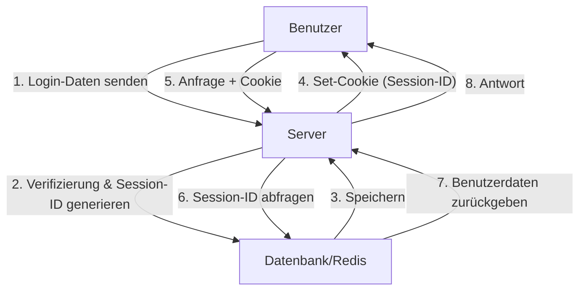
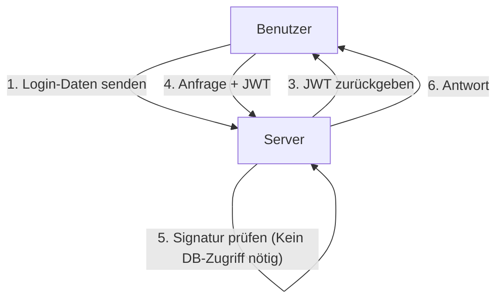
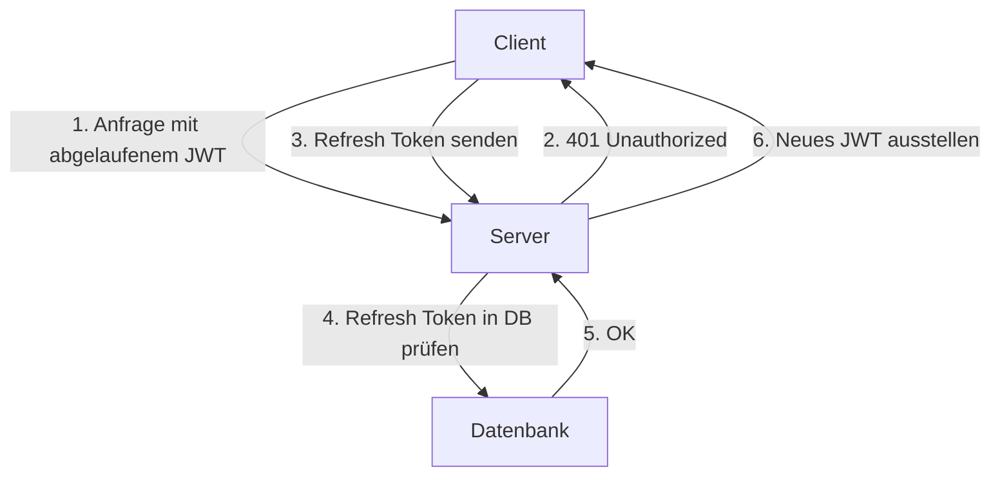

Mit der Entwicklung von Webanwendungen haben auch Authentifizierungssysteme einen großen Wandel vollzogen. In diesem Zusammenhang hat sich das JSON Web Token (JWT) in modernen Anwendungen, insbesondere in Single-Page-Applications (SPA) und Microservices-Architekturen, als zustandslose Authentifizierungsmethode explosionsartig verbreitet.

Viele Sicherheitsexperten warnen jedoch davor, JWT als „Wundermittel für die Sitzungsverwaltung“ zu behandeln. Warum gibt es die Meinung, dass „JWT nicht für die Sitzungsverwaltung verwendet werden sollte“? Dieser Artikel vergleicht die traditionelle Cookie-basierte Sitzungsverwaltung mit JWT und befasst sich eingehend mit den in JWT verborgenen Risiken und architektonischen Herausforderungen.

## Die Funktionsweise der traditionellen Sitzungsverwaltung (Zustandsbehaftet)

Bevor wir über JWT diskutieren, lassen Sie uns die traditionelle zustandsbehaftete (stateful) Sitzungsverwaltung rekapitulieren, die seit vielen Jahren verwendet wird.

Bei der traditionellen Sitzungsverwaltung stellt der Server nach einer erfolgreichen Anmeldung des Benutzers eine eindeutige „Session-ID“ aus und speichert diese in einer Datenbank oder einem In-Memory-Datenspeicher (wie Redis). An den Client wird nur diese Session-ID als Cookie zurückgegeben.

### Vorteile
- **Einfache Ungültigmachung (Revocation)**: Durch einfaches Löschen der Sitzung auf der Serverseite kann ein Benutzer sofort abgemeldet oder eine kompromittierte Sitzung ungültig gemacht werden.
- **Geringe Datengröße**: Das Cookie enthält lediglich eine zufällige Zeichenfolge (Session-ID), was die Bandbreite nicht belastet.
- **Hohe Sicherheit**: Die Sitzungsinformationen werden sicher auf der Serverseite aufbewahrt und sind für den Client nicht sichtbar.

### Nachteile
- **Skalierbarkeitsprobleme**: Bei jeder Anfrage muss auf den Sitzungsspeicher zugegriffen werden, was bei steigendem Datenverkehr die Belastung der Datenbank erhöht. Außerdem ist eine Sitzungsfreigabe (Session-Sharing) zwischen mehreren Servern hinter einem Load Balancer erforderlich.

## Der Aufstieg von JWT (JSON Web Token) und zustandsloser Authentifizierung

Um die Skalierbarkeitsprobleme zu lösen, rückte die zustandslose Authentifizierung mittels JWT in den Fokus.

Ein JWT ist ein Token, das die erforderlichen Benutzerinformationen (Claims) im JSON-Format speichert und mit dem privaten Schlüssel des Servers signiert (Signature) wird.

### Der größte Vorteil von JWT: Überprüfung ohne Datenbankzugriff
Bei der Authentifizierung mit JWT muss der Server bei Erhalt einer Anfrage lediglich die dem Token beigefügte Signatur mit seinem eigenen Schlüssel überprüfen, um sicherzustellen, dass das Token nicht manipuliert wurde und von ihm selbst ausgestellt wurde.
Das bedeutet, **dass bei jeder Anfrage kein Zugriff auf die Datenbank mehr erforderlich ist**. Dadurch verringert sich der Overhead beim Austausch von Authentifizierungsinformationen zwischen Microservices drastisch, und die Skalierbarkeit wird enorm verbessert.

---

## Der „Schatten“ von JWT: Verborgene Risiken und Herausforderungen bei der Sitzungsverwaltung

Auf den ersten Blick scheint JWT perfekt zu sein, aber wenn man versucht, es direkt auf die „Sitzungsverwaltung“ zwischen Browser und Server anzuwenden, stößt man auf zahlreiche fatale Probleme.

### 1. Das Ungültigmachen (Revocation) von Tokens ist extrem schwierig

Der größte Vorteil von JWT, die „Zustandslosigkeit (kein Speichern des Zustands auf dem Server)“, wird gleichzeitig zu seiner größten Schwäche.
**Ein ausgestelltes JWT kann serverseitig prinzipiell nicht erzwungenermaßen ungültig gemacht werden, bis seine Gültigkeitsdauer (exp) abläuft.**

Wenn das Gerät eines Benutzers gestohlen wird oder ein JWT durch einen XSS-Angriff kompromittiert wird, hat der Administrator keine Möglichkeit, dieses Token zu stoppen. Selbst wenn das Passwort geändert wird, bleibt das bereits ausgestellte JWT gültig.

Es gibt Fälle, in denen versucht wird, dieses Problem zu lösen, indem eine Architektur mit einer „Blacklist für ungültig gemachte JWTs“ in einer Datenbank oder Redis implementiert wird, aber das stellt den eigentlichen Zweck auf den Kopf. Wenn bei jeder Anfrage eine Blacklist überprüft wird, ist dies nicht mehr „zustandslos“ und unterscheidet sich in keiner Weise von der traditionellen zustandsbehafteten Sitzungsverwaltung. Vielmehr verschlechtert sich die Leistung, da jedes Mal ein JWT übertragen wird, dessen Datengröße weitaus größer ist als die einer Session-ID.

### 2. Die Geschichte der „alg: none“-Schwachstelle und Implementierungsrisiken

JWT ist sehr flexibel und unterstützt mehrere Signaturalgorithmen. Diese Flexibilität führte jedoch in der Vergangenheit zu schwerwiegenden Schwachstellen.
Im Header eines JWT gibt es das `alg`-Feld (Algorithmus). Wenn hier `none` angegeben wird, wird es als „unsigniertes“ Token behandelt.

In der Vergangenheit wiesen viele JWT-Bibliotheken die Schwachstelle auf, dass sie `alg: none` akzeptierten (z. B. CVE-2015-9256). Ein Angreifer konnte ein JWT mit erhöhten Rechten erstellen, den Header in `alg: none` ändern und es senden, um den Server zu täuschen und sich als Administrator anzumelden.
Dies wurde inzwischen in den wichtigsten Bibliotheken behoben, ist jedoch ein typisches Beispiel dafür, wie komplex die Implementierung von JWT ist und wie leicht Konfigurationsfehler zu fatalen Folgen führen können.

### 3. Die Debatte um den Speicherort: LocalStorage vs. HttpOnly Cookie

Nachdem das JWT im Frontend (z. B. SPA) empfangen wurde, ist die Frage, wo es gespeichert werden soll, stets Gegenstand hitziger Debatten.

#### Bei Speicherung in LocalStorage / SessionStorage
- **Vorteile**: Leicht über JavaScript zugänglich und einfach in den `Authorization: Bearer <token>`-Header von API-Anfragen einzufügen.
- **Risiken**: **Extrem anfällig für XSS-Angriffe (Cross-Site Scripting)**. Wenn schädliches Skript auf der Seite eingeschleust wird, kann das JWT im LocalStorage problemlos ausgelesen und an den Server des Angreifers gesendet werden.

#### Bei Speicherung als HttpOnly Cookie
- **Vorteile**: Da über JavaScript nicht darauf zugegriffen werden kann, wird das Risiko verhindert, dass das Token durch XSS direkt gestohlen wird.
- **Risiken**: **Anfällig für CSRF-Angriffe (Cross-Site Request Forgery)**. Da der Browser das Cookie bei Anfragen automatisch sendet, besteht die Gefahr, dass unbeabsichtigt Aktionen ausgeführt werden, wenn die API von einer anderen bösartigen Seite aus aufgerufen wird (dies kann heutzutage jedoch durch die Verwendung des `SameSite`-Attributs erheblich gemindert werden).

Als Best Practice für die Sicherheit wird tendenziell empfohlen, **„JWT in einem Cookie mit dem HttpOnly-Attribut zu speichern“**, aber an diesem Punkt kehrt man zu der Frage zurück: „Warum reicht dann nicht eine normale Cookie-basierte Sitzung aus?“

### 4. Die Notwendigkeit von Refresh Tokens und zunehmende Komplexität

Um das Risiko einer JWT-Kompromittierung zu minimieren, wird die Gültigkeitsdauer eines Access Tokens (JWT) in der Regel sehr kurz (z. B. 15 Minuten) eingestellt.
Man kann den Benutzer jedoch nicht alle 15 Minuten bitten, sich erneut anzumelden. Hier kommt das **Refresh Token** ins Spiel.

Ein Refresh Token hat eine längere Gültigkeitsdauer, wird in der serverseitigen Datenbank gespeichert und so gestaltet, dass es bei Bedarf ungültig gemacht werden kann (Revocation).
Aber denken Sie genau darüber nach: **In dem Moment, in dem das Refresh Token in der Datenbank überprüft und verwaltet wird, wird das System wieder vollständig „zustandsbehaftet“.**

## Fazit: Die richtige Architektur für den richtigen Zweck wählen

JWT ist keineswegs „böse“. Es ist aber auch kein Allheilmittel.
In den folgenden Anwendungsfällen ist JWT ein äußerst leistungsstarkes Werkzeug:

1. **Server-zu-Server-Kommunikation zwischen Microservices**: Wenn jeder Dienst in einem vertrauenswürdigen internen Netzwerk die Authentifizierung unabhängig überprüfen muss.
2. **Kurzfristige Delegierung von Berechtigungen**: Verwendung als Link zum Zurücksetzen von Passwörtern oder als einmalige URL zur Bestätigung der E-Mail-Adresse.
3. **Access Tokens und ID Tokens in OAuth2 / OIDC**: Nutzung für ihren ursprünglichen Zweck.

Andererseits ist die Realität, dass **für die allgemeine Sitzungsverwaltung (Aufrechterhaltung des Login-Status) zwischen Webbrowser und Server die traditionelle zustandsbehaftete Sitzungsverwaltung mittels HttpOnly Cookie (und z. B. Redis) oft weitaus sicherer und einfacher ist**.

Es ist die wichtigste Verantwortung eines Architekten, JWT nicht nur deshalb für die Sitzungsverwaltung einzusetzen, weil es „modern“ ist oder „jeder es benutzt“, sondern die Anforderungen des Systems an Skalierbarkeit, Ungültigmachung und Sicherheitsrisiken umfassend zu bewerten und die geeignete Technologie auszuwählen.
