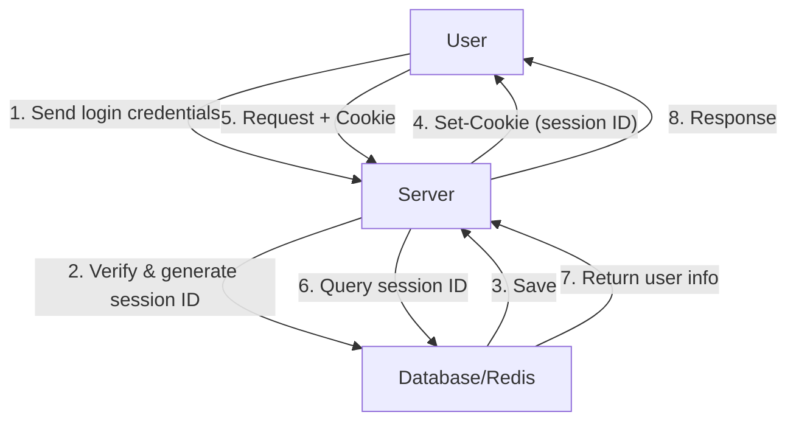
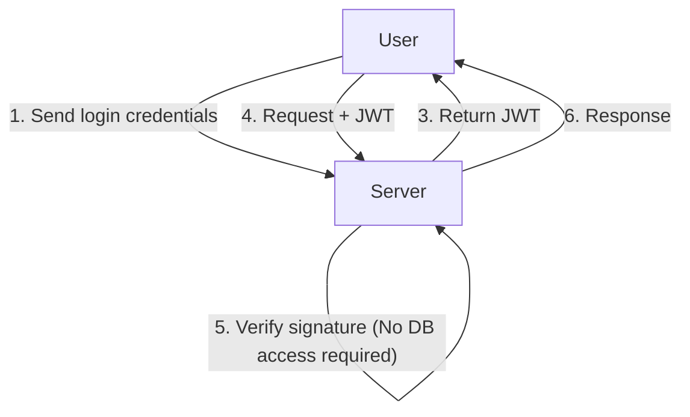
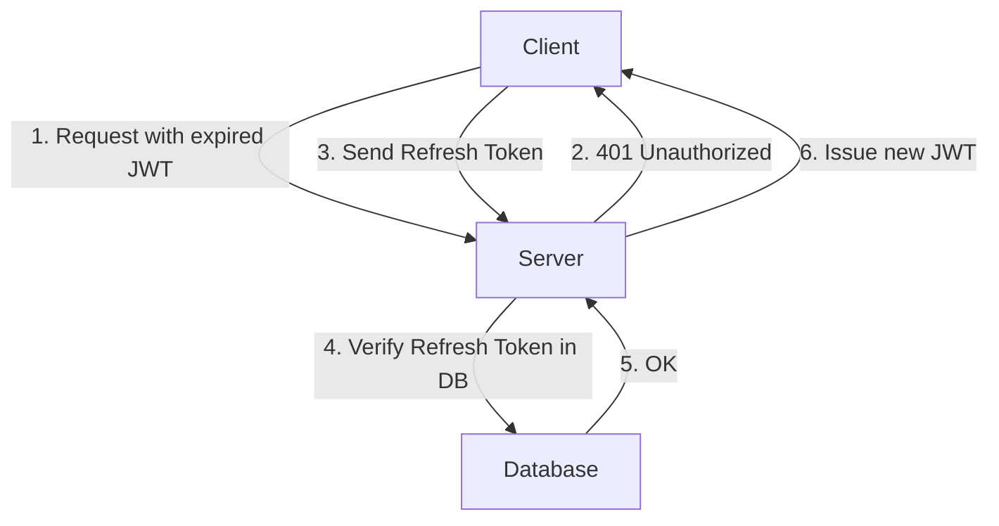

As web applications have evolved, authentication systems have also undergone significant transformations. In this context, JSON Web Tokens (JWT) have exploded in popularity as a stateless authentication method in modern applications, particularly for Single Page Applications (SPAs) and microservices architectures.

However, many security experts sound the alarm about treating JWTs as a "silver bullet for session management." Why is there an opinion that "JWTs should not be used for session management"? In this article, we will compare traditional Cookie-based session management with JWTs, and dig deep into the hidden risks and architectural challenges of JWTs.

## How Traditional Session Management (Stateful) Works

Before discussing JWTs, let's review the traditional stateful session management that has been used for many years.

In traditional session management, when a user successfully logs in, the server issues a unique "session ID" and saves it in a database or an in-memory data store (like Redis). Only this session ID is returned to the client as a Cookie.

### Advantages
- **Easy Revocation**: By simply deleting the session on the server side, you can immediately log out a user or invalidate a hijacked session.
- **Small Data Size**: What is placed in the Cookie is just a random string (the session ID), which does not strain bandwidth.
- **Robust Security**: Session information is safely stored on the server side and is invisible to the client.

### Disadvantages
- **Scalability Challenges**: It is necessary to access the session store for every request, and as traffic increases, the load on the database increases. Session sharing across multiple servers behind a load balancer is also required.

## The Rise of JWT (JSON Web Token) and Stateless Authentication

To solve the scalability challenges, stateless authentication using JWTs attracted attention.

A JWT is a token that stores necessary user information (claims) in JSON format and is appended with a signature using the server's secret key.

### The Biggest Advantage of JWT: Verification Without DB Access
In authentication with JWT, when the server receives a request, it only needs to verify the signature attached to the token with its own key to confirm that the token has not been tampered with and that it was issued by itself.
In other words, **there is no longer a need to access the database for every request**. This drastically reduces the overhead of exchanging authentication information between microservices and dramatically improves scalability.

---

## The "Shadow" of JWT: Hidden Risks and Challenges in Session Management

At first glance, JWT seems perfect, but when trying to apply it directly to "session management" between a browser and a server, it faces numerous fatal problems.

### 1. Token Revocation is Extremely Difficult

The greatest advantage of JWT, its "stateless" nature (having no state on the server side), directly flips into its biggest weakness.
**Once a JWT is issued, it generally cannot be forcibly invalidated on the server side until its expiration time (exp) runs out.**

If a user's device is stolen or a JWT is leaked via an XSS attack, administrators have no way to stop that token. Even if the password is changed, the already issued JWT continues to live.

To solve this, there are cases where an architecture with a "blacklist of invalidated JWTs" in a database or Redis is adopted, but this defeats the original purpose. If a blacklist is checked for every request, it is no longer "stateless" and is no different from traditional stateful session management. Rather, performance deteriorates by transmitting a JWT every time, which has a much larger data size than a session ID.

### 2. The History and Implementation Risks of the "alg: none" Vulnerability

JWT is highly flexible and supports multiple signature algorithms. However, this flexibility has caused serious vulnerabilities in the past.
The header of a JWT has an `alg` (algorithm) field, and if `none` is specified here, it is treated as an "unsigned" token.

In the past, many JWT libraries had a vulnerability (such as CVE-2015-9256) where they accepted `alg: none`. An attacker could simply create a JWT with elevated privileges, rewrite the header to `alg: none`, and send it, easily deceiving the server and logging in as an administrator.
While major libraries have now addressed this, it is a typical example showing how complex JWT implementation can be and how fatal configuration mistakes can become.

### 3. The Storage Location Debate: LocalStorage vs HttpOnly Cookie

After receiving a JWT on the frontend (like an SPA), where it should be stored is always a subject of fierce debate.

#### Storing in LocalStorage / SessionStorage
- **Advantages**: It is easy to access from JavaScript and easy to attach to the `Authorization: Bearer <token>` header of API requests.
- **Risks**: **It is extremely vulnerable to XSS (Cross-Site Scripting) attacks.** If a malicious script gets into the site, the JWT in LocalStorage can be easily read and sent to the attacker's server.

#### Storing in HttpOnly Cookie
- **Advantages**: Because it cannot be accessed from JavaScript, it prevents the risk of the token being directly stolen by XSS.
- **Risks**: **It becomes a target for CSRF (Cross-Site Request Forgery) attacks.** Because browsers automatically send Cookies when making a request, there is a danger that unintended processes might be executed if an API is hit from another malicious site (though this can be largely mitigated nowadays by utilizing the `SameSite` attribute).

As a security best practice, there is a tendency to recommend **"storing JWT in an HttpOnly attribute Cookie,"** but when this happens, it brings us back to the question, "Why not just use regular Cookie-based sessions?"

### 4. The Necessity and Complexity of Refresh Tokens

To minimize the risk of a JWT leak, the expiration time of an access token (JWT) is generally set very short (e.g., 15 minutes).
However, you cannot ask the user to log in again every 15 minutes. This is where the **Refresh Token** comes into play.

Refresh tokens are designed to have a long expiration time, be stored in the server-side database, and be capable of revocation if necessary.
But think about it carefully. **The moment refresh tokens are being verified and managed in a database, the system has become completely "stateful."**

## Conclusion: Designing an Architecture of the Right Tool for the Right Job

JWTs are by no means "evil." However, they are not a panacea either.
In the following use cases, JWTs become very powerful tools:

1. **Server-to-Server Communication in Microservices**: When each service needs to independently verify authentication within a trusted internal network.
2. **Short-Term Delegation of Authority**: Use as password reset links or one-time URLs for email address confirmation.
3. **Access Tokens and ID Tokens in OAuth2 / OIDC**: Their intended primary use.

On the other hand, **for session management (maintaining login state) between typical web browsers and servers, traditional stateful session management using HttpOnly Cookies (using Redis, etc.) is often much safer and simpler in reality.**

Rather than adopting JWT for session management just because it is "modern" or "everyone is using it," it is an important responsibility required of an architect to comprehensively evaluate the scalability, revocation requirements, and security risks the system demands, and choose the appropriate technology.
