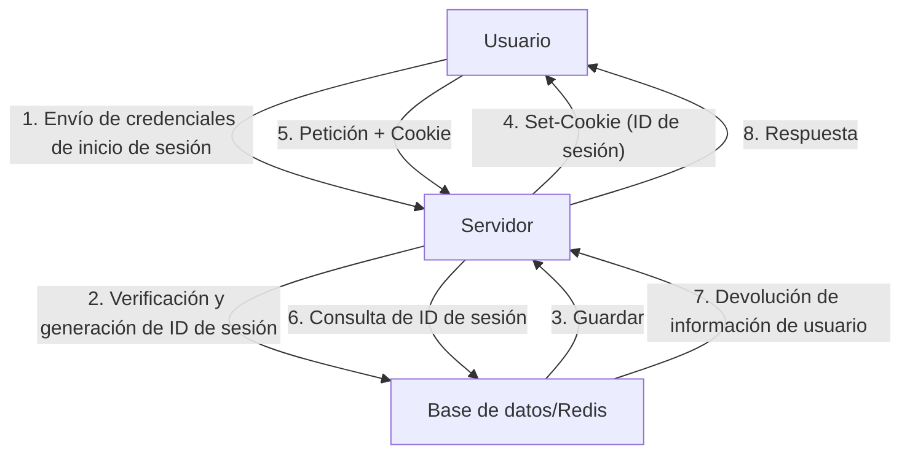
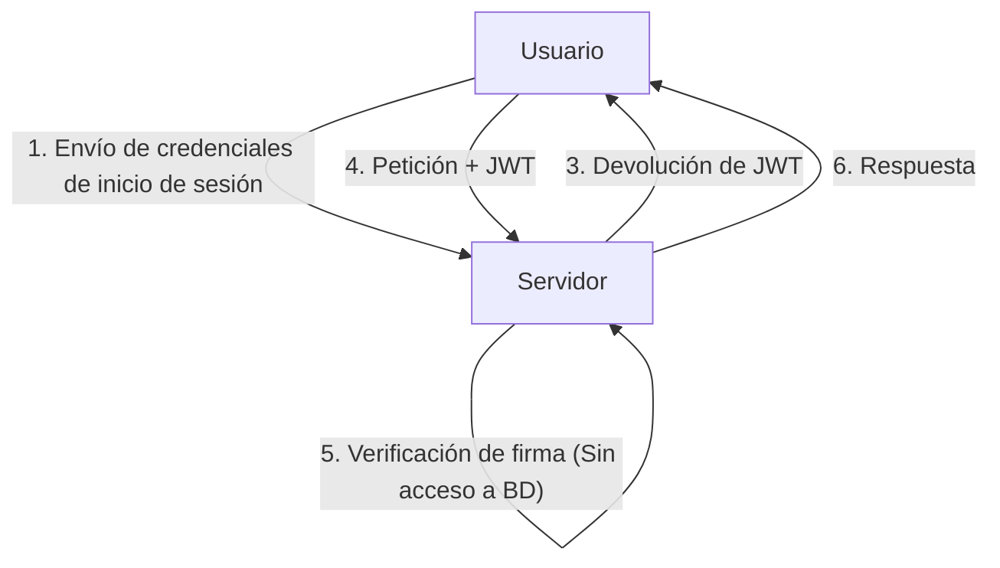
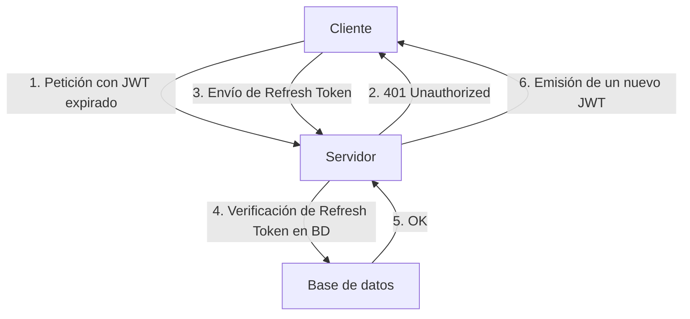

Junto con la evolución de las aplicaciones web, los sistemas de autenticación también han experimentado grandes transformaciones. En este contexto, JSON Web Token (JWT) se ha popularizado explosivamente como un método de autenticación sin estado (stateless) en aplicaciones modernas, especialmente en aplicaciones de página única (SPA) y arquitecturas de microservicios.

Sin embargo, muchos expertos en seguridad advierten sobre el peligro de tratar a JWT como la "bala de plata para la gestión de sesiones". ¿Por qué existe la opinión de que "no se debe usar JWT para la gestión de sesiones"? En este artículo, compararemos la gestión tradicional de sesiones basada en cookies con JWT, y profundizaremos en los riesgos ocultos y los desafíos arquitectónicos de JWT.

## El mecanismo tradicional de gestión de sesiones (con estado / stateful)

Antes de debatir sobre JWT, repasemos la tradicional gestión de sesiones con estado que se ha utilizado durante muchos años.

En la gestión de sesiones tradicional, cuando un usuario inicia sesión correctamente, el servidor emite un "ID de sesión" único y lo guarda en una base de datos o en un almacén de datos en memoria (como Redis). Al cliente solo se le devuelve este ID de sesión en forma de Cookie.

### Ventajas
- **Facilidad de revocación (Revocation)**: Simplemente eliminando la sesión en el lado del servidor, se puede cerrar la sesión del usuario inmediatamente o invalidar una sesión secuestrada.
- **Tamaño de datos reducido**: Lo único que se envía en la Cookie es una cadena aleatoria (el ID de sesión), por lo que no consume mucho ancho de banda.
- **Robustez de seguridad**: La información de la sesión se guarda de forma segura en el servidor y no es visible para el cliente.

### Desventajas
- **Problemas de escalabilidad**: Es necesario acceder al almacén de sesiones con cada petición, y si el tráfico aumenta, la carga en la base de datos se vuelve muy alta. También se requiere compartir las sesiones entre múltiples servidores detrás de un balanceador de carga.

## El auge de JWT (JSON Web Token) y la autenticación sin estado

Para resolver los problemas de escalabilidad, llamó la atención la autenticación sin estado mediante el uso de JWT.

JWT es un token que almacena la información necesaria del usuario (claims) en formato JSON y le añade una firma (Signature) utilizando la clave privada del servidor.

### La mayor ventaja de JWT: Verificación sin acceso a la base de datos
En la autenticación con JWT, cuando el servidor recibe una petición, solo tiene que verificar la firma adjunta al token con su propia clave para confirmar que el token no ha sido alterado y que fue emitido por él mismo.
En otras palabras, **ya no es necesario acceder a la base de datos con cada petición**. Gracias a esto, la sobrecarga al intercambiar información de autenticación entre microservicios se reduce drásticamente, mejorando la escalabilidad de forma exponencial.

---

## Las "sombras" de JWT: Riesgos y desafíos ocultos en la gestión de sesiones

A primera vista, JWT parece perfecto, pero si se intenta aplicar directamente a la "gestión de sesiones" entre el navegador y el servidor, nos enfrentaremos a numerosos problemas fatales.

### 1. La revocación (Revocation) del token es extremadamente difícil

La principal ventaja de JWT, su característica de "sin estado" (no mantener estado en el servidor), se convierte a su vez en su mayor debilidad.
**En principio, un JWT emitido no puede ser invalidado forzosamente desde el lado del servidor hasta que su tiempo de expiración (exp) se haya agotado.**

Si el dispositivo de un usuario es robado o si el JWT se filtra mediante un ataque XSS, el administrador no tiene forma de detener ese token. Incluso si se cambia la contraseña, el JWT ya emitido seguirá siendo válido.

Hay casos donde, para solucionar esto, se adopta una arquitectura que mantiene una "lista negra de JWTs invalidados" en una base de datos o en Redis, pero esto es contraproducente. Si se comprueba la lista negra en cada petición, entonces ya no es "sin estado", y no se diferencia en nada de la gestión de sesiones con estado tradicional. De hecho, el rendimiento empeorará, ya que se transfiere en cada ocasión un JWT cuyo tamaño de datos es mucho mayor que un ID de sesión.

### 2. La historia de la vulnerabilidad "alg: none" y los riesgos de implementación

JWT es muy flexible y soporta múltiples algoritmos de firma. Sin embargo, esta flexibilidad ha causado graves vulnerabilidades en el pasado.
El encabezado de JWT tiene un campo `alg` (algoritmo), y si se especifica `none` en él, se trata como un token "sin firma".

En el pasado, muchas bibliotecas de JWT sufrían de una vulnerabilidad (como CVE-2015-9256) en la cual aceptaban `alg: none`. Un atacante solo tenía que crear un JWT con sus privilegios elevados, reescribir el encabezado con `alg: none` y enviarlo para engañar al servidor y lograr iniciar sesión como administrador.
Actualmente esto está mitigado en las bibliotecas principales, pero es un ejemplo típico de lo compleja que es la implementación de JWT y de cómo un error de configuración puede ser fatal.

### 3. El debate sobre el lugar de almacenamiento: LocalStorage vs HttpOnly Cookie

Tras recibir el JWT en el frontend (como en una SPA), dónde se debe almacenar es siempre objeto de un intenso debate.

#### Almacenarlo en LocalStorage / SessionStorage
- **Ventajas**: Se puede acceder fácilmente desde JavaScript y es fácil de adjuntar al encabezado `Authorization: Bearer <token>` en las peticiones a la API.
- **Riesgos**: **Es extremadamente vulnerable a ataques XSS (Cross-Site Scripting)**. Si se inyecta un script malicioso en el sitio, el JWT en LocalStorage puede ser leído fácilmente y enviado al servidor del atacante.

#### Almacenarlo en una Cookie HttpOnly
- **Ventajas**: Al no ser accesible desde JavaScript, se evita el riesgo de que el token sea robado directamente mediante XSS.
- **Riesgos**: **Se convierte en el objetivo de ataques CSRF (Cross-Site Request Forgery)**. Dado que el navegador envía automáticamente las cookies al realizar una petición, existe el peligro de que una acción se ejecute involuntariamente si otra página maliciosa invoca a la API (sin embargo, hoy en día esto se puede mitigar en gran medida utilizando el atributo `SameSite`).

Como mejor práctica de seguridad, hay una tendencia a recomendar **"guardar el JWT en una Cookie con el atributo HttpOnly"**, pero al hacerlo, volvemos a la pregunta de "¿por qué no usar simplemente sesiones tradicionales basadas en cookies?".

### 4. La necesidad y complejidad de los Refresh Tokens

Para minimizar el riesgo de filtración de un JWT, es común configurar el tiempo de expiración del token de acceso (JWT) de forma muy corta (por ejemplo, 15 minutos).
Sin embargo, no se le puede pedir al usuario que vuelva a iniciar sesión cada 15 minutos. Es aquí donde entran en juego los **tokens de actualización (Refresh Tokens)**.

Un token de actualización tiene una expiración más larga, se almacena en la base de datos del lado del servidor, y se diseña de manera que pueda ser invalidado (revocado) si es necesario.
Pero piénsalo bien: **en el momento en que se verifica y gestiona un token de actualización en la base de datos, el sistema se vuelve completamente "con estado" (stateful).**

## Conclusión: Diseñar una arquitectura adecuada para el lugar adecuado

JWT no es de ninguna manera "malo". Pero tampoco es una panacea.
En los siguientes casos de uso, JWT puede ser una herramienta extremadamente poderosa:

1. **Comunicación de servidor a servidor entre microservicios**: Cuando en una red interna de confianza cada servicio necesita verificar la autenticación de forma independiente.
2. **Delegación de permisos a corto plazo**: Como enlaces para restablecer contraseñas o URLs de un solo uso para verificar direcciones de correo electrónico.
3. **Tokens de acceso y tokens de ID en OAuth2 / OIDC**: Su uso previsto original.

Por otro lado, **en la gestión de sesiones general entre un navegador web y un servidor (mantener el estado de inicio de sesión), la gestión de sesiones tradicional con estado utilizando Cookies HttpOnly (como el uso de Redis) es, en muchos casos, mucho más segura y simple.**

En lugar de adoptar JWT para la gestión de sesiones simplemente "porque es moderno" o "porque todo el mundo lo usa", la importante responsabilidad de un arquitecto es juzgar de forma integral la escalabilidad que requiere el sistema, los requisitos de revocación y los riesgos de seguridad, para así elegir la tecnología adecuada.
