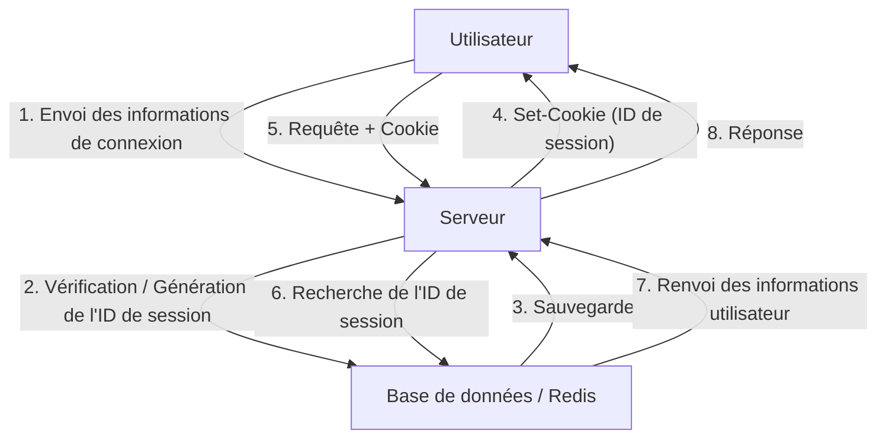
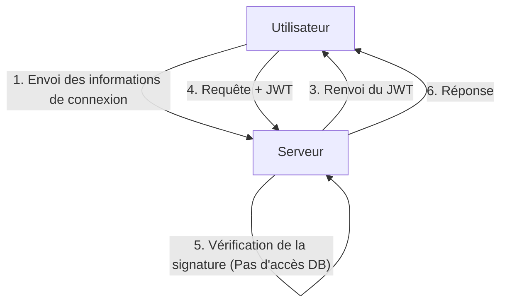
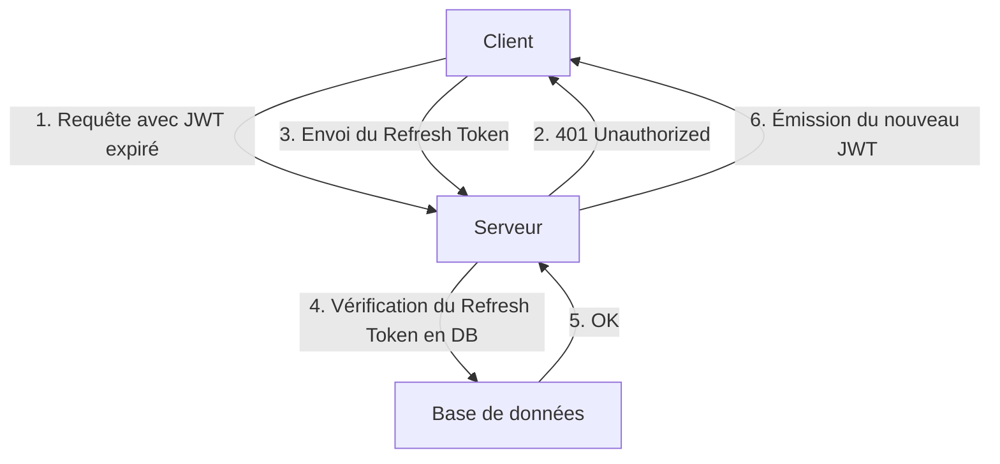

Avec l'évolution des applications web, les systèmes d'authentification ont également subi des transformations majeures. Parmi elles, les JSON Web Tokens (JWT) ont connu une adoption explosive en tant que moyen d'authentification sans état (stateless) dans les applications modernes, en particulier les applications à page unique (SPA) et les architectures de microservices.

Cependant, de nombreux experts en sécurité mettent en garde contre le fait de considérer JWT comme une « solution miracle pour la gestion des sessions ». Pourquoi l'opinion selon laquelle « JWT ne devrait pas être utilisé pour la gestion des sessions » existe-t-elle ? Dans cet article, nous comparerons la gestion de session traditionnelle basée sur les cookies avec JWT, et nous approfondirons les risques cachés et les défis architecturaux de JWT.

## Le fonctionnement de la gestion de session traditionnelle (avec état)

Avant de discuter de JWT, passons en revue la gestion de session traditionnelle avec état (stateful) qui est utilisée depuis de nombreuses années.

Dans la gestion de session traditionnelle, lorsqu'un utilisateur réussit à se connecter, le serveur émet un « ID de session » unique et l'enregistre dans une base de données ou un magasin de données en mémoire (tel que Redis). Seul cet ID de session est renvoyé au client sous forme de cookie.

### Avantages
- **Révocation facile** : Il suffit de supprimer la session côté serveur pour déconnecter immédiatement l'utilisateur ou invalider une session usurpée.
- **Petite taille des données** : Le cookie ne contient qu'une chaîne de caractères aléatoire (l'ID de session), ce qui ne surcharge pas la bande passante.
- **Robustesse de la sécurité** : Les informations de session sont stockées en toute sécurité côté serveur et sont invisibles pour le client.

### Inconvénients
- **Défis de scalabilité** : Il est nécessaire d'accéder au magasin de sessions à chaque requête, et lorsque le trafic augmente, la charge sur la base de données s'intensifie. Le partage de session entre plusieurs serveurs derrière un équilibreur de charge est également nécessaire.

## L'essor de JWT (JSON Web Token) et de l'authentification sans état

Pour résoudre les problèmes de scalabilité, l'attention s'est portée sur l'authentification sans état à l'aide de JWT.

Un JWT est un jeton qui stocke les informations utilisateur nécessaires (revendications ou *claims*) au format JSON et y appose une signature en utilisant la clé privée du serveur.

### Le plus grand avantage de JWT : vérification sans accès à la base de données
Avec l'authentification JWT, lorsque le serveur reçoit une requête, il lui suffit de vérifier la signature attachée au jeton avec sa propre clé pour confirmer que le jeton n'a pas été altéré et qu'il l'a bien émis lui-même.
En d'autres termes, **il n'est plus nécessaire d'accéder à la base de données à chaque requête**. Cela réduit considérablement la charge lors de l'échange d'informations d'authentification entre les microservices, améliorant ainsi de manière spectaculaire la scalabilité.

---

## L'« ombre » de JWT : risques et défis de la gestion des sessions

À première vue, JWT semble parfait, mais si l'on tente de l'appliquer tel quel à la « gestion de session » entre un navigateur et un serveur, on se heurte à de nombreux problèmes critiques.

### 1. La révocation des jetons est extrêmement difficile

La caractéristique « sans état » (absence d'état côté serveur), qui est le plus grand avantage de JWT, se transforme directement en sa plus grande faiblesse.
**En principe, un JWT émis ne peut pas être invalidé de force par le serveur avant l'expiration de sa durée de validité (exp).**

Si l'appareil de l'utilisateur est volé ou si le JWT fuit en raison d'une attaque XSS, l'administrateur n'a aucun moyen d'arrêter ce jeton. Même si le mot de passe est modifié, le JWT déjà émis reste valide.

Pour résoudre ce problème, certaines architectures adoptent une « liste noire de JWT révoqués » dans une base de données ou Redis, mais c'est un non-sens. Si la liste noire est vérifiée à chaque requête, le système n'est plus « sans état », et cela ne diffère en rien de la gestion de session traditionnelle avec état. Au contraire, les performances se dégradent car le JWT, dont la taille est bien supérieure à celle d'un ID de session, est transmis à chaque fois.

### 2. L'histoire de la vulnérabilité « alg: none » et les risques d'implémentation

JWT est très flexible et prend en charge plusieurs algorithmes de signature. Cependant, cette flexibilité a causé de graves vulnérabilités par le passé.
L'en-tête du JWT contient un champ `alg` (algorithme), et si on y spécifie `none`, il est traité comme un jeton « sans signature ».

Autrefois, de nombreuses bibliothèques JWT présentaient une vulnérabilité (comme la CVE-2015-9256) qui acceptait `alg: none`. Un attaquant pouvait créer un JWT élevant ses propres privilèges, modifier l'en-tête en `alg: none` et l'envoyer, trompant ainsi le serveur pour se connecter en tant qu'administrateur.
Bien que cela soit corrigé dans les bibliothèques principales aujourd'hui, c'est un exemple typique montrant à quel point l'implémentation de JWT est complexe et qu'une erreur de configuration peut être fatale.

### 3. La controverse sur le lieu de stockage : LocalStorage vs HttpOnly Cookie

Après avoir reçu un JWT sur le front-end (comme une SPA), l'endroit où le stocker fait l'objet de débats intenses.

#### Stockage dans LocalStorage / SessionStorage
- **Avantages** : Facilement accessible depuis JavaScript, ce qui facilite son ajout à l'en-tête `Authorization: Bearer <token>` des requêtes API.
- **Risques** : **Extrêmement vulnérable aux attaques XSS (Cross-Site Scripting)**. Si un script malveillant s'infiltre dans le site, le JWT contenu dans le LocalStorage peut être facilement lu et envoyé au serveur de l'attaquant.

#### Stockage dans un HttpOnly Cookie
- **Avantages** : Inaccessible depuis JavaScript, ce qui empêche le risque de vol direct du jeton via XSS.
- **Risques** : **Sujet aux attaques CSRF (Cross-Site Request Forgery)**. Le navigateur envoyant automatiquement les cookies lors d'une requête, si une API est appelée depuis un autre site malveillant, des actions non désirées pourraient être exécutées (bien que cela puisse être considérablement atténué aujourd'hui en utilisant l'attribut `SameSite`).

En tant que meilleure pratique de sécurité, **« stocker le JWT dans un cookie avec l'attribut HttpOnly »** a tendance à être recommandé, mais cela ramène à la question : « Pourquoi une session classique basée sur les cookies ne suffirait-elle pas ? »

### 4. La nécessité du Refresh Token et la complexification

Pour minimiser le risque de fuite du JWT, la durée de validité du jeton d'accès (JWT) est généralement définie comme étant très courte (par exemple, 15 minutes).
Cependant, on ne peut pas demander à l'utilisateur de se reconnecter toutes les 15 minutes. C'est là qu'intervient le **Refresh Token (jeton d'actualisation)**.

Le Refresh Token a une longue durée de validité, est stocké dans la base de données côté serveur et est conçu pour pouvoir être révoqué si nécessaire.
Mais réfléchissez bien. **Au moment où le système vérifie et gère le Refresh Token dans la base de données, il devient complètement « avec état (stateful) ».**

## Conclusion : Concevoir une architecture adaptée aux besoins

JWT n'est en aucun cas « mauvais ». Mais ce n'est pas non plus une panacée.
Dans les cas d'utilisation suivants, JWT est un outil très puissant :

1. **Communication de serveur à serveur entre microservices** : Lorsque chaque service doit vérifier l'authentification de manière indépendante sur un réseau interne de confiance.
2. **Délégation de pouvoir à court terme** : Utilisation comme lien de réinitialisation de mot de passe ou URL à usage unique pour la confirmation de l'adresse e-mail.
3. **Jetons d'accès et jetons d'identité dans OAuth2 / OIDC** : Utilisation dans son but initial.

D'un autre côté, **pour la gestion des sessions entre un navigateur Web classique et un serveur (maintien de l'état de connexion), l'utilisation d'une gestion de session avec état utilisant un HttpOnly Cookie traditionnel (avec Redis, etc.) est souvent beaucoup plus sûre et plus simple**.

Adopter JWT pour la gestion de session simplement parce que c'est « moderne » ou parce que « tout le monde l'utilise » n'est pas recommandé. Il est de la responsabilité majeure de l'architecte d'évaluer globalement la scalabilité, les exigences de révocation et les risques de sécurité du système afin de choisir la technologie appropriée.
