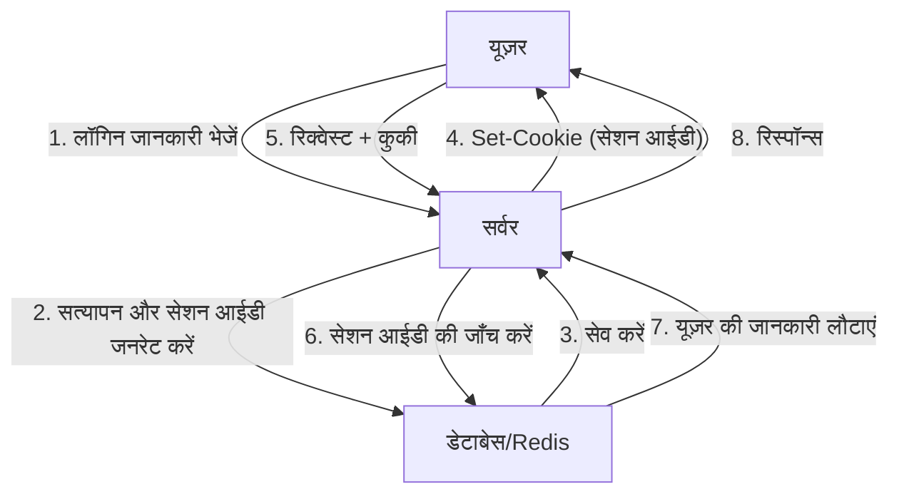
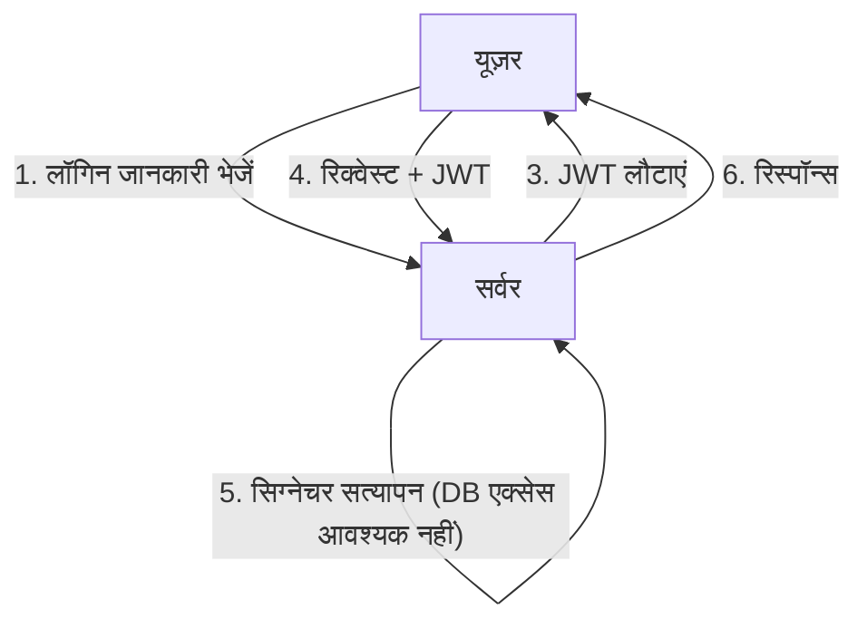
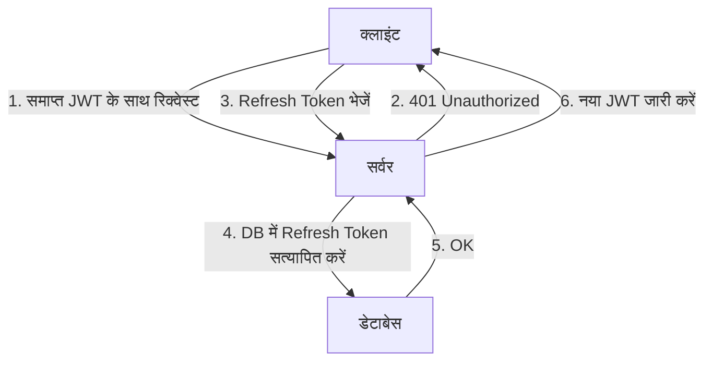

वेब एप्लिकेशन के विकास के साथ, ऑथेंटिकेशन (प्रमाणीकरण) प्रणालियों में भी बड़े बदलाव हुए हैं। इसमें, JSON Web Token (JWT) ने आधुनिक एप्लिकेशन्स, विशेष रूप से सिंगल-पेज एप्लिकेशन (SPA) और माइक्रोसर्विस आर्किटेक्चर में, एक स्टेटलेस ऑथेंटिकेशन पद्धति के रूप में बहुत लोकप्रियता हासिल की है।

हालाँकि, JWT को "सत्र प्रबंधन (session management) के लिए रामबाण" के रूप में मानने के खिलाफ कई सुरक्षा विशेषज्ञों ने चेतावनी दी है। "JWT का उपयोग सत्र प्रबंधन के लिए नहीं किया जाना चाहिए" जैसी राय क्यों मौजूद है? इस लेख में, हम पारंपरिक कुकी-आधारित (Cookie-based) सत्र प्रबंधन की JWT से तुलना करेंगे, और JWT में छिपे जोखिमों और आर्किटेक्चरल चुनौतियों पर गहराई से विचार करेंगे।

## पारंपरिक सत्र प्रबंधन (स्टेटफुल) की कार्यप्रणाली

JWT पर चर्चा करने से पहले, आइए वर्षों से उपयोग किए जा रहे पारंपरिक स्टेटफुल सत्र प्रबंधन (stateful session management) को दोहराएं।

पारंपरिक सत्र प्रबंधन में, जब कोई यूज़र सफलतापूर्वक लॉगिन करता है, तो सर्वर एक अद्वितीय (unique) "सेशन आईडी" जारी करता है और उसे डेटाबेस या इन-मेमोरी डेटा स्टोर (जैसे Redis) में सेव करता है। क्लाइंट को यह सेशन आईडी केवल एक कुकी (Cookie) के रूप में लौटाया जाता है।

### फायदे
- **रद्द करना (Revocation) आसान**: सर्वर साइड पर केवल सत्र को हटाकर, यूज़र को तुरंत लॉग आउट किया जा सकता है या चोरी हुए सत्र को अमान्य किया जा सकता है।
- **डेटा का छोटा आकार**: कुकी में केवल एक रैंडम स्ट्रिंग (सेशन आईडी) होती है, जो बैंडविड्थ पर दबाव नहीं डालती।
- **मजबूत सुरक्षा**: सत्र की जानकारी सर्वर पर सुरक्षित रूप से रखी जाती है, और क्लाइंट को दिखाई नहीं देती।

### नुकसान
- **स्केलेबिलिटी की चुनौती**: हर रिक्वेस्ट पर सेशन स्टोर को एक्सेस करने की आवश्यकता होती है, और ट्रैफिक बढ़ने पर डेटाबेस पर लोड बढ़ जाता है। लोड बैलेंसर के पीछे कई सर्वरों के बीच सत्र साझा करना भी आवश्यक हो जाता है।

## JWT (JSON Web Token) और स्टेटलेस ऑथेंटिकेशन का उदय

स्केलेबिलिटी की चुनौती को हल करने के लिए, JWT का उपयोग करके स्टेटलेस ऑथेंटिकेशन पर ध्यान केंद्रित किया गया।

JWT एक ऐसा टोकन है जो आवश्यक यूज़र जानकारी (क्लेम्स) को JSON फॉर्मेट में स्टोर करता है और सर्वर की प्राइवेट की (Private Key) से एक सिग्नेचर (Signature) जोड़ता है।

### JWT का सबसे बड़ा फायदा: DB एक्सेस के बिना सत्यापन
JWT द्वारा ऑथेंटिकेशन में, जब सर्वर को कोई रिक्वेस्ट मिलती है, तो वह टोकन से जुड़े सिग्नेचर को अपनी की (Key) से सत्यापित करता है। यह पुष्टि करता है कि टोकन के साथ छेड़छाड़ नहीं की गई है और यह उसी के द्वारा जारी किया गया था।
यानी, **हर रिक्वेस्ट पर डेटाबेस को एक्सेस करने की आवश्यकता समाप्त हो जाती है**। इससे माइक्रोसर्विसेज के बीच ऑथेंटिकेशन जानकारी शेयर करते समय ओवरहेड काफी कम हो जाता है, और स्केलेबिलिटी में काफी सुधार होता है।

---

## JWT की "परछाई": सत्र प्रबंधन में जोखिम और चुनौतियां

पहली नज़र में JWT परफेक्ट लग सकता है, लेकिन अगर आप इसे ब्राउज़र और सर्वर के बीच "सत्र प्रबंधन" पर सीधे लागू करने का प्रयास करते हैं, तो आपको कई गंभीर समस्याओं का सामना करना पड़ेगा।

### 1. टोकन को रद्द करना (Revocation) बेहद मुश्किल है

JWT का सबसे बड़ा फायदा, "स्टेटलेस (सर्वर साइड पर कोई स्टेट नहीं)", इसकी सबसे बड़ी कमजोरी में बदल जाता है।
**एक बार जारी किया गया JWT, जब तक कि उसकी समाप्ति तिथि (exp) समाप्त नहीं हो जाती, सिद्धांत रूप में सर्वर साइड पर जबरन रद्द नहीं किया जा सकता।**

यदि किसी यूज़र का डिवाइस चोरी हो जाता है, या XSS हमले से JWT लीक हो जाता है, तो एडमिनिस्ट्रेटर के पास उस टोकन को रोकने का कोई उपाय नहीं है। पासवर्ड बदलने के बावजूद, जारी किया गया JWT काम करता रहेगा।

इसे हल करने के लिए "रद्द किए गए JWT की ब्लैकलिस्ट" को डेटाबेस या Redis में रखने का आर्किटेक्चर इस्तेमाल किया जाता है, लेकिन यह मूल उद्देश्य को ही खत्म कर देता है। अगर हर रिक्वेस्ट पर ब्लैकलिस्ट चेक की जाती है, तो यह अब "स्टेटलेस" नहीं रहता, बल्कि पारंपरिक स्टेटफुल सत्र प्रबंधन के समान हो जाता है। इसके विपरीत, सेशन आईडी की तुलना में बहुत बड़े डेटा आकार वाले JWT को हर बार ट्रांसफर करने से परफॉरमेंस खराब हो जाता है।

### 2. "alg: none" भेद्यता का इतिहास और इम्प्लीमेंटेशन जोखिम

JWT अत्यधिक लचीला है और कई सिग्नेचर एल्गोरिदम का समर्थन करता है। लेकिन इसी लचीलेपन ने अतीत में गंभीर कमजोरियों को जन्म दिया है।
JWT हेडर में एक `alg` (एल्गोरिदम) फील्ड होता है, और यदि इसे `none` के रूप में सेट किया जाता है, तो इसे "बिना सिग्नेचर" वाले टोकन के रूप में माना जाता है।

अतीत में, कई JWT लाइब्रेरीज़ में यह भेद्यता (जैसे CVE-2015-9256) थी जो `alg: none` को स्वीकार कर लेती थी। हमलावर केवल एक उन्नत विशेषाधिकार वाला (escalated privilege) JWT बना सकते थे, हेडर को `alg: none` में बदल सकते थे, और सर्वर को धोखा देकर एडमिनिस्ट्रेटर के रूप में लॉगिन कर सकते थे।
आजकल, प्रमुख लाइब्रेरीज़ में इसे ठीक कर लिया गया है, लेकिन यह इस बात का एक क्लासिक उदाहरण है कि JWT को लागू करना कितना जटिल है, और कॉन्फ़िगरेशन की गलतियाँ कैसे घातक हो सकती हैं।

### 3. स्टोर करने के स्थान पर विवाद: LocalStorage vs HttpOnly Cookie

फ्रंटएंड (जैसे SPA) में JWT प्राप्त करने के बाद, इसे कहाँ स्टोर किया जाए, यह हमेशा गहन बहस का विषय रहता है।

#### LocalStorage / SessionStorage में स्टोर करना
- **फायदे**: JavaScript से आसानी से एक्सेस किया जा सकता है, और API रिक्वेस्ट के `Authorization: Bearer <token>` हेडर में जोड़ना आसान है।
- **जोखिम**: **XSS (क्रॉस-साइट स्क्रिप्टिंग) हमलों के प्रति अत्यधिक संवेदनशील** है। यदि साइट में कोई दुर्भावनापूर्ण (malicious) स्क्रिप्ट इंजेक्ट की जाती है, तो LocalStorage में मौजूद JWT को आसानी से पढ़ा जा सकता है और हमलावर के सर्वर पर भेजा जा सकता है।

#### HttpOnly Cookie में स्टोर करना
- **फायदे**: JavaScript से एक्सेस नहीं किया जा सकता, इसलिए XSS द्वारा सीधे टोकन चोरी होने का जोखिम कम होता है।
- **जोखिम**: **CSRF (क्रॉस-साइट रिक्वेस्ट फोर्जरी) हमलों का लक्ष्य** बन जाता है। चूंकि ब्राउज़र रिक्वेस्ट करते समय स्वचालित रूप से कुकीज़ भेजता है, इसलिए यदि किसी अन्य दुर्भावनापूर्ण साइट से API कॉल की जाती है, तो अनपेक्षित प्रक्रियाएं निष्पादित (execute) होने का खतरा होता है (हालाँकि आधुनिक समय में `SameSite` एट्रिब्यूट का उपयोग करके इसे काफी हद तक कम किया जा सकता है)।

सुरक्षा के सर्वोत्तम अभ्यास (Best Practice) के रूप में, **"JWT को HttpOnly एट्रिब्यूट वाली कुकी में स्टोर करने"** की सिफारिश की जाती है, लेकिन फिर यह सवाल उठता है कि "सामान्य कुकी-आधारित सत्र क्यों नहीं?"

### 4. Refresh Token की आवश्यकता और जटिलता

JWT लीक होने के जोखिम को कम करने के लिए, एक्सेस टोकन (JWT) की समाप्ति तिथि आम तौर पर बहुत कम (जैसे 15 मिनट) सेट की जाती है।
लेकिन आप यूज़र को हर 15 मिनट में फिर से लॉगिन करने के लिए नहीं कह सकते। यहीं **रिफ्रेश टोकन (Refresh Token)** काम आता है।

रिफ्रेश टोकन की समाप्ति तिथि लंबी होती है, इसे सर्वर साइड डेटाबेस में स्टोर किया जाता है, और इसे आवश्यकतानुसार रद्द (Revoke) करने योग्य डिज़ाइन किया जाता है।
लेकिन ध्यान से सोचें। **जैसे ही आप डेटाबेस में रिफ्रेश टोकन को सत्यापित और प्रबंधित करते हैं, सिस्टम पूरी तरह से "स्टेटफुल" हो जाता है।**

## निष्कर्ष: सही जगह पर सही आर्किटेक्चर डिज़ाइन

JWT कभी भी "बुरा" नहीं है। लेकिन यह हर मर्ज़ की दवा भी नहीं है।
निम्नलिखित यूज़ केस में JWT एक बहुत ही शक्तिशाली टूल बन जाता है:

1. **माइक्रोसर्विसेज के बीच सर्वर-टू-सर्वर संचार**: विश्वसनीय आंतरिक नेटवर्क पर, जहाँ प्रत्येक सेवा को स्वतंत्र रूप से ऑथेंटिकेशन को सत्यापित करने की आवश्यकता होती है।
2. **अल्पकालिक अधिकार प्रत्यायोजन (Short-term delegation)**: पासवर्ड रीसेट लिंक या ईमेल एड्रेस कन्फर्मेशन के लिए वन-टाइम URL के रूप में।
3. **OAuth2 / OIDC में एक्सेस टोकन और आईडी टोकन**: इसके मूल उद्देश्य के रूप में उपयोग।

दूसरी ओर, **सामान्य वेब ब्राउज़र और सर्वर के बीच सत्र प्रबंधन (लॉगिन स्थिति बनाए रखने) के लिए, पारंपरिक HttpOnly कुकीज़ (जैसे Redis का उपयोग) का उपयोग करके स्टेटफुल सत्र प्रबंधन अक्सर अधिक सुरक्षित और सरल होता है।**

सिर्फ इसलिए कि यह "आधुनिक" है या "हर कोई इसका उपयोग कर रहा है", JWT को सत्र प्रबंधन के लिए अपनाने के बजाय, सिस्टम की स्केलेबिलिटी आवश्यकताओं, रद्द करने की आवश्यकताओं और सुरक्षा जोखिमों का समग्र रूप से मूल्यांकन करना, और उपयुक्त तकनीक का चयन करना एक आर्किटेक्ट की महत्वपूर्ण जिम्मेदारी है。
