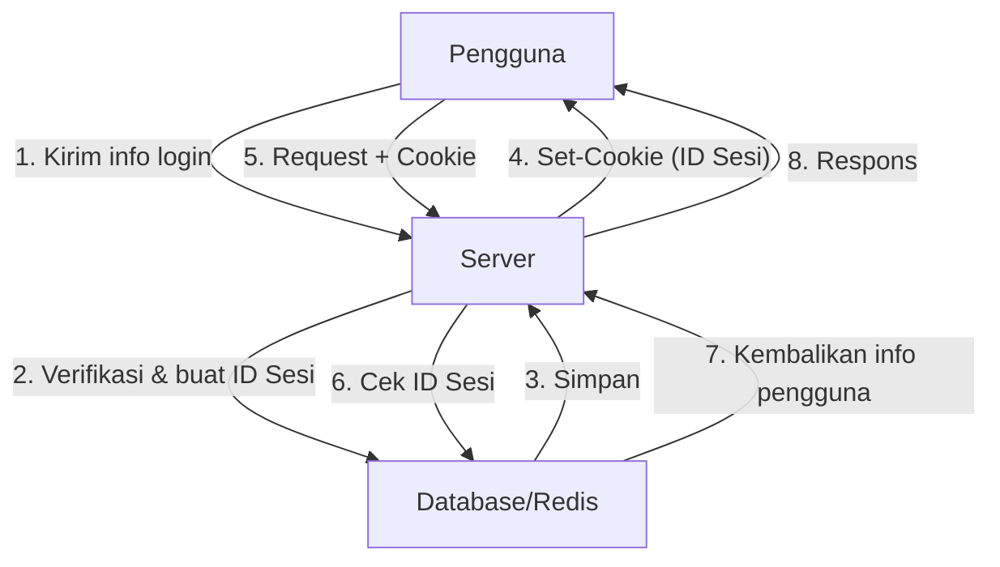
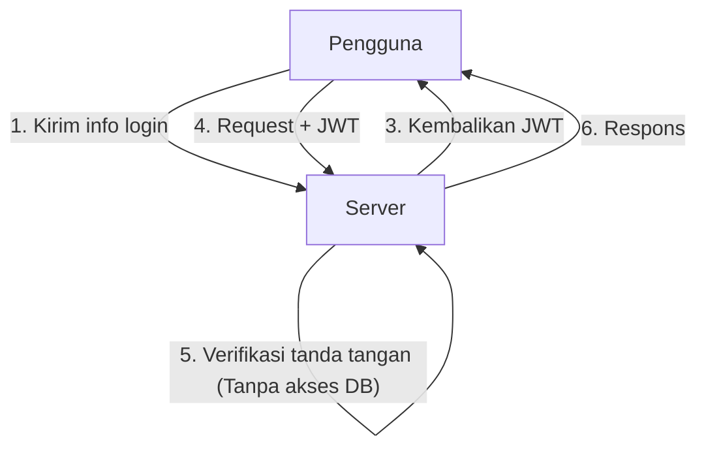
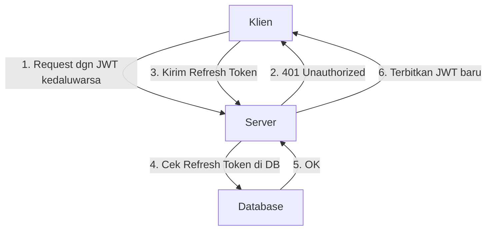

Seiring dengan evolusi aplikasi web, sistem autentikasi juga telah mengalami transformasi yang besar. Di antaranya, JSON Web Token (JWT) telah menyebar secara eksplosif sebagai metode autentikasi stateless untuk aplikasi modern, terutama *Single Page Application* (SPA) dan arsitektur layanan mikro (*microservices*).

Namun, banyak pakar keamanan yang memperingatkan agar tidak memperlakukan JWT sebagai "peluru perak dalam manajemen sesi". Mengapa ada pendapat bahwa "JWT tidak seharusnya digunakan untuk manajemen sesi"? Dalam artikel ini, kita akan membandingkan manajemen sesi berbasis Cookie tradisional dengan JWT, serta menggali lebih dalam mengenai risiko dan tantangan arsitektur yang tersembunyi pada JWT.

## Mekanisme Manajemen Sesi Tradisional (Stateful)

Sebelum membahas tentang JWT, mari kita tinjau kembali manajemen sesi stateful tradisional yang telah digunakan selama bertahun-tahun.

Pada manajemen sesi tradisional, ketika pengguna berhasil login, server akan menerbitkan "ID sesi" yang unik dan menyimpannya di database atau *in-memory data store* (seperti Redis). Server hanya mengembalikan ID sesi ini ke klien dalam bentuk Cookie.

### Kelebihan
- **Mudah dicabut (Revocation)**: Hanya dengan menghapus sesi di sisi server, pengguna dapat langsung *logout* atau sesi yang dibajak dapat dibatalkan seketika.
- **Ukuran data kecil**: Hanya string acak (ID sesi) yang disematkan pada Cookie, sehingga tidak membebani *bandwidth*.
- **Keamanan yang kokoh**: Informasi sesi disimpan dengan aman di sisi server dan tidak terlihat oleh klien.

### Kekurangan
- **Tantangan skalabilitas**: Perlu mengakses *session store* pada setiap *request*, dan jika lalu lintas meningkat, beban pada database akan ikut naik. Diperlukan juga pembagian sesi (*session sharing*) antar berbagai server yang berada di belakang *load balancer*.

## Kebangkitan JWT (JSON Web Token) dan Autentikasi Stateless

Untuk mengatasi tantangan skalabilitas tersebut, autentikasi stateless menggunakan JWT mulai menarik perhatian.

JWT adalah token yang menyimpan informasi pengguna yang diperlukan (klaim) dalam format JSON, yang kemudian diberikan tanda tangan digital (*Signature*) menggunakan kunci rahasia milik server.

### Keuntungan Utama JWT: Verifikasi Tanpa Akses DB
Pada autentikasi menggunakan JWT, saat server menerima *request*, server hanya perlu memverifikasi tanda tangan yang tersemat pada token menggunakan kuncinya sendiri untuk memastikan bahwa token tersebut tidak diubah dan benar-benar diterbitkan olehnya.
Artinya, **tidak perlu lagi mengakses database pada setiap request**. Hal ini secara drastis mengurangi *overhead* saat bertukar informasi autentikasi antar layanan mikro, dan meningkatkan skalabilitas secara signifikan.

---

## "Bayangan" JWT: Risiko dan Tantangan dalam Manajemen Sesi

Meski JWT sekilas terlihat sempurna, jika kita menerapkannya begitu saja untuk "manajemen sesi" antara peramban (*browser*) dan server, kita akan menghadapi banyak masalah fatal.

### 1. Pencabutan Token (Revocation) Sangat Sulit Dilakukan

Karakteristik "stateless" (tidak menyimpan status di sisi server) yang merupakan keunggulan terbesar JWT, juga sekaligus berbalik menjadi kelemahan terbesarnya.
**Pada prinsipnya, JWT yang telah diterbitkan tidak dapat dibatalkan secara paksa di sisi server hingga masa berlakunya (exp) habis.**

Jika perangkat pengguna dicuri atau JWT bocor akibat serangan XSS, administrator tidak memiliki cara untuk menghentikan token tersebut. Bahkan jika *password* diubah, JWT yang sudah terbit akan tetap hidup.

Untuk mengatasi ini, kadang digunakan arsitektur yang menyimpan "daftar hitam (*blacklist*) JWT yang dibatalkan" di dalam database atau Redis. Namun, hal ini menjadi keliru secara mendasar. Jika harus mengecek *blacklist* setiap kali ada *request*, sistem tersebut tidak lagi "stateless" dan tidak ada bedanya dengan manajemen sesi stateful tradisional. Malahan, kinerjanya akan memburuk karena harus mentransfer JWT—yang ukuran datanya jauh lebih besar daripada ID sesi—pada setiap *request*.

### 2. Sejarah Kerentanan "alg: none" dan Risiko Implementasi

JWT sangat fleksibel dan mendukung berbagai algoritma tanda tangan. Namun, fleksibilitas inilah yang menyebabkan kerentanan serius di masa lalu.
Header JWT memiliki *field* `alg` (algoritma), dan jika nilai `none` ditentukan di sana, token tersebut akan diperlakukan sebagai token "tanpa tanda tangan".

Di masa lalu, banyak pustaka JWT memiliki kerentanan yang menerima `alg: none` (seperti CVE-2015-9256). Seorang penyerang dapat membuat JWT dengan hak akses yang telah ditingkatkan, lalu cukup dengan mengubah header menjadi `alg: none` dan mengirimkannya, mereka dapat mengelabui server agar bisa login sebagai administrator.
Meskipun hal ini sudah diatasi pada pustaka-pustaka utama saat ini, ini adalah contoh klasik yang menunjukkan betapa rumitnya implementasi JWT dan bagaimana kesalahan konfigurasi dapat berakibat fatal.

### 3. Perdebatan Lokasi Penyimpanan: LocalStorage vs HttpOnly Cookie

Setelah menerima JWT di *frontend* (seperti SPA), pertanyaan di mana token tersebut harus disimpan selalu menjadi perdebatan sengit.

#### Jika disimpan di LocalStorage / SessionStorage
- **Kelebihan**: Mudah diakses dari JavaScript, dan mudah disematkan ke dalam header API *request* `Authorization: Bearer <token>`.
- **Risiko**: **Sangat rentan terhadap serangan XSS (Cross-Site Scripting)**. Jika ada skrip berbahaya yang menyusup ke situs, JWT di LocalStorage dapat dengan mudah dibaca dan dikirim ke server penyerang.

#### Jika disimpan di HttpOnly Cookie
- **Kelebihan**: Karena tidak dapat diakses dari JavaScript, risiko token dicuri secara langsung oleh XSS bisa dihindari.
- **Risiko**: **Menjadi target serangan CSRF (Cross-Site Request Forgery)**. Karena *browser* otomatis mengirimkan Cookie pada setiap *request*, jika API dipanggil dari situs jahat lainnya, ada bahaya bahwa proses akan dieksekusi di luar kehendak pengguna (meskipun di masa kini, hal ini dapat dikurangi secara signifikan dengan memanfaatkan atribut `SameSite`).

Sebagai praktik terbaik keamanan, **"menyimpan JWT dalam Cookie dengan atribut HttpOnly"** sering kali direkomendasikan. Namun, jika demikian, kita kembali ke pertanyaan: "Mengapa tidak menggunakan sesi berbasis Cookie biasa saja?"

### 4. Kebutuhan dan Kompleksitas Refresh Token

Untuk meminimalkan risiko kebocoran JWT, masa berlaku token akses (JWT) umumnya diatur menjadi sangat singkat (misalnya 15 menit).
Namun, tidak mungkin kita meminta pengguna untuk login ulang setiap 15 menit. Di sinilah **Refresh Token** berperan.

Refresh token memiliki masa berlaku yang lebih lama, disimpan di database sisi server, dan dirancang agar dapat dibatalkan (Revocation) jika diperlukan.
Namun, coba pikirkan kembali. **Pada saat Anda memverifikasi dan mengelola refresh token di database, sistem tersebut telah sepenuhnya menjadi "stateful".**

## Kesimpulan: Rancanglah Arsitektur yang Tepat Guna

JWT bukanlah sesuatu yang "jahat". Namun, JWT juga bukan obat untuk segala penyakit.
JWT menjadi alat yang sangat kuat pada kasus penggunaan berikut:

1. **Komunikasi antar-server pada layanan mikro**: Saat setiap layanan harus memverifikasi autentikasi secara independen di jaringan internal yang tepercaya.
2. **Delegasi wewenang jangka pendek**: Penggunaan sebagai URL sekali pakai untuk konfirmasi alamat email atau tautan reset kata sandi.
3. **Token akses & Token ID di OAuth2 / OIDC**: Penggunaan sesuai tujuan aslinya.

Di sisi lain, kenyataannya adalah bahwa **untuk manajemen sesi (mempertahankan status login) antara web browser umum dan server, manajemen sesi stateful menggunakan HttpOnly Cookie tradisional (seperti menggunakan Redis) sering kali jauh lebih aman dan sederhana.**

Mengadopsi JWT untuk manajemen sesi hanya karena alasan "modern" atau "semua orang menggunakannya" bukanlah langkah yang tepat. Menilai secara komprehensif skalabilitas yang dibutuhkan sistem, persyaratan pencabutan akses, serta risiko keamanan, lalu memilih teknologi yang paling sesuai adalah tanggung jawab krusial seorang arsitek perangkat lunak.
