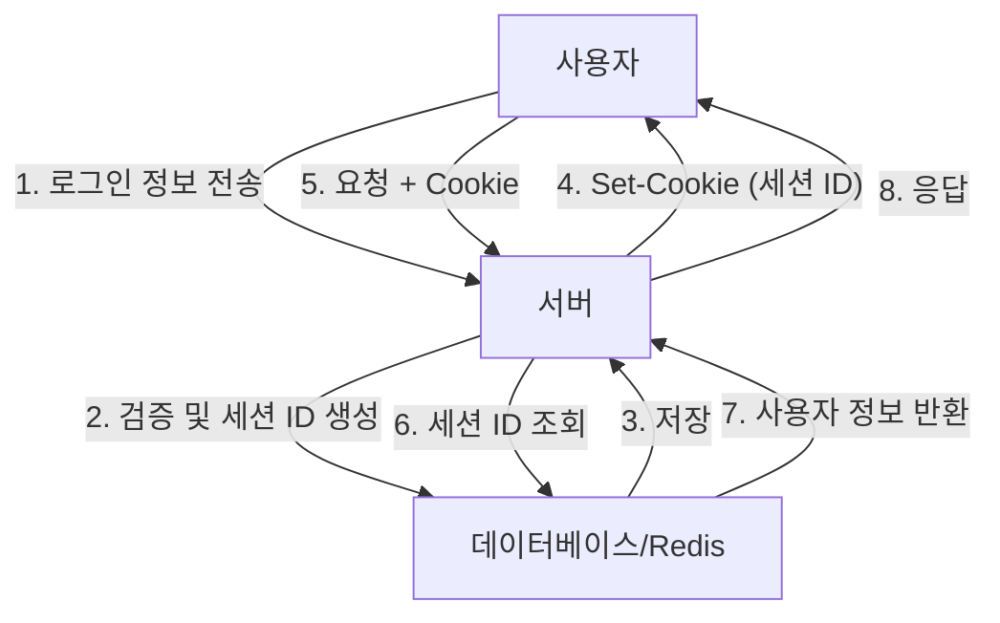
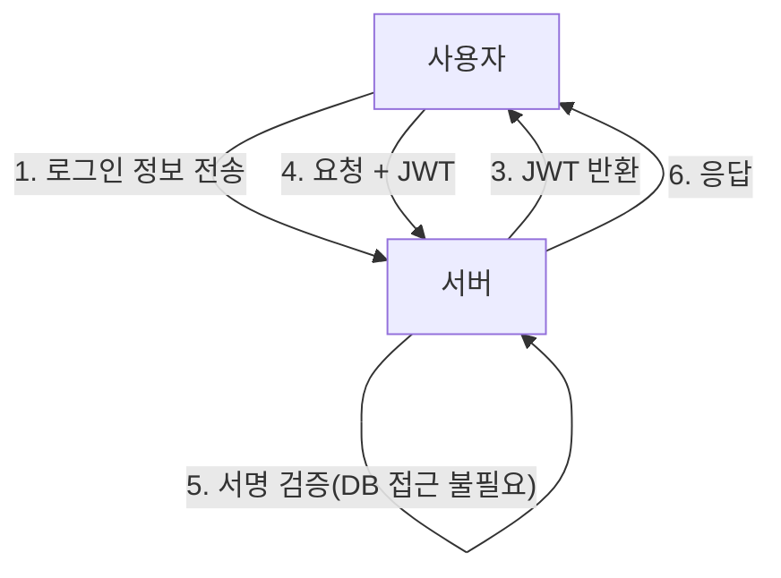
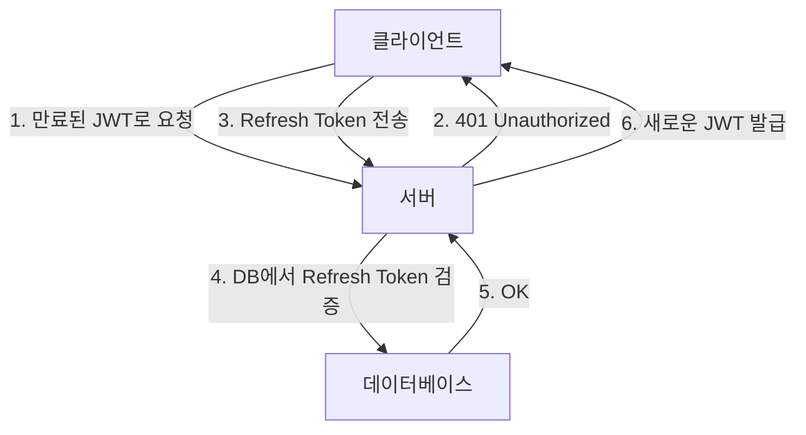

웹 애플리케이션의 발전과 함께 인증 시스템도 큰 변혁을 이루어 왔습니다. 그중에서도 JSON Web Token(JWT)은 모던 애플리케이션, 특히 싱글 페이지 애플리케이션(SPA)이나 마이크로서비스 아키텍처에서 상태 비저장(Stateless) 인증 수단으로 폭발적으로 보급되었습니다.

하지만 JWT를 '세션 관리의 은탄환'으로 취급하는 것에 대해 많은 보안 전문가들이 경종을 울리고 있습니다. "JWT는 세션 관리에 사용해서는 안 된다"라는 의견은 왜 존재하는 것일까요? 본 기사에서는 기존의 쿠키 기반 세션 관리와 JWT를 비교하고, JWT에 숨겨진 위험성과 아키텍처 상의 과제에 대해 깊이 파헤쳐 보겠습니다.

## 기존 세션 관리(상태 유지, Stateful)의 메커니즘

JWT에 대해 논의하기 전에, 오랫동안 사용되어 온 기존의 상태 유지(Stateful) 세션 관리에 대해 복습해 봅시다.

기존의 세션 관리에서는 사용자가 로그인에 성공하면 서버 측에서 고유한 '세션 ID'를 발급하고, 이를 데이터베이스나 인메모리 데이터 스토어(Redis 등)에 저장합니다. 클라이언트에게는 이 세션 ID만을 쿠키로 반환합니다.

### 장점
- **무효화(Revocation)가 용이함**: 서버 측에서 세션을 삭제하는 것만으로 즉시 사용자를 로그아웃시키거나 탈취된 세션을 무효화할 수 있습니다.
- **작은 데이터 크기**: 쿠키에 담는 것은 무작위 문자열(세션 ID)뿐이므로 대역폭을 압박하지 않습니다.
- **견고한 보안**: 세션 정보는 서버 측에 안전하게 보관되며 클라이언트에게는 보이지 않습니다.

### 단점
- **확장성 과제**: 요청이 있을 때마다 세션 스토어에 접근해야 하므로, 트래픽이 증가하면 데이터베이스에 가해지는 부하가 높아집니다. 로드 밸런서 뒤에 있는 여러 서버 간의 세션 공유도 필요합니다.

## JWT(JSON Web Token)와 상태 비저장(Stateless) 인증의 대두

확장성 과제를 해결하기 위해 주목받은 것이 JWT를 이용한 상태 비저장 인증입니다.

JWT는 필요한 사용자 정보(클레임, Claim)를 JSON 형식으로 저장하고, 서버의 비밀키로 서명(Signature)을 부여한 토큰입니다.

### JWT의 최대 장점: DB 접근이 필요 없는 검증
JWT를 통한 인증에서는 서버가 요청을 받았을 때 토큰에 부여된 서명을 자신이 가진 키로 검증하는 것만으로, 해당 토큰이 위조되지 않았다는 것과 자신이 발급한 것임을 확인할 수 있습니다.
즉, **요청이 있을 때마다 데이터베이스에 접근할 필요가 없어집니다**. 이로 인해 마이크로서비스 간에 인증 정보를 주고받을 때의 오버헤드가 급감하고, 확장성이 비약적으로 향상되었습니다.

---

## JWT의 '그림자': 세션 관리에 숨겨진 위험성과 과제

언뜻 보기에 완벽해 보이는 JWT이지만, 이를 브라우저와 서버 간의 '세션 관리'에 그대로 적용하려고 하면 수많은 치명적인 문제에 직면하게 됩니다.

### 1. 토큰의 무효화(Revocation)가 매우 어려움

JWT의 최대 장점인 '상태 비저장(서버 측에 상태를 가지지 않음)'이라는 특성은 그대로 최대 약점으로 뒤바뀝니다.
**발급된 JWT는 유효 기간(exp)이 만료될 때까지 원칙적으로 서버 측에서 강제로 무효화할 수 없습니다.**

만약 사용자의 기기를 도난당하거나 XSS 공격으로 인해 JWT가 유출된 경우, 관리자는 해당 토큰을 정지시킬 수단을 갖지 못합니다. 비밀번호를 변경해도 발급된 JWT는 계속 살아 있습니다.

이를 해결하고자 '무효화된 JWT의 블랙리스트'를 데이터베이스나 Redis에 두는 아키텍처를 채택하는 경우가 있는데, 이는 본말전도입니다. 요청마다 블랙리스트를 확인한다면 그것은 더 이상 '상태 비저장'이 아니며, 기존의 상태 유지 세션 관리와 다를 바가 없습니다. 오히려 세션 ID보다 훨씬 데이터 크기가 큰 JWT를 매번 전송하는 만큼 성능은 악화됩니다.

### 2. 'alg: none' 취약점의 역사와 구현 위험성

JWT는 유연성이 높아 여러 서명 알고리즘을 지원합니다. 하지만 이 유연성이 과거에 심각한 취약점을 일으켰습니다.
JWT 헤더에는 `alg`(알고리즘) 필드가 있으며, 여기에 `none`을 지정하면 '서명 없음' 토큰으로 취급됩니다.

과거 많은 JWT 라이브러리가 `alg: none`을 허용해 버리는 취약점(CVE-2015-9256 등)을 안고 있었습니다. 공격자는 자신의 권한을 상승시킨 JWT를 생성하고 헤더를 `alg: none`으로 변조하여 전송하는 것만으로 서버를 속여 관리자로 로그인할 수 있었습니다.
현재는 주요 라이브러리에서 대응이 완료되었지만, JWT의 구현이 얼마나 복잡하며 설정 실수가 얼마나 치명적인 결과로 이어지기 쉬운지 보여주는 전형적인 예입니다.

### 3. 저장 위치 논쟁: LocalStorage vs HttpOnly Cookie

프론트엔드(SPA 등)에서 JWT를 받은 후 이를 어디에 저장해야 하는지는 항상 격렬한 논쟁의 대상이 됩니다.

#### LocalStorage / SessionStorage에 저장할 경우
- **장점**: JavaScript에서 쉽게 접근할 수 있고, API 요청의 `Authorization: Bearer <token>` 헤더에 부여하기 쉽습니다.
- **위험성**: **XSS(교차 사이트 스크립팅) 공격에 매우 취약**합니다. 만약 사이트 내에 악의적인 스크립트가 주입될 경우, LocalStorage 내의 JWT는 쉽게 탈취되어 공격자의 서버로 전송됩니다.

#### HttpOnly Cookie에 저장할 경우
- **장점**: JavaScript에서 접근할 수 없으므로, XSS를 통해 토큰을 직접 탈취당할 위험을 방지할 수 있습니다.
- **위험성**: **CSRF(교차 사이트 요청 위조) 공격의 대상**이 됩니다. 브라우저는 요청 시 자동으로 쿠키를 전송하므로, 다른 악의적인 사이트에서 API를 호출할 경우 의도치 않게 처리가 실행될 위험이 있습니다(단, 현대에는 `SameSite` 속성을 활용하여 대폭 완화할 수 있습니다).

보안 모범 사례로는 **'JWT를 HttpOnly 속성의 쿠키에 저장하는 것'**이 권장되는 경향이 있지만, 이렇게 되면 "왜 평범한 쿠키 기반 세션으로는 안 되는 것인가?"라는 의문으로 회귀하게 됩니다.

### 4. Refresh Token의 필요성과 복잡화

JWT 유출 위험을 최소화하기 위해 액세스 토큰(JWT)의 유효 기간은 매우 짧게(예: 15분) 설정하는 것이 일반적입니다.
하지만 15분마다 사용자에게 재로그인을 요구할 수는 없습니다. 그래서 등장하는 것이 **리프레시 토큰(Refresh Token)**입니다.

리프레시 토큰은 유효 기간이 길고, 서버 측의 데이터베이스에 저장되며 필요에 따라 무효화(Revocation)가 가능하도록 설계합니다.
하지만 잘 생각해 보십시오. **리프레시 토큰을 데이터베이스에서 검증하고 관리하는 시점에서, 시스템은 완전히 '상태 유지(Stateful)'가 된 것입니다.**

## 결론: 적재적소의 아키텍처 설계를

JWT는 결코 '악'이 아닙니다. 하지만 만병통치약도 아닙니다.
다음과 같은 사용 사례에서 JWT는 매우 강력한 도구가 됩니다.

1. **마이크로서비스 간의 서버 간 통신**: 신뢰할 수 있는 내부 네트워크에서 각 서비스가 독립적으로 인증을 검증해야 할 경우.
2. **단기적인 권한 위임**: 비밀번호 재설정 링크나 이메일 주소 확인용 일회성 URL로 활용할 경우.
3. **OAuth2 / OIDC에서의 액세스 토큰 및 ID 토큰**: 본래의 용도로 활용할 경우.

반면에, **일반적인 웹 브라우저와 서버 간의 세션 관리(로그인 상태 유지)에 있어서는 기존의 HttpOnly 쿠키를 이용한 상태 유지 세션 관리(Redis 등 활용)가 훨씬 더 안전하고 단순**한 경우가 많은 것이 현실입니다.

"모던하니까", "다들 쓰니까"라는 이유만으로 JWT를 세션 관리에 도입하기보다는, 시스템이 요구하는 확장성, 무효화 요건, 그리고 보안 위험을 종합적으로 판단하여 적절한 기술을 선택하는 것이 아키텍트에게 요구되는 중요한 책임입니다.
