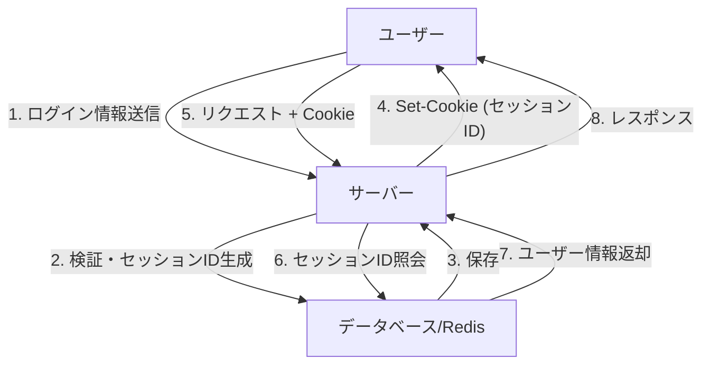
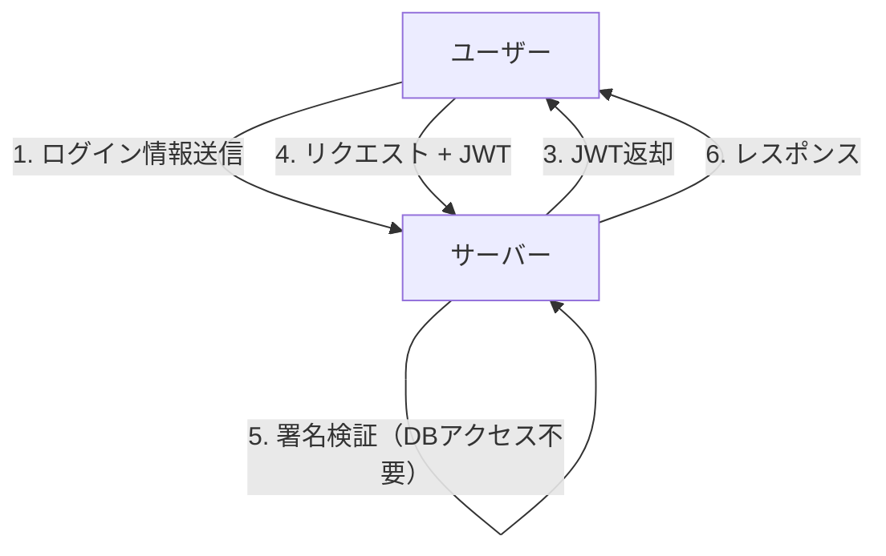
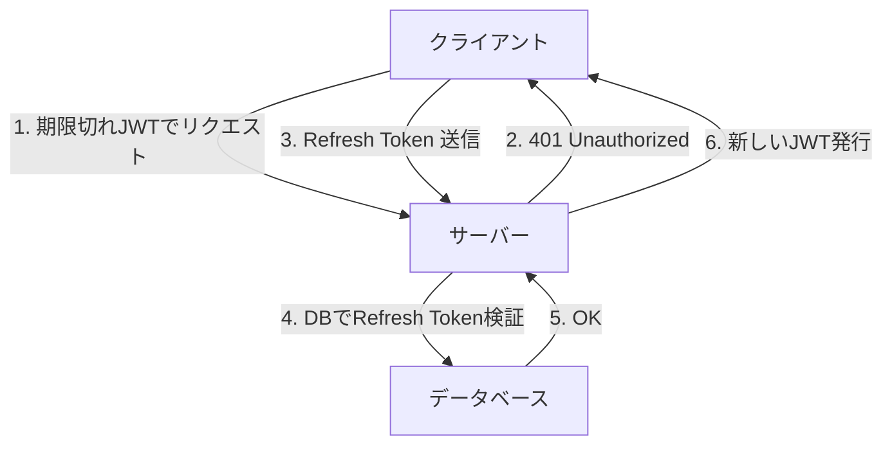

ウェブアプリケーションの進化とともに、認証システムも大きな変革を遂げてきました。その中で、JSON Web Token（JWT）はモダンなアプリケーション、特にシングルページアプリケーション（SPA）やマイクロサービスアーキテクチャにおいて、ステートレスな認証手段として爆発的に普及しました。

しかし、JWTを「セッション管理の銀の弾丸」として扱うことには、多くのセキュリティ専門家が警鐘を鳴らしています。「JWTはセッション管理に使うべきではない」という意見はなぜ存在するのでしょうか。本記事では、従来のCookieベースのセッション管理とJWTを比較し、JWTに潜むリスクとアーキテクチャ上の課題について深く掘り下げます。

## 従来のセッション管理（ステートフル）の仕組み

JWTについて議論する前に、長年使われてきた従来のステートフルなセッション管理についておさらいしましょう。

従来のセッション管理では、ユーザーがログインに成功すると、サーバー側で一意の「セッションID」を発行し、それをデータベースやインメモリデータストア（Redisなど）に保存します。クライアントには、このセッションIDのみをCookieとして返却します。

### メリット
- **無効化（Revocation）が容易**: サーバー側でセッションを削除するだけで、即座にユーザーをログアウトさせたり、奪取されたセッションを無効化したりできます。
- **データサイズの小ささ**: Cookieに乗せるのはランダムな文字列（セッションID）だけであり、帯域幅を圧迫しません。
- **セキュリティの堅牢性**: セッション情報はサーバー側に安全に保管され、クライアントからは見えません。

### デメリット
- **スケーラビリティの課題**: リクエストのたびにセッションストアにアクセスする必要があり、トラフィックが増大するとデータベースへの負荷が高まります。ロードバランサー背後にある複数サーバー間でのセッション共有も必要です。

## JWT（JSON Web Token）とステートレス認証の台頭

スケーラビリティの課題を解決するために注目されたのが、JWTを用いたステートレス認証です。

JWTは、必要なユーザー情報（クレーム）をJSON形式で格納し、サーバーの秘密鍵で署名（Signature）を付与したトークンです。

### JWTの最大のメリット：DBアクセス不要の検証
JWTによる認証では、サーバーはリクエストを受け取った際、トークンに付与された署名を自身の持つ鍵で検証するだけで、そのトークンが改ざんされていないこと、そして自らが発行したものであることを確認できます。
つまり、**リクエストのたびにデータベースにアクセスする必要がなくなります**。これにより、マイクロサービス間で認証情報をやり取りする際のオーバーヘッドが激減し、スケーラビリティが飛躍的に向上しました。

---

## JWTの「影」：セッション管理に潜むリスクと課題

一見すると完璧に見えるJWTですが、これをブラウザとサーバー間の「セッション管理」にそのまま適用しようとすると、数多くの致命的な問題に直面します。

### 1. トークンの無効化（Revocation）が極めて困難

JWTの最大のメリットである「ステートレス（サーバー側に状態を持たない）」という特性は、そのまま最大の弱点に反転します。
**発行されたJWTは、有効期限（exp）が切れるまで、サーバー側で強制的に無効化することが原則としてできません。**

もしユーザーのデバイスが盗まれたり、XSS攻撃によってJWTが漏洩したりした場合、管理者はそのトークンを止める手段を持ちません。パスワードを変更しても、発行済みのJWTは生き続けます。

これを解決しようと「無効化したJWTのブラックリスト」をデータベースやRedisに持つアーキテクチャを採用するケースがありますが、これは本末転倒です。リクエストのたびにブラックリストをチェックするのであれば、それはもはや「ステートレス」ではなく、従来のステートフルなセッション管理と何ら変わりません。むしろ、セッションIDよりもはるかにデータサイズの大きいJWTを毎回転送する分、パフォーマンスは悪化します。

### 2. 「alg: none」脆弱性の歴史と実装リスク

JWTは柔軟性が高く、複数の署名アルゴリズムをサポートしています。しかし、この柔軟性が過去に深刻な脆弱性を引き起こしました。
JWTのヘッダーには `alg`（アルゴリズム）フィールドがあり、ここに `none` を指定すると「署名なし」のトークンとして扱われます。

かつて、多くのJWTライブラリが `alg: none` を受け入れてしまう脆弱性（CVE-2015-9256など）を抱えていました。攻撃者は自身の権限を昇格させたJWTを作成し、ヘッダーを `alg: none` に書き換えて送信するだけで、サーバーを騙して管理者としてログインできてしまったのです。
現在では主要なライブラリで対策されていますが、JWTの実装がいかに複雑で、設定ミスが致命傷になりやすいかを示す典型的な例です。

### 3. 保存場所論争：LocalStorage vs HttpOnly Cookie

フロントエンド（SPAなど）でJWTを受け取った後、それをどこに保存すべきかは、常に激しい議論の的となります。

#### LocalStorage / SessionStorage に保存する場合
- **メリット**: JavaScriptから簡単にアクセスでき、APIリクエストの `Authorization: Bearer <token>` ヘッダーに付与しやすい。
- **リスク**: **XSS（クロスサイトスクリプティング）攻撃に対して極めて脆弱**です。もしサイト内に悪意のあるスクリプトが混入した場合、LocalStorage内のJWTは簡単に読み取られ、攻撃者のサーバーへ送信されてしまいます。

#### HttpOnly Cookie に保存する場合
- **メリット**: JavaScriptからアクセスできないため、XSSによってトークンが直接盗み出されるリスクを防げます。
- **リスク**: **CSRF（クロスサイトリクエストフォージェリ）攻撃の対象**となります。ブラウザはリクエスト時に自動でCookieを送信するため、別の悪意あるサイトからAPIを叩かれた場合、意図せず処理が実行される危険があります（ただし、現代では `SameSite` 属性を活用することで大幅に軽減可能です）。

セキュリティのベストプラクティスとしては、**「JWTを HttpOnly 属性の Cookie に保存する」**ことが推奨される傾向にありますが、こうなると「なぜ普通のCookieベースセッションではダメなのか？」という疑問に回帰します。

### 4. Refresh Tokenの必要性と複雑化

JWTの漏洩リスクを最小限に抑えるため、アクセストークン（JWT）の有効期限は非常に短く（例：15分）設定するのが一般的です。
しかし、15分ごとにユーザーに再ログインを求めるわけにはいきません。そこで登場するのが **リフレッシュトークン（Refresh Token）** です。

リフレッシュトークンは有効期限が長く、サーバー側のデータベースに保存され、必要に応じて無効化（Revocation）が可能な設計にします。
しかし、よく考えてみてください。**リフレッシュトークンをデータベースで検証・管理している時点で、システムは完全に「ステートフル」になっています。**

## 結論：適材適所のアーキテクチャ設計を

JWTは決して「悪」ではありません。しかし、万能薬でもありません。
以下のユースケースにおいて、JWTは非常に強力なツールとなります。

1. **マイクロサービス間のサーバー間通信**: 信頼できる内部ネットワークで、各サービスが独立して認証を検証する必要がある場合。
2. **短期的な権限委譲**: パスワードリセットのリンクや、メールアドレス確認のワンタイムURLとしての利用。
3. **OAuth2 / OIDC におけるアクセストークン・IDトークン**: 本来の用途としての利用。

一方で、**一般的なWebブラウザとサーバー間のセッション管理（ログイン状態の維持）においては、従来の HttpOnly Cookie を用いたステートフルなセッション管理（Redis等の利用）の方が、はるかに安全でシンプル**であることが多いのが現実です。

「モダンだから」「みんな使っているから」という理由だけでJWTをセッション管理に採用するのではなく、システムが求めるスケーラビリティ、無効化の要件、そしてセキュリティリスクを総合的に判断し、適切な技術を選択することが、アーキテクトに求められる重要な責任です。
