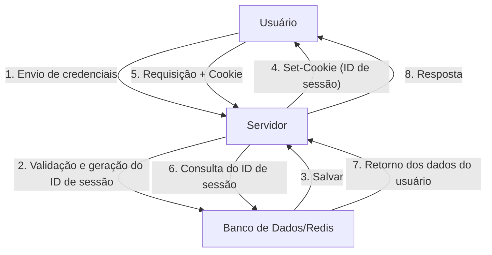
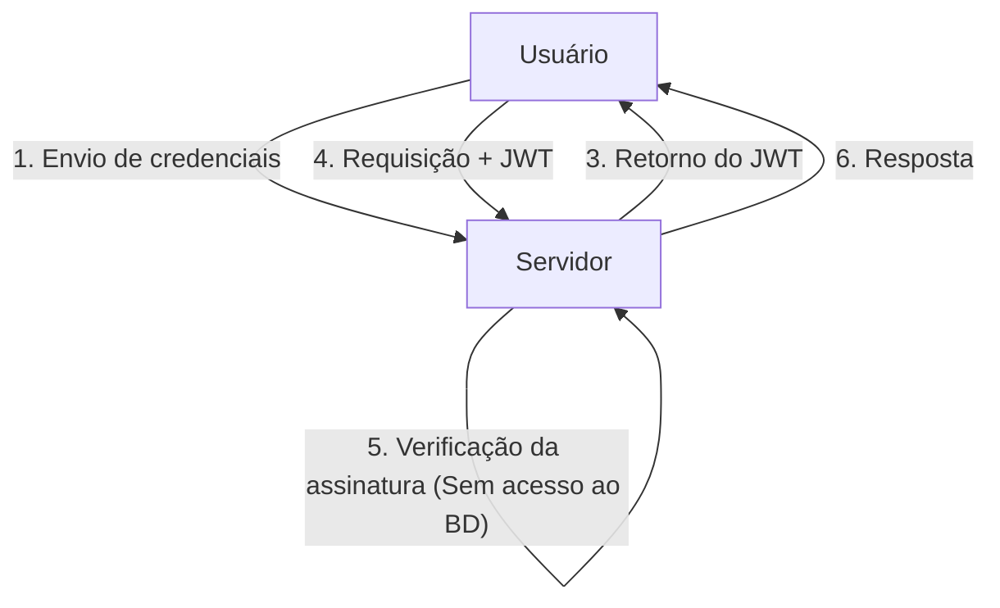
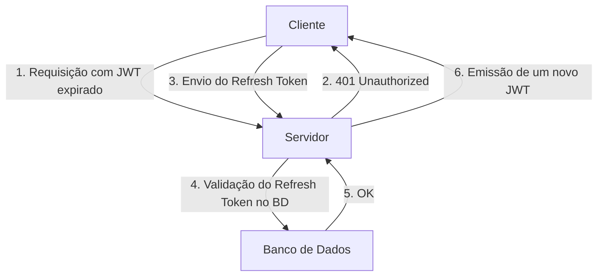

Com a evolução das aplicações web, os sistemas de autenticação também passaram por grandes transformações. Nesse contexto, o JSON Web Token (JWT) popularizou-se explosivamente como um meio de autenticação stateless em aplicações modernas, especialmente em Single Page Applications (SPA) e arquiteturas de microsserviços.

No entanto, muitos especialistas em segurança alertam contra tratar o JWT como uma "bala de prata para o gerenciamento de sessão". Por que existe a opinião de que "o JWT não deve ser usado para gerenciamento de sessão"? Neste artigo, compararemos o gerenciamento tradicional de sessão baseado em cookies com o JWT, e nos aprofundaremos nos riscos e desafios arquitetônicos ocultos no JWT.

## O Mecanismo Tradicional de Gerenciamento de Sessão (Stateful)

Antes de discutir o JWT, vamos recapitular o gerenciamento tradicional de sessão stateful, que tem sido usado por muitos anos.

No gerenciamento tradicional de sessão, quando um usuário faz login com sucesso, o servidor emite um "ID de sessão" único e o salva em um banco de dados ou datastore em memória (como o Redis). Para o cliente, apenas esse ID de sessão é retornado na forma de um Cookie.

### Vantagens
- **Facilidade de Revogação (Revocation)**: Basta remover a sessão no lado do servidor para deslogar imediatamente o usuário ou invalidar uma sessão sequestrada.
- **Tamanho reduzido dos dados**: O Cookie carrega apenas uma string aleatória (o ID de sessão), o que não consome muita largura de banda.
- **Robustez de segurança**: As informações da sessão são armazenadas de forma segura no lado do servidor e ficam invisíveis para o cliente.

### Desvantagens
- **Desafios de escalabilidade**: É necessário acessar o armazenamento de sessão a cada requisição, e o aumento do tráfego eleva a carga no banco de dados. Também é necessário compartilhar as sessões entre múltiplos servidores atrás de um balanceador de carga (load balancer).

## A Ascensão do JWT (JSON Web Token) e da Autenticação Stateless

Para resolver os desafios de escalabilidade, a autenticação stateless usando JWT ganhou destaque.

O JWT é um token que armazena as informações necessárias do usuário (claims) no formato JSON, com uma assinatura (Signature) gerada pela chave privada do servidor.

### A Maior Vantagem do JWT: Validação Sem Acesso ao BD
Na autenticação via JWT, quando o servidor recebe uma requisição, basta verificar a assinatura contida no token usando sua própria chave para confirmar que o token não foi adulterado e que foi emitido por ele mesmo.
Em outras palavras, **elimina-se a necessidade de acessar o banco de dados a cada requisição**. Isso reduz drasticamente o overhead ao trocar informações de autenticação entre microsserviços, melhorando consideravelmente a escalabilidade.

---

## A "Sombra" do JWT: Riscos e Desafios Ocultos no Gerenciamento de Sessão

À primeira vista, o JWT parece perfeito, mas tentar aplicá-lo diretamente no "gerenciamento de sessão" entre navegador e servidor leva a vários problemas críticos.

### 1. A Revogação (Revocation) do Token é Extremamente Difícil

A principal vantagem do JWT, a sua característica "stateless" (não manter estado no servidor), transforma-se na sua maior fraqueza.
**Em princípio, um JWT emitido não pode ser forçosamente invalidado pelo servidor até que o seu tempo de expiração (exp) acabe.**

Se o dispositivo de um usuário for roubado ou se o JWT vazar devido a um ataque XSS, o administrador não terá meios para interromper aquele token. Mesmo que a senha seja alterada, o JWT já emitido continuará válido.

Alguns casos adotam uma arquitetura que mantém uma "lista negra (blacklist) de JWTs revogados" num banco de dados ou no Redis para contornar isso, mas tal abordagem anula o propósito inicial. Se for necessário verificar a lista negra a cada requisição, já não é mais "stateless", sendo na prática o mesmo que o gerenciamento de sessão stateful tradicional. Pelo contrário, o desempenho piora porque o JWT, que tem um tamanho de dados muito maior que um ID de sessão, é transmitido todas as vezes.

### 2. O Histórico e o Risco de Implementação da Vulnerabilidade "alg: none"

O JWT é bastante flexível e suporta múltiplos algoritmos de assinatura. No entanto, essa flexibilidade causou vulnerabilidades severas no passado.
O cabeçalho do JWT possui um campo `alg` (algoritmo), e se `none` for especificado, ele será tratado como um token "sem assinatura".

No passado, muitas bibliotecas JWT tinham uma vulnerabilidade (como a CVE-2015-9256) que aceitava `alg: none`. Um invasor só precisava criar um JWT elevando seus próprios privilégios, alterar o cabeçalho para `alg: none` e enviá-lo para enganar o servidor e conseguir o login como administrador.
Atualmente as principais bibliotecas estão protegidas contra isso, mas este é um exemplo clássico de como a implementação do JWT é complexa e como configurações incorretas podem ser fatais.

### 3. A Controvérsia do Local de Armazenamento: LocalStorage vs HttpOnly Cookie

Depois de receber um JWT no frontend (como num SPA), o local onde ele deve ser armazenado é sempre alvo de debates acalorados.

#### Ao salvar no LocalStorage / SessionStorage
- **Vantagens**: Fácil acesso através do JavaScript e facilidade para anexá-lo no cabeçalho `Authorization: Bearer <token>` nas requisições da API.
- **Riscos**: **Extremamente vulnerável a ataques XSS (Cross-Site Scripting)**. Se um script malicioso for injetado no site, o JWT no LocalStorage pode ser facilmente lido e enviado para o servidor do invasor.

#### Ao salvar num Cookie HttpOnly
- **Vantagens**: Como não pode ser acessado via JavaScript, evita o risco de o token ser roubado diretamente via XSS.
- **Riscos**: **Torna-se alvo de ataques CSRF (Cross-Site Request Forgery)**. Como os navegadores enviam os Cookies automaticamente nas requisições, existe o perigo de que uma ação seja executada sem intenção se a API for chamada por um outro site malicioso (embora hoje em dia isso possa ser mitigado consideravelmente utilizando o atributo `SameSite`).

Como melhor prática de segurança, a tendência é recomendar **"armazenar o JWT num Cookie com o atributo HttpOnly"**, mas isso nos leva de volta à questão: "Por que não usar as sessões comuns baseadas em cookies?"

### 4. A Necessidade e a Complexidade do Refresh Token

Para minimizar o risco de vazamento do JWT, é comum configurar o tempo de expiração do token de acesso (JWT) para ser muito curto (ex: 15 minutos).
Contudo, não é possível pedir para o usuário fazer login novamente a cada 15 minutos. É aí que entra o **Token de Atualização (Refresh Token)**.

O Refresh Token possui um tempo de expiração mais longo, é armazenado no banco de dados do lado do servidor e tem um design que permite a sua invalidação (Revocation) quando necessário.
Mas pare e pense. **No momento em que o Refresh Token é validado e gerenciado num banco de dados, o sistema torna-se completamente "stateful".**

## Conclusão: Escolha a Arquitetura Certa para o Lugar Certo

O JWT definitivamente não é "maligno". Mas também não é uma panaceia.
Nos casos de uso abaixo, o JWT é uma ferramenta extremamente poderosa:

1. **Comunicação entre servidores (Microsserviços)**: Quando cada serviço precisa validar a autenticação de forma independente numa rede interna confiável.
2. **Delegação de autorização a curto prazo**: Como um link de redefinição de senha ou uma URL de uso único para confirmação de e-mail.
3. **Tokens de Acesso e Tokens de ID no OAuth2 / OIDC**: O seu uso original pretendido.

Por outro lado, **para o gerenciamento comum de sessão entre um navegador web e um servidor (manter o estado de login), o gerenciamento tradicional de sessão stateful utilizando Cookies HttpOnly (com Redis, etc.) é muitas vezes muito mais seguro e simples**.

Em vez de adotar o JWT para o gerenciamento de sessão só porque é "moderno" ou "porque todos usam", a responsabilidade crítica de um arquiteto é avaliar de forma abrangente a escalabilidade necessária do sistema, os requisitos de invalidação e os riscos de segurança, a fim de selecionar a tecnologia apropriada.
