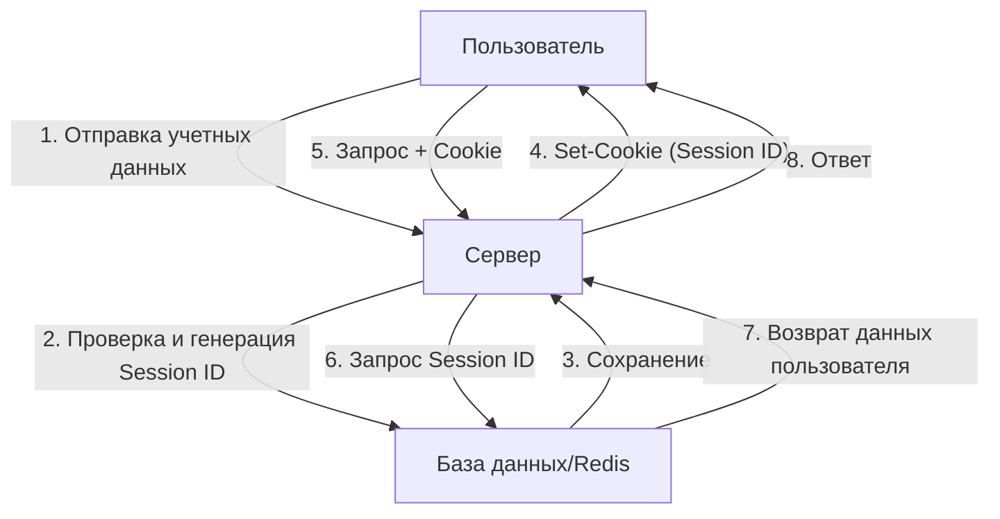
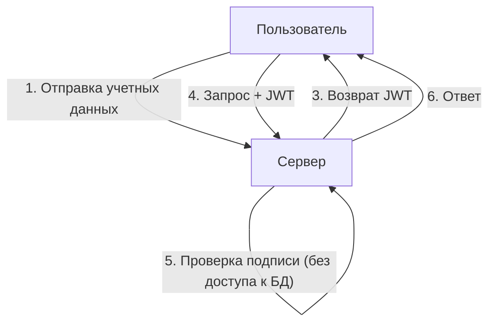
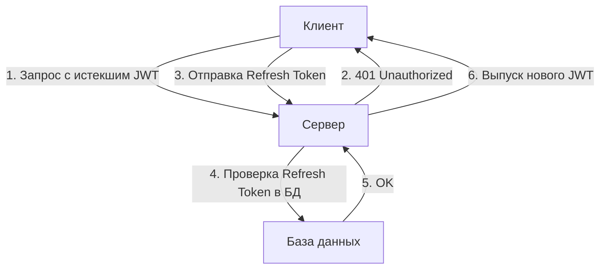

Вместе с эволюцией веб-приложений значительные изменения претерпели и системы аутентификации. На этом фоне JSON Web Token (JWT) получил взрывное распространение в качестве средства stateless-аутентификации (без сохранения состояния) в современных приложениях, особенно в одностраничных приложениях (SPA) и микросервисной архитектуре.

Однако многие эксперты по безопасности бьют тревогу по поводу отношения к JWT как к «серебряной пуле для управления сессиями». Почему же существует мнение, что «JWT не следует использовать для управления сессиями»? В этой статье мы сравним традиционное управление сессиями на основе Cookie с JWT, а также глубоко погрузимся в риски и архитектурные проблемы, скрывающиеся в JWT.

## Механизм традиционного управления сессиями (stateful)

Прежде чем обсуждать JWT, давайте вспомним о традиционном stateful-управлении сессиями, которое использовалось на протяжении многих лет.

При традиционном управлении сессиями, когда пользователь успешно авторизуется, сервер выпускает уникальный идентификатор сессии («Session ID») и сохраняет его в базе данных или хранилище данных в памяти (например, Redis). Клиенту возвращается только этот идентификатор сессии в виде Cookie.

### Преимущества
- **Легкость отзыва (Revocation)**: Просто удалив сессию на стороне сервера, можно мгновенно разлогинить пользователя или аннулировать украденную сессию.
- **Малый объем данных**: В Cookie передается только случайная строка (Session ID), что не перегружает пропускную способность сети.
- **Надежность безопасности**: Данные сессии безопасно хранятся на стороне сервера и скрыты от клиента.

### Недостатки
- **Проблемы масштабируемости**: При каждом запросе необходимо обращаться к хранилищу сессий, и при росте трафика увеличивается нагрузка на базу данных. Также требуется совместное использование сессий между несколькими серверами за балансировщиком нагрузки.

## Появление JWT (JSON Web Token) и stateless-аутентификации

Для решения проблем масштабируемости внимание было обращено на stateless-аутентификацию с использованием JWT.

JWT — это токен, который хранит необходимые данные пользователя (claims) в формате JSON и содержит подпись (Signature), созданную с помощью секретного ключа сервера.

### Главное преимущество JWT: Проверка без доступа к БД
При аутентификации с помощью JWT, когда сервер получает запрос, ему достаточно проверить подпись, прикрепленную к токену, используя свой собственный ключ, чтобы убедиться, что токен не был подделан и что он был выпущен им самим.
Другими словами, **больше нет необходимости обращаться к базе данных при каждом запросе**. Это резко снижает накладные расходы при обмене аутентификационными данными между микросервисами и кардинально улучшает масштабируемость.

---

## «Тень» JWT: Риски и проблемы управления сессиями

На первый взгляд JWT кажется идеальным, но если попытаться применить его в чистом виде для «управления сессиями» между браузером и сервером, вы столкнетесь с множеством фатальных проблем.

### 1. Отзыв токена (Revocation) крайне затруднителен

Главное преимущество JWT — его «stateless» природа (отсутствие состояния на стороне сервера) — оборачивается его главной слабостью.
**Выпущенный JWT, как правило, невозможно принудительно аннулировать на стороне сервера до истечения его срока действия (exp).**

Если устройство пользователя украдено или JWT утек из-за XSS-атаки, у администратора нет возможности остановить этот токен. Даже при смене пароля уже выпущенный JWT продолжает действовать.

Существуют архитектурные решения, пытающиеся решить эту проблему путем создания «черного списка аннулированных JWT» в базе данных или Redis, но это ставит всё с ног на голову. Если при каждом запросе необходимо проверять черный список, то это больше не «stateless», а ничем не отличается от традиционного stateful-управления сессиями. Более того, производительность даже ухудшится из-за необходимости каждый раз передавать JWT, размер которого намного больше, чем Session ID.

### 2. История уязвимости «alg: none» и риски реализации

JWT обладает высокой гибкостью и поддерживает множество алгоритмов подписи. Однако в прошлом эта гибкость приводила к серьезным уязвимостям.
В заголовке JWT есть поле `alg` (алгоритм), и если указать в нем `none`, он будет рассматриваться как токен «без подписи».

В прошлом многие библиотеки JWT содержали уязвимость, позволяющую принимать `alg: none` (например, CVE-2015-9256). Злоумышленнику было достаточно создать JWT с повышенными привилегиями, изменить заголовок на `alg: none` и отправить его, чтобы обмануть сервер и авторизоваться как администратор.
В настоящее время эта проблема решена в основных библиотеках, но это классический пример того, насколько сложна реализация JWT и как легко ошибка конфигурации может стать фатальной.

### 3. Споры о месте хранения: LocalStorage против HttpOnly Cookie

Вопрос о том, где хранить JWT после его получения на фронтенде (например, в SPA), всегда является предметом жарких дискуссий.

#### При хранении в LocalStorage / SessionStorage
- **Преимущества**: Легко получить доступ из JavaScript и удобно прикреплять к заголовку API-запроса `Authorization: Bearer <token>`.
- **Риски**: **Крайне уязвимо для атак XSS (межсайтовый скриптинг)**. Если на сайт внедрен вредоносный скрипт, JWT из LocalStorage можно легко прочитать и отправить на сервер злоумышленника.

#### При хранении в HttpOnly Cookie
- **Преимущества**: Поскольку доступ из JavaScript невозможен, предотвращается риск прямой кражи токена с помощью XSS.
- **Риски**: **Становится мишенью для атак CSRF (подделка межсайтовых запросов)**. Поскольку браузер автоматически отправляет Cookie при выполнении запроса, существует опасность, что API будет вызвано с другого вредоносного сайта и операция выполнится непреднамеренно (однако в наше время это можно значительно смягчить с помощью атрибута `SameSite`).

Как лучшая практика безопасности, существует тенденция рекомендовать **«хранить JWT в Cookie с атрибутом HttpOnly»**, но в этом случае мы возвращаемся к вопросу: «Почему бы тогда не использовать обычные сессии на основе Cookie?».

### 4. Необходимость Refresh Token и усложнение архитектуры

Чтобы свести к минимуму риск утечки JWT, срок действия access-токена (JWT) обычно устанавливается очень коротким (например, 15 минут).
Однако мы не можем просить пользователя авторизоваться заново каждые 15 минут. Здесь на сцену выходит **Refresh Token (токен обновления)**.

Refresh Token имеет длительный срок действия, хранится в базе данных на стороне сервера и проектируется так, чтобы его можно было при необходимости аннулировать (Revocation).
Но подумайте сами: **в тот момент, когда система проверяет и управляет Refresh-токенами в базе данных, она становится полностью «stateful».**

## Заключение: Выбирайте правильную архитектуру для своей задачи

JWT ни в коем случае не является «злом». Но это и не панацея.
В следующих сценариях использования JWT становится очень мощным инструментом:

1. **Межсерверное взаимодействие между микросервисами**: В надежной внутренней сети, где каждому сервису необходимо независимо проверять аутентификацию.
2. **Краткосрочное делегирование прав**: Использование в качестве ссылок для сброса пароля или одноразовых URL для подтверждения email.
3. **Access и ID токены в OAuth2 / OIDC**: Использование по прямому назначению.

С другой стороны, **для управления сессиями (поддержания состояния авторизации) между обычным веб-браузером и сервером традиционное stateful-управление сессиями с использованием HttpOnly Cookie (и применением таких технологий, как Redis) в реальности часто оказывается гораздо более безопасным и простым**.

Важная обязанность архитектора — не просто внедрять JWT для управления сессиями, потому что это «современно» или «все так делают», а принимать решения на основе комплексной оценки требуемой масштабируемости системы, требований к отзыву сессий и рисков безопасности, выбирая соответствующие технологии.
