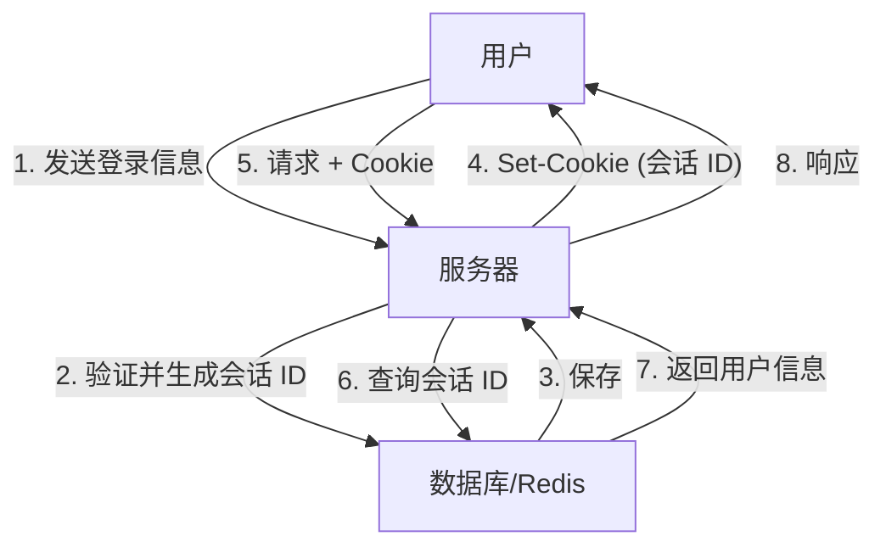
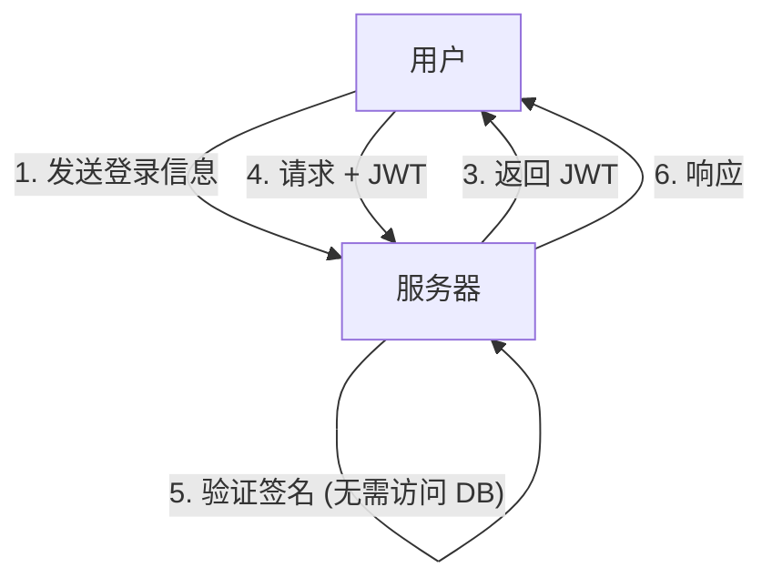
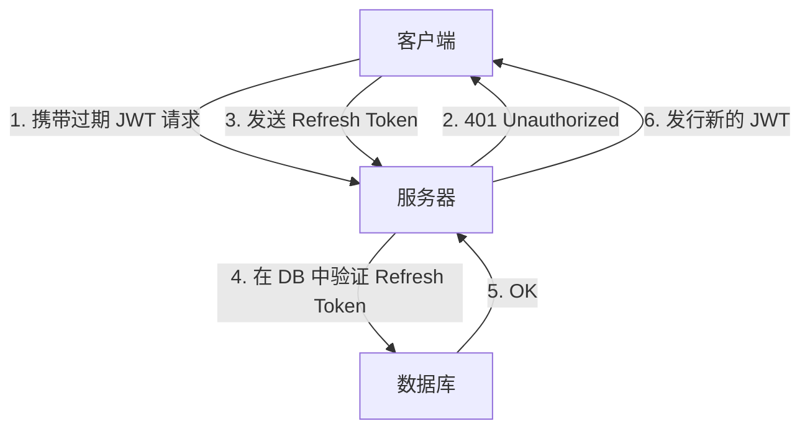

随着 Web 应用程序的发展，认证系统也经历了巨大的变革。其中，JSON Web Token（JWT）作为一种无状态的认证手段，在现代应用程序，尤其是单页应用（SPA）和微服务架构中得到了爆炸式的普及。

然而，对于将 JWT 视为“会话管理的银弹”，许多安全专家敲响了警钟。为什么会存在“不应将 JWT 用于会话管理”的观点呢？本文将对比传统的基于 Cookie 的会话管理与 JWT，深入探讨 JWT 潜藏的风险和架构上的挑战。

## 传统的会话管理（有状态）机制

在讨论 JWT 之前，让我们先回顾一下长期以来使用的传统的有状态会话管理。

在传统的会话管理中，当用户登录成功时，服务器端会发行一个唯一的“会话 ID（Session ID）”，并将其保存在数据库或内存数据存储（如 Redis）中。对于客户端，只将这个会话 ID 作为 Cookie 返回。

### 优点
- **易于失效（Revocation）**：只需在服务器端删除会话，即可立即让用户登出，或使被盗取的会话失效。
- **数据体积小**：附加在 Cookie 上的只是一个随机字符串（会话 ID），不会挤压带宽。
- **安全性高**：会话信息安全地保存在服务器端，客户端无法看到。

### 缺点
- **可扩展性挑战**：每次请求都需要访问会话存储，流量增加时数据库负载会变高。在负载均衡器背后的多台服务器之间还需要共享会话。

## JWT（JSON Web Token）与无状态认证的崛起

为了解决可扩展性问题，使用 JWT 的无状态认证受到了广泛关注。

JWT 是一种将必要的用户信息（声明/Claims）以 JSON 格式存储，并使用服务器的密钥附加签名（Signature）的令牌。

### JWT 的最大优势：无需访问 DB 即可验证
在使用 JWT 进行认证时，服务器在接收到请求后，只需使用自己的密钥验证附加在令牌上的签名，即可确认该令牌未被篡改，且确实是由自己发行的。
也就是说，**每次请求都不再需要访问数据库**。这极大地降低了微服务之间传递认证信息时的开销，使其可扩展性得到了飞跃性的提升。

---

## JWT 的“阴影”：会话管理中潜藏的风险与挑战

乍看之下完美的 JWT，如果直接应用于浏览器和服务器之间的“会话管理”，将会面临许多致命的问题。

### 1. 令牌失效（Revocation）极其困难

JWT 最大优势的“无状态（服务器端不保存状态）”特性，直接反转成为了其最大的弱点。
**原则上，发行的 JWT 在其过期时间（exp）到达之前，无法在服务器端强制使其失效。**

如果用户的设备被盗，或者由于 XSS 攻击导致 JWT 泄漏，管理员没有办法停止该令牌。即使更改了密码，已发行的 JWT 仍然有效。

为了解决这个问题，有些架构会采用在数据库或 Redis 中维护“已失效 JWT 的黑名单”。但这完全是本末倒置。如果在每次请求时都要检查黑名单，那就根本不再是“无状态”，与传统的有状态会话管理毫无区别。相反，由于每次都要传输数据量比会话 ID 大得多的 JWT，性能反而会恶化。

### 2. “alg: none”漏洞的历史与实现风险

JWT 非常灵活，支持多种签名算法。然而，这种灵活性在过去曾引发过严重的漏洞。
JWT 的头部（Header）中有一个 `alg`（算法）字段，如果在这里指定为 `none`，它就会被视为“无签名”的令牌。

过去，许多 JWT 库都存在接受 `alg: none` 的漏洞（如 CVE-2015-9256 等）。攻击者只需创建一个提升了自身权限的 JWT，将其头部修改为 `alg: none` 并发送，就能欺骗服务器以管理员身份登录。
虽然目前主流库都已修复了此问题，但这依然是证明 JWT 的实现有多复杂、配置错误又有多容易变成致命伤的典型例子。

### 3. 保存位置之争：LocalStorage vs HttpOnly Cookie

前端（如 SPA）在接收到 JWT 后，到底应该把它保存在哪里，一直是一个激烈争论的焦点。

#### 保存在 LocalStorage / SessionStorage 的情况
- **优点**：可以通过 JavaScript 轻松访问，便于附加到 API 请求的 `Authorization: Bearer <token>` 头部中。
- **风险**：**对 XSS（跨站脚本攻击）极其脆弱**。如果网站内混入了恶意的脚本，LocalStorage 中的 JWT 就会被轻易读取，并发送到攻击者的服务器。

#### 保存在 HttpOnly Cookie 的情况
- **优点**：由于 JavaScript 无法访问，可以防止通过 XSS 直接窃取令牌的风险。
- **风险**：**会成为 CSRF（跨站请求伪造）攻击的目标**。浏览器在发送请求时会自动附带 Cookie，因此如果被其他恶意网站调用 API，就有可能意外执行某些操作（不过，在现代浏览器中利用 `SameSite` 属性可以大幅减轻此风险）。

作为安全最佳实践，目前更倾向于推荐**“将 JWT 保存在具有 HttpOnly 属性的 Cookie 中”**。然而，这样一来又回到了最初的疑问：“为什么不直接用普通的基于 Cookie 的会话管理呢？”

### 4. Refresh Token 的必要性与复杂化

为了将 JWT 的泄漏风险降至最低，通常会将访问令牌（JWT）的有效期设置得非常短（例如：15 分钟）。
但是，总不能每 15 分钟就让用户重新登录一次。于是就引入了 **刷新令牌（Refresh Token）**。

刷新令牌的有效期较长，被保存在服务器端的数据库中，并且被设计为可以在需要时使其失效（Revocation）。
但是，请仔细想一想。**一旦你在数据库中验证并管理刷新令牌，系统就已经完全变成了“有状态（Stateful）”的了。**

## 结论：设计适材适所的架构

JWT 绝不是“邪恶”的，但它也不是万能药。
在以下用例中，JWT 是一种非常强大的工具：

1. **微服务间的服务器间通信**：在受信任的内部网络中，各个服务需要独立验证认证信息时。
2. **短期的权限委托**：例如作为密码重置链接或邮箱验证的单次 URL 使用。
3. **OAuth2 / OIDC 中的访问令牌・ID 令牌**：作为其原本的用途使用。

另一方面，**在一般的 Web 浏览器与服务器之间的会话管理（保持登录状态）中，使用传统的带有 HttpOnly 属性的 Cookie 进行的有状态会话管理（如使用 Redis 等），在现实中往往远比 JWT 更加安全且简单**。

不应仅仅因为“很现代”或“大家都在用”就将 JWT 采用到会话管理中。作为架构师，其重要责任在于综合评估系统所需的可扩展性、失效要求以及安全风险，从而选择合适的技术。
