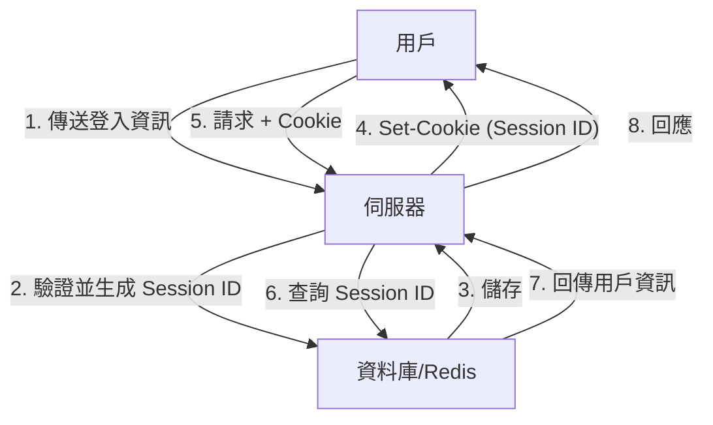
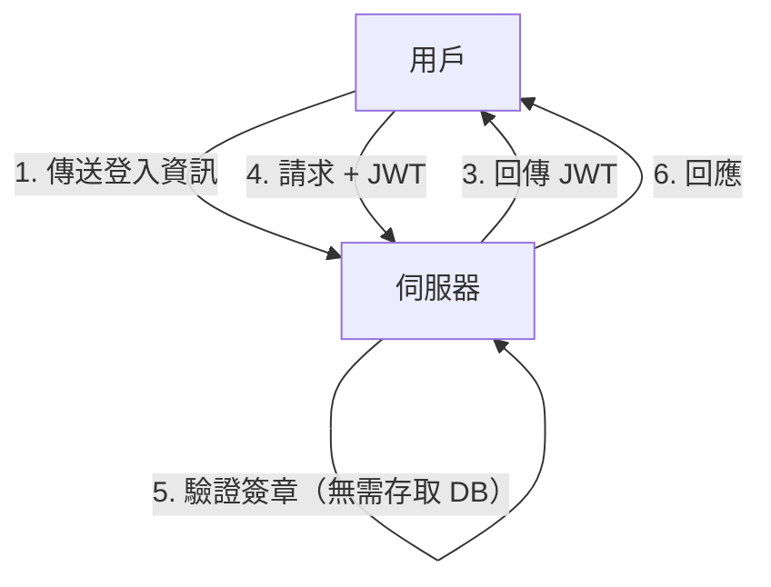
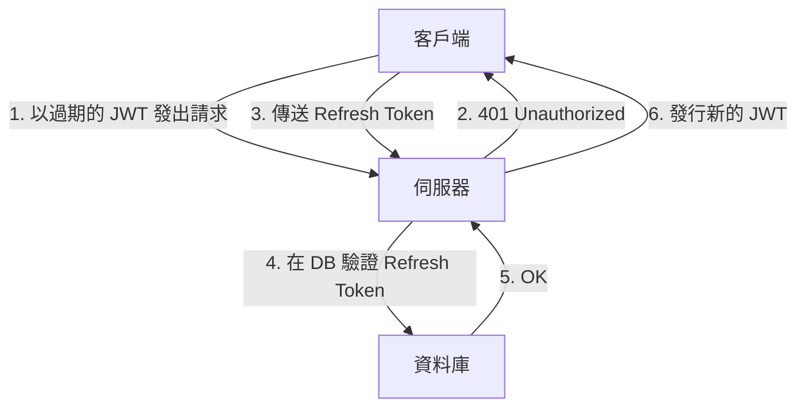

隨著 Web 應用程式的演進，認證系統也經歷了重大的變革。其中，JSON Web Token（JWT）在現代應用程式中，尤其是單頁應用程式（SPA）與微服務架構中，作為一種無狀態（Stateless）的認證手段，獲得了爆發性的普及。

然而，許多資安專家對將 JWT 視為「Session 管理的銀彈」提出了警告。為什麼會存在「不應該將 JWT 用於 Session 管理」的意見呢？本文將比較傳統基於 Cookie 的 Session 管理與 JWT，深入探討 JWT 潛藏的風險以及架構上的挑戰。

## 傳統的 Session 管理（有狀態）機制

在討論 JWT 之前，讓我們先回顧一下長年來被廣泛使用的傳統有狀態（Stateful）Session 管理機制。

在傳統的 Session 管理中，當用戶登入成功時，伺服器端會發行一組唯一的「Session ID」，並將其儲存在資料庫或記憶體資料儲存（如 Redis）中。伺服器只會將這個 Session ID 以 Cookie 的形式回傳給客戶端。

### 優點
- **易於作廢（Revocation）**：只需在伺服器端刪除 Session，即可立即讓用戶登出，或使被盜用的 Session 失效。
- **資料體積小**：放在 Cookie 中的只是一組隨機字串（Session ID），不會佔用太多頻寬。
- **高度的安全性**：Session 資訊安全地保存在伺服器端，對客戶端是不可見的。

### 缺點
- **擴展性（Scalability）的挑戰**：每次請求都需要存取 Session 儲存區，當流量增加時，會加重資料庫的負載。此外，也需要在負載平衡器後方的多台伺服器之間共享 Session。

## JWT（JSON Web Token）與無狀態認證的崛起

為了解決擴展性的問題，使用 JWT 的無狀態（Stateless）認證開始受到關注。

JWT 是一種將必要的用戶資訊（Claims）以 JSON 格式儲存，並使用伺服器的私鑰加上簽章（Signature）的 Token（權杖）。

### JWT 的最大優勢：無需存取 DB 即可驗證
在使用 JWT 的認證中，伺服器在接收到請求時，只需使用自己的密鑰驗證附加在 Token 上的簽章，就能確認該 Token 沒有被竄改，且確實是由自己發行的。
也就是說，**每次請求時都不再需要存取資料庫了**。這大幅減少了微服務之間傳遞認證資訊的開銷，並飛躍性地提升了擴展性。

---

## JWT 的「陰影」：潛藏於 Session 管理中的風險與挑戰

乍看之下 JWT 似乎很完美，但如果將其直接應用於瀏覽器與伺服器之間的「Session 管理」，就會面臨許多致命的問題。

### 1. Token 幾乎無法作廢（Revocation）

JWT 最大的優勢「無狀態（伺服器端不保存狀態）」，同時也反轉成為它最大的弱點。
**原則上，在已發行的 JWT 到期（exp）之前，伺服器端是無法強制將其作廢的。**

如果用戶的裝置被盜，或是因 XSS 攻擊導致 JWT 外洩，管理者將沒有任何手段可以停用該 Token。即使更改了密碼，已發行的 JWT 依然有效。

有時會看到為了解決這個問題，而在資料庫或 Redis 中建立「已作廢 JWT 黑名單」的架構，但這根本是本末倒置。如果每次請求都要檢查黑名單，那就已經不再是「無狀態」了，這與傳統有狀態的 Session 管理沒有兩樣。而且，每次都要傳送比 Session ID 大得多的 JWT，反而會導致效能惡化。

### 2. 「alg: none」漏洞的歷史與實作風險

JWT 具有很高的靈活性，支援多種簽章演算法。然而，這種靈活性在過去曾引發過嚴重的安全漏洞。
JWT 的標頭（Header）中包含 `alg`（演算法）欄位，如果在此指定為 `none`，該 Token 就會被視為「無簽章」。

過去，許多 JWT 函式庫存在著接受 `alg: none` 的漏洞（例如 CVE-2015-9256）。攻擊者只需自行產生一個提升權限的 JWT，將標頭改為 `alg: none` 並發送，就能欺騙伺服器並以管理者身分登入。
雖然現在主要的函式庫都已經修復了這個問題，但這是一個典型的例子，顯示了 JWT 的實作有多麼複雜，且設定錯誤很容易造成致命的後果。

### 3. 儲存位置之爭：LocalStorage vs HttpOnly Cookie

在前端（如 SPA）接收到 JWT 之後，應該將其儲存在哪裡，一直是一個激烈爭論的話題。

#### 儲存在 LocalStorage / SessionStorage 的情況
- **優點**：可以透過 JavaScript 輕鬆存取，方便將其附加到 API 請求的 `Authorization: Bearer <token>` 標頭中。
- **風險**：**對 XSS（跨站指令碼）攻擊極為脆弱**。如果網站內被植入了惡意指令碼，LocalStorage 中的 JWT 很容易被讀取並發送給攻擊者的伺服器。

#### 儲存在 HttpOnly Cookie 的情況
- **優點**：因為無法透過 JavaScript 存取，所以能防止 XSS 直接盜取 Token 的風險。
- **風險**：會成為 **CSRF（跨站請求偽造）攻擊的目標**。由於瀏覽器在發出請求時會自動發送 Cookie，如果從其他惡意網站呼叫 API，可能會有非預期的操作被執行的風險（不過在現代，可以透過活用 `SameSite` 屬性來大幅降低此風險）。

作為安全的最佳實踐，目前的趨勢是推薦**「將 JWT 儲存在具有 HttpOnly 屬性的 Cookie 中」**，但這樣一來，又會回到原點：「為什麼不能用一般的 Cookie based Session 就好？」

### 4. Refresh Token 的必要性與複雜化

為了將 JWT 的外洩風險降到最低，通常會將 Access Token（存取權杖，即 JWT）的有效期限設定得非常短（例如：15 分鐘）。
然而，總不能每 15 分鐘就要求用戶重新登入。這時登場的就是 **Refresh Token（更新權杖）**。

Refresh Token 的有效期限較長，並會儲存在伺服器端的資料庫中，設計上可以根據需求進行作廢（Revocation）。
但是，仔細想想。**當你需要在資料庫中驗證和管理 Refresh Token 時，系統就已經完全變成「有狀態（Stateful）」的了。**

## 結論：因地制宜的架構設計

JWT 絕對不是「邪惡」的。但它也不是萬靈丹。
在以下的使用案例中，JWT 會是非常強大的工具：

1. **微服務之間的伺服器對伺服器通訊**：在可靠的內部網路中，各個服務需要獨立驗證認證資訊時。
2. **短期的權限委派**：用於密碼重設連結，或電子郵件確認的一次性 URL。
3. **OAuth2 / OIDC 中的 Access Token 與 ID Token**：作為其原本的設計用途來使用。

另一方面，**在一般的 Web 瀏覽器與伺服器之間的 Session 管理（維持登入狀態）中，使用傳統 HttpOnly Cookie 的有狀態 Session 管理（例如使用 Redis），在多數情況下往往會更安全且簡單**，這也是現實的狀況。

架構師的重責大任，在於綜合評估系統所要求的擴展性、作廢（Revocation）的需求以及安全風險來選擇合適的技術，而不是僅僅因為「這很現代」或「大家都在用」的理由，就將 JWT 採用在 Session 管理中。
