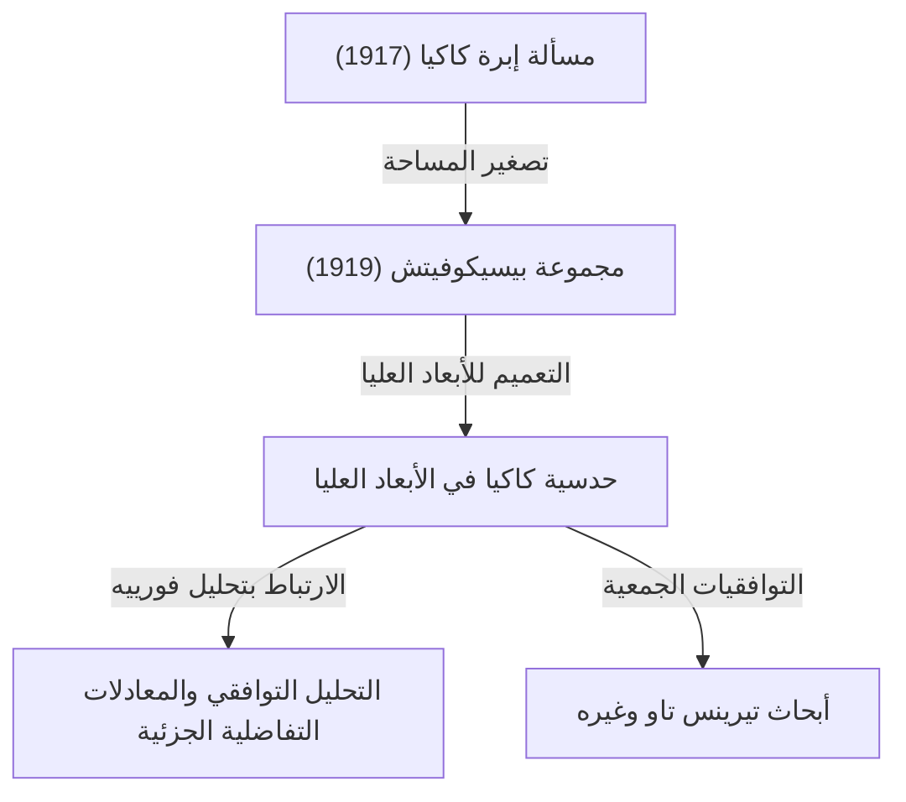

في عالم الرياضيات، توجد بعض المواضيع التي تبدأ بمسائل بديهية وسهلة الفهم للغاية، ولكن إجاباتها والمسائل المتفرعة منها تؤدي إلى أعمق مجالات الرياضيات الحديثة. "[مبرهنة فيرما الأخيرة](/ar/p/fermats-last-theorem/)" و"[حدسية بوانكاريه](/ar/p/poincare-conjecture/)" هي أمثلة بارزة على ذلك، و**"حدسية كاكيا (Kakeya Conjecture)"** التي تقع عند تقاطع الهندسة والتحليل هي أيضاً واحدة من تلك المواضيع الساحرة.

في هذا المقال، سنغوص بعمق في الصورة الكاملة لحدسية كاكيا ونشرحها، بدءاً من "مسألة إبرة كاكيا" التي طرحها عالم الرياضيات الياباني سويتشي كاكيا (Soichi Kakeya) في عام 1917، ومروراً بالاكتشاف المذهل الذي توصل إليه عالم الرياضيات الروسي بيسيكوفيتش (Besicovitch)، وصولاً إلى أبحاث عالم الرياضيات العبقري المعاصر تيرينس تاو (Terence Tao) وغيره.

---

## 1. مسألة إبرة كاكيا: تساؤل بديهي

في عام 1917، طرح سويتشي كاكيا، الذي كان في جامعة توهوكو الإمبراطورية (جامعة توهوكو حالياً)، المسألة التالية البسيطة والمرئية للغاية:

> **مسألة إبرة كاكيا (Kakeya Needle Problem)**
> ما هو الشكل ذو المساحة الأصغر الذي يمكن من خلاله تحريك قطعة مستقيمة (إبرة) طولها 1 بشكل مستمر على مستوى بحيث يمكن تغيير اتجاهها بمقدار 360 درجة (دورة كاملة)؟ وما هي تلك المساحة الصغرى؟

على سبيل المثال، يمكننا تدوير إبرة طولها 1 حول مركزها في دائرة نصف قطرها $1/2$. مساحة هذه الدائرة هي $\pi/4 \approx 0.785$.
أيضاً، يمكن تدوير الإبرة داخل مثلث متساوي الأضلاع طول ضلعه $1/\sqrt{3}$ (وارتفاعه 1) بقليل من التفكير. مساحة هذا المثلث هي $1/\sqrt{3} \approx 0.577$، وهي أصغر من مساحة الدائرة.

علاوة على ذلك، أظهر كاكيا نفسه أنه باستخدام شكل يُسمى الداليّ (Deltoid - نوع من الأشكال النجمية)، يمكن تقليل المساحة إلى $\pi/8 \approx 0.392$. توقع العديد من علماء الرياضيات "أن هذه هي المساحة الصغرى على الأرجح".

لكن الأمور اتخذت منعطفاً غير متوقع.

---

## 2. معجزة بيسيكوفيتش: مجموعة كاكيا ذات المساحة الصفرية

بعد بضع سنوات فقط من طرح كاكيا لمسألته، وتحديداً في عام 1919 (نُشر في عام 1928)، كان عالم الرياضيات الروسي أبرام بيسيكوفيتش (Abram Besicovitch) يبني أشكالاً لا تُصدق في سياق مختلف تماماً (أبحاث حول تكامل ريمان).

أثبت بيسيكوفيتش وجود مجموعة (تُعرف الآن باسم **"مجموعة بيسيكوفيتش"** أو **"مجموعة كاكيا"**) تمتلك الخصائص التالية:

> **توجد مجموعة على المستوى يمكن أن تحتوي على قطعة مستقيمة طولها 1 في أي اتجاه، ومع ذلك يمكن جعل قياس ليبيغ (المساحة) الخاص بها صغيراً كما نشاء، أو يمكن أن يكون قياسها 0.**

بمعنى آخر، النتيجة المذهلة هي أنه "يمكن تدوير إبرة طولها 1 دورة كاملة داخل شكل مساحته صفر". وراء هذه الحقيقة التي تتعارض تماماً مع الحدس، تكمن طريقة بناء في الهندسة الكسيرية (Fractal Geometry).

### البناء باستخدام شجرة بيرون (Perron Tree)
واحدة من الطرق الرئيسية لبناء هذه المجموعة العجيبة تُسمى "شجرة بيرون".
1. أولاً، نعتبر مثلثاً ذا قاعدة.
2. نقسم هذا المثلث من الرأس باتجاه القاعدة إلى مثلثات طويلة وضيقة.
3. نقوم بإزاحة هذه المثلثات الطويلة والضيقة المقسمة قليلاً بحيث تتداخل مع بعضها البعض (ولكن مع الحفاظ على شمولية اتجاهات القطع المستقيمة).
4. من خلال تكرار عملية "التقسيم والتداخل" هذه إلى ما لا نهاية، يمكن ضغط مساحة المثلث الأصلي وجعلها صغيرة كما نشاء.

المجموعة التي يتم الحصول عليها كغاية لهذه العملية الكسيرية تكون ممتلئة بعدد لا يحصى من "القطع المستقيمة ذات الطول 1"، ومع ذلك فإن مساحتها الإجمالية (قياس ليبيغ) تصبح صفراً.

---

## 3. ولادة حدسية كاكيا في الأبعاد العليا

بعد إثبات "وجود مجموعات كاكيا ذات المساحة الصفرية" في المستوى (ثنائي الأبعاد)، اتجه اهتمام علماء الرياضيات بطبيعة الحال نحو الأبعاد العليا (3 أبعاد، 4 أبعاد، وحتى $n$ بُعد).

من المعروف أنه حتى في الفضاء ذي الـ $n$ بُعد $\mathbb{R}^n$، يمكن بناء مجموعة تتضمن قطَعاً مستقيمة للوحدة في جميع الاتجاهات (مجموعة كاكيا) بحيث يكون الحجم (قياس ليبيغ ذو الـ $n$ بُعد) صفراً.

ولكن حتى لو كان الحجم صفراً، فإن "امتداد الشكل" أو "تعقيده" يجب قياسه بمقاييس أخرى. هذه هي مفاهيم الأبعاد الكسيرية والتي تُسمى **"بُعد هاوسدورف" (Hausdorff dimension)** و **"بُعد مينكوفسكي" (Minkowski dimension)**.

على الرغم من أن مساحة مجموعة كاكيا ثنائية الأبعاد هي صفر، فقد تم إثبات أن بُعد هاوسدورف لها هو بالضبط 2. وهذا يعني أنه على الرغم من عدم امتلاكها لمساحة، إلا أن تعقيد الشكل يمتلك امتداداً يكفي لملء فضاء ثنائي الأبعاد.

من هنا ولدت **"حدسية كاكيا (Kakeya Conjecture)"** الشهيرة كواحدة من المسائل غير المحلولة في الرياضيات الحديثة.

> **حدسية كاكيا في الأبعاد العليا**
> بالنسبة لأي مجموعة كاكيا (مجموعة تحتوي على قطع مستقيمة للوحدة في جميع الاتجاهات) في الفضاء ذي الـ $n$ بُعد $\mathbb{R}^n$، فإن بُعد هاوسدورف وبُعد مينكوفسكي لها هو بالضبط $n$.

تم إثبات صحة هذه الحدسية عندما يكون البُعد $n=1, 2$، ولكنها لا تزال غير محلولة بالنسبة لـ $n \ge 3$ (الفضاءات ثلاثية الأبعاد فما فوق).

---

## 4. التأثير على الرياضيات الحديثة: لماذا تُعد حدسية كاكيا مهمة؟

لماذا تحظى مسألة هندسية بحتة في ظاهرها حول "بُعد الشكل الذي تُدوَّر فيه الإبرة" بكل هذا الاهتمام في طليعة الرياضيات الحديثة؟
السبب هو أن تشارلز فيفرمان (Charles Fefferman) اكتشف في سبعينيات القرن العشرين وجود صلة عميقة بين حدسية كاكيا و**"التحليل التوافقي (تحليل فورييه)"**.

### حدسية بوخنر-ريس ومعادلة الموجة
أظهر فيفرمان أن إحدى المسائل المهمة في التحليل التوافقي التي تبحث في تقارب تحويل فورييه، والتي تُسمى "حدسية بوخنر-ريس" (Bochner-Riesz conjecture)، مرتبطة ارتباطاً مباشراً بالخصائص الهندسية لمجموعة كاكيا.
إذا كان بُعد مجموعة كاكيا أصغر تماماً من $n$، فلن نتمكن من كبح ظاهرة تركز الطاقة في نقطة واحدة نتيجة تراكب موجات معينة، مما سيؤدي إلى تناقضات في النظريات الأساسية للتحليل.

علاوة على ذلك، يرتبط هذا ارتباطاً وثيقاً بـ "حدسية التنعيم المحلي لمعادلة الموجة (Local smoothing conjecture)" في مجال **المعادلات التفاضلية الجزئية (PDE)**. عندما تنتشر موجات الصوت أو الضوء في الفضاء، فإن المسألة الفيزيائية المتمثلة في كيفية انتشار الموجة ومكان تركز الطاقة محكومة بالهندسة الكسيرية لمجموعة كاكيا.

---

## 5. تيرينس تاو والتوافقيات الجمعية

في السنوات الأخيرة، كان لعلماء الرياضيات أمثال الحائز على ميدالية فيلدز تيرينس تاو (Terence Tao) دور كبير في تقديم مقاربة رائدة لحدسية كاكيا. لقد تصدوا لحدسية كاكيا باستخدام أدوات من مجال يُعرف باسم **"التوافقيات الجمعية" (Additive Combinatorics)**.

في عام 2008، قام زيف ديفير (Zeev Dvir) بحل "حدسية كاكيا في الحقول المنتهية" باستخدام الفضاء $\mathbb{F}_q^n$ فوق حقل منتهٍ حلاً كاملاً باستخدام طريقة بسيطة بشكل مذهل تُعرف بطريقة متعددات الحدود (Polynomial method). وقد ألقى هذا ضوءاً جديداً على إمكانية حل حدسية كاكيا في فضاء الأعداد الحقيقية.

قام تاو وزملاؤه بتحليل توافقي لكيفية تقاطع القطع المستقيمة التي لا حصر لها والموجودة في مجموعة كاكيا مع بعضها البعض (Intersection theory)، وهم يرفعون الحد الأدنى (Lower bounds) لأبعاد معينة عاماً بعد عام. ورغم أنهم لم يصلوا إلى برهان كامل حتى الآن، إلا أنهم يقتربون شيئاً فشيئاً من الحقيقة من خلال دمج الأساليب من مختلف فروع الرياضيات.

---

## 6. خلاصة

بدأت "مسألة إبرة كاكيا" في عام 1917 كتساؤل يشبه اللغز الهندسي الذي يمكن لأي شخص فهمه. ومع ذلك، كان جوهرها هو رياضيات عميقة بشكل مخيف تمتد جذورها إلى قوانين الفيزياء في الكون، مثل اتساع الفضاء والأبعاد وانتشار الموجات.

تبدأ حدسية كاكيا من "مجموعة المساحة الصفرية" التي تتحدى الحدس، لتصبح جسراً ضخماً يربط بين محيطات الرياضيات الحديثة: تحليل فورييه، والمعادلات التفاضلية الجزئية، والتوافقيات الجمعية. هل سيأتي اليوم الذي تُحل فيه هذه الحدسية بالكامل في الفضاءات ثلاثية الأبعاد فما فوق؟ تحدي علماء الرياضيات لا يزال مستمراً حتى اليوم.
