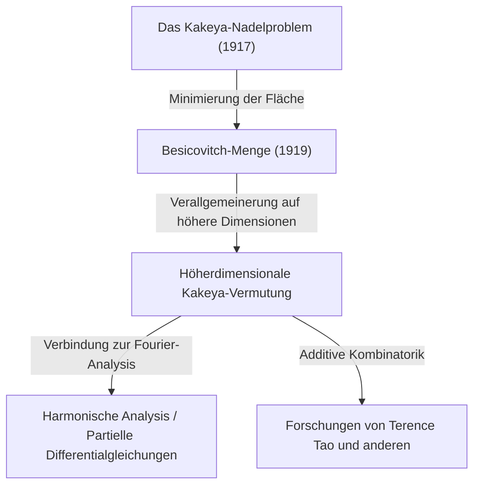

In der Welt der Mathematik gibt es Themen, die mit einem intuitiv sehr leicht verständlichen Problem beginnen, deren Lösungen und daraus abgeleitete Probleme jedoch zu den tiefgründigsten Bereichen der modernen Mathematik führen. "Fermats letzter Satz" und die "Poincaré-Vermutung" sind typische Beispiele dafür, aber auch die **"Kakeya-Vermutung"**, die an der Schnittstelle von Geometrie und Analysis liegt, ist ein solches faszinierendes Thema.

In diesem Artikel werden wir das Gesamtbild der Kakeya-Vermutung tiefgehend erläutern – angefangen mit dem "Kakeya-Nadelproblem", das 1917 von dem japanischen Mathematiker Soichi Kakeya aufgeworfen wurde, über die erstaunliche Entdeckung des russischen Mathematikers Abram Besicovitch, bis hin zur Forschung des modernen genialen Mathematikers Terence Tao und anderen.

---

## 1. Das Kakeya-Nadelproblem: Eine intuitive Frage

Im Jahr 1917 stellte Soichi Kakeya, der an der Kaiserlichen Universität Tohoku (der heutigen Tohoku-Universität) tätig war, das folgende sehr einfache und visuelle Problem.

> **Das Kakeya-Nadelproblem (Kakeya Needle Problem)**
> Welches ist die Figur mit dem kleinsten Flächeninhalt, in der ein Liniensegment (eine Nadel) der Länge 1 kontinuierlich bewegt werden kann, um seine Richtung um 360 Grad (eine volle Umdrehung) zu ändern? Und wie groß ist diese minimale Fläche?

Zum Beispiel kann man eine Nadel der Länge 1 innerhalb eines Kreises mit dem Radius $1/2$ um ihren Mittelpunkt drehen. Die Fläche dieses Kreises beträgt $\pi/4 \approx 0.785$.
Außerdem kann man die Nadel mit etwas Geschick auch im Inneren eines gleichseitigen Dreiecks (mit der Höhe 1) mit einer Seitenlänge von $1/\sqrt{3}$ drehen. Diese Fläche beträgt $1/\sqrt{3} \approx 0.577$, was kleiner als der Kreis ist.

Darüber hinaus zeigte Kakeya selbst, dass man durch die Verwendung einer Figur namens Deltoid (eine Art Sternform) die Fläche auf $\pi/8 \approx 0.392$ reduzieren kann. Viele Mathematiker vermuteten: "Wahrscheinlich ist das die minimale Fläche."

Die Dinge nahmen jedoch eine unerwartete Wendung.

---

## 2. Das Wunder von Besicovitch: Die Kakeya-Menge mit Fläche null

Nur wenige Jahre nach Kakeyas Fragestellung, im Jahr 1919 (veröffentlicht 1928), hatte der russische Mathematiker Abram Besicovitch in einem völlig anderen Zusammenhang (Forschung zum Riemann-Integral) eine unglaubliche Figur konstruiert.

Besicovitch bewies, dass eine Menge mit der folgenden Eigenschaft (heute **"Besicovitch-Menge"** oder **"Kakeya-Menge"** genannt) existiert:

> **Es existiert eine Menge in der Ebene, die für jede mögliche Richtung ein Liniensegment der Länge 1 enthält, deren Lebesgue-Maß (Fläche) jedoch beliebig klein gemacht werden kann oder sogar das Maß 0 hat.**

Das bedeutet die erstaunliche Schlussfolgerung: "Man kann eine Nadel der Länge 1 innerhalb einer Figur mit der Fläche null einmal um 360 Grad drehen." Hinter dieser Tatsache, die der Intuition völlig widerspricht, verbarg sich eine fraktal-geometrische Konstruktionsmethode.

### Konstruktion durch den Perron-Baum (Perron Tree)
Eine repräsentative Methode zur Konstruktion dieser mysteriösen Menge ist der sogenannte "Perron-Baum".
1. Zunächst betrachtet man ein Dreieck mit einer Grundfläche.
2. Man unterteilt das Dreieck von der Spitze in Richtung der Grundfläche in lange, schmale Streifen.
3. Die unterteilten, langen und schmalen Dreiecke werden leicht gegeneinander verschoben, sodass sie sich stark überlappen (wobei jedoch die Abdeckung der Liniensegment-Richtungen erhalten bleibt).
4. Durch unendlich häufige Wiederholung dieser "Unterteilen und Überlappen"-Operation kann man die Fläche des ursprünglichen Dreiecks beliebig klein komprimieren.

Die Menge, die man als Grenzwert dieser fraktalen Operation erhält, ist dicht gepackt mit unzähligen "Liniensegmenten der Länge 1", doch ihre Gesamtfläche (Lebesgue-Maß) wird zu null.

---

## 3. Die Geburt der höherdimensionalen Kakeya-Vermutung

Nachdem bewiesen wurde, dass in der Ebene (2 Dimensionen) eine "Kakeya-Menge mit Fläche null existiert", richtete sich das Interesse der Mathematiker natürlicherweise auf höhere Dimensionen (3 Dimensionen, 4 Dimensionen und sogar $n$ Dimensionen).

Es ist bekannt, dass man auch im $n$-dimensionalen Raum $\mathbb{R}^n$ eine Menge konstruieren kann, die Einheitsliniensegmente in alle Richtungen enthält (Kakeya-Menge) und deren Volumen (das $n$-dimensionale Lebesgue-Maß) null ist.

Aber selbst wenn das Volumen null ist, müssen die "Ausdehnung als Figur" und die "Komplexität" mit einem anderen Maßstab gemessen werden. Das sind die Konzepte der fraktalen Dimension, die **"Hausdorff-Dimension"** oder **"Minkowski-Dimension"** genannt werden.

Eine 2-dimensionale Kakeya-Menge hat die Fläche null, aber es ist bewiesen, dass ihre Hausdorff-Dimension genau 2 ist. Das heißt, auch wenn sie keine Fläche besitzt, hat sie in Bezug auf die Komplexität der Figur eine Ausdehnung, die ausreicht, um den 2-dimensionalen Raum auszufüllen.

Daraus entstand die als ungelöstes Problem der modernen Mathematik berühmte **"Kakeya-Vermutung"**.

> **Höherdimensionale Kakeya-Vermutung**
> Die Hausdorff-Dimension und die Minkowski-Dimension jeder Kakeya-Menge (einer Menge, die Einheitsliniensegmente in alle Richtungen enthält) im $n$-dimensionalen Raum $\mathbb{R}^n$ ist genau $n$.

Diese Vermutung ist für die Dimensionen $n=1, 2$ bewiesen worden, bleibt jedoch für $n \ge 3$ (Räume mit 3 oder mehr Dimensionen) ungelöst.

---

## 4. Auswirkungen auf die moderne Mathematik: Warum ist die Kakeya-Vermutung so wichtig?

Warum erregt ein scheinbar reines Geometrieproblem wie "die Dimension einer Figur, in der sich eine Nadel dreht" an vorderster Front der modernen Mathematik so viel Aufmerksamkeit?
Das liegt daran, dass Charles Fefferman in den 1970er Jahren entdeckte, dass es eine tiefe Verbindung zwischen der Kakeya-Vermutung und der **"harmonischen Analysis (Fourier-Analysis)"** gibt.

### Die Bochner-Riesz-Vermutung und die Wellengleichung
Fefferman zeigte, dass die "Bochner-Riesz-Vermutung", ein wichtiges Problem der harmonischen Analysis zur Untersuchung der Konvergenz der Fourier-Transformation, tatsächlich direkt mit den geometrischen Eigenschaften der Kakeya-Menge verbunden ist.
Wenn die Dimension der Kakeya-Menge echt kleiner als $n$ wäre, könnte man das Phänomen, dass sich Energie durch die Überlagerung bestimmter Wellen an einem Ort konzentriert, nicht mehr kontrollieren, was zu einem Widerspruch in grundlegenden Theoremen der Analysis führen würde.

Darüber hinaus ist dies auch eng mit der "Local smoothing conjecture" (Vermutung zur lokalen Glättung der Wellengleichung) im Bereich der **partiellen Differentialgleichungen (PDE)** verbunden. Das physikalische Problem, wie sich Schall- oder Lichtwellen im Raum ausbreiten, wie sie diffundieren und wo sich Energie konzentriert, wird durch die fraktale Geometrie der Kakeya-Menge dominiert.

---

## 5. Terence Tao und die additive Kombinatorik

In jüngster Zeit haben Mathematiker wie der Fields-Medaillen-Gewinner Terence Tao revolutionäre Ansätze für diese Kakeya-Vermutung geliefert. Sie nahmen die Kakeya-Vermutung mit Werkzeugen aus einem Bereich namens **"Additive Kombinatorik"** in Angriff.

Die "Finite Field Kakeya Conjecture" (Kakeya-Vermutung über endlichen Körpern) unter Verwendung des Raums $\mathbb{F}_q^n$ über einem endlichen Körper wurde 2008 von Zeev Dvir mit einer erstaunlich einfachen Methode namens Polynommethode vollständig gelöst. Dadurch wurde auch ein neues Licht auf die Lösung der Kakeya-Vermutung im reellen Raum geworfen.

Tao und seine Kollegen analysieren kombinatorisch, wie sich die unzähligen in einer Kakeya-Menge enthaltenen Liniensegmente gegenseitig schneiden (Intersection theory), und verschieben die unteren Schranken (Lower bounds) für bestimmte Dimensionen von Jahr zu Jahr nach oben. Obwohl bis heute kein vollständiger Beweis erbracht wurde, nähert man sich der Wahrheit durch die Verschmelzung von Methoden aus verschiedenen Bereichen der Mathematik Stück für Stück.

---

## 6. Zusammenfassung

Das "Kakeya-Nadelproblem" von 1917 begann als eine Art Formel-Puzzle, das jeder verstehen konnte. Im Kern jedoch handelte es sich um eine furchterregend tiefe Mathematik, die bis zu den physikalischen Gesetzen des Universums wie der Ausdehnung des Raums, Dimensionen und der Wellenausbreitung reichte.

Die Kakeya-Vermutung begann mit einer intuitiv schwer vorstellbaren "Menge mit der Fläche null" und ist zu einer gewaltigen Brücke geworden, die den großen Ozean der modernen Mathematik – Fourier-Analysis, partielle Differentialgleichungen und additive Kombinatorik – verbindet. Wird der Tag kommen, an dem diese Vermutung für Räume von drei oder mehr Dimensionen vollständig gelöst wird? Die Herausforderung der Mathematiker geht auch heute noch weiter.
