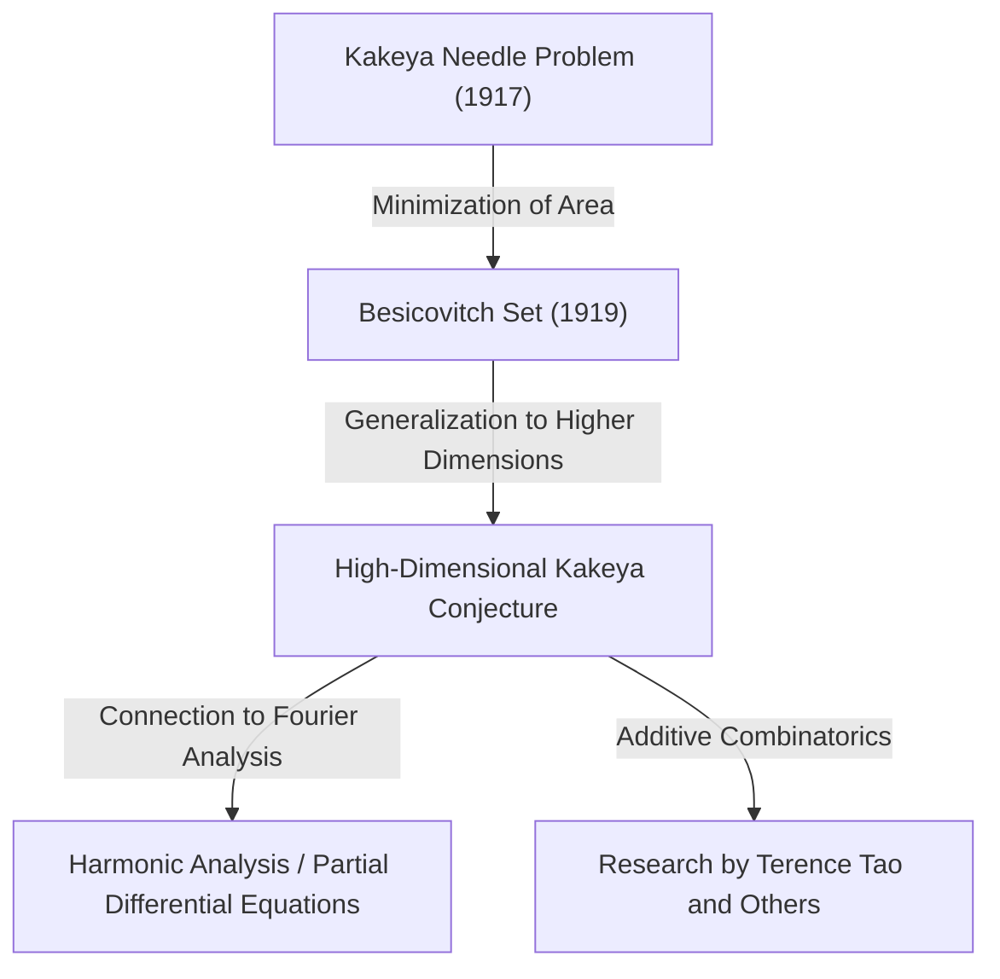

In the world of mathematics, there are topics that start with highly intuitive problems, but whose solutions and derived problems lead to the most profound areas of modern mathematics. "Fermat's Last Theorem" and the "Poincaré Conjecture" are typical examples, but the **"Kakeya Conjecture"**, located at the intersection of geometry and analysis, is also one of these fascinating themes.

In this article, we will delve deeply into the full picture of the Kakeya Conjecture, starting from the "Kakeya Needle Problem" posed by Japanese mathematician Soichi Kakeya in 1917, through the surprising discovery by Russian mathematician Besicovitch, and up to the research by modern mathematical genius Terence Tao and others.

---

## 1. Kakeya's Needle Problem: An Intuitive Question

In 1917, Soichi Kakeya at Tohoku Imperial University (now Tohoku University) posed the following very simple and visual problem:

> **Kakeya Needle Problem**
> What is the shape of minimum area within which a line segment (a needle) of length 1 can be rotated continuously through 360 degrees (a full turn) in a plane? And what is that minimum area?

For example, a needle of length 1 can be rotated around its center in a circle of radius $1/2$. The area of this circle is $\pi/4 \approx 0.785$.
Also, inside an equilateral triangle with a side length of $1/\sqrt{3}$ (height of 1), the needle can be rotated with a little ingenuity. This area is $1/\sqrt{3} \approx 0.577$, which is smaller than the circle.

Furthermore, Kakeya himself showed that by using a shape called a deltoid (a type of hypocycloid), the area can be reduced to $\pi/8 \approx 0.392$. Many mathematicians conjectured that "this is probably the minimum area."

However, things took an unexpected turn.

---

## 2. Besicovitch's Marvel: The Kakeya Set of Area Zero

In 1919 (published in 1928), just a few years after Kakeya posed the problem, the Russian mathematician Abram Besicovitch was constructing incredible shapes in an entirely different context (the study of Riemann integration).

Besicovitch proved that there exists a set (now called a **"Besicovitch set"** or **"Kakeya set"**) with the following property:

> **There exists a set in the plane that contains a line segment of length 1 in every direction, yet its Lebesgue measure (area) can be made arbitrarily small, or even zero.**

In other words, the astonishing conclusion is that "a needle of length 1 can be rotated a full turn within a shape of zero area." Behind this fact, which completely defies intuition, was a fractal geometric construction method.

### Construction by Perron Tree
A typical method for constructing this mysterious set is what is called a "Perron tree".
1. First, consider a triangle with a base.
2. Divide the triangle from the vertex toward the base into long, thin strips.
3. Slide the divided thin triangles slightly so that they overlap each other (but while maintaining the coverage of line segment directions).
4. By repeating this "divide and overlap" operation infinitely, the area of the original triangle can be compressed to be arbitrarily small.

The set obtained as the limit of this fractal operation is packed with infinitely many "line segments of length 1", yet the total area (Lebesgue measure) is zero.

---

## 3. The Birth of the High-Dimensional Kakeya Conjecture

After it was proved that "a Kakeya set of area zero exists" in the plane (2 dimensions), the interest of mathematicians naturally shifted to higher dimensions (3 dimensions, 4 dimensions, and further $n$-dimensions).

Even in $n$-dimensional space $\mathbb{R}^n$, it is known that one can construct a set containing unit line segments in all directions (a Kakeya set) whose volume ($n$-dimensional Lebesgue measure) is zero.

However, even if the volume is zero, the "extent as a shape" or "complexity" must be measured by a different scale. These are the concepts of fractal dimensions called **"Hausdorff dimension"** and **"Minkowski dimension"**.

A 2-dimensional Kakeya set has zero area, but its Hausdorff dimension has been proven to be exactly 2. That is, even without area, its complexity has enough extent to fill the 2-dimensional space.

From here, the **"Kakeya Conjecture"**, famous as an unsolved problem in modern mathematics, was born.

> **High-Dimensional Kakeya Conjecture**
> The Hausdorff dimension and Minkowski dimension of any Kakeya set (a set containing a unit line segment in every direction) in $n$-dimensional space $\mathbb{R}^n$ are exactly $n$.

This conjecture has been proven correct for dimensions $n=1, 2$, but remains unsolved for $n \ge 3$ (spaces of 3 dimensions or more).

---

## 4. Ripple Effects on Modern Mathematics: Why is the Kakeya Conjecture Important?

Why has a seemingly pure geometric problem about "the dimension of a shape rotating a needle" attracted so much attention at the forefront of modern mathematics?
It is because in the 1970s, Charles Fefferman discovered a deep connection between the Kakeya Conjecture and **"Harmonic Analysis (Fourier Analysis)"**.

### Bochner-Riesz Conjecture and the Wave Equation
Fefferman showed that the "Bochner-Riesz conjecture", an important problem in harmonic analysis that investigates the convergence of the Fourier transform, is actually directly linked to the geometric properties of Kakeya sets.
If the dimension of a Kakeya set were strictly smaller than $n$, it would become impossible to suppress the phenomenon of energy concentrating in one point due to the superposition of specific waves, leading to contradictions in fundamental theorems of analysis.

Furthermore, this is also deeply linked to the "Local smoothing conjecture for the wave equation" in the field of **Partial Differential Equations (PDEs)**. When waves of sound or light propagate through space, the physical problem of how the waves diffuse and where the energy concentrates is governed by the fractal geometry of Kakeya sets.

---

## 5. Terence Tao and Additive Combinatorics

In recent years, Fields Medalist Terence Tao and other mathematicians have brought a breakthrough approach to this Kakeya conjecture. They tackled the Kakeya conjecture using tools from a field called **"Additive Combinatorics"**.

The "Finite Field Kakeya Conjecture", which uses a space over a finite field $\mathbb{F}_q^n$, was completely resolved by Zeev Dvir in 2008 using a wonderfully simple method called the polynomial method. This has also shed new light on resolving the Kakeya conjecture in real space.

Tao and his colleagues analyze how the infinitely many line segments contained in a Kakeya set intersect with each other (Intersection theory) from a combinatorial perspective, and are pushing up the lower bounds for specific dimensions year by year. Although a complete proof has not yet been reached, by integrating methods from various fields of mathematics, they are gradually getting closer to the truth.

---

## 6. Conclusion

The "Kakeya Needle Problem" of 1917 began with a question like a shape puzzle that anyone could understand. However, its essence was terrifyingly profound mathematics rooted even in the physical laws of the universe, such as the expanse and dimensions of space, and the propagation of waves.

The Kakeya conjecture started from counter-intuitive "sets of zero area" and has become a grand bridge connecting the vast oceans of modern mathematics: Fourier analysis, partial differential equations, and additive combinatorics. The challenge of mathematicians continues today, looking toward the day when this conjecture is completely resolved in 3-dimensional spaces and higher.
