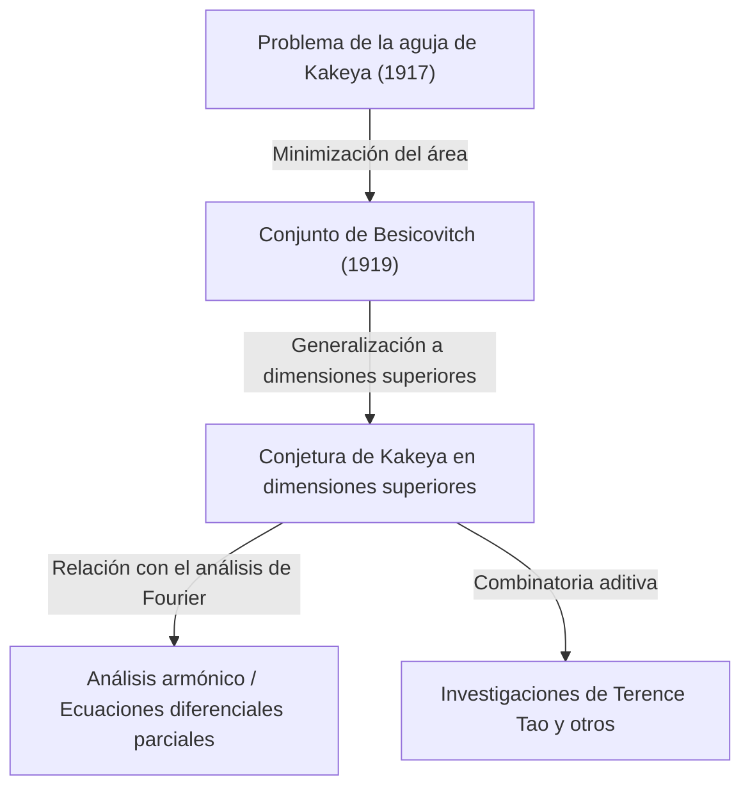

En el mundo de las matemáticas, existen ciertos temas que comienzan con un problema intuitivamente muy fácil de entender, pero cuyas soluciones y problemas derivados se conectan con las áreas más profundas de las matemáticas modernas. El "Último Teorema de Fermat" y la "Conjetura de Poincaré" son ejemplos representativos, pero la **"Conjetura de Kakeya" (Kakeya Conjecture)**, situada en la intersección de la geometría y el análisis matemático, es también uno de esos temas fascinantes.

En este artículo, exploraremos en profundidad toda la perspectiva de la conjetura de Kakeya, comenzando desde el "Problema de la aguja de Kakeya" planteado en 1917 por el matemático japonés Soichi Kakeya, pasando por el sorprendente descubrimiento del matemático ruso Abram Besicovitch, hasta llegar a las investigaciones de genios matemáticos modernos como Terence Tao.

---

## 1. El problema de la aguja de Kakeya: Una pregunta intuitiva

En 1917, Soichi Kakeya, quien se encontraba en la Universidad Imperial de Tohoku (actual Universidad de Tohoku), planteó el siguiente problema muy simple y visual:

> **Problema de la aguja de Kakeya (Kakeya Needle Problem)**
> ¿Cuál es la figura de menor área dentro de la cual se puede rotar un segmento de línea (aguja) de longitud 1 de manera continua hasta darle una vuelta completa (360 grados), cambiando su dirección? Y, ¿cuál es esa área mínima?

Por ejemplo, dentro de un círculo de radio $1/2$, se puede rotar una aguja de longitud 1 usándolo como eje central. El área de este círculo es $\pi/4 \approx 0.785$.
También, dentro de un triángulo equilátero de lado $1/\sqrt{3}$ (con altura 1), si se tiene un poco de ingenio, se puede rotar la aguja. Esta área resulta ser $1/\sqrt{3} \approx 0.577$, que es menor que la del círculo.

Además, el propio Kakeya demostró que, usando una figura llamada deltoide (un tipo de hipocicloide o forma de estrella), se puede reducir el área hasta $\pi/8 \approx 0.392$. Muchos matemáticos supusieron: "Probablemente esta sea el área mínima".

Sin embargo, la situación tomó un rumbo inesperado.

---

## 2. La maravilla de Besicovitch: El conjunto de Kakeya de área cero

Apenas unos años después del planteamiento de Kakeya, en 1919 (publicado en 1928), el matemático ruso Abram Besicovitch, en un contexto completamente diferente (el estudio de la integral de Riemann), estaba construyendo una figura increíble.

Besicovitch demostró que existe un conjunto con las siguientes propiedades (actualmente llamado **"conjunto de Besicovitch"** o **"conjunto de Kakeya"**):

> **Existe un conjunto en el plano que contiene un segmento de línea de longitud 1 en todas las direcciones y cuya medida de Lebesgue (área) puede ser tan pequeña como se desee, o incluso de medida cero.**

En otras palabras, la sorprendente conclusión es que "se puede rotar completamente una aguja de longitud 1 dentro de una figura de área cero". Detrás de este hecho que va totalmente en contra de la intuición, se encontraba un método de construcción de geometría fractal.

### Construcción mediante el árbol de Perron (Perron Tree)
El método representativo para construir este extraño conjunto es el llamado "árbol de Perron".
1. Primero, consideramos un triángulo con una base.
2. Dividimos ese triángulo desde el vértice hacia la base en triángulos largos y estrechos.
3. Deslizamos ligeramente estos triángulos largos y estrechos divididos para que se superpongan entre sí (pero manteniendo la cobertura de todas las direcciones de los segmentos de línea).
4. Al repetir esta operación de "dividir y superponer" infinitamente, el área del triángulo original se puede comprimir y hacer tan pequeña como se desee.

El conjunto obtenido como el límite de esta operación fractal está repleto de innumerables "segmentos de línea de longitud 1", pero su área total (medida de Lebesgue) es cero.

---

## 3. El nacimiento de la conjetura de Kakeya en dimensiones superiores

Después de que se demostró en el plano (2 dimensiones) que "existe un conjunto de Kakeya de área cero", el interés de los matemáticos se dirigió naturalmente a dimensiones superiores (3 dimensiones, 4 dimensiones, e incluso $n$ dimensiones).

Se sabe que en un espacio de $n$ dimensiones $\mathbb{R}^n$ también es posible construir un conjunto que contiene un segmento de línea unitario en todas las direcciones (conjunto de Kakeya) cuyo volumen (medida de Lebesgue en $n$ dimensiones) es cero.

Sin embargo, incluso si el volumen es cero, la "extensión como figura" o "complejidad" debe medirse con otra escala. Es aquí donde entran los conceptos de dimensión fractal llamados **"dimensión de Hausdorff"** y **"dimensión de Minkowski"**.

Aunque el conjunto de Kakeya en 2 dimensiones tiene área cero, se ha demostrado que su dimensión de Hausdorff es exactamente 2. Es decir, a pesar de no tener área, su complejidad como figura tiene una extensión que llena todo el espacio bidimensional.

A partir de esto, nace uno de los problemas no resueltos más famosos de las matemáticas modernas: la **"Conjetura de Kakeya"**.

> **Conjetura de Kakeya en dimensiones superiores**
> La dimensión de Hausdorff y la dimensión de Minkowski de cualquier conjunto de Kakeya (un conjunto que contiene segmentos de línea unitarios en todas las direcciones) en el espacio de $n$ dimensiones $\mathbb{R}^n$ es exactamente $n$.

Se ha demostrado que esta conjetura es cierta para las dimensiones $n=1, 2$, pero sigue sin resolverse para $n \ge 3$ (espacios de 3 o más dimensiones).

---

## 4. Repercusiones en las matemáticas modernas: ¿Por qué es importante la conjetura de Kakeya?

¿Por qué un problema aparentemente puro de geometría sobre "la dimensión de una figura que rota una aguja" atrae tanta atención en la vanguardia de las matemáticas modernas?
Esto se debe a que, en la década de 1970, Charles Fefferman descubrió una profunda conexión entre la conjetura de Kakeya y el **"análisis armónico (análisis de Fourier)"**.

### La conjetura de Bochner-Riesz y la ecuación de ondas
Fefferman demostró que un problema importante del análisis armónico, la "conjetura de Bochner-Riesz", que investiga la convergencia de las transformadas de Fourier, está en realidad directamente relacionado con las propiedades geométricas de los conjuntos de Kakeya.
Si la dimensión del conjunto de Kakeya fuera verdaderamente menor que $n$, no se podría controlar el fenómeno en el que la energía se concentra extremadamente debido a la superposición de ciertas ondas, lo que generaría una contradicción en los teoremas fundamentales del análisis matemático.

Además, esto está profundamente vinculado con la "conjetura de suavizado local (Local smoothing conjecture)" de la ecuación de ondas en el campo de las **ecuaciones diferenciales parciales (PDE)**. Cuando el sonido o las ondas de luz se propagan por el espacio, el problema físico de cómo se difunden las ondas y dónde se concentra la energía está gobernado por la geometría fractal de los conjuntos de Kakeya.

---

## 5. Terence Tao y la combinatoria aditiva

En años recientes, quienes han aportado enfoques revolucionarios a esta conjetura de Kakeya son matemáticos como Terence Tao, ganador de la Medalla Fields. Ellos desafiaron la conjetura de Kakeya utilizando herramientas de un campo llamado **"Combinatoria Aditiva (Additive Combinatorics)"**.

La "Conjetura de Kakeya en campos finitos", que utiliza espacios sobre cuerpos finitos $\mathbb{F}_q^n$, fue resuelta por completo en 2008 por Zeev Dvir utilizando el método polinomial, un enfoque asombrosamente simple. Esto también arrojó nueva luz sobre la resolución de la conjetura de Kakeya en el espacio de los números reales.

Tao y otros matemáticos analizan de forma combinatoria cómo se intersecan los innumerables segmentos de línea contenidos en un conjunto de Kakeya (Intersection theory), y han ido elevando año tras año las cotas inferiores (Lower bounds) para dimensiones específicas. Aunque hoy en día todavía no se ha alcanzado una demostración completa, al fusionar técnicas de diversos campos de las matemáticas, se están acercando poco a poco a la verdad.

---

## 6. Conclusión

El "Problema de la aguja de Kakeya" de 1917 comenzó como una pregunta similar a un rompecabezas geométrico que cualquiera podía entender. Sin embargo, su esencia era una matemática terriblemente profunda que echa raíces incluso en las leyes físicas del universo, como la extensión del espacio, sus dimensiones y la propagación de ondas.

La conjetura de Kakeya comenzó con un contraintuitivo "conjunto de área cero" y se ha convertido en un puente magnífico que conecta los inmensos océanos de las matemáticas modernas: el análisis de Fourier, las ecuaciones diferenciales parciales y la combinatoria aditiva. Los desafíos de los matemáticos continúan hoy en día, con la esperanza de que llegue el día en que esta conjetura se resuelva por completo en espacios de 3 o más dimensiones.
