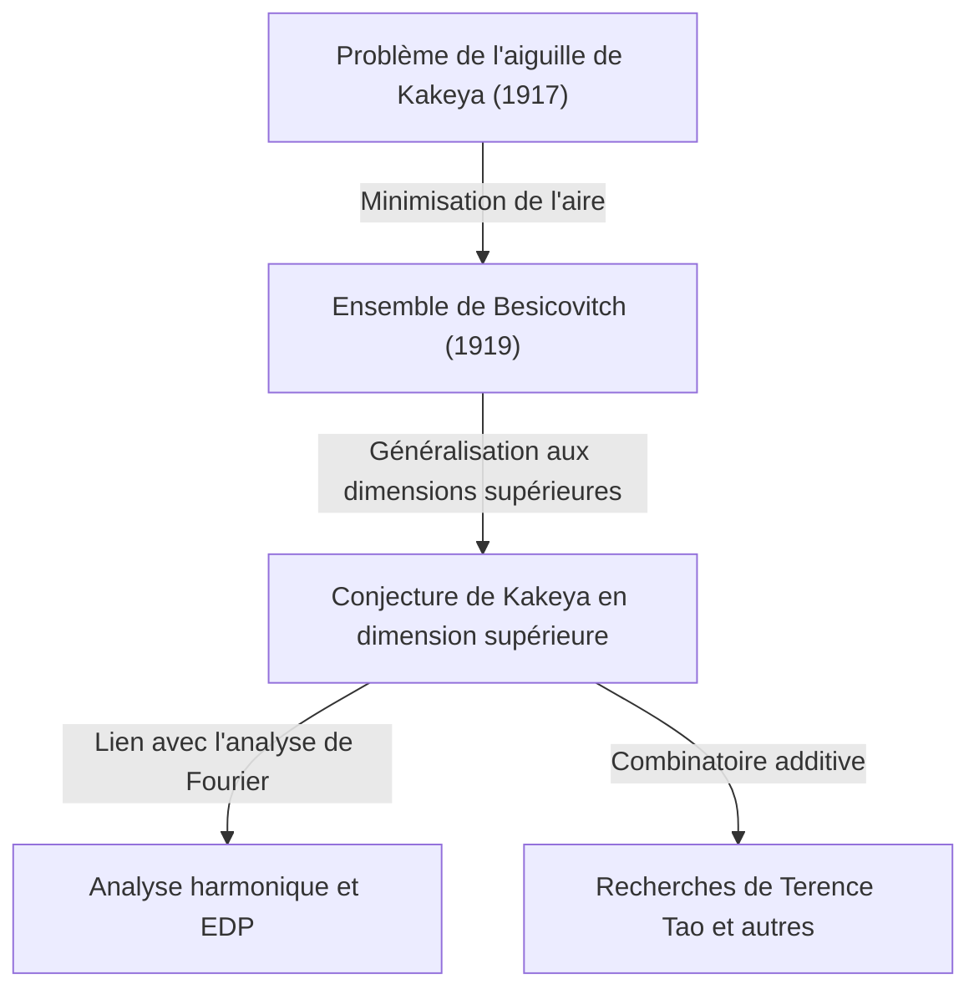

Dans le monde des mathématiques, il existe quelques sujets qui commencent par un problème très facile à comprendre intuitivement, mais dont la solution et les problèmes qui en découlent mènent aux domaines les plus profonds des mathématiques modernes. Le "dernier théorème de Fermat" et la "conjecture de Poincaré" en sont des exemples typiques, mais la **"conjecture de Kakeya (Kakeya Conjecture)"**, située à l'intersection de la géométrie et de l'analyse, est également l'un de ces thèmes fascinants.

Cet article explore en profondeur l'ensemble de la conjecture de Kakeya, en commençant par le "problème de l'aiguille de Kakeya" soulevé en 1917 par le mathématicien japonais Soichi Kakeya, jusqu'à la découverte étonnante du mathématicien russe Besicovitch, et aux recherches de génies mathématiques contemporains comme Terence Tao.

---

## 1. Le problème de l'aiguille de Kakeya : une question intuitive

En 1917, Soichi Kakeya, alors à l'Université impériale du Tohoku (aujourd'hui l'Université du Tohoku), a posé le problème très simple et visuel suivant :

> **Le problème de l'aiguille de Kakeya (Kakeya Needle Problem)**
> Parmi toutes les figures planes dans lesquelles un segment de droite de longueur 1 (une aiguille) peut être déplacé continûment pour faire un tour complet (360 degrés), quelle est celle dont l'aire est minimale ? Et quelle est cette aire minimale ?

Par exemple, vous pouvez faire tourner une aiguille de longueur 1 autour de son centre dans un cercle de rayon $1/2$. L'aire de ce cercle est de $\pi/4 \approx 0.785$.
De plus, vous pouvez faire tourner l'aiguille à l'intérieur d'un triangle équilatéral de côté $1/\sqrt{3}$ (de hauteur 1) avec un peu d'astuce. L'aire de ce triangle est de $1/\sqrt{3} \approx 0.577$, ce qui est plus petit que celle du cercle.

De plus, Kakeya lui-même a montré qu'en utilisant une figure appelée deltoïde (une sorte de forme étoilée), l'aire pouvait être réduite à $\pi/8 \approx 0.392$. De nombreux mathématiciens ont supposé que "ce serait probablement l'aire minimale".

Cependant, les choses ont pris une tournure inattendue.

---

## 2. L'étonnement de Besicovitch : l'ensemble de Kakeya d'aire nulle

En 1919 (publié en 1928), quelques années seulement après la question de Kakeya, le mathématicien russe Abram Besicovitch construisait une figure incroyable dans un contexte complètement différent (l'étude de l'intégrale de Riemann).

Besicovitch a prouvé qu'il existe un ensemble (maintenant appelé **"ensemble de Besicovitch"** ou **"ensemble de Kakeya"**) ayant la propriété suivante :

> **Il existe un ensemble dans le plan qui contient un segment de ligne de longueur 1 dans toutes les directions, mais dont la mesure de Lebesgue (aire) peut être rendue aussi petite que l'on veut, ou dont la mesure est de 0.**

En d'autres termes, c'est la conclusion étonnante que "vous pouvez faire faire un tour complet à une aiguille de longueur 1 à l'intérieur d'une figure d'aire nulle". Derrière ce fait, qui va totalement à l'encontre de l'intuition, se trouvait une méthode de construction de géométrie fractale.

### Construction par l'arbre de Perron (Perron Tree)
Une méthode représentative pour construire cet ensemble mystérieux est ce qu'on appelle "l'arbre de Perron".
1. Tout d'abord, considérez un triangle avec une base.
2. Divisez ce triangle en triangles minces et allongés du sommet vers la base.
3. Faites glisser ces triangles allongés et divisés petit à petit afin qu'ils se chevauchent (tout en conservant la couverture des directions des segments de ligne).
4. En répétant cette opération de "diviser et superposer" à l'infini, l'aire du triangle d'origine peut être compressée et rendue aussi petite que l'on veut.

L'ensemble obtenu comme limite de cette opération fractale est rempli d'une infinité de "segments de longueur 1", mais son aire totale (mesure de Lebesgue) devient nulle.

---

## 3. La naissance de la conjecture de Kakeya en dimension supérieure

Après qu'il a été prouvé qu'un "ensemble de Kakeya d'aire nulle existe" dans un plan (2 dimensions), l'intérêt des mathématiciens s'est naturellement tourné vers des dimensions supérieures (3 dimensions, 4 dimensions et même $n$ dimensions).

Il est connu que même dans un espace à $n$ dimensions $\mathbb{R}^n$, il est possible de construire un ensemble qui contient un segment unité dans toutes les directions (un ensemble de Kakeya) et dont le volume (mesure de Lebesgue à $n$ dimensions) devient nul.

Cependant, même si le volume est nul, "l'étendue en tant que figure" et la "complexité" doivent être mesurées par une autre échelle. C'est le concept de dimension fractale appelé **"dimension de Hausdorff"** ou **"dimension de Minkowski"**.

Un ensemble de Kakeya en 2 dimensions a une aire nulle, mais il a été prouvé que sa dimension de Hausdorff est exactement 2. En d'autres termes, même s'il n'a pas d'aire, il a suffisamment d'étendue pour remplir l'espace bidimensionnel en termes de complexité de la figure.

De là est née la célèbre **"conjecture de Kakeya"** comme un problème non résolu des mathématiques modernes.

> **Conjecture de Kakeya en dimension supérieure**
> La dimension de Hausdorff et la dimension de Minkowski de tout ensemble de Kakeya (un ensemble contenant un segment de ligne unitaire dans chaque direction) dans un espace à $n$ dimensions $\mathbb{R}^n$ sont exactement de $n$.

Cette conjecture a été prouvée comme étant correcte pour les dimensions $n=1, 2$, mais reste non résolue pour $n \ge 3$ (espaces de 3 dimensions ou plus).

---

## 4. Répercussions sur les mathématiques modernes : pourquoi la conjecture de Kakeya est-elle importante ?

Pourquoi un problème de géométrie pure apparemment simple comme "la dimension d'une figure qui fait tourner une aiguille" attire-t-il autant l'attention à la pointe des mathématiques modernes ?
C'est parce que dans les années 1970, Charles Fefferman a découvert qu'il existait un lien profond entre la conjecture de Kakeya et **"l'analyse harmonique (analyse de Fourier)"**.

### La conjecture de Bochner-Riesz et l'équation des ondes
Fefferman a montré que la "conjecture de Bochner-Riesz", un problème important en analyse harmonique étudiant la convergence de la transformée de Fourier, est en fait directement liée aux propriétés géométriques de l'ensemble de Kakeya.
Si la dimension de l'ensemble de Kakeya était strictement inférieure à $n$, le phénomène de concentration d'énergie due à la superposition de certaines ondes ne pourrait pas être supprimé, conduisant à des contradictions dans les théorèmes fondamentaux de l'analyse.

De plus, cela est également profondément lié à la "conjecture de lissage local (Local smoothing conjecture) de l'équation des ondes" dans le domaine des **équations aux dérivées partielles (EDP)**. Le problème physique de savoir comment les ondes se diffusent et où l'énergie se concentre lorsque le son ou la lumière se propagent dans l'espace est régi par la géométrie fractale des ensembles de Kakeya.

---

## 5. Terence Tao et la combinatoire additive

Ces dernières années, des mathématiciens comme le lauréat de la médaille Fields Terence Tao ont apporté des approches révolutionnaires à cette conjecture de Kakeya. Ils se sont attaqués à la conjecture de Kakeya à l'aide d'outils issus d'un domaine appelé **"combinatoire additive (Additive Combinatorics)"**.

La "conjecture de Kakeya sur les corps finis", utilisant l'espace $\mathbb{F}_q^n$ sur des corps finis, a été complètement résolue en 2008 par Zeev Dvir en utilisant une méthode polynomiale étonnamment simple. Cela a également apporté une nouvelle lumière sur la résolution de la conjecture de Kakeya dans l'espace réel.

Tao et d'autres analysent de manière combinatoire la façon dont une infinité de segments de ligne inclus dans l'ensemble de Kakeya se croisent (Théorie de l'intersection) et repoussent chaque année les bornes inférieures (Lower bounds) pour des dimensions spécifiques. Bien qu'une preuve complète n'ait pas encore été atteinte, en fusionnant des méthodes de divers domaines des mathématiques, nous nous rapprochons de la vérité petit à petit.

---

## 6. Résumé

Le "problème de l'aiguille de Kakeya" de 1917 a commencé comme un puzzle géométrique que tout le monde pouvait comprendre. Cependant, son essence s'est révélée être une mathématique effroyablement profonde qui prend racine dans les lois physiques de l'univers, telles que l'étendue et la dimension de l'espace, et la propagation des ondes.

La conjecture de Kakeya commence avec des "ensembles d'aire nulle" contre-intuitifs et sert de pont magnifique reliant le vaste océan des mathématiques modernes, y compris l'analyse de Fourier, les équations aux dérivées partielles et la combinatoire additive. Le défi des mathématiciens se poursuit aujourd'hui pour voir si le jour viendra où cette conjecture sera complètement résolue dans les espaces de 3 dimensions et plus.
