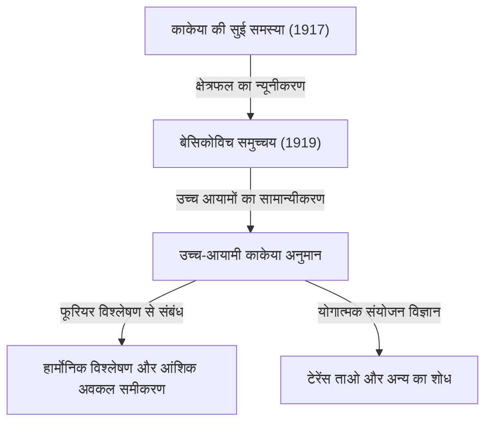

गणित की दुनिया में ऐसे कई विषय हैं जो बहुत ही सहज और समझने में आसान समस्या से शुरू होते हैं, लेकिन उनके समाधान और उनसे उत्पन्न होने वाली समस्याएं आधुनिक गणित के सबसे गहरे क्षेत्रों से जुड़ जाती हैं। 'फ़र्मेट का अंतिम प्रमेय' और '[पॉइनकेयर अनुमान](/hi/p/poincare-conjecture/)' इसके प्रमुख उदाहरण हैं, लेकिन ज्यामिति और विश्लेषण के चौराहे पर स्थित **"काकेया अनुमान (Kakeya Conjecture)"** भी ऐसे ही आकर्षक विषयों में से एक है।

इस लेख में, हम काकेया अनुमान की पूरी तस्वीर को गहराई से समझेंगे। यह 1917 में जापानी गणितज्ञ सोइची काकेया द्वारा प्रस्तुत "काकेया की सुई समस्या" से शुरू होकर, रूसी गणितज्ञ बेसिकोविच की आश्चर्यजनक खोज, और आधुनिक प्रतिभाशाली गणितज्ञ टेरेंस ताओ (Terence Tao) और अन्य के शोध तक फैला हुआ है।

---

## 1. काकेया की सुई समस्या: एक सहज प्रश्न

1917 में, तोहोकू इंपीरियल यूनिवर्सिटी (अब तोहोकू यूनिवर्सिटी) के सोइची काकेया ने निम्नलिखित बहुत ही सरल और दृश्य समस्या प्रस्तुत की:

> **काकेया की सुई समस्या (Kakeya Needle Problem)**
> लंबाई 1 के एक रेखाखंड (सुई) को एक समतल पर निरंतर घुमाते हुए 360 डिग्री (एक पूरा चक्कर) घुमाने की अनुमति देने वाली आकृतियों में से, सबसे छोटे क्षेत्रफल वाली आकृति कौन सी है? और वह न्यूनतम क्षेत्रफल क्या है?

उदाहरण के लिए, त्रिज्या $1/2$ वाले वृत्त के अंदर लंबाई 1 की सुई को उसके केंद्र के चारों ओर घुमाया जा सकता है। इस वृत्त का क्षेत्रफल $\pi/4 \approx 0.785$ है।
इसके अलावा, एक समबाहु त्रिभुज (जिसकी ऊंचाई 1 है) जिसकी भुजा $1/\sqrt{3}$ है, के अंदर भी थोड़े प्रयास से सुई को घुमाया जा सकता है। इसका क्षेत्रफल $1/\sqrt{3} \approx 0.577$ है, जो वृत्त से छोटा है।

इसके अतिरिक्त, काकेया ने स्वयं दिखाया कि डेल्टॉइड (तारे के आकार का एक प्रकार) नामक आकृति का उपयोग करके क्षेत्रफल को $\pi/8 \approx 0.392$ तक कम किया जा सकता है। कई गणितज्ञों ने अनुमान लगाया कि "संभवतः यही न्यूनतम क्षेत्रफल होगा।"

हालाँकि, चीजें एक अप्रत्याशित दिशा में मुड़ गईं।

---

## 2. बेसिकोविच का आश्चर्य: शून्य क्षेत्रफल वाला काकेया समुच्चय

काकेया के प्रस्ताव के कुछ ही वर्षों बाद 1919 में (1928 में प्रकाशित), रूसी गणितज्ञ अब्राम बेसिकोविच (Abram Besicovitch) ने एक बिल्कुल अलग संदर्भ (रीमैन इंटीग्रल पर शोध) में एक अविश्वसनीय आकृति का निर्माण किया।

बेसिकोविच ने साबित किया कि निम्नलिखित गुणों वाला एक समुच्चय (जिसे अब **"बेसिकोविच समुच्चय"** या **"काकेया समुच्चय"** कहा जाता है) मौजूद है।

> **समतल पर एक ऐसा समुच्चय मौजूद है जिसमें हर संभव दिशा में लंबाई 1 का रेखाखंड शामिल होने के बावजूद, इसका लेबेग माप (क्षेत्रफल) मनमाना छोटा बनाया जा सकता है, या इसका माप 0 है।**

दूसरे शब्दों में, यह एक आश्चर्यजनक निष्कर्ष था कि "आप लंबाई 1 की सुई को शून्य क्षेत्रफल वाली आकृति के अंदर एक पूरा चक्कर घुमा सकते हैं।" इस पूरी तरह से सहज ज्ञान के विपरीत तथ्य के पीछे फ्रैक्टल ज्यामितीय निर्माण विधि थी।

### पेरोन ट्री (Perron Tree) द्वारा निर्माण
इस रहस्यमयी समुच्चय के निर्माण की प्रतिनिधि विधि को "पेरोन ट्री" कहा जाता है।
1. सबसे पहले, एक आधार वाले त्रिभुज पर विचार करें।
2. उस त्रिभुज को शीर्ष से आधार की ओर पतले टुकड़ों में विभाजित करें।
3. विभाजित पतले त्रिभुजों को एक दूसरे पर थोड़ा खिसकाएं (ताकि वे एक-दूसरे पर ओवरलैप हों, लेकिन रेखाखंडों की दिशा की पूर्णता बनी रहे)।
4. इस "विभाजित करें और ओवरलैप करें" की प्रक्रिया को अनंत बार दोहराकर, मूल त्रिभुज के क्षेत्रफल को मनमाने ढंग से छोटा किया जा सकता है।

इस फ्रैक्टल जैसी प्रक्रिया की सीमा के रूप में प्राप्त समुच्चय में अनगिनत "लंबाई 1 के रेखाखंड" कसकर भरे होते हैं, लेकिन कुल क्षेत्रफल (लेबेग माप) शून्य हो जाता है।

---

## 3. उच्च-आयामी काकेया अनुमान का जन्म

समतल (2-आयाम) में "शून्य क्षेत्रफल वाले काकेया समुच्चय के अस्तित्व" के प्रमाणित होने के बाद, गणितज्ञों की रुचि स्वाभाविक रूप से उच्च आयामों (3-आयाम, 4-आयाम, और यहाँ तक कि $n$-आयाम) की ओर मुड़ गई।

$n$-आयामी अंतरिक्ष $\mathbb{R}^n$ में भी, सभी दिशाओं में इकाई रेखाखंडों वाले समुच्चय (काकेया समुच्चय) बनाए जा सकते हैं, जिनका आयतन ($n$-आयामी लेबेग माप) शून्य होता है।

हालाँकि, आयतन शून्य होने पर भी, "आकृति के विस्तार" और "जटिलता" को दूसरे पैमाने से मापने की आवश्यकता होती है। यह **"हॉसडॉर्फ आयाम"** (Hausdorff dimension) और **"मिन्कोव्स्की आयाम"** (Minkowski dimension) नामक फ्रैक्टल आयाम की अवधारणा है।

2-आयामी काकेया समुच्चय का क्षेत्रफल शून्य है, लेकिन यह प्रमाणित हो चुका है कि इसका हॉसडॉर्फ आयाम ठीक 2 है। दूसरे शब्दों में, क्षेत्रफल न होने के बावजूद, इसकी जटिलता के रूप में आकृति का विस्तार इतना अधिक है कि यह 2-आयामी अंतरिक्ष को पूरी तरह से भर देता है।

यहीं से आधुनिक गणित की एक प्रसिद्ध अनसुलझी समस्या **"काकेया अनुमान (Kakeya Conjecture)"** का जन्म होता है।

> **उच्च-आयामी काकेया अनुमान**
> $n$-आयामी अंतरिक्ष $\mathbb{R}^n$ में किसी भी काकेया समुच्चय (सभी दिशाओं में इकाई रेखाखंडों को शामिल करने वाला समुच्चय) का हॉसडॉर्फ आयाम और मिन्कोव्स्की आयाम ठीक $n$ होता है।

यह अनुमान आयाम $n=1, 2$ के लिए सही साबित हुआ है, लेकिन $n \ge 3$ (3 या अधिक आयाम वाले अंतरिक्ष) के मामले में अभी भी अनसुलझा है।

---

## 4. आधुनिक गणित पर प्रभाव: काकेया अनुमान महत्वपूर्ण क्यों है?

"सुई घुमाने वाली आकृति के आयाम" जैसी दिखने वाली विशुद्ध ज्यामितीय समस्या आधुनिक गणित में सबसे आगे इतना ध्यान क्यों आकर्षित कर रही है?

ऐसा इसलिए है क्योंकि 1970 के दशक में, चार्ल्स फेफरमैन (Charles Fefferman) ने खोजा कि काकेया अनुमान और **"हार्मोनिक विश्लेषण (फूरियर विश्लेषण)"** के बीच एक गहरा संबंध है।

### बोचनर-रीज़ अनुमान और तरंग समीकरण
फेफरमैन ने दिखाया कि फूरियर रूपांतरण के अभिसरण की जांच करने वाली "बोचनर-रीज़ अनुमान (Bochner-Riesz conjecture)" नामक हार्मोनिक विश्लेषण की algebraic समस्या वास्तव में काकेया समुच्चय के ज्यामितीय गुणों से सीधे जुड़ी है।

यदि काकेया समुच्चय का आयाम वास्तव में $n$ से कम है, तो विशिष्ट तरंगों के सुपरपोज़िशन (superposition) के कारण ऊर्जा के एक बिंदु पर केंद्रित होने की घटना को दबाया नहीं जा सकता है, जिससे विश्लेषण के मूलभूत प्रमेयों में विरोधाभास उत्पन्न होगा।

इसके अलावा, यह **आंशिक अवकल समीकरणों (PDE)** के क्षेत्र में "तरंग समीकरणों के स्थानीय समतलीकरण अनुमान ([Local](/hi/p/git%E3%81%A7%E3%82%BF%E3%82%B0%E3%82%92%E6%B6%88%E3%81%99/) smoothing conjecture)" से भी गहराई से जुड़ा है। जब ध्वनि या प्रकाश की तरंगें अंतरिक्ष में फैलती हैं, तो तरंगें कैसे फैलती हैं और ऊर्जा कहाँ केंद्रित होती है, यह भौतिक समस्या काकेया समुच्चय की फ्रैक्टल ज्यामिति द्वारा नियंत्रित होती है।

---

## 5. टेरेंस ताओ और योगात्मक संयोजन विज्ञान

हाल के वर्षों में, फील्ड्स मेडल विजेता टेरेंस ताओ (Terence Tao) और अन्य गणितज्ञों ने इस काकेया अनुमान के लिए एक अभूतपूर्व दृष्टिकोण प्रस्तुत किया है। उन्होंने **"योगात्मक संयोजन विज्ञान (Additive Combinatorics)"** नामक क्षेत्र के उपकरणों का उपयोग करके काकेया अनुमान को चुनौती दी है।

परिमित क्षेत्र (finite field) पर अंतरिक्ष $\mathbb{F}_q^n$ का उपयोग करने वाला "परिमित क्षेत्र काकेया अनुमान" (finite field Kakeya conjecture) 2008 में ज़ीव ड्विर (Zeev Dvir) द्वारा बहुपद विधि नामक एक आश्चर्यजनक रूप से सरल विधि का उपयोग करके पूरी तरह से हल किया गया था। इसने वास्तविक अंतरिक्ष में काकेया अनुमान के समाधान पर भी नया प्रकाश डाला है।

ताओ और उनके सहयोगियों ने संयोजनात्मक रूप से विश्लेषण किया कि काकेया समुच्चय में अनगिनत रेखाखंड एक-दूसरे को कैसे काटते हैं (Intersection theory) और विशिष्ट आयामों के लिए निचली सीमा (Lower bounds) को साल-दर-साल बढ़ा रहे हैं। हालाँकि अभी भी एक पूर्ण प्रमाण प्राप्त नहीं हुआ है, वे गणित के विभिन्न क्षेत्रों की विधियों को एकीकृत करके धीरे-धीरे सत्य के करीब पहुंच रहे हैं।

---

## 6. निष्कर्ष

1917 की "काकेया की सुई समस्या" एक आकृति पहेली जैसे प्रश्न के रूप में शुरू हुई जिसे कोई भी समझ सकता है। लेकिन इसका सार भयानक रूप से गहरा गणित था, जो अंतरिक्ष के विस्तार और आयामों, और ब्रह्मांड के भौतिक नियमों जैसे तरंग प्रसार में गहराई से निहित है।

काकेया अनुमान सहज ज्ञान के विपरीत "शून्य क्षेत्रफल वाले समुच्चय" से शुरू होता है और आधुनिक गणित के विशाल महासागरों—फूरियर विश्लेषण, आंशिक अवकल समीकरण, और योगात्मक संयोजन विज्ञान को जोड़ने वाला एक शानदार पुल बन गया है। क्या वह दिन आएगा जब 3 या अधिक आयामों के अंतरिक्ष में इस अनुमान को पूरी तरह से हल कर लिया जाएगा? गणितज्ञों की चुनौती आज भी जारी है।
