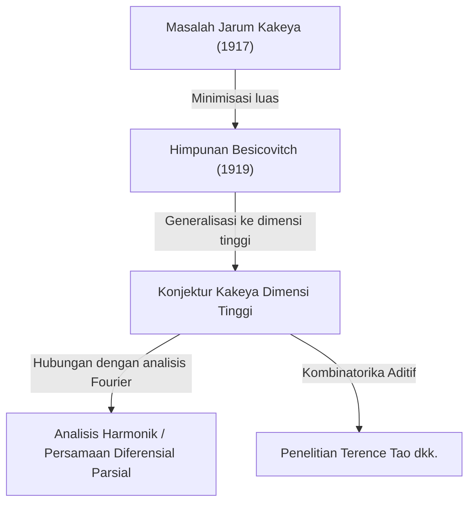

Di dunia matematika, terdapat beberapa topik yang berawal dari masalah yang sangat intuitif, namun solusi atau masalah turunannya mengarah pada bidang-bidang terdalam dalam matematika modern. "Teorema Terakhir Fermat" dan "Konjektur Poincaré" adalah contoh utamanya, tetapi **"Konjektur Kakeya (Kakeya Conjecture)"**, yang terletak di persimpangan geometri dan analisis, juga merupakan salah satu tema yang memikat.

Dalam artikel ini, kita akan menggali lebih dalam keseluruhan Konjektur Kakeya, dimulai dari "Masalah Jarum Kakeya" yang diajukan oleh matematikawan Jepang Soichi Kakeya pada tahun 1917, kemudian penemuan mengejutkan oleh matematikawan Rusia Besicovitch, hingga penelitian oleh matematikawan jenius modern Terence Tao dan lainnya.

---

## 1. Masalah Jarum Kakeya: Pertanyaan Intuitif

Pada tahun 1917, Soichi Kakeya, yang berada di Universitas Imperial Tohoku (sekarang Universitas Tohoku), mengajukan masalah visual yang sangat sederhana berikut:

> **Masalah Jarum Kakeya (Kakeya Needle Problem)**
> Bentuk apa yang memiliki luas paling kecil yang memungkinkan sebuah segmen garis (jarum) dengan panjang 1 diputar secara kontinu di bidang sejauh 360 derajat (satu putaran penuh)? Dan berapakah luas minimum tersebut?

Sebagai contoh, Anda dapat memutar jarum dengan panjang 1 di dalam sebuah lingkaran dengan jari-jari $1/2$ menggunakan pusatnya sebagai sumbu. Luas lingkaran ini adalah $\pi/4 \approx 0.785$.
Selain itu, di dalam segitiga sama sisi dengan panjang sisi $1/\sqrt{3}$ (tinggi 1), dengan sedikit modifikasi, jarum juga dapat diputar. Luasnya adalah $1/\sqrt{3} \approx 0.577$, yang lebih kecil dari lingkaran.

Lebih lanjut, Kakeya sendiri menunjukkan bahwa dengan menggunakan bentuk yang disebut deltoid (sejenis bentuk bintang), luasnya dapat dikurangi menjadi $\pi/8 \approx 0.392$. Banyak matematikawan yang menduga, "Mungkin ini adalah luas minimum."

Namun, keadaan berbalik ke arah yang tidak terduga.

---

## 2. Keajaiban Besicovitch: Himpunan Kakeya dengan Luas Nol

Hanya beberapa tahun setelah pengajuan Kakeya, pada tahun 1919 (diterbitkan pada tahun 1928), matematikawan Rusia Abram Besicovitch sedang membangun bentuk yang luar biasa dalam konteks yang sama sekali berbeda (penelitian integral Riemann).

Besicovitch membuktikan keberadaan sebuah himpunan dengan sifat-sifat berikut (kini dikenal sebagai **"Himpunan Besicovitch"** atau **"Himpunan Kakeya"**).

> **Terdapat himpunan pada bidang yang mengandung segmen garis dengan panjang 1 di setiap arah, namun ukuran Lebesgue-nya (luas) dapat dibuat sekecil apapun, atau memiliki ukuran 0.**

Dengan kata lain, ini adalah kesimpulan mengejutkan bahwa "Sebuah jarum dengan panjang 1 dapat diputar satu putaran penuh di dalam sebuah bentuk yang memiliki luas nol." Di balik fakta yang berlawanan dengan intuisi ini terdapat metode konstruksi fraktal geometris.

### Konstruksi dengan Pohon Perron (Perron Tree)
Metode perwakilan untuk mengkonstruksi himpunan misterius ini disebut "Pohon Perron".
1. Pertama, pertimbangkan sebuah segitiga dengan alas.
2. Bagilah segitiga tersebut menjadi bentuk-bentuk panjang dan tipis dari titik sudut ke alas.
3. Geser sedikit segitiga-segitiga panjang dan tipis yang terbagi tersebut sehingga saling tumpang tindih (namun tetap mempertahankan cakupan arah segmen garis).
4. Dengan mengulangi operasi "membagi dan menumpuk" ini tanpa henti, luas segitiga asli dapat dikompresi menjadi sekecil apa pun.

Sebagai batas dari operasi fraktal ini, himpunan yang dihasilkan dipenuhi dengan "segmen garis dengan panjang 1" yang tak terhitung jumlahnya, namun luas keseluruhannya (ukuran Lebesgue) adalah nol.

---

## 3. Lahirnya Konjektur Kakeya Dimensi Tinggi

Setelah dibuktikan bahwa "Himpunan Kakeya dengan luas nol ada" pada bidang (2 dimensi), perhatian para matematikawan secara alami beralih ke dimensi yang lebih tinggi (3 dimensi, 4 dimensi, dan bahkan $n$ dimensi).

Telah diketahui bahwa dalam ruang $n$-dimensi $\mathbb{R}^n$, juga dimungkinkan untuk mengkonstruksi himpunan yang memuat segmen garis satuan di semua arah (Himpunan Kakeya) yang volumenya (ukuran Lebesgue $n$-dimensi) adalah nol.

Namun, meskipun volumenya nol, "penyebaran sebagai sebuah bentuk" atau "kompleksitas" harus diukur dengan skala yang berbeda. Itulah konsep dimensi fraktal yang disebut **"Dimensi Hausdorff"** atau **"Dimensi Minkowski"**.

Himpunan Kakeya 2-dimensi memiliki luas nol, tetapi telah dibuktikan bahwa dimensi Hausdorff-nya tepat 2. Artinya, meskipun tidak memiliki luas, ia memiliki perluasan yang cukup untuk mengisi ruang 2-dimensi dalam hal kompleksitas bentuknya.

Dari sinilah, **"Konjektur Kakeya (Kakeya Conjecture)"** lahir, yang terkenal sebagai masalah yang belum terpecahkan dalam matematika modern.

> **Konjektur Kakeya Dimensi Tinggi**
> Dimensi Hausdorff dan dimensi Minkowski dari sembarang himpunan Kakeya (himpunan yang memuat segmen garis satuan di semua arah) dalam ruang $n$-dimensi $\mathbb{R}^n$ adalah tepat $n$.

Konjektur ini telah dibuktikan kebenarannya untuk dimensi $n=1, 2$, tetapi tetap tidak terpecahkan untuk $n \ge 3$ (ruang 3 dimensi atau lebih).

---

## 4. Dampak pada Matematika Modern: Mengapa Konjektur Kakeya Penting?

Mengapa masalah yang tampak murni dari geometri, seperti "dimensi bentuk yang memutar jarum", menarik begitu banyak perhatian di garis depan matematika modern?
Hal ini karena pada tahun 1970-an, Charles Fefferman menemukan hubungan mendalam antara Konjektur Kakeya dan **"Analisis Harmonik (Analisis Fourier)"**.

### Konjektur Bochner-Riesz dan Persamaan Gelombang
Fefferman menunjukkan bahwa masalah penting dalam analisis harmonik yang menyelidiki konvergensi transformasi Fourier, yaitu "Konjektur Bochner-Riesz (Bochner-Riesz conjecture)", sebenarnya secara langsung terhubung dengan sifat geometris himpunan Kakeya.
Jika dimensi himpunan Kakeya benar-benar lebih kecil dari $n$, fenomena energi yang terkonsentrasi pada satu titik karena superposisi gelombang tertentu tidak akan dapat dikendalikan, yang mengarah pada kontradiksi dengan teorema dasar analitik.

Selain itu, hal ini sangat berkaitan dengan "Konjektur penghalusan lokal persamaan gelombang (Local smoothing conjecture)" dalam bidang **Persamaan Diferensial Parsial (PDE)**. Masalah fisik tentang bagaimana gelombang menyebar dan di mana energi terkonsentrasi ketika gelombang suara atau cahaya merambat melalui ruang, diatur oleh geometri fraktal himpunan Kakeya.

---

## 5. Terence Tao dan Kombinatorika Aditif

Dalam beberapa tahun terakhir, matematikawan termasuk peraih Medali Fields Terence Tao telah membawa pendekatan revolusioner pada Konjektur Kakeya. Mereka menantang Konjektur Kakeya menggunakan alat dari bidang yang disebut **"Kombinatorika Aditif (Additive Combinatorics)"**.

"Konjektur Kakeya Lapangan Hingga" menggunakan ruang pada lapangan hingga $\mathbb{F}_q^n$ sepenuhnya diselesaikan oleh Zeev Dvir pada tahun 2008 dengan menggunakan metode polinomial yang sangat sederhana. Hal ini juga memberikan titik terang baru pada penyelesaian Konjektur Kakeya di ruang nyata.

Tao dan rekan-rekannya menganalisis secara kombinatorial bagaimana tak terhitung banyaknya segmen garis yang terkandung dalam himpunan Kakeya berpotongan satu sama lain (Intersection theory), mendorong batas bawah (Lower bounds) untuk dimensi tertentu dari tahun ke tahun. Meskipun pembuktian lengkap belum tercapai hingga saat ini, dengan menggabungkan metode dari berbagai bidang matematika, kebenaran sedikit demi sedikit semakin dekat.

---

## 6. Kesimpulan

"Masalah Jarum Kakeya" pada tahun 1917 dimulai sebagai teka-teki geometris yang dapat dipahami oleh siapa saja. Namun esensinya adalah matematika yang sangat dalam dan mengakar pada hukum fisika alam semesta, seperti penyebaran ruang, dimensi, dan rambatan gelombang.

Konjektur Kakeya, berawal dari "himpunan dengan luas nol" yang berlawanan dengan intuisi, telah menjadi jembatan luar biasa yang menghubungkan lautan besar matematika modern: analisis Fourier, persamaan diferensial parsial, dan kombinatorika aditif. Apakah hari di mana konjektur ini sepenuhnya terpecahkan untuk ruang 3 dimensi atau lebih akan tiba, tantangan para matematikawan terus berlanjut hingga hari ini.
