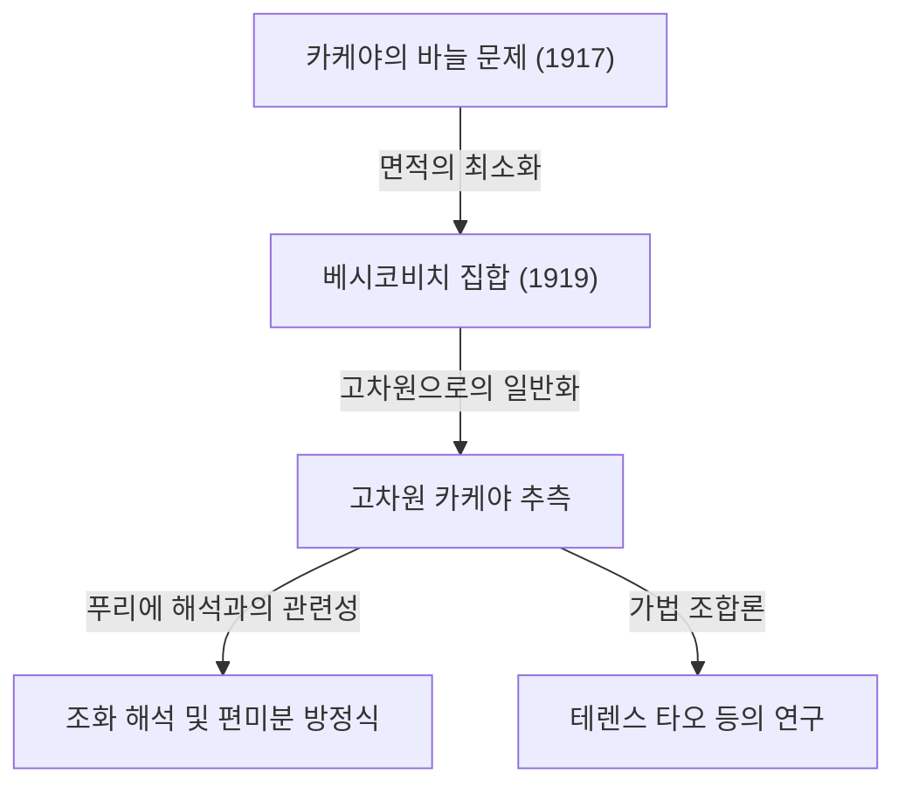

수학의 세계에는 직관적으로 매우 이해하기 쉬운 문제를 계기로 삼아, 그 해답이나 파생되는 문제가 현대 수학의 가장 심오한 영역으로 이어지는 주제들이 몇 가지 존재합니다. '[페르마의 마지막 정리](/ko/p/fermats-last-theorem/)'나 '[푸앵카레 추측](/ko/p/poincare-conjecture/)'이 그 대표적인 예이지만, 기하학과 해석학의 교차점에 위치한 **'카케야 추측(Kakeya Conjecture)'** 또한 그러한 매혹적인 주제 중 하나입니다.

본 기사에서는 1917년 일본의 수학자 카케야 소이치(掛谷宗一)가 제기한 '카케야의 바늘 문제'에서 시작하여, 러시아의 수학자 베시코비치의 놀라운 발견, 그리고 현대의 천재 수학자 테렌스 타오(Terence Tao) 등의 연구에 이르기까지 카케야 추측의 전모를 깊이 파헤쳐 해설합니다.

---

## 1. 카케야의 바늘 문제: 직관적인 질문

1917년, 도호쿠 제국대학(현재의 도호쿠 대학)에 있던 카케야 소이치는 다음과 같은 매우 단순하고 시각적인 문제를 제기했습니다.

> **카케야의 바늘 문제(Kakeya Needle Problem)**
> 길이 1인 선분(바늘)을 평면 위에서 연속적으로 움직여 360도(한 바퀴) 방향을 바꿀 수 있는 도형 중, 면적이 최소가 되는 것은 무엇인가? 또한, 그 최소 면적은 얼마인가?

예를 들어, 반지름이 $1/2$인 원 안에서 길이 1인 바늘을 중심을 축으로 회전시킬 수 있습니다. 이 원의 면적은 $\pi/4 \approx 0.785$입니다.
또한, 한 변의 길이가 $1/\sqrt{3}$인 정삼각형(높이가 1) 내부에서도 약간 연구하면 바늘을 회전시킬 수 있습니다. 이 면적은 $1/\sqrt{3} \approx 0.577$이 되어, 원보다 작아집니다.

더 나아가 카케야 자신은 델토이드(성망형의 일종)라는 도형을 사용하면 면적을 $\pi/8 \approx 0.392$까지 줄일 수 있음을 보여주었습니다. 많은 수학자들은 "아마 이것이 최소 면적일 것이다"라고 추측했습니다.

하지만 사태는 뜻밖의 방향으로 전개됩니다.

---

## 2. 베시코비치의 경이: 면적 0의 카케야 집합

카케야의 제기에서 불과 몇 년 후인 1919년(발표는 1928년), 러시아의 수학자 아브람 베시코비치(Abram Besicovitch)는 완전히 다른 맥락(리만 적분 연구)에서 믿을 수 없는 도형을 구축하고 있었습니다.

베시코비치는 다음과 같은 성질을 가진 집합(현재 **'베시코비치 집합'** 혹은 **'카케야 집합'**이라고 불립니다)이 존재함을 증명한 것입니다.

> **임의의 방향에 대해 길이 1인 선분을 포함함에도 불구하고, 그 르베그 측도(면적)를 얼마든지 작게 만들 수 있거나 측도가 0인 평면상의 집합이 존재한다.**

즉, "면적 0인 도형 안에서 길이 1인 바늘을 한 바퀴 회전시킬 수 있다"는 놀라운 결론입니다. 직관에 정면으로 반하는 이 사실의 배경에는 프랙탈 기하학적인 구성법이 있었습니다.

### 페론의 나무(Perron Tree)에 의한 구성
이 신기한 집합을 구성하기 위한 대표적인 기법이 '페론의 나무'라고 불리는 것입니다.
1. 먼저, 밑변을 가진 삼각형을 생각합니다.
2. 그 삼각형을 꼭짓점에서 밑변을 향해 길고 가늘게 분할합니다.
3. 분할된 가늘고 긴 삼각형들을 서로 겹치도록(하지만 선분 방향의 망라성은 유지한 채) 조금씩 슬라이드시킵니다.
4. 이 "분할하고 겹치는" 조작을 무한히 반복함으로써 원래 삼각형의 면적을 얼마든지 작게 압축할 수 있습니다.

이 프랙탈적인 조작의 극한으로 얻어지는 집합은 무수한 '길이 1의 선분'이 빽빽하게 들어차 있는데도 전체의 면적(르베그 측도)은 0이 되는 것입니다.

---

## 3. 고차원 카케야 추측의 탄생

평면(2차원)에서 "면적 0인 카케야 집합이 존재한다"는 것이 증명된 후, 수학자들의 관심은 자연스럽게 고차원(3차원, 4차원, 나아가 $n$차원)으로 향했습니다.

$n$차원 공간 $\mathbb{R}^n$에서도 모든 방향의 단위 선분을 포함하는 집합(카케야 집합)에서 부피($n$차원 르베그 측도)가 0이 되는 것을 구성할 수 있음이 알려져 있습니다.

그러나 부피가 0이라 하더라도, "도형으로서의 확장"이나 "복잡성"은 다른 척도로 측정해야 합니다. 그것이 **'하우스도르프 차원'**이나 **'민코프스키 차원'**이라 불리는 프랙탈 차원의 개념입니다.

2차원의 카케야 집합은 면적이 0이지만, 하우스도르프 차원은 정확히 2라는 것이 증명되어 있습니다. 즉, 면적을 갖지 않더라도 도형의 복잡성으로서는 2차원 공간을 가득 메울 정도의 확장을 가지고 있다는 것입니다.

여기서 현대 수학의 미해결 문제로 유명한 **'카케야 추측(掛谷予想)'**이 탄생합니다.

> **고차원 카케야 추측**
> $n$차원 공간 $\mathbb{R}^n$에서의 임의의 카케야 집합(모든 방향의 단위 선분을 포함하는 집합)의 하우스도르프 차원 및 민코프스키 차원은 정확히 $n$이다.

이 추측은 차원 $n=1, 2$인 경우에는 옳다는 것이 증명되어 있지만, $n \ge 3$ (3차원 이상의 공간)에서는 여전히 미해결 상태입니다.

---

## 4. 현대 수학으로의 파급: 왜 카케야 추측이 중요한가?

"바늘을 돌리는 도형의 차원"이라는 얼핏 보기에 순수한 기하학 문제가, 왜 현대 수학의 최전선에서 이토록 주목받고 있는 것일까요?
그것은 1970년대에 찰스 페퍼먼(Charles Fefferman)이 카케야 추측과 **'조화 해석(푸리에 해석)'** 사이에 깊은 연관성이 있음을 발견했기 때문입니다.

### 보흐너-리스 추측과 파동 방정식
페퍼먼은 푸리에 변환의 수렴성을 조사하는 '보흐너-리스 추측(Bochner-Riesz conjecture)'이라는 조화 해석의 중요 문제가, 사실 카케야 집합의 기하학적 성질과 직결되어 있음을 보여주었습니다.
만약 카케야 집합의 차원이 $n$보다 진정으로 작다고 한다면, 특정 파동의 중첩에 의해 에너지가 한곳으로 집중되어 버리는 현상을 억제할 수 없게 되어, 해석학의 근본적인 정리에 모순이 생겨버리는 것입니다.

더 나아가 이는 **편미분 방정식(PDE)** 분야의 '파동 방정식의 국소 평활화 추측(Local smoothing conjecture)'과도 깊게 연결되어 있습니다. 소리나 빛의 파동이 공간을 전파할 때 파동이 어떻게 확산되고 어디에 에너지가 집중되는가 하는 물리적인 문제가, 카케야 집합의 프랙탈 기하학에 의해 지배되고 있는 것입니다.

---

## 5. 테렌스 타오와 가법 조합론

최근 이 카케야 추측에 대해 획기적인 접근을 가져온 것이 필즈상 수상자인 테렌스 타오(Terence Tao)를 비롯한 수학자들입니다. 그들은 **'가법 조합론(Additive Combinatorics)'**이라 불리는 분야의 도구를 사용하여 카케야 추측에 도전했습니다.

유한체 상의 공간 $\mathbb{F}_q^n$을 이용한 '유한체 카케야 추측'은 지브 지브(Zeev Dvir)에 의해 2008년에 다항식법이라는 놀랍도록 단순한 방법으로 완전히 해명되었습니다. 이로 인해 실수 공간에서의 카케야 추측 해결에도 새로운 빛이 비춰지고 있습니다.

타오 등은 카케야 집합에 포함된 무수한 선분들이 서로 어떻게 교차하는지(Intersection theory)를 조합론적으로 해석하여, 특정 차원에 대한 하한(Lower bounds)을 매년 밀어 올리고 있습니다. 현재까지도 완전한 증명에는 이르지 못했지만, 수학의 다양한 분야의 기법들을 융합시킴으로써 조금씩 진리에 다가가고 있습니다.

---

## 6. 요약

1917년 '카케야의 바늘 문제'는 누구나 이해할 수 있는 도형 퍼즐 같은 질문에서 시작되었습니다. 하지만 그 본질은 공간의 확장과 차원, 그리고 파동의 전파라는 우주의 물리 법칙에까지 뿌리를 내리고 있는 무섭도록 심오한 수학이었습니다.

카케야 추측은 직관에 반하는 '면적 0인 집합'에서 시작하여 푸리에 해석, 편미분 방정식, 그리고 가법 조합론이라는 현대 수학의 대양을 연결하는 장대한 가교가 되고 있습니다. 3차원 이상의 공간에서 이 추측이 완전히 해명되는 날이 올지, 수학자들의 도전은 오늘도 계속되고 있습니다.
