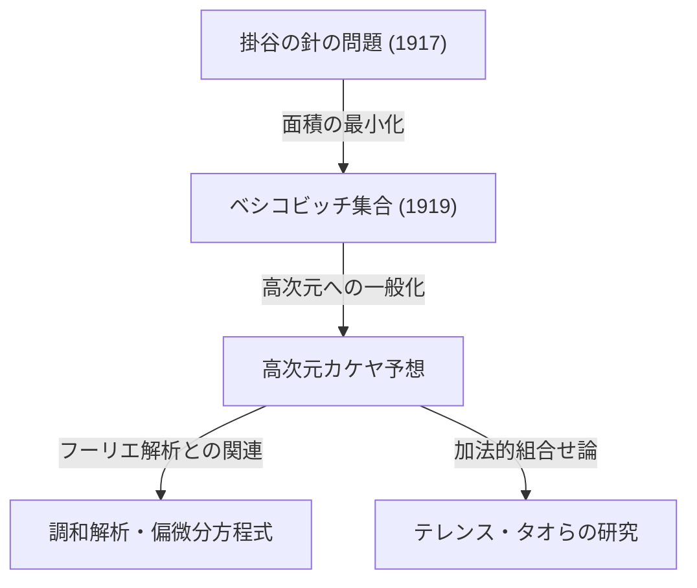

数学の世界には、直感的に非常にわかりやすい問題をきっかけとしながら、その解答や派生する問題が現代数学の最も深遠な領域へと繋がっていくようなトピックがいくつか存在します。「[フェルマーの最終定理](/p/fermats-last-theorem/)」や「[ポアンカレ予想](/p/poincare-conjecture/)」がその代表例ですが、幾何学と解析学の交差点に位置する**「カケヤ予想（Kakeya Conjecture）」**もまた、そうした魅惑的なテーマの1つです。

本記事では、1917年に日本の数学者・掛谷宗一（かけや そういち）が提起した「掛谷の針の問題」から始まり、ロシアの数学者ベシコビッチによる驚くべき発見、そして現代の天才数学者テレンス・タオ（Terence Tao）らの研究に至るまで、カケヤ予想の全貌を深く掘り下げて解説します。

---

## 1. 掛谷の針の問題：直感的な問いかけ

1917年、東北帝国大学（現在の東北大学）にいた掛谷宗一は、次のような非常にシンプルで視覚的な問題を提起しました。

> **掛谷の針の問題（Kakeya Needle Problem）**
> 長さ1の線分（針）を、平面上で連続的に動かして、360度（一回転）向きを変えることができるような図形のうち、面積が最小となるものは何か？ また、その最小面積はいくらか？

たとえば、半径 $1/2$ の円の中で長さ1の針を中心を軸にして回転させることができます。この円の面積は $\pi/4 \approx 0.785$ です。
また、一辺が $1/\sqrt{3}$ の正三角形（高さが1）の内部でも、少し工夫すれば針を回転させることができます。この面積は $1/\sqrt{3} \approx 0.577$ となり、円よりも小さくなります。

さらに掛谷自身は、デルトイド（星芒形の一種）という図形を使えば、面積を $\pi/8 \approx 0.392$ にまで減らせることを示しました。多くの数学者は「おそらくこれが最小面積だろう」と予想しました。

しかし、事態は思わぬ方向へ転がります。

---

## 2. ベシコビッチの驚異：面積ゼロの掛谷集合

掛谷の提起からわずか数年後の1919年（発表は1928年）、ロシアの数学者アブラム・ベシコビッチ（Abram Besicovitch）は、全く異なる文脈（リーマン積分の研究）で信じられない図形を構築していました。

ベシコビッチは、次のような性質を持つ集合（現在**「ベシコビッチ集合」**あるいは**「掛谷集合」**と呼ばれます）が存在することを証明したのです。

> **任意の方向について長さ1の線分を含むにもかかわらず、そのルベーグ測度（面積）がいくらでも小さくできる、あるいは測度0であるような平面上の集合が存在する。**

つまり、「面積ゼロの図形の中で、長さ1の針を一回転させることができる」という驚くべき結論です。直感に真っ向から反するこの事実の背景には、フラクタル幾何学的な構成法がありました。

### ペロンの木（Perron Tree）による構成
この不思議な集合を構成するための代表的な手法が「ペロンの木」と呼ばれるものです。
1. まず、底辺を持つ三角形を考えます。
2. その三角形を頂点から底辺に向かって細長く分割します。
3. 分割された細長い三角形たちを、互いに重なるように（しかし線分の方向の網羅性は保ったまま）少しずつスライドさせます。
4. この「分割して重ねる」操作を無限に繰り返すことで、元の三角形の面積をいくらでも小さく圧縮することができます。

このフラクタル的な操作の極限として得られる集合は、無数の「長さ1の線分」がぎっしり詰まっているのに、全体の面積（ルベーグ測度）はゼロになるのです。

---

## 3. 高次元カケヤ予想の誕生

平面（2次元）において「面積ゼロの掛谷集合が存在する」ことが証明された後、数学者たちの関心は自然と高次元（3次元、4次元、さらには $n$次元）へと向かいました。

$n$次元空間 $\mathbb{R}^n$ においても、すべての方向の単位線分を含む集合（掛谷集合）で、体積（ $n$次元ルベーグ測度）がゼロになるものを構成できることが知られています。

しかし、体積がゼロだとしても、「図形としての広がり」や「複雑さ」は別の尺度で測る必要があります。それが**「ハウスドルフ次元」**や**「ミンコフスキー次元」**と呼ばれるフラクタル次元の概念です。

2次元の掛谷集合は面積ゼロですが、ハウスドルフ次元はちょうど2であることが証明されています。つまり、面積を持たなくても、図形の複雑さとしては2次元空間を埋め尽くすほどの広がりを持っているということです。

ここから、現代数学の未解決問題として有名な**「カケヤ予想（掛谷予想）」**が誕生します。

> **高次元カケヤ予想**
> $n$次元空間 $\mathbb{R}^n$ における任意の掛谷集合（すべての方向の単位線分を含む集合）のハウスドルフ次元およびミンコフスキー次元は、ちょうど $n$ である。

この予想は、次元 $n=1, 2$ の場合は正しいことが証明されていますが、$n \ge 3$ （3次元以上の空間）においては未解決のままです。

---

## 4. 現代数学への波及：なぜカケヤ予想が重要なのか？

「針を回す図形の次元」という一見すると純粋な幾何学の問題が、なぜ現代数学の最前線でこれほどまでに注目を集めているのでしょうか？
それは、1970年代にチャールズ・フェファーマン（Charles Fefferman）が、カケヤ予想と**「調和解析（フーリエ解析）」**の間に深いつながりがあることを発見したからです。

### ボホナー・リース予想と波動方程式
フェファーマンは、フーリエ変換の収束性を調べる「ボホナー・リース予想（Bochner-Riesz conjecture）」という調和解析の重要問題が、実は掛谷集合の幾何学的性質と直結していることを示しました。
もし掛谷集合の次元が $n$ よりも真に小さいとすると、特定の波の重ね合わせによってエネルギーが一極集中してしまう現象を抑えきれなくなり、解析学の根本的な定理に矛盾が生じてしまうのです。

さらに、これは**偏微分方程式（PDE）**の分野における「波動方程式の局所平滑化予想（Local smoothing conjecture）」とも深くリンクしています。音や光の波が空間を伝播する際、波がどのように拡散し、どこにエネルギーが集中するかという物理的な問題が、掛谷集合のフラクタル幾何学によって支配されているのです。

---

## 5. テレンス・タオと加法的組合せ論

近年、このカケヤ予想に対して画期的なアプローチをもたらしたのが、フィールズ賞受賞者のテレンス・タオ（Terence Tao）をはじめとする数学者たちです。彼らは**「加法的組合せ論（Additive Combinatorics）」**と呼ばれる分野のツールを用いてカケヤ予想に挑みました。

有限体上の空間 $\mathbb{F}_q^n$ を用いた「有限体カケヤ予想」は、ジブ・ゼエヴィ（Zeev Dvir）によって2008年に多項式法という驚異的にシンプルな方法で完全に解明されました。これにより、実数空間におけるカケヤ予想の解決にも新たな光が当てられています。

タオたちは、掛谷集合に含まれる無数の線分が互いにどのように交差するか（Intersection theory）を組み合わせ論的に解析し、特定の次元に対する下界（Lower bounds）を年々押し上げています。現在でも完全な証明には至っていませんが、数学の様々な分野の手法を融合させることで、少しずつ真理へと近づいています。

---

## 6. まとめ

1917年の「掛谷の針の問題」は、誰にでも理解できる図形パズルのような問いから始まりました。しかしその本質は、空間の広がりと次元、そして波の伝播という宇宙の物理法則にまで根を下ろす、恐ろしく深遠な数学でした。

カケヤ予想は、直感に反する「面積ゼロの集合」から始まり、フーリエ解析、偏微分方程式、そして加法的組合せ論という現代数学の大海原を繋ぐ壮大な架け橋となっています。3次元以上の空間でこの予想が完全に解明される日は来るのか、数学者たちの挑戦は今日も続いています。
