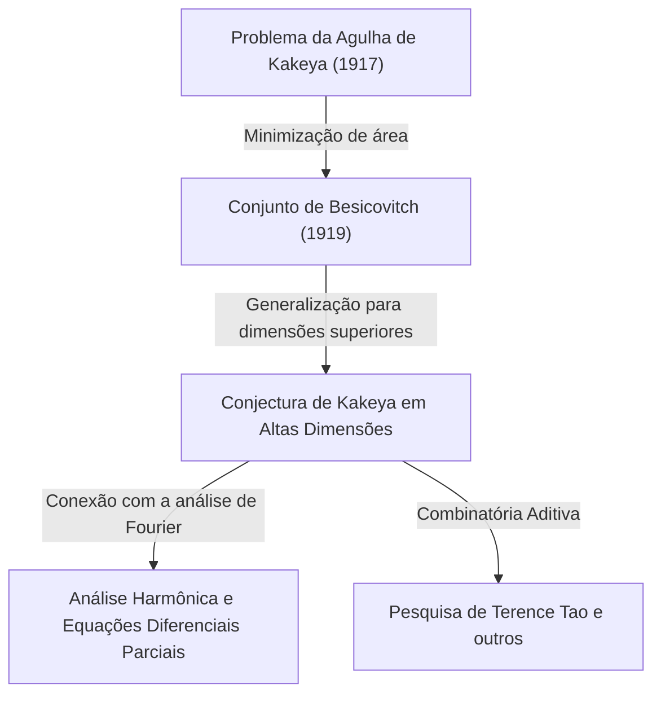

No mundo da matemática, existem alguns tópicos que começam com problemas que são intuitivamente muito fáceis de entender, mas cujas soluções e problemas derivados se conectam aos reinos mais profundos da matemática moderna. O "Último Teorema de Fermat" e a "Conjectura de Poincaré" são exemplos típicos, mas a **"Conjectura de Kakeya (Kakeya Conjecture)"**, localizada no cruzamento da geometria com a análise, também é um desses temas fascinantes.

Neste artigo, exploraremos a fundo a Conjectura de Kakeya, começando com o "Problema da Agulha de Kakeya" proposto pelo matemático japonês Soichi Kakeya em 1917, passando pela surpreendente descoberta do matemático russo Besicovitch, até chegar aos estudos de gênios matemáticos modernos como Terence Tao.

---

## 1. O Problema da Agulha de Kakeya: Uma questão intuitiva

Em 1917, Soichi Kakeya, da Universidade Imperial de Tohoku (atualmente Universidade de Tohoku), propôs o seguinte problema altamente visual e simples:

> **O Problema da Agulha de Kakeya (Kakeya Needle Problem)**
> Qual é a figura de menor área dentro da qual um segmento de reta (agulha) de comprimento 1 pode ser movido continuamente de forma a girar 360 graus (uma volta completa)? E qual é essa área mínima?

Por exemplo, você pode girar uma agulha de comprimento 1 em torno do seu centro dentro de um círculo de raio $1/2$. A área desse círculo é $\pi/4 \approx 0.785$.
Além disso, com um pouco de engenhosidade, a agulha pode ser girada dentro de um triângulo equilátero de lado $1/\sqrt{3}$ (altura 1). Essa área é $1/\sqrt{3} \approx 0.577$, o que é menor que a do círculo.

O próprio Kakeya mostrou que usando uma figura chamada deltoide (um tipo de formato de estrela), a área pode ser reduzida para $\pi/8 \approx 0.392$. Muitos matemáticos previram: "Esta é provavelmente a área mínima."

No entanto, as coisas tomaram um rumo inesperado.

---

## 2. A Surpresa de Besicovitch: Conjuntos de Kakeya de Área Zero

Apenas alguns anos após a proposta de Kakeya, em 1919 (publicado em 1928), o matemático russo Abram Besicovitch construiu uma figura inacreditável em um contexto completamente diferente (o estudo da integral de Riemann).

Besicovitch provou a existência de conjuntos (agora chamados de **"Conjuntos de Besicovitch"** ou **"Conjuntos de Kakeya"**) que possuem as seguintes propriedades.

> **Existe um conjunto no plano que, apesar de conter um segmento de reta de comprimento 1 em todas as direções possíveis, tem uma medida de Lebesgue (área) que pode ser arbitrariamente pequena, ou mesmo uma medida de 0.**

Em outras palavras, é a surpreendente conclusão de que "você pode girar uma agulha de comprimento 1 dentro de uma figura de área zero". Por trás desse fato contra-intuitivo, estava um método de construção da geometria fractal.

### Construção pela Árvore de Perron (Perron Tree)
O método representativo para construir esse conjunto misterioso é chamado de "Árvore de Perron".
1. Primeiro, considere um triângulo com uma base.
2. Divida o triângulo em triângulos longos e estreitos, do vértice até a base.
3. Deslize os triângulos divididos gradualmente para que eles se sobreponham uns aos outros (mas mantendo a cobertura das direções dos segmentos de reta).
4. Ao repetir essa operação de "dividir e sobrepor" infinitamente, a área do triângulo original pode ser comprimida para o quão pequena você quiser.

O conjunto obtido como o limite dessa operação fractal está repleto de incontáveis "segmentos de reta de comprimento 1", mas sua área total (medida de Lebesgue) é zero.

---

## 3. O Nascimento da Conjectura de Kakeya em Altas Dimensões

Depois que foi provado que "existem conjuntos de Kakeya de área zero" no plano (2 dimensões), o interesse dos matemáticos naturalmente se voltou para dimensões superiores (3, 4 e até $n$ dimensões).

Sabe-se que no espaço $n$-dimensional $\mathbb{R}^n$, é possível construir um conjunto contendo segmentos de reta unitários em todas as direções (um conjunto de Kakeya) cujo volume (medida de Lebesgue $n$-dimensional) é zero.

No entanto, mesmo que o volume seja zero, a "extensão como uma figura" ou "complexidade" deve ser medida por outra escala. É aqui que entram os conceitos de dimensão fractal chamados **"Dimensão de Hausdorff"** e **"Dimensão de Minkowski"**.

Um conjunto de Kakeya bidimensional tem área zero, mas está provado que sua dimensão de Hausdorff é exatamente 2. Em outras palavras, mesmo que não tenha área, tem uma extensão espacial que preenche o espaço bidimensional em termos de complexidade da figura.

A partir daqui nasce a **"Conjectura de Kakeya (Kakeya Conjecture)"**, famosa como um problema não resolvido na matemática moderna.

> **Conjectura de Kakeya em Altas Dimensões**
> A dimensão de Hausdorff e a dimensão de Minkowski de qualquer conjunto de Kakeya (um conjunto que contém um segmento de reta unitário em todas as direções) no espaço $n$-dimensional $\mathbb{R}^n$ são exatamente $n$.

Foi provado que essa conjectura é verdadeira para as dimensões $n=1, 2$, mas continua sem solução para $n \ge 3$ (espaços de 3 ou mais dimensões).

---

## 4. Repercussões na Matemática Moderna: Por que a Conjectura de Kakeya é importante?

Por que um problema de geometria aparentemente puro como "a dimensão de uma figura girando uma agulha" atrai tanta atenção na vanguarda da matemática moderna?
Isso ocorre porque, na década de 1970, Charles Fefferman descobriu uma profunda conexão entre a Conjectura de Kakeya e a **"Análise Harmônica (Análise de Fourier)"**.

### Conjectura de Bochner-Riesz e a Equação da Onda
Fefferman mostrou que a "Conjectura de Bochner-Riesz", um problema importante na análise harmônica que investiga a convergência das transformadas de Fourier, está na verdade diretamente ligada às propriedades geométricas dos conjuntos de Kakeya.
Se a dimensão do conjunto de Kakeya fosse estritamente menor que $n$, seria impossível suprimir o fenômeno onde a energia se concentra em um ponto pela superposição de certas ondas, criando contradições em teoremas fundamentais da análise.

Além disso, isso está profundamente ligado à "Conjectura de suavização local (Local smoothing conjecture)" no campo das **Equações Diferenciais Parciais (EDP)**. Como as ondas de som e luz se propagam pelo espaço, onde se difundem e onde a energia se concentra são problemas físicos que são governados pela geometria fractal dos conjuntos de Kakeya.

---

## 5. Terence Tao e a Combinatória Aditiva

Nos últimos anos, uma abordagem inovadora para essa conjectura de Kakeya foi trazida por matemáticos como o vencedor da Medalha Fields, Terence Tao. Eles enfrentaram a Conjectura de Kakeya usando ferramentas de um campo chamado **"Combinatória Aditiva (Additive Combinatorics)"**.

A "Conjectura de Kakeya de Corpos Finitos" usando o espaço $\mathbb{F}_q^n$ sobre um corpo finito foi completamente resolvida em 2008 por Zeev Dvir com um método surpreendentemente simples chamado método polinomial. Isso também lançou nova luz sobre a resolução da Conjectura de Kakeya no espaço real.

Tao e outros analisaram combinatoriamente como os incontáveis segmentos de reta contidos nos conjuntos de Kakeya se cruzam entre si (Intersection theory), elevando o limite inferior (Lower bounds) de dimensões específicas ano após ano. Embora ainda não se tenha chegado a uma prova completa, eles estão se aproximando lentamente da verdade, fundindo métodos de vários campos da matemática.

---

## 6. Conclusão

O "Problema da Agulha de Kakeya" de 1917 começou como um quebra-cabeça geométrico que qualquer um poderia entender. No entanto, sua essência era uma matemática assustadoramente profunda, enraizada nas leis físicas do universo: a extensão do espaço, a dimensão e a propagação de ondas.

A Conjectura de Kakeya, partindo do conceito contra-intuitivo de "conjuntos de área zero", tornou-se uma magnífica ponte que conecta os vastos oceanos da matemática moderna: análise de Fourier, equações diferenciais parciais e combinatória aditiva. Chegará o dia em que essa conjectura será totalmente resolvida em espaços de 3 dimensões e superiores? O desafio dos matemáticos continua até hoje.
