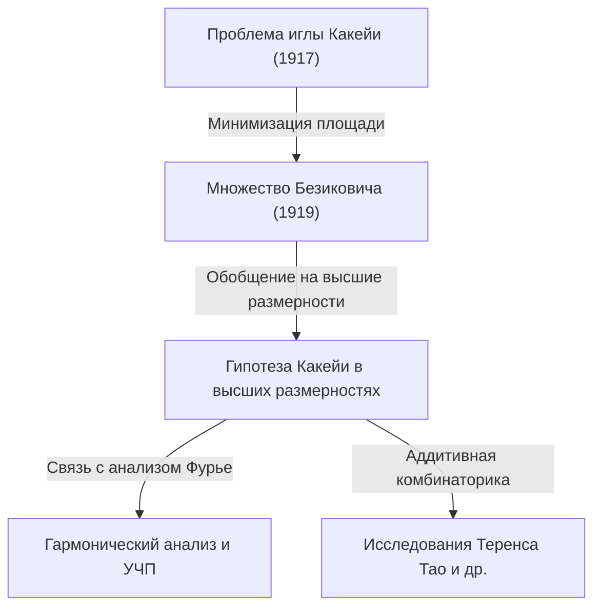

В мире математики есть темы, которые начинаются с интуитивно понятных проблем, но чьи решения и производные задачи ведут в самые глубокие области современной математики. «Великая теорема Ферма» и «Гипотеза Пуанкаре» являются типичными примерами, но **«Гипотеза Какейи (Kakeya Conjecture)»**, находящаяся на стыке геометрии и математического анализа, также является одной из таких увлекательных тем.

В этой статье мы подробно рассмотрим гипотезу Какейи, начиная с «Проблемы иглы Какейи», предложенной японским математиком Соити Какейя (Soichi Kakeya) в 1917 году, через удивительное открытие российского математика Абрама Безиковича, вплоть до исследований современных гениальных математиков, таких как Теренс Тао (Terence Tao).

---

## 1. Проблема иглы Какейи: интуитивный вопрос

В 1917 году Соити Какейя из Императорского университета Тохоку (ныне Университет Тохоку) задал следующий очень простой и наглядный вопрос.

> **Проблема иглы Какейи (Kakeya Needle Problem)**
> Какую минимальную площадь должна иметь фигура, внутри которой отрезок (игла) длины 1 можно непрерывно перемещать, разворачивая его на 360 градусов? И чему равна эта минимальная площадь?

Например, иглу длины 1 можно вращать вокруг ее центра внутри круга радиусом $1/2$. Площадь этого круга равна $\pi/4 \approx 0.785$.
Также, приложив немного усилий, иглу можно вращать внутри правильного треугольника со стороной $1/\sqrt{3}$ (и высотой 1). Его площадь составляет $1/\sqrt{3} \approx 0.577$, что меньше, чем у круга.

Кроме того, сам Какейя показал, что используя фигуру под названием дельтоида (вид астроиды), можно уменьшить площадь до $\pi/8 \approx 0.392$. Многие математики предполагали: «Вероятно, это и есть минимальная площадь».

Однако всё обернулось совершенно неожиданным образом.

---

## 2. Чудо Безиковича: множество Какейи нулевой площади

Всего через несколько лет после постановки задачи Какейя, в 1919 году (опубликовано в 1928), российский математик Абрам Безикович (Abram Besicovitch), работая в совершенно другом контексте (исследование интеграла Римана), построил невероятную фигуру.

Безикович доказал существование множества (ныне называемого **«множеством Безиковича»** или **«множеством Какейи»**) со следующими свойствами:

> **На плоскости существует множество, которое содержит отрезок длины 1 в любом направлении, но при этом его мера Лебега (площадь) может быть сделана сколь угодно малой, или даже равной 0.**

Иными словами, потрясающий вывод гласил: «Иглу длины 1 можно развернуть на 360 градусов внутри фигуры с нулевой площадью». За этим противоречащим интуиции фактом скрывался метод построения из фрактальной геометрии.

### Построение с помощью дерева Перрона (Perron Tree)
Типичный метод построения этого удивительного множества называется «Дерево Перрона».
1. Сначала возьмем треугольник с основанием.
2. Разделим его от вершины к основанию на тонкие треугольники.
3. Сдвинем эти тонкие треугольники так, чтобы они сильно перекрывались друг с другом (сохраняя при этом полноту направлений отрезков).
4. Бесконечно повторяя эту операцию «разделения и наложения», можно сжать площадь исходного треугольника до сколь угодно малой величины.

Множество, полученное как предел этой фрактальной операции, плотно заполнено бесконечным числом «отрезков длины 1», но его общая площадь (мера Лебега) равна нулю.

---

## 3. Рождение гипотезы Какейи в высших размерностях

После того как было доказано, что на плоскости (в двумерном пространстве) «существует множество Какейи нулевой площади», интерес математиков естественно обратился к более высоким размерностям (3D, 4D и вплоть до $n$-мерных пространств).

Известно, что и в $n$-мерном пространстве $\mathbb{R}^n$ можно построить множество, содержащее единичные отрезки во всех направлениях (множество Какейи), объем которого ( $n$-мерная мера Лебега) равен нулю.

Однако даже если объем равен нулю, «размер фигуры» или ее «сложность» нужно измерять другими способами. Здесь возникают понятия фрактальной размерности, такие как **«размерность Хаусдорфа»** и **«размерность Минковского»**.

Доказано, что двумерное множество Какейи имеет площадь ноль, но его размерность Хаусдорфа в точности равна 2. Это означает, что хотя оно и не имеет площади, его структурная сложность достаточна, чтобы заполнять двумерное пространство.

Отсюда берет начало знаменитая нерешенная проблема современной математики — **«Гипотеза Какейи»**.

> **Гипотеза Какейи в высших размерностях**
> Размерность Хаусдорфа и размерность Минковского любого множества Какейи (множества, содержащего единичный отрезок в любом направлении) в $n$-мерном пространстве $\mathbb{R}^n$ в точности равны $n$.

Эта гипотеза доказана для размерностей $n=1, 2$, но остается нерешенной для $n \ge 3$ (в пространствах размерности 3 и выше).

---

## 4. Влияние на современную математику: почему гипотеза Какейи так важна?

Почему проблема, кажущаяся чисто геометрической задачей о «размерности фигуры для вращения иглы», привлекает такое огромное внимание на переднем крае современной математики?
Причина кроется в том, что в 1970-х годах Чарльз Фефферман (Charles Fefferman) обнаружил глубокую связь между гипотезой Какейи и **«гармоническим анализом (анализом Фурье)»**.

### Гипотеза Бохнера-Риса и волновое уравнение
Фефферман показал, что важная проблема гармонического анализа о сходимости преобразования Фурье, называемая «Гипотезой Бохнера-Риса (Bochner-Riesz conjecture)», напрямую связана с геометрическими свойствами множеств Какейи.
Если бы размерность множества Какейи была строго меньше $n$, то концентрация энергии за счет суперпозиции определенных волн стала бы неконтролируемой, что привело бы к противоречию в фундаментальных теоремах математического анализа.

Кроме того, это глубоко связано с «гипотезой локального сглаживания волнового уравнения (Local smoothing conjecture)» в области **уравнений в частных производных (УЧП)**. Физический вопрос о том, как рассеиваются волны (звука или света) при распространении в пространстве и где концентрируется их энергия, управляется фрактальной геометрией множеств Какейи.

---

## 5. Теренс Тао и аддитивная комбинаторика

В последние годы революционный подход к гипотезе Какейи был предложен лауреатом Филдсовской премии Теренсом Тао (Terence Tao) и другими математиками. Они попытались решить гипотезу Какейи, используя инструменты из области, называемой **«аддитивная комбинаторика (Additive Combinatorics)»**.

«Гипотеза Какейи над конечными полями», рассматривающая пространство $\mathbb{F}_q^n$ над конечным полем, была полностью разрешена Зивом Двиром (Zeev Dvir) в 2008 году удивительно простым полиномиальным методом. Это пролило новый свет и на решение гипотезы Какейи в вещественном пространстве.

Тао и его коллеги комбинаторно анализируют то, как бесконечное число отрезков во множестве Какейи пересекаются друг с другом (теория пересечений - Intersection theory), с каждым годом улучшая нижние оценки (Lower bounds) для конкретных размерностей. Хотя полного доказательства все еще нет, объединение методов из разных областей математики позволяет шаг за шагом приближаться к истине.

---

## 6. Заключение

«Проблема иглы Какейи» 1917 года началась с вопроса, похожего на геометрическую головоломку, понятную каждому. Но ее суть оказалась потрясающе глубокой математикой, которая уходит корнями в понимание протяженности пространства, размерности и физических законов Вселенной, таких как распространение волн.

Гипотеза Какейи — это грандиозный мост, начинающийся с противоречащего интуиции «множества нулевой площади» и соединяющий огромные океаны современной математики: анализ Фурье, уравнения в частных производных и аддитивную комбинаторику. Настанет ли день, когда эта гипотеза будет полностью разрешена для пространств размерности 3 и выше? Брошенный математиками вызов продолжается и сегодня.
