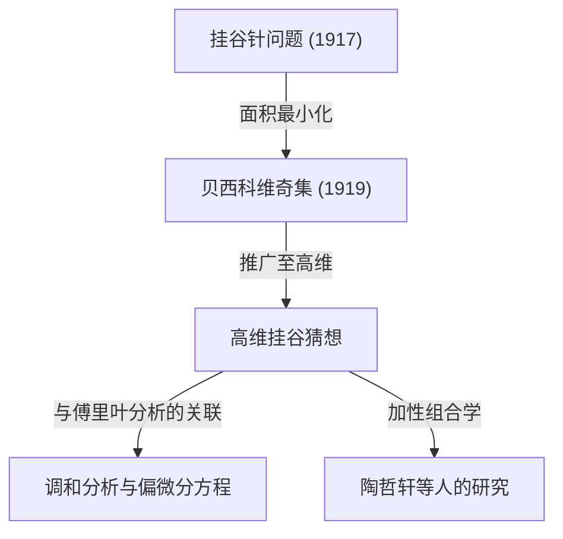

在数学世界中，有这样一些话题，它们以直观易懂的问题为契机，但其解答及衍生出的问题却能连接到现代数学最深奥的领域。“[费马大定理](/zh-cn/p/fermats-last-theorem/)”和“[庞加莱猜想](/zh-cn/p/poincare-conjecture/)”就是其中的典型代表，而位于几何学与分析学交汇处的<strong>“挂谷猜想（Kakeya Conjecture）”</strong>，也是这样一个充满魅力的主题。

本文将从1917年日本数学家挂谷宗一（Soichi Kakeya）提出的“挂谷针问题”开始，深入探讨俄罗斯数学家贝西科维奇（Besicovitch）的惊人发现，直至当代天才数学家陶哲轩（Terence Tao）等人的研究，为您全面解析挂谷猜想的全貌。

---

## 1. 挂谷针问题：直观的提问

1917年，任教于东北帝国大学（现东北大学）的挂谷宗一，提出了下面这个非常简单且直观的问题。

> **挂谷针问题（Kakeya Needle Problem）**
> 在平面上连续移动一条长度为1的线段（针），使其方向旋转360度（一整圈），在所有能够实现这一操作的图形中，面积最小的是什么图形？这个最小面积又是多少？

例如，我们可以在半径为 $1/2$ 的圆内，以圆心为轴旋转这根长度为1的针。这个圆的面积是 $\pi/4 \approx 0.785$。
此外，在边长为 $1/\sqrt{3}$ 的正三角形（高为1）内部，只要稍作设计，也能让针旋转一圈。这个图形的面积为 $1/\sqrt{3} \approx 0.577$，比圆还要小。

甚至挂谷本人还证明了，如果使用一种叫作三尖瓣线（Deltoid，星形线的一种）的图形，就可以将面积缩小到 $\pi/8 \approx 0.392$。许多数学家曾猜测“这可能就是最小面积了”。

然而，事情却朝着意想不到的方向发展。

---

## 2. 贝西科维奇的奇迹：面积为零的挂谷集

就在挂谷提出该问题短短几年后的1919年（发表于1928年），俄罗斯数学家阿布拉姆·贝西科维奇（Abram Besicovitch）在完全不同的背景下（黎曼积分的研究中），构造出了一个令人难以置信的图形。

贝西科维奇证明了存在具有以下性质的集合（现在被称为**“贝西科维奇集”**或**“挂谷集”**）：

> **存在这样一个平面集合，它包含了所有方向上的长度为1的线段，但其勒贝格测度（面积）却可以任意小，甚至是测度为0。**

也就是说，“在一个面积为零的图形中，可以让长度为1的针旋转一整圈”——这是一个惊人的结论。在这个完全违背直觉的事实背后，隐藏着分形几何学的构造方法。

### 利用佩龙树（Perron Tree）的构造
构造这个神奇集合的一种代表性方法就是所谓的“佩龙树”。
1. 首先，考虑一个有底边的三角形。
2. 将该三角形从顶点到底边分割成许多细长的三角形。
3. 将这些细长的三角形相互重叠地（但保持线段方向的完备性）稍微滑动。
4. 通过无限次重复这种“分割并重叠”的操作，可以将原三角形的面积无限度地压缩变小。

作为这种分形操作的极限而得到的集合，虽然密密麻麻地塞满了无数“长度为1的线段”，但其整体面积（勒贝格测度）却是零。

---

## 3. 高维挂谷猜想的诞生

在证明了平面（二维）中“存在面积为零的挂谷集”之后，数学家们的兴趣自然而然地转向了高维（三维、四维甚至 $n$ 维）空间。

已知在 $n$ 维空间 $\mathbb{R}^n$ 中，也可以构造出包含所有方向单位线段的集合（挂谷集），且其体积（ $n$ 维勒贝格测度）为零。

但是，即使体积为零，“图形的广度”或“复杂程度”仍需要用另一种尺度来衡量。这就是被称为**“豪斯多夫维数（Hausdorff dimension）”**或**“闵可夫斯基维数（Minkowski dimension）”**的分形维数概念。

虽然二维的挂谷集面积为零，但已证明其豪斯多夫维数恰好为2。也就是说，即使没有面积，从图形的[复杂度](/zh-cn/p/time-space-complexity-big-o-notation-examples/)来看，它具有填满整个二维空间的广度。

由此，作为现代数学中著名的未解决问题——<strong>“挂谷猜想”</strong>诞生了。

> **高维挂谷猜想**
> 在 $n$ 维空间 $\mathbb{R}^n$ 中的任意挂谷集（包含所有方向的单位线段的集合），其豪斯多夫维数和闵可夫斯基维数恰好均为 $n$。

该猜想在维数 $n=1, 2$ 时已被证明是正确的，但在 $n \ge 3$（三维及以上空间）的情况下，至今仍是未解之谜。

---

## 4. 对现代数学的影响：挂谷猜想为何如此重要？

“旋转针的图形维数”这个看似纯粹的几何学问题，为何能在现代数学的最前沿引起如此大的关注呢？
原因在于，1970年代，查尔斯·费弗曼（Charles Fefferman）发现了挂谷猜想与<strong>“调和分析（傅里叶分析）”</strong>之间存在着深刻的联系。

### 博赫纳-里斯猜想与波动方程
费弗曼指出，研究傅里叶变换收敛性的“博赫纳-里斯猜想（Bochner-Riesz conjecture）”这一调和分析中的重要问题，实际上与挂谷集的几何性质直接相关。
如果挂谷集的维数严格小于 $n$，那么特定波的叠加会导致能量极度集中的现象将无法受到抑制，从而在分析学的基本定理中产生矛盾。

此外，这还与<strong>偏微分方程（PDE）</strong>领域的“波动方程的局部平滑猜想（Local smoothing conjecture）”紧密相连。声音或光波在空间中传播时，波如何扩散、能量在何处集中等物理问题，正是由挂谷集的分形几何学所支配的。

---

## 5. 陶哲轩与加性组合学

近年来，为挂谷猜想带来突破性方法的，是以菲尔兹奖得主陶哲轩（Terence Tao）为首的数学家们。他们利用被称为<strong>“加性组合学（Additive Combinatorics）”</strong>领域的工具向挂谷猜想发起了挑战。

利用有限域上的空间 $\mathbb{F}_q^n$ 提出的“有限域挂谷猜想”，在2008年被齐夫·泽维（Zeev Dvir）用惊人简单的多项式方法彻底解决。这为解决实数空间中的挂谷猜想带来了新的曙光。

陶哲轩等人通过组合学的方法，分析了挂谷集中包含的无数线段是如何相互相交的（相交理论，Intersection theory），从而逐年提高特定维数下的下界（Lower bounds）。虽然目前仍未得出完整的证明，但通过融合数学各个领域的方法，他们正一步步逼近真理。

---

## 6. 总结

1917年的“挂谷针问题”，始于一个连普通人都能理解的图形拼图式疑问。然而其本质却是一门深奥得令人惊叹的数学，其根系甚至延伸到了空间的广度、维数，以及波的传播等宇宙物理法则。

挂谷猜想从违背直觉的“面积为零的集合”出发，成为了一座连接傅里叶分析、偏微分方程以及加性组合学等现代数学汪洋大海的宏伟桥梁。在三维及以上空间中，这个猜想是否会有被彻底解明的一天？数学家们的挑战，时至今日仍在继续。
