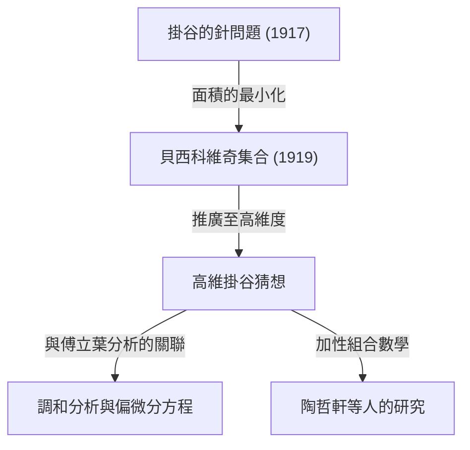

在數學的世界裡，有幾個主題是從直觀上非常容易理解的問題開始，但其解答及衍生的問題卻與現代數學最深奧的領域相連。「[費馬最後定理](/zh-tw/p/fermats-last-theorem/)」和「[龐加萊猜想](/zh-tw/p/poincare-conjecture/)」是其中的代表例子，而位於幾何學和分析學交匯點的**「掛谷猜想（Kakeya Conjecture）」**，也是這樣一個迷人的主題。

在本文中，我們將從1917年日本數學家掛谷宗一（Soichi Kakeya）提出的「掛谷針問題」開始，到俄羅斯數學家貝西科維奇（Abram Besicovitch）的驚人發現，再到現代天才數學家陶哲軒（Terence Tao）等人的研究，深入探討並解說掛谷猜想的全貌。

---

## 1. 掛谷的針問題：直觀的提問

1917年，當時在東北帝國大學（現為東北大學）的掛谷宗一提出了以下這個非常簡單且具視覺性的問題。

> **掛谷針問題（Kakeya Needle Problem）**
> 在平面上連續移動一根長度為1的線段（針），使其改變方向360度（旋轉一圈），在所有能達成此動作的圖形中，面積最小的是什麼？且其最小面積是多少？

例如，在一個半徑為 $1/2$ 的圓內，可以將長度為1的針以中心為軸進行旋轉。這個圓的面積是 $\pi/4 \approx 0.785$。
此外，在邊長為 $1/\sqrt{3}$ 的正三角形（高為1）內部，只要稍微花點心思，也可以讓針旋轉。其面積為 $1/\sqrt{3} \approx 0.577$，比圓還要小。

進一步地，掛谷本人證明了如果使用被稱為內擺線（Deltoid，一種星芒形）的圖形，就可以將面積減小到 $\pi/8 \approx 0.392$。許多數學家預測「這大概就是最小面積了」。

然而，事情的發展出乎意料。

---

## 2. 貝西科維奇的驚奇：面積為零的掛谷集合

在掛谷提出問題短短幾年後的1919年（發表於1928年），俄羅斯數學家亞伯拉罕·貝西科維奇（Abram Besicovitch）在完全不同的背景下（黎曼積分的研究）建構出了一個令人難以置信的圖形。

貝西科維奇證明了具有以下性質的集合（現在被稱為**「貝西科維奇集合」**或**「掛谷集合」**）是存在的。

> **在平面上存在一個集合，儘管它包含了任意方向上長度為1的線段，其勒貝格測度（面積）卻可以任意小，或者測度為0。**

也就是說，得出了一個驚人的結論：「可以在面積為零的圖形中，讓長度為1的針旋轉一圈」。在這個與直覺完全相反的事實背後，有著碎形幾何學的建構方法。

### 透過佩龍樹（Perron Tree）的建構
建構這個不可思議集合的一個代表性方法被稱為「佩龍樹」。
1. 首先，考慮一個有底邊的三角形。
2. 將那個三角形從頂點向底邊分割成細長的條狀。
3. 將分割後的細長三角形互相重疊地（但保持線段方向的涵蓋性）稍微滑動。
4. 透過無限重複這個「分割並重疊」的操作，可以將原始三角形的面積壓縮得任意小。

作為這個碎形操作極限所得到的集合，雖然塞滿了無數「長度為1的線段」，但整體的面積（勒貝格測度）卻變成了零。

---

## 3. 高維掛谷猜想的誕生

在平面（2維）中「存在面積為零的掛谷集合」被證明之後，數學家們的關注自然轉向了高維度（3維、4維，甚至 $n$維）。

我們已知在 $n$維空間 $\mathbb{R}^n$ 中，也可以建構出包含所有方向的單位線段（掛谷集合）且體積（$n$維勒貝格測度）為零的集合。

然而，即使體積為零，「作為圖形的延展」和「[複雜度](/zh-tw/p/time-space-complexity-big-o-notation-examples/)」也需要用其他標準來衡量。這就是被稱為**「豪斯多夫維度（Hausdorff dimension）」**和**「閔考斯基維度（Minkowski dimension）」**的碎形維度概念。

2維的掛谷集合雖然面積為零，但其豪斯多夫維度已被證明剛好為2。也就是說，即使沒有面積，就圖形的[複雜度](/zh-tw/p/time-space-complexity-big-o-notation-examples/)而言，它具有足以填滿2維空間的延展性。

從這裡，誕生了現代數學中著名的未解決問題**「掛谷猜想（Kakeya Conjecture）」**。

> **高維掛谷猜想**
> 在 $n$維空間 $\mathbb{R}^n$ 中的任意掛谷集合（包含所有方向單位線段的集合），其豪斯多夫維度和閔考斯基維度恰好為 $n$。

這個猜想在維度 $n=1, 2$ 的情況下已被證明是正確的，但在 $n \ge 3$（3維以上的空間）中仍然是未解決的。

---

## 4. 對現代數學的波及：為什麼掛谷猜想很重要？

一個看似純粹關於「旋轉針的圖形維度」的幾何問題，為什麼在現代數學的最前線會受到如此大的關注呢？
那是因為，在1970年代，查爾斯·費夫曼（Charles Fefferman）發現了掛谷猜想與<strong>「調和分析（傅立葉分析）」</strong>之間有著深厚的連結。

### 博赫納-里斯猜想與波動方程
費夫曼指出，研究傅立葉轉換收斂性的調和分析重要問題「博赫納-里斯猜想（Bochner-Riesz conjecture）」，實際上與掛谷集合的幾何性質有著直接的關聯。
如果掛谷集合的維度真的小於 $n$，那麼由特定波的疊加所造成的能量極度集中現象將無法被抑制，從而導致分析學中的根本定理出現矛盾。

此外，這也與<strong>偏微分方程（PDE）</strong>領域中的「波動方程的局部平滑猜想（Local smoothing conjecture）」有著深刻的聯繫。聲音或光波在空間中傳播時，波如何擴散、能量集中在哪裡的物理問題，都受到掛谷集合的碎形幾何學所支配。

---

## 5. 陶哲軒與加性組合數學

近年來，對這個掛谷猜想帶來突破性方法的，是包含菲爾茲獎得主陶哲軒（Terence Tao）在內的數學家們。他們使用了被稱為<strong>「加性組合數學（Additive Combinatorics）」</strong>領域的工具來挑戰掛谷猜想。

使用有限體上空間 $\mathbb{F}_q^n$ 的「有限體掛谷猜想」，在2008年由澤夫·德維爾（Zeev Dvir）透過多項式法這個驚人簡單的方法完全解開了。這也為解決實數空間中的掛谷猜想帶來了新的曙光。

陶哲軒等人對掛谷集合中所包含的無數線段如何互相交會（Intersection theory）進行組合學分析，並逐年推高特定維度的下界（Lower bounds）。雖然目前仍未達到完全證明，但透過融合數學各個領域的方法，正一步步逼近真理。

---

## 6. 總結

1917年的「掛谷的針問題」，是從一個任何人都聽得懂的圖形謎題般的提問開始的。然而其本質，卻是深植於空間的延展與維度、以及波的傳播等宇宙物理法則中，一門無比深奧的數學。

掛谷猜想，從違反直覺的「面積為零的集合」開始，成為了連接傅立葉分析、偏微分方程以及加性組合數學這片現代數學汪洋的宏偉橋樑。在3維以上的空間裡，這個猜想被完全解開的日子是否會到來？數學家們的挑戰，時至今日仍在繼續。
