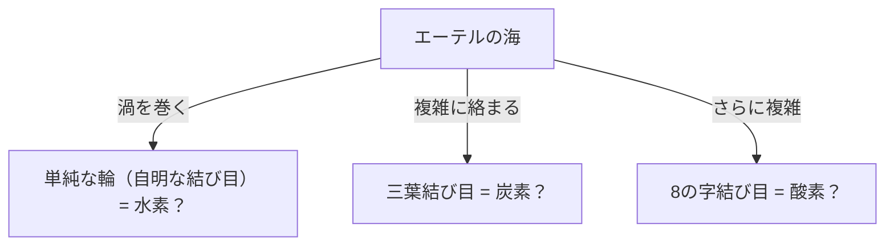
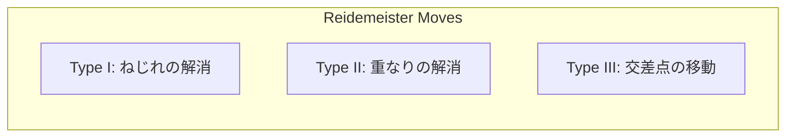

## ما هي نظرية العقد؟

الجميع يختبرون ربط أربطة الأحذية أو التعامل مع أسلاك السماعات المتشابكة في حياتهم اليومية. ومع ذلك، قد تتفاجأ عندما تسمع أن هذا مرتبط ارتباطًا وثيقًا بـ "طليعة الرياضيات". "نظرية العقد" (Knot Theory)، والتي تقع ضمن مجال "الطوبولوجيا" في الرياضيات، هي بالضبط التخصص الذي يدرس بدقة خصائص هذه "التشابكات".

الفرق الأكبر بين العقدة العادية والعقدة الرياضية يكمن في حقيقة أن **كلا الطرفين متصلان (إنها منحنى مغلق)**. إذا لم تكن الأطراف ثابتة، فيمكن في النهاية فك أي عقدة. ومع ذلك، عندما يتم توصيل كلا الطرفين لتكوين حلقة، يصبح "التشابك" الخاص بها ثابتًا، وما لم يتم قطعها، لا يمكن تغييرها إلى حالة تشابك مختلفة.

إن تصنيف هذا "التشابك للسلاسل المغلقة" البسيط ظاهريًا وطرح أسئلة مثل "هل هذه العقدة هي نفس تلك العقدة؟" أو "هل يمكن فك هذه العقدة؟" يشكلان المقترحات الأساسية لنظرية العقد.

## "نظرية ذرة الدوامة" للورد كيلفن: أصل رومانسي من الفيزياء

وراء تحول نظرية العقد إلى موضوع كامل في الرياضيات تكمن فرضية رائعة اقترحها الفيزيائي في القرن التاسع عشر ويليام طومسون (الذي عُرف لاحقًا باللورد كيلفن).

في عام 1867، اقترح اللورد كيلفن "نظرية ذرة الدوامة"، والتي تنص على أن "الذرات عبارة عن **دوامات معقودة** تشكلت في الأثير (الوسط الذي كان يُعتقد في ذلك الوقت أنه يملأ الكون)".
لقد ركز على خاصية أن حلقات الدخان (حلقات الدوامة) تحافظ بشكل مستقر على شكلها ولا تنكسر حتى عندما تصطدم ببعضها البعض، بل تهتز فقط. كان يعتقد أنه إذا أمكن تفسير الاختلافات في العناصر المختلفة من خلال "أنواع العقد (الاختلافات في التشابك)" لهذه الدوامات، فيمكن وصف الكيمياء بحتة كعلم هندسة.

في النهاية، تم دحض وجود الأثير من خلال تجربة ميكلسون-مورلي وغيرها، وتم التخلي عن فرضية ذرة الدوامة في الفيزياء. ومع ذلك، بدأ علماء الرياضيات الذين ألهمتهم فرضيته، مثل بيتر تيت، المشروع العظيم المتمثل في "تصنيف جميع العقد وإنشاء جداول". وأصبح هذا فجر نظرية العقد كعلم رياضيات.

## حركات ريدمايستر: قواعد "لتشويه" العقد

أكبر تحد في نظرية العقد هو تحديد ما إذا كانت "عقدتان تبدوان مختلفتين للوهلة الأولى هما في الواقع نفس العقدة (متطابقتان إذا تشوهتا دون قطع الخيط)".
يُطلق على العقدة في مساحة ثلاثية الأبعاد مرسومة عن طريق إسقاطها على ورق (ثنائي الأبعاد) اسم "إسقاط العقدة".

في عام 1926، أثبت كورت ريدمايستر أنه بغض النظر عن مدى تعقيد تشوه العقدة، يمكن تمثيلها في إسقاط من خلال **مزيج من 3 أنواع فقط من العمليات المحلية**. هذه تسمى "حركات ريدمايستر" (Reidemeister Moves).

1. **النوع الأول (Type I)**: عملية لإضافة أو إزالة التواء. (إنشاء أو إزالة حلقة في الخيط)
2. **النوع الثاني (Type II)**: عملية لتداخل أو فصل خيطين.
3. **النوع الثالث (Type III)**: عملية ينزلق فيها الخيط ويمر عبر تقاطع خيوط أخرى.

إذا أمكن تحويل إسقاطي عقدتين إلى نفس الشكل من خلال تكرار هذه الحركات الثلاث، يمكن القول إنهما "نفس العقدة (متكافئتان)". على العكس من ذلك، إذا أمكن إثبات أنه "لن يتطابقا أبدًا بغض النظر عن عدد مرات تكرار هذه العمليات الثلاث"، يتم تحديد أنهما عقدتان مختلفتان.

## متعددة حدود جونز: اكتشاف كبير هز عالم الرياضيات

لسنوات عديدة، سعى علماء الرياضيات إلى إيجاد أداة قوية (ثابت العقدة) لإثبات أن "عقدتين مختلفتان". الثابت هو قيمة أو صيغة لا تتغير أبدًا حتى عند تنفيذ حركات ريدمايستر.

تم اكتشاف متعددة حدود ألكسندر في عام 1928 واستُخدمت كأداة قياسية لفترة طويلة، ولكن كانت بها نقاط ضعف، مثل عدم القدرة على التمييز بين العقدة وصورتها المعكوسة.

في عام 1984، اكتشف عالم الرياضيات النيوزيلندي فون جونز فجأة ثابت عقدة جديدًا من أبحاثه في مجال مختلف تمامًا يسمى جبر فون نيومان. وهذا هو "متعددة حدود جونز" (Jones Polynomial).

يتم حساب متعددة حدود جونز $V(K)$ بشكل تكراري (علاقة سكين) باستخدام "الإشارة (زائد أو ناقص)" لتقاطعات العقدة.

بنى اكتشاف متعددة حدود جونز جسرًا عميقًا ليس فقط مع الطوبولوجيا ولكن أيضًا مع مجالات أخرى من الفيزياء، مثل الميكانيكا الإحصائية ونظرية المجال الكمي. أظهر إدوارد ويتن أنه يمكن اشتقاق متعددة حدود جونز بشكل طبيعي ضمن إطار نظرية المجال الكمي التي تسمى نظرية تشيرن-سيمونز، مما ختم اندماج الرياضيات والفيزياء. لهذا الإنجاز، فاز جونز وويتن بميدالية فيلدز في عام 1990.

## ألغاز الحياة والعقد: الحمض النووي (DNA) وتوبويزوميراز

لا تقتصر نظرية العقد على عالم الرياضيات البحتة. فهي تلعب دورًا أساسيًا في فهم سلوك الحمض النووي في خلايانا.

يحتوي الحمض النووي على هيكل حلزوني مزدوج، ولكن لتكرار الحمض النووي أثناء انقسام الخلايا، يجب فك هذا الحلزون. ومع ذلك، ونظرًا لأن خيوط الحمض النووي الطويلة والرقيقة للغاية معبأة بإحكام في المساحة الضيقة لنواة الخلية، فإنها تلتوي بعنف وتتشابك وتشكل "عقدًا" حرفيًا أثناء عمليات التكرار والنسخ.
إذا تركت هذه التشابكات بمفردها، فسوف يتمزق الحمض النووي، وتموت الخلية.

هنا يأتي دور إنزيم خاص يسمى "توبويزوميراز" (Topoisomerase).
والمثير للدهشة أن توبويزوميراز يقوم بعمليات تشبه السحر: **"قطع شريط حمض نووي مثل المقص، وتمرير شريط آخر عبر الفجوة، ثم إعادة توصيلهما"**.

- **توبويزوميراز النوع الأول (Type I)**: يقطع خيطًا واحدًا فقط من الحلزون المزدوج، ويمرر الآخر من خلاله، ويعيد الاتصال. (يغير رقم الارتباط بمقدار 1)
- **توبويزوميراز النوع الثاني (Type II)**: يقطع كلا خيطي الحلزون المزدوج، ويمرر حلزونًا مزدوجًا آخر من خلاله، ويعيد الاتصال. (يعكس الجزء العلوي / السفلي من التقاطع)

من منظور رياضي، هذا ليس أقل من عملية اصطناعية لعكس زائد/ناقص لتقاطع عقدة. يتعاون علماء الرياضيات وعلماء الأحياء لتحليل كيفية قيام إنزيمات التوبويزوميراز بفك عقد الحمض النووي باستخدام نظرية العقد.

## تكنولوجيا المستقبل: الأنيونات والحوسبة الكمومية الطوبولوجية

واليوم، تعد نظرية العقد واحدة من أهم الموضوعات نحو تحقيق "أجهزة الكمبيوتر الكمومية"، وهي أجهزة الكمبيوتر من الجيل التالي.

أجهزة الكمبيوتر الكمومية العادية عرضة للغاية للضوضاء (الحرارة والموجات الكهرومغناطيسية) ولديها عيب قاتل يتمثل في كونها عرضة لأخطاء الحساب. الفكرة للتغلب على هذا هي "الحوسبة الكمومية الطوبولوجية".

عندما تتبادل جسيمات خاصة (أو أشباه جسيمات) محصورة في مساحة ثنائية الأبعاد تسمى "الأنيونات" (Anyons) مواقعها (تتشابك معًا مثل الجديلة)، تتغير الحالة الكمومية (الدالة الموجية) للجسيمات.
عندما يتم رسم [مسار](/ar/p/windows-%E3%81%A7%D9%85%D8%B3%D8%A7%D8%B1%E3%81%AE%E9%80%9A%E3%81%A3%E3%81%9F%D9%85%D9%84%D9%81-%D8%AA%D9%86%D9%81%D9%8A%D8%B0%D9%8A%E3%81%AE%E5%A0%B4%E6%89%80%E3%82%92%E8%A6%8B%E3%81%A4%E3%81%91%E3%82%8B%E6%96%B9%E6%B3%95/) الأنيونات على طول المحور الزمني (البعد الثالث)، يتم رسم [مسار](/ar/p/windows-%E3%81%A7%D9%85%D8%B3%D8%A7%D8%B1%E3%81%AE%E9%80%9A%E3%81%A3%E3%81%9F%D9%85%D9%84%D9%81-%D8%AA%D9%86%D9%81%D9%8A%D8%B0%D9%8A%E3%81%AE%E5%A0%B4%E6%89%80%E3%82%92%E8%A6%8B%E3%81%A4%E3%81%91%E3%82%8B%E6%96%B9%E6%B3%95/) حرفي لـ "الجديلة" (Braid).

في الحوسبة الكمومية الطوبولوجية، يتم استخدام "عقدة جديلة الأنيون" كبوابة كمومية (عملية حسابية).
لا يتغير نوع العقدة حتى إذا تم سحب الخيط أو هزه قليلاً (تمت إضافة ضوضاء)، طالما لم يتم قطع الخيط (طالما لم تتغير الطوبولوجيا). بمعنى آخر، من خلال تسجيل المعلومات في بنية العقدة نفسها، تصبح "الحوسبة الكمومية الخالية من الأخطاء" والقوية للغاية ضد الضوضاء البيئية ممكنة.

## الخاتمة: تحدي اللغز غير القابل للفك

بدءًا من النموذج الذري الفاشل للورد كيلفن، أصبحت نظرية العقد الأساس على مدى قرون لتوضيح أنشطة حياة الحمض النووي وتصميم أجهزة الكمبيوتر الكمومية المستقبلية.

في "تشابك الخيوط" الذي يبدو وكأنه لعبة أطفال للوهلة الأولى، تختبئ مفاتيح كشف حقائق الكون وألغاز الحياة. هذا هو بالضبط أكبر جاذبية لتخصص الرياضيات الأكاديمي، والسبب وراء استمرار نظرية العقد في إبهار الكثير من العلماء اليوم.
