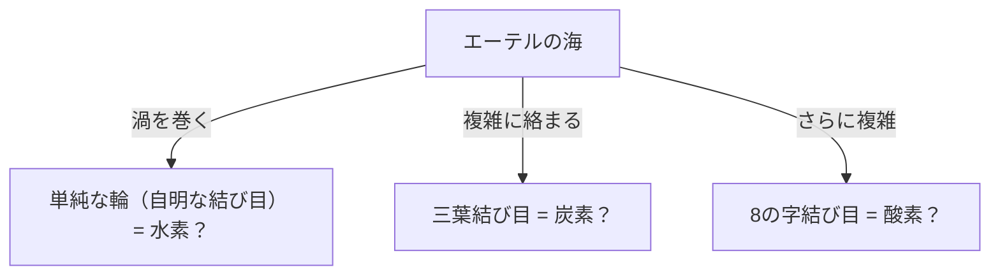
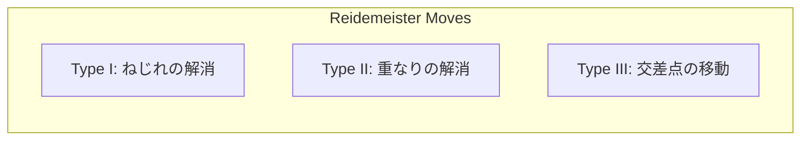

## Was ist Knotentheorie?

Jeder hat im Alltag schon einmal Schnürsenkel gebunden oder sich mit verhedderten Kopfhörerkabeln herumgeschlagen. Es mag jedoch überraschen, dass dies eng mit der "Spitze der Mathematik" verbunden ist. Die "Knotentheorie", ein Teilgebiet der "Topologie" in der Mathematik, ist genau die Disziplin, die die Eigenschaften dieser "Verflechtungen" streng untersucht.

Der größte Unterschied zwischen einem gewöhnlichen Knoten und einem mathematischen Knoten besteht darin, dass **beide Enden miteinander verbunden sind (es handelt sich um eine geschlossene Kurve)**. Wenn die Enden nicht fixiert sind, lässt sich jeder Knoten irgendwann aufziehen und lösen. Wenn jedoch beide Enden zu einer Schleife verbunden sind, ist die Art der "Verknotung" fixiert und kann nicht in eine andere Verknotung verändert werden, es sei denn, man durchschneidet sie.

Diese scheinbar einfache "Verknotung geschlossener Schleifen" zu klassifizieren und Fragen zu stellen wie "Ist dieser Knoten derselbe wie ein anderer Knoten?" oder "Kann dieser Knoten gelöst werden?", sind die grundlegenden Aufgaben der Knotentheorie.

## Lord Kelvins "Wirbelatom-Hypothese": Ein romantischer Ursprung aus der Physik

Der Hintergrund dafür, dass die Knotentheorie zu einem vollwertigen mathematischen Fach wurde, ist eine faszinierende Hypothese des Physikers William Thomson (später Lord Kelvin) aus dem 19. Jahrhundert.

Im Jahr 1867 schlug Lord Kelvin die "Wirbelatom-Hypothese" vor, die besagte, dass "Atome **verknotete Wirbel** sind, die im Äther entstanden sind (dem Medium, von dem man damals annahm, dass es das Universum erfüllt)".
Er bemerkte, dass Rauchringe (Wirbelringe) ihre Form stabil beibehalten und beim Zusammenstoß nicht zerbrechen, sondern nur vibrieren. Er dachte, wenn die Unterschiede zwischen verschiedenen Elementen durch die "Arten von Knoten (Unterschiede in der Verknotung)" dieser Wirbel erklärt werden könnten, dann könnte die Chemie rein als Geometrie beschrieben werden.

Letztendlich wurde die Existenz des Äthers durch das Michelson-Morley-Experiment und andere widerlegt, und die Wirbelatom-Hypothese wurde als Physik aufgegeben. Mathematiker, die von seiner Hypothese inspiriert waren, wie Peter Tait, begannen jedoch das große Projekt, "alle Knoten zu klassifizieren und Tabellen zu erstellen". Dies wurde die Geburtsstunde der Knotentheorie als Mathematik.

## Reidemeister-Bewegungen: Regeln zum "Verformen" von Knoten

Die größte Herausforderung in der Knotentheorie besteht darin, festzustellen, ob "zwei Knoten, die auf den ersten Blick unterschiedlich aussehen, tatsächlich gleich sind (identisch, wenn sie verformt werden, ohne die Schnur zu zerschneiden)".
Ein Knoten im 3D-Raum, der durch Projektion auf Papier (2D) gezeichnet wird, wird als "Knotendiagramm" bezeichnet.

Im Jahr 1926 bewies Kurt Reidemeister, dass, egal wie komplex die Verformung eines Knotens ist, sie auf einer Projektion durch eine **Kombination von nur 3 Arten lokaler Operationen** dargestellt werden kann. Diese werden "Reidemeister-Bewegungen" genannt.

1. **Typ I**: Eine Operation, um eine Verdrehung hinzuzufügen oder zu entfernen. (Eine Schleife in der Schnur erzeugen oder entfernen)
2. **Typ II**: Eine Operation, um zwei Schnüre übereinanderzulegen oder voneinander zu trennen.
3. **Typ III**: Eine Operation, bei der eine Schnur über einen Kreuzungspunkt anderer Schnüre gleitet und hindurchführt.

Wenn zwei Knotendiagramme in dieselbe Figur verwandelt werden können, indem diese 3 Bewegungen wiederholt werden, kann man sagen, dass sie "derselbe Knoten (äquivalent)" sind. Umgekehrt, wenn bewiesen werden kann, dass "sie niemals übereinstimmen werden, egal wie oft diese 3 Operationen wiederholt werden", steht fest, dass es sich um unterschiedliche Knoten handelt.

## Das Jones-Polynom: Eine große Entdeckung, die die mathematische Welt erschütterte

Lange Zeit suchten Mathematiker nach einem mächtigen Werkzeug (Knoteninvariante), um zu beweisen, dass "zwei Knoten unterschiedlich sind". Eine Invariante ist ein Wert oder eine Formel, die sich absolut nicht ändert, selbst wenn Reidemeister-Bewegungen ausgeführt werden.

Das Alexander-Polynom wurde 1928 entdeckt und lange Zeit als Standardwerkzeug verwendet, hatte aber Schwächen, wie zum Beispiel, dass es einen Knoten nicht von seinem Spiegelbild unterscheiden konnte.

Im Jahr 1984 entdeckte der neuseeländische Mathematiker Vaughan Jones plötzlich eine neue Knoteninvariante aus seiner Forschung in einem völlig anderen Bereich namens Von-Neumann-Algebren. Dies ist das "Jones-Polynom".

Das Jones-Polynom $V(K)$ wird rekursiv (Skein-Relation) unter Verwendung des "Vorzeichens (Plus oder Minus)" der Knotenschnittpunkte berechnet.

Die Entdeckung des Jones-Polynoms schlug eine tiefe Brücke nicht nur zur Topologie, sondern auch zu anderen Bereichen der Physik, wie der statistischen Mechanik und der Quantenfeldtheorie. Edward Witten zeigte, dass das Jones-Polynom auf natürliche Weise im Rahmen der Quantenfeldtheorie, der Chern-Simons-Theorie, abgeleitet werden kann, was die Verschmelzung von Mathematik und Physik besiegelte. Für diese Leistung erhielten Jones und Witten 1990 die Fields-Medaille.

## Die Geheimnisse des Lebens und der Knoten: DNA und Topoisomerase

Die Knotentheorie ist nicht auf die Welt der reinen Mathematik beschränkt. Sie spielt eine wesentliche Rolle beim Verständnis des Verhaltens von DNA in unseren Zellen.

DNA hat eine Doppelhelixstruktur, aber um DNA während der Zellteilung zu replizieren, muss diese Helix entwirrt werden. Da die extrem langen und dünnen DNA-Stränge jedoch eng im engen Raum des Zellkerns verpackt sind, verdrehen sie sich während der Replikations- und Transkriptionsprozesse heftig, verheddern sich und bilden buchstäblich "Knoten".
Wenn diese Verflechtungen in Ruhe gelassen werden, reißt die DNA und die Zelle stirbt.

Hier kommt ein spezielles Enzym namens "Topoisomerase" ins Spiel.
Erstaunlicherweise führt die Topoisomerase magieähnliche Operationen durch: **"Einen DNA-Strang wie eine Schere durchschneiden, einen anderen Strang durch die Lücke führen und sie dann wieder verbinden."**

- **Typ-I-Topoisomerase**: Schneidet nur einen Strang der Doppelhelix, führt den anderen hindurch und verbindet ihn wieder. (Ändert die Verknüpfungszahl um 1)
- **Typ-II-Topoisomerase**: Schneidet beide Stränge der Doppelhelix, führt eine andere Doppelhelix hindurch und verbindet sie wieder. (Dreht die Ober-/Unterseite der Kreuzung um)

Aus mathematischer Sicht ist dies nichts anderes als eine künstliche Operation des Umkehrens des Plus-/Minus-Zeichens einer Knotenschnittstelle. Mathematiker und Biologen arbeiten zusammen, um mithilfe der Knotentheorie zu analysieren, wie Topoisomerasen DNA-Knoten entwirren.

## Zukunftstechnologie: Anyonen und topologische Quantencomputer

Heute ist die Knotentheorie eines der wichtigsten Themen auf dem Weg zur Realisierung von "Quantencomputern", den Computern der nächsten Generation.

Normale Quantencomputer sind extrem anfällig für Rauschen (Wärme und elektromagnetische Wellen) und haben den fatalen Fehler, dass sie anfällig für Berechnungsfehler sind. Die Idee, dies zu überwinden, ist das "topologische Quantencomputing".

Wenn spezielle Teilchen (oder Quasiteilchen), die im 2D-Raum eingeschlossen sind und "Anyonen" genannt werden, die Position tauschen (sich wie ein Zopf verheddern), ändert sich der Quantenzustand (Wellenfunktion) der Teilchen.
Wenn die Flugbahn von Anyonen entlang der Zeitachse (3. Dimension) gezeichnet wird, wird eine buchstäbliche Flugbahn eines "Zopfes" gezeichnet.

Beim topologischen Quantencomputing wird dieser "Anyonen-Zopfknoten" als Quantengatter (Berechnungsoperation) verwendet.
Die Art eines Knotens ändert sich nicht, selbst wenn leicht an der Schnur gezogen oder geschüttelt wird (Rauschen wird hinzugefügt), solange die Schnur nicht durchschnitten wird (solange sich die Topologie nicht ändert). Mit anderen Worten, indem Informationen in der Struktur des Knotens selbst gespeichert werden, wird "fehlerfreies Quantencomputing", das äußerst robust gegen Umgebungsrauschen ist, möglich.

## Fazit: Herausforderung des unlösbaren Geheimnisses

Ausgehend von Lord Kelvins gescheitertem Atommodell wurde die Knotentheorie über Jahrhunderte zur Grundlage, um die Lebensaktivitäten der DNA aufzuklären und zukünftige Quantencomputer zu entwerfen.

In der "Verknotung von Schnüren", die auf den ersten Blick wie ein Kinderspiel aussieht, verbergen sich die Schlüssel, um die Wahrheiten des Universums und die Geheimnisse des Lebens zu entschlüsseln. Genau das ist der größte Reiz der akademischen Disziplin Mathematik und der Grund, warum die Knotentheorie auch heute noch so viele Wissenschaftler fasziniert.
