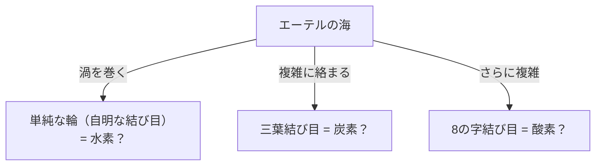
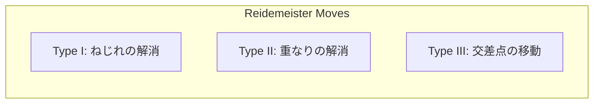

## What is Knot Theory?

Everyone has the experience of tying shoelaces or dealing with tangled earphone cords in everyday life. However, you might be surprised to hear that this is deeply connected to the "cutting edge of mathematics." "Knot Theory," located within the mathematical field of "topology," is precisely the discipline that strictly studies the properties of these "tangles."

The biggest difference between a normal knot and a mathematical knot is that **both ends are connected (it is a closed curve)**. If the ends are not fixed, any knot will eventually slip and untie. But when the ends are joined to form a loop, its "way of tangling" is fixed, and unless it is cut, it cannot be changed into a different tangling.

Classifying this seemingly simple "tangling of closed loops" and asking questions like "Is this knot the same as another knot?" and "Can this knot be untied?" are the basic propositions of knot theory.

## Lord Kelvin's "Vortex Atom Hypothesis": A Romantic Origin from Physics

The background to knot theory becoming a full-fledged subject in mathematics involves a fascinating hypothesis by the 19th-century physicist William Thomson (later Lord Kelvin).

In 1867, Lord Kelvin proposed the "Vortex Atom Theory," suggesting that "atoms are **knotted vortices** created in the aether (the medium then thought to fill the universe)."
He noticed that smoke rings (vortex rings) stably keep their shape and do not break when colliding, only vibrating. He thought that if the differences between various elements could be explained by the "types of knots (differences in tangling)" of these vortices, then chemistry could be described purely as geometry.

Ultimately, the existence of the aether was disproved by the Michelson-Morley experiment and others, and the vortex atom hypothesis was abandoned as physics. However, mathematicians inspired by his hypothesis, such as Peter Tait, began the grand project of "classifying all knots and creating tables." This became the dawn of knot theory as mathematics.

## Reidemeister Moves: Rules for "Deforming" Knots

The greatest challenge in knot theory is determining whether "two knots that look different at first glance are actually the same (identical if deformed without cutting the string)."
A knot in 3D space drawn by projecting it onto paper (2D) is called a "knot projection."

In 1926, Kurt Reidemeister proved that no matter how complex the deformation of a knot, it can be represented on a projection by a **combination of just 3 types of local operations**. These are called "Reidemeister Moves."

1. **Type I**: An operation to add or remove a twist. (Creating or removing a loop in the string)
2. **Type II**: An operation to overlap or separate two strings.
3. **Type III**: An operation where a string slides over and passes through an intersection of other strings.

If two knot projections can be turned into the same figure by repeating these 3 moves, they can be said to be the "same knot (equivalent)." Conversely, if it can be proven that "they will never match no matter how many times these 3 operations are repeated," it is determined that they are different knots.

## The Jones Polynomial: A Major Discovery That Shook the Math World

For many years, mathematicians sought a powerful tool (knot invariant) to prove that "two knots are different." An invariant is a value or formula that absolutely does not change even when Reidemeister moves are performed.

The Alexander polynomial was discovered in 1928 and used as a standard tool for a long time, but it had weaknesses, such as not being able to distinguish a knot from its mirror image.

In 1984, the New Zealand mathematician Vaughan Jones suddenly discovered a new knot invariant from his research in a completely different field called von Neumann algebras. This is the "Jones Polynomial."

The Jones polynomial $V(K)$ is calculated recursively (skein relation) using the "sign (plus or minus)" of the knot intersections.

The discovery of the Jones polynomial built a deep bridge not only with topology but also with other fields of physics, such as statistical mechanics and quantum field theory. Edward Witten showed that the Jones polynomial can be naturally derived within the framework of quantum field theory called Chern-Simons theory, sealing the fusion of mathematics and physics. For this achievement, Jones and Witten won the Fields Medal in 1990.

## The Mysteries of Life and Knots: DNA and Topoisomerase

Knot theory is not confined to the world of pure mathematics. It plays an essential role in understanding the behavior of DNA in our cells.

DNA has a double helix structure, but to replicate DNA during cell division, this helix must be untangled. However, because the extremely long and thin DNA strands are packed tightly in the narrow space of the cell nucleus, they twist violently, tangle, and literally form "knots" during the replication and transcription processes.
If these tangles are left alone, the DNA will tear, and the cell will die.

This is where a special enzyme called "Topoisomerase" comes into play.
Amazingly, topoisomerase performs magic-like operations: **"cutting a DNA strand like scissors, passing another strand through the gap, and then reconnecting them."**

- **Type I Topoisomerase**: Cuts only one strand of the double helix, passes the other through, and reconnects. (Changes the linking number by 1)
- **Type II Topoisomerase**: Cuts both strands of the double helix, passes another double helix through, and reconnects. (Flips the top/bottom of the crossing)

From a mathematical perspective, this is nothing less than an artificial operation of flipping the plus/minus of a knot intersection. Mathematicians and biologists collaborate to analyze how topoisomerases untangle DNA knots using knot theory.

## Future Technology: Anyons and Topological Quantum Computing

Today, knot theory is one of the most important themes toward realizing "quantum computers," the next-generation computers.

Normal quantum computers are extremely vulnerable to noise (heat and electromagnetic waves) and have a fatal flaw of being prone to calculation errors. The idea to overcome this is "Topological Quantum Computing."

When special particles (or quasiparticles) confined in 2D space called "Anyons" swap positions (tangling together like a braid), the quantum state (wave function) of the particles changes.
When the trajectory of anyons is drawn along the time axis (3rd dimension), a literal trajectory of a "Braid" is drawn.

In topological quantum computing, this "anyon braid knot" is used as a quantum gate (calculation operation).
The type of a knot does not change even if the string is pulled or shaken slightly (noise is added), as long as the string is not cut (as long as the topology does not change). In other words, by recording information in the structure of the knot itself, "error-free quantum computing" that is highly robust against environmental noise becomes possible.

## Conclusion: Challenging the Untieable Mystery

Starting from Lord Kelvin's failed atomic model, knot theory became the foundation over centuries to elucidate the life activities of DNA and design future quantum computers.

In the "tangling of strings" that looks like child's play at first glance, the keys to unraveling the truths of the universe and the mysteries of life are hidden. This is precisely the greatest appeal of the academic discipline of mathematics, and the reason why knot theory continues to fascinate so many scientists today.
