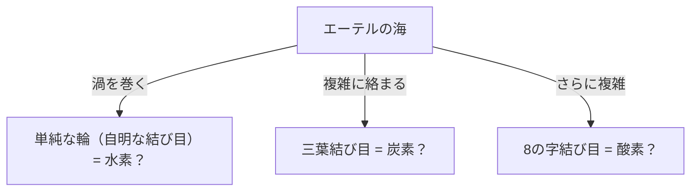
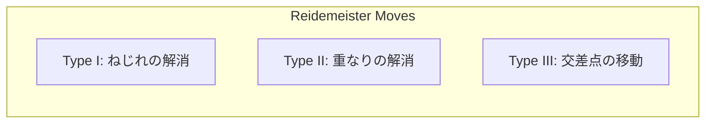

## ¿Qué es la Teoría de Nudos?

Todo el mundo tiene la experiencia de atarse los cordones de los zapatos o lidiar con cables de auriculares enredados en su vida diaria. Sin embargo, puede que te sorprenda saber que esto está profundamente relacionado con la "vanguardia de las matemáticas". La "Teoría de Nudos", un subcampo de la "Topología" en matemáticas, es precisamente la disciplina que investiga rigurosamente las propiedades de estos "enredos".

La mayor diferencia entre un nudo cotidiano y un nudo matemático radica en el hecho de que **ambos extremos están unidos (son curvas cerradas)**. Si los extremos no están fijos, cualquier nudo eventualmente puede soltarse y desatarse. Sin embargo, cuando ambos extremos se conectan para formar un bucle, su "enredo" se vuelve fijo, y a menos que se corte, no puede cambiarse a un estado diferente de enredo.

Categorizar este "enredo de cuerdas cerradas" aparentemente simple y hacer preguntas como "¿Es este nudo igual que ese nudo?" o "¿Se puede desatar este nudo?" forman las proposiciones fundamentales de la teoría de nudos.

## La "Teoría del Átomo de Vórtice" de Lord Kelvin: Un origen romántico desde la física

Detrás de que la teoría de nudos se convirtiera en un tema de pleno derecho en matemáticas, se encuentra una fascinante hipótesis propuesta por el físico del siglo XIX William Thomson (más tarde Lord Kelvin).

En 1867, Lord Kelvin propuso la "Teoría del Átomo de Vórtice", que afirmaba que "los átomos son **vórtices anudados** formados en el éter (el medio que se creía en ese momento que llenaba el universo)".
Se centró en la propiedad de que los anillos de humo (anillos de vórtice) mantienen su forma de manera estable y no se rompen incluso cuando chocan entre sí, sino que simplemente vibran. Pensó que si las diferencias en varios elementos pudieran explicarse por los "tipos de nudos (diferencias en el enredo)" de estos vórtices, la química podría describirse puramente como geometría.

En última instancia, el experimento de Michelson-Morley y otros refutaron la existencia del éter, y la hipótesis del átomo de vórtice fue abandonada como física. Sin embargo, los matemáticos inspirados por su hipótesis, como Peter Tait, comenzaron el gran proyecto de "clasificar todos los nudos y crear tablas". Este fue el amanecer de la teoría de nudos como matemáticas.

## Movimientos de Reidemeister: Reglas para "deformar" nudos

El mayor desafío en la teoría de nudos es determinar si "dos nudos que se ven diferentes a primera vista son en realidad el mismo (idénticos si se deforman sin cortar la cuerda)".
Un nudo en el espacio 3D dibujado proyectándolo sobre un papel (2D) se llama "proyección de nudo".

En 1926, Kurt Reidemeister demostró que, sin importar cuán compleja sea la deformación de un nudo, puede representarse en una proyección mediante una **combinación de solo 3 tipos de operaciones locales**. Estas se denominan "Movimientos de Reidemeister".

1. **Tipo I**: Una operación para agregar o quitar una torsión. (Crear o quitar un bucle en la cuerda)
2. **Tipo II**: Una operación para superponer o separar dos cuerdas.
3. **Tipo III**: Una operación donde una cuerda se desliza y pasa a través de una intersección de otras cuerdas.

Si dos proyecciones de nudos se pueden convertir en la misma figura repitiendo estos 3 movimientos, se puede decir que son "el mismo nudo (equivalente)". Por el contrario, si se puede probar que "nunca coincidirán sin importar cuántas veces se repitan estas 3 operaciones", se determina que son nudos diferentes.

## El Polinomio de Jones: Un gran descubrimiento que sacudió el mundo de las matemáticas

Durante muchos años, los matemáticos buscaron una herramienta poderosa (invariante de nudo) para demostrar que "dos nudos son diferentes". Un invariante es un valor o fórmula que absolutamente no cambia, incluso cuando se realizan los movimientos de Reidemeister.

El polinomio de Alexander fue descubierto en 1928 y utilizado como herramienta estándar durante mucho tiempo, pero tenía debilidades, como no poder distinguir un nudo de su imagen especular.

En 1984, el matemático neozelandés Vaughan Jones descubrió de repente un nuevo invariante de nudo a partir de su investigación en un campo completamente diferente llamado álgebras de von Neumann. Este es el "Polinomio de Jones".

El polinomio de Jones $V(K)$ se calcula recursivamente (relación de skein) utilizando el "signo (positivo o negativo)" de las intersecciones de nudos.

El descubrimiento del polinomio de Jones construyó un puente profundo no solo con la topología sino también con otros campos de la física, como la mecánica estadística y la teoría cuántica de campos. Edward Witten mostró que el polinomio de Jones puede derivarse naturalmente dentro del marco de la teoría cuántica de campos llamada teoría de Chern-Simons, sellando la fusión de las matemáticas y la física. Por este logro, Jones y Witten ganaron la Medalla Fields en 1990.

## Los misterios de la vida y los nudos: ADN y topoisomerasa

La teoría de nudos no se limita al mundo de las matemáticas puras. Desempeña un papel esencial en la comprensión del comportamiento del ADN en nuestras células.

El ADN tiene una estructura de doble hélice, pero para replicar el ADN durante la división celular, esta hélice debe desenredarse. Sin embargo, debido a que las cadenas de ADN extremadamente largas y delgadas están empaquetadas de forma apretada en el estrecho espacio del núcleo celular, se tuercen violentamente, se enredan y, literalmente, forman "nudos" durante los procesos de replicación y transcripción.
Si estos enredos se dejan solos, el ADN se rasgará y la célula morirá.

Aquí es donde entra en juego una enzima especial llamada "Topoisomerasa".
Sorprendentemente, la topoisomerasa realiza operaciones mágicas: **"cortar una cadena de ADN como tijeras, pasar otra cadena a través del espacio y luego volver a conectarlas"**.

- **Topoisomerasa tipo I**: Corta solo una cadena de la doble hélice, pasa la otra a través y vuelve a conectarla. (Cambia el número de enlace en 1)
- **Topoisomerasa tipo II**: Corta ambas cadenas de la doble hélice, pasa otra doble hélice a través y vuelve a conectarlas. (Invierte la parte superior / inferior del cruce)

Desde una perspectiva matemática, esto no es más que una operación artificial de invertir el más / menos de una intersección de nudos. Matemáticos y biólogos colaboran para analizar cómo las topoisomerasas desenredan los nudos de ADN utilizando la teoría de nudos.

## Tecnología del futuro: Anyones y computación cuántica topológica

Hoy en día, la teoría de nudos es uno de los temas más importantes hacia la realización de "computadoras cuánticas", las computadoras de próxima generación.

Las computadoras cuánticas normales son extremadamente vulnerables al ruido (calor y ondas electromagnéticas) y tienen un defecto fatal de ser propensas a errores de cálculo. La idea para superar esto es la "Computación Cuántica Topológica".

Cuando partículas especiales (o cuasipartículas) confinadas en el espacio 2D llamadas "Anyones" intercambian posiciones (enredándose como una trenza), el estado cuántico (función de onda) de las partículas cambia.
Cuando la trayectoria de los anyones se dibuja a lo largo del eje temporal (tercera dimensión), se dibuja una trayectoria literal de una "Trenza".

En la computación cuántica topológica, este "nudo de trenza de anyone" se utiliza como puerta cuántica (operación de cálculo).
El tipo de nudo no cambia incluso si la cuerda se tira o se agita ligeramente (se agrega ruido), siempre que la cuerda no se corte (siempre que la topología no cambie). En otras palabras, al registrar información en la estructura del nudo en sí, se hace posible la "computación cuántica sin errores" que es altamente robusta contra el ruido ambiental.

## Conclusión: Desafiando el misterio inquebrantable

A partir del fallido modelo atómico de Lord Kelvin, la teoría de nudos se convirtió en la base durante siglos para dilucidar las actividades de la vida del ADN y diseñar futuras computadoras cuánticas.

En el "enredo de cuerdas" que a primera vista parece un juego de niños, se esconden las claves para desentrañar las verdades del universo y los misterios de la vida. Este es precisamente el mayor atractivo de la disciplina académica de las matemáticas, y la razón por la que la teoría de nudos sigue fascinando a tantos científicos en la actualidad.
