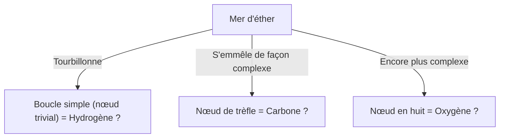
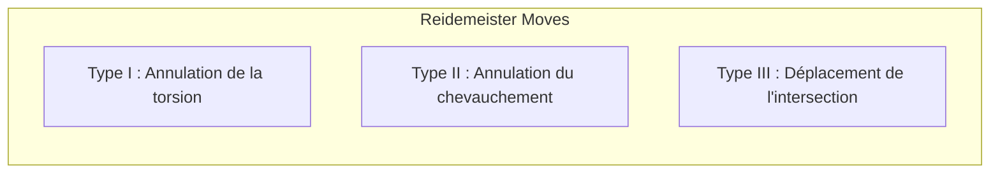

## Qu'est-ce que la théorie des nœuds ?

Nous avons tous l'expérience de lacer nos chaussures ou d'avoir les fils de nos écouteurs emmêlés au quotidien. Cependant, vous pourriez être surpris d'apprendre que cela est profondément lié à la « pointe des mathématiques ». La « Théorie des nœuds » (Knot Theory), qui fait partie de la branche des mathématiques appelée « topologie », est la discipline qui étudie rigoureusement la nature de ces « enchevêtrements ».

La plus grande différence entre les nœuds ordinaires et les nœuds mathématiques réside dans le fait que **leurs deux extrémités sont reliées (ce sont des courbes fermées)**. Si les extrémités ne sont pas fixées, n'importe quel nœud finira par se dénouer de lui-même. Mais si vous reliez les deux extrémités pour former une boucle, la manière dont elle est emmêlée est fixée et ne peut être modifiée en un autre type d'enchevêtrement sans la couper.

Classer ces simples « enchevêtrements de cordes fermées » et se demander « Ce nœud est-il le même qu'un autre ? » ou « Ce nœud peut-il être dénoué ? » constituent les propositions fondamentales de la théorie des nœuds.

## L'hypothèse des « atomes tourbillonnaires » de Lord Kelvin : une origine romantique de la physique

La raison pour laquelle la théorie des nœuds est devenue un véritable sujet d'étude mathématique repose sur une hypothèse fascinante émise au XIXe siècle par le physicien William Thomson (qui deviendra plus tard Lord Kelvin).

En 1867, Lord Kelvin a proposé l'« hypothèse des atomes tourbillonnaires » (Vortex Atom Theory), suggérant que « les atomes sont des **nœuds de tourbillons** formés dans l'éther (le milieu censé remplir l'univers à l'époque) ».
Il avait remarqué que les ronds de fumée (anneaux tourbillonnaires) gardaient leur forme de manière stable et ne se brisaient pas même s'ils se heurtaient, se contentant de vibrer. Il a pensé que si les différences entre divers éléments chimiques pouvaient être expliquées par ces « types de nœuds (différences d'enchevêtrements) » des tourbillons, la chimie pourrait alors être décrite comme de la géométrie pure.

Finalement, des expériences comme celle de Michelson-Morley ont réfuté l'existence de l'éther, et l'hypothèse des atomes tourbillonnaires a été abandonnée par la physique. Cependant, inspirés par cette hypothèse, des mathématiciens comme Peter Tait ont lancé un projet monumental visant à « classer tous les nœuds et à en créer un tableau ». Ce fut l'aube de la théorie des nœuds en tant que mathématiques.

## Les mouvements de Reidemeister : règles pour « déformer » les nœuds

Le plus grand défi de la théorie des nœuds est de déterminer si « deux nœuds qui semblent différents à première vue sont en fait les mêmes (s'ils coïncident si on les déforme sans couper la corde) ».
La projection d'un nœud de l'espace tridimensionnel dessiné sur du papier (en 2D) est appelée le « diagramme du nœud ».

En 1926, Kurt Reidemeister a prouvé que, peu importe la complexité de la déformation d'un nœud, elle peut être représentée sur le diagramme par une combinaison de **seulement trois types d'opérations locales**. On appelle cela les « mouvements de Reidemeister » (Reidemeister Moves).

1. **Type I** : L'opération consistant à ajouter ou retirer une torsion. (Créer ou supprimer une boucle de corde)
2. **Type II** : L'opération consistant à superposer ou séparer deux cordes.
3. **Type III** : L'opération où une corde glisse et passe par-dessus l'intersection de deux autres cordes.

Si les diagrammes de deux nœuds peuvent devenir identiques après avoir répété ces trois mouvements plusieurs fois, on dit qu'ils sont « le même nœud (équivalents) ». À l'inverse, si l'on peut prouver que « peu importe le nombre de fois que ces trois opérations sont répétées, ils ne coïncideront jamais », alors il est certain qu'il s'agit de nœuds différents.

## Le polynôme de Jones : une découverte majeure qui a secoué le monde des mathématiques

Pendant de nombreuses années, les mathématiciens ont cherché un outil puissant (un invariant de nœud) pour prouver que « deux nœuds sont différents ». Un invariant est une valeur ou une formule mathématique qui ne change absolument pas, même si l'on applique les mouvements de Reidemeister.

Le polynôme d'Alexander a été découvert en 1928 et a longtemps été utilisé comme outil standard, mais il présentait des faiblesses, telles que son incapacité à faire la distinction entre un nœud et son image dans un miroir (image chirale).

En 1984, le mathématicien néo-zélandais Vaughan Jones a soudainement découvert un nouvel invariant de nœud à partir de ses recherches dans un domaine complètement différent, l'algèbre de von Neumann. C'est ce qu'on appelle le « polynôme de Jones » (Jones Polynomial).

Le polynôme de Jones $V(K)$ est calculé de manière récursive (relation d'écheveau ou relation de skein) en utilisant le « signe (positif ou négatif) » des intersections du nœud.

La découverte du polynôme de Jones a jeté un pont profond non seulement vers la topologie, mais aussi vers d'autres domaines de la physique, tels que la mécanique statistique et la théorie quantique des champs. Edward Witten a montré que le polynôme de Jones pouvait être naturellement dérivé dans le cadre d'une théorie quantique des champs appelée théorie de Chern-Simons, consolidant ainsi la fusion entre mathématiques et physique. Jones et Witten ont tous deux reçu la médaille Fields en 1990 pour ces réalisations.

## Le mystère de la vie et les nœuds : l'ADN et la topoisomérase

La théorie des nœuds ne se limite pas au monde des mathématiques pures. Elle joue un rôle essentiel dans la compréhension du comportement de l'ADN à l'intérieur de nos cellules.

L'ADN a une structure en double hélice, mais pour le répliquer lors de la division cellulaire, il est nécessaire de dérouler cette hélice. Cependant, comme les brins d'ADN, extrêmement longs et fins, sont confinés dans l'espace étroit du noyau cellulaire, ils se tordent et s'emmêlent violemment au cours de la réplication ou de la transcription, formant littéralement des « nœuds ».
Si cet enchevêtrement est laissé tel quel, l'ADN se cassera et la cellule mourra.

C'est là qu'intervient une enzyme spéciale appelée « topoisomérase » (Topoisomerase).
La topoisomérase accomplit une opération quasi magique : **« elle coupe un brin d'ADN comme des ciseaux, fait passer un autre brin par l'espace ouvert, puis recolle les extrémités »**.

- **Topoisomérase de type I** : Coupe un seul des brins de la double hélice, laisse passer l'autre brin, et referme. (Change le nombre d'entrelacements de 1)
- **Topoisomérase de type II** : Coupe les deux brins de la double hélice, fait passer une autre double hélice à travers, et referme. (Inverse le sens dessus-dessous de l'intersection)

D'un point de vue mathématique, ce n'est rien d'autre que l'opération d'inversion artificielle du signe positif/négatif de l'intersection du nœud. Les mathématiciens et les biologistes collaborent pour analyser comment la topoisomérase démêle les nœuds de l'ADN en utilisant la théorie des nœuds.

## La technologie du futur : Anyons et calcul quantique topologique

À l'époque moderne, la théorie des nœuds est devenue l'un des thèmes les plus importants pour la réalisation des « ordinateurs quantiques », les ordinateurs de la prochaine génération.

Les ordinateurs quantiques ordinaires sont extrêmement sensibles au bruit (chaleur, ondes électromagnétiques) et ont le défaut fatal d'être très sujets aux erreurs de calcul. L'idée pour surmonter cela est le « calcul quantique topologique » (Topological Quantum Computing).

Les « anyons » (Anyons), des particules (ou quasi-particules) spéciales confinées dans un espace bidimensionnel, voient leur état quantique (fonction d'onde) changer lorsqu'ils échangent leur position (en s'entremêlant comme une tresse).
Si l'on trace la trajectoire des anyons le long de l'axe du temps (la troisième dimension), on dessine littéralement la trajectoire d'une « tresse » (Braid).

Dans le calcul quantique topologique, ce « nœud de tresse d'anyons » est utilisé comme porte quantique (opération de calcul).
Un nœud ne changera pas de type tant qu'il n'est pas coupé (tant que la topologie ne change pas), même si l'on tire un peu sur la corde ou si on la secoue (si du bruit est ajouté). En d'autres termes, en enregistrant les informations dans la structure même du nœud, il devient possible de réaliser un « calcul quantique sans erreur » extrêmement robuste face au bruit environnemental.

## Conclusion : relever le défi du mystère indénouable

Née du modèle atomique raté de Lord Kelvin, la théorie des nœuds a traversé les siècles pour devenir la base permettant de comprendre l'activité vitale de l'ADN et de concevoir les ordinateurs quantiques de demain.

L'« enchevêtrement des cordes », qui ressemble à un jeu d'enfant à première vue, cache la clé pour percer la vérité de l'univers et le mystère de la vie. C'est le plus grand charme de la discipline mathématique, et la raison pour laquelle la théorie des nœuds continue de fasciner d'innombrables scientifiques aujourd'hui.
