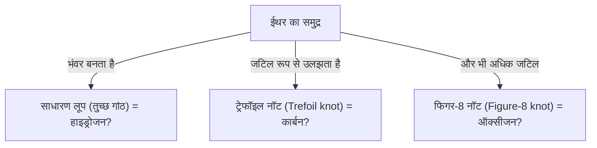
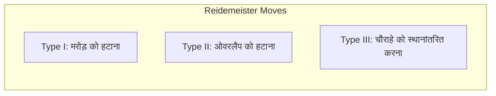

## नॉट थ्योरी (Knot Theory) क्या है?

रोजमर्रा की जिंदगी में जूते के फीते बांधने या इयरफोन के तार उलझने का अनुभव हम सभी को होता है। लेकिन आपको यह जानकर हैरानी हो सकती है कि इसका "गणित के अत्याधुनिक क्षेत्र" से गहरा संबंध है। गणित की एक शाखा, "टोपोलॉजी (Topology)" के अंतर्गत आने वाली "नॉट थ्योरी (Knot Theory)", वास्तव में इसी "उलझाव" के गुणों का कड़ाई से अध्ययन करने वाला विज्ञान है।

सामान्य गांठों और गणितीय गांठों के बीच सबसे बड़ा अंतर यह है कि **इनके दोनों सिरे जुड़े होते हैं (ये बंद वक्र होते हैं)**। यदि सिरे बंधे नहीं हैं, तो कोई भी गांठ अंततः आसानी से खुल जाएगी। लेकिन अगर दोनों सिरों को जोड़कर एक लूप बना दिया जाए, तो उसके "उलझने का तरीका" निश्चित हो जाता है, और जब तक उसे काटा न जाए, तब तक उसे दूसरे प्रकार के उलझाव में नहीं बदला जा सकता।

इस प्रथम दृष्टया साधारण "बंद धागों के उलझाव" को वर्गीकृत करना, और यह पूछना कि "क्या एक गांठ दूसरी गांठ के समान है?" या "क्या इस गांठ को सुलझाया जा सकता है?", नॉट थ्योरी के मूलभूत प्रश्न हैं।

## लॉर्ड केल्विन की 'वोर्टेक्स एटम हाइपोथेसिस': भौतिकी से एक रोमांटिक उत्पत्ति

नॉट थ्योरी को गणित के एक गंभीर विषय के रूप में स्थापित करने के पीछे 19वीं सदी के भौतिक विज्ञानी विलियम थॉमसन (बाद में लॉर्ड केल्विन) की एक आकर्षक परिकल्पना थी।

1867 में, लॉर्ड केल्विन ने "वोर्टेक्स एटम थ्योरी (Vortex Atom Theory)" का प्रस्ताव रखा, जिसमें कहा गया था कि "परमाणु, ईथर (उस समय ब्रह्मांड में व्याप्त माना जाने वाला एक माध्यम) में बने **भंवरों की गांठें** हैं।"
उन्होंने इस बात पर ध्यान दिया कि धुएं के छल्ले (भंवर के छल्ले) स्थिर रूप बनाए रखते हैं, और आपस में टकराने पर भी केवल कंपन करते हैं, टूटते नहीं। उन्होंने सोचा कि यदि विभिन्न रासायनिक तत्वों के बीच का अंतर इन भंवरों के "गांठों के प्रकार (उलझने के तरीके में अंतर)" द्वारा समझाया जा सकता है, तो शायद रसायन विज्ञान की दुनिया को शुद्ध ज्यामिति के रूप में वर्णित किया जा सकता है।

अंततः माइकेल्सन-मोर्ले के प्रयोगों द्वारा ईथर के अस्तित्व को खारिज कर दिया गया, और भौतिकी में वोर्टेक्स एटम हाइपोथेसिस को त्याग दिया गया। हालांकि, उनकी परिकल्पना से प्रेरित होकर, पीटर टैट जैसे गणितज्ञों ने "सभी गांठों को वर्गीकृत करने और एक तालिका बनाने" की एक भव्य परियोजना शुरू की। यही गणित के रूप में नॉट थ्योरी की शुरुआत थी।

## रीडमेइस्टर मूव्स (Reidemeister Moves): गांठों को 'बदलने' के नियम

नॉट थ्योरी में सबसे बड़ी चुनौती यह निर्धारित करना है कि "क्या दो गांठें जो पहली नज़र में अलग दिखती हैं, वास्तव में एक ही हैं (यदि उन्हें बिना काटे विकृत किया जाए तो वे मेल खाती हैं)"।
3-आयामी अंतरिक्ष में एक गांठ को कागज (2-आयाम) पर प्रक्षेपित करने पर जो चित्र बनता है, उसे "नॉट डायग्राम (गांठ का आरेख)" कहा जाता है।

1926 में, कर्ट रीडमेइस्टर ने साबित किया कि गांठ का विरूपण कितना भी जटिल क्यों न हो, आरेख पर इसे **केवल 3 प्रकार के स्थानीय संचालन के संयोजन** द्वारा दर्शाया जा सकता है। इन्हें "रीडमेइस्टर मूव्स (Reidemeister Moves)" कहा जाता है।

1. **टाइप I (Type I)**: मरोड़ जोड़ने या हटाने का संचालन। (धागे का एक लूप बनाना या हटाना)
2. **टाइप II (Type II)**: दो धागों को एक-दूसरे पर रखने या अलग करने का संचालन।
3. **टाइप III (Type III)**: धागे के चौराहे के ऊपर से किसी अन्य धागे को स्लाइड करने का संचालन।

यदि दो नॉट डायग्राम को इन 3 चालों को कई बार दोहराकर समान चित्र में बदला जा सकता है, तो उन्हें "समान गांठें (तुल्य)" कहा जा सकता है। इसके विपरीत, यदि यह साबित किया जा सकता है कि "चाहे कितनी भी बार इन 3 ऑपरेशनों को दोहराया जाए, वे कभी मेल नहीं खाएंगे", तो यह निश्चित हो जाता है कि वे अलग-अलग गांठें हैं।

## जोन्स पॉलीनोमियल (Jones Polynomial): एक महान खोज जिसने गणितीय दुनिया को हिला दिया

कई वर्षों तक, गणितज्ञ "दो गांठें अलग हैं" यह साबित करने के लिए एक शक्तिशाली उपकरण (नॉट इनवेरिएंट) की तलाश में थे। इनवेरिएंट एक मूल्य या सूत्र है जो रीडमेइस्टर मूव्स को लागू करने के बाद भी बिल्कुल नहीं बदलता है।

1928 में, अलेक्जेंडर पॉलीनोमियल की खोज की गई थी और लंबे समय तक एक मानक उपकरण के रूप में उपयोग की जाती थी, लेकिन इसमें दर्पण में देखी गई गांठ (मिरर इमेज) में अंतर न कर पाने जैसी कमजोरियां थीं।

1984 में, न्यूजीलैंड के गणितज्ञ वॉन जोन्स ने वॉन न्यूमैन बीजगणित नामक एक बिल्कुल अलग क्षेत्र में अपने शोध से अचानक एक नए नॉट इनवेरिएंट की खोज की। यही "जोन्स पॉलीनोमियल (Jones Polynomial)" है।

जोन्स पॉलीनोमियल $V(K)$ की गणना गांठ के चौराहों के "चिह्न (प्लस या माइनस)" का उपयोग करके पुनरावर्ती रूप से (स्केन संबंध) की जाती है।

जोन्स पॉलीनोमियल की खोज ने न केवल टोपोलॉजी, बल्कि सांख्यिकीय यांत्रिकी और क्वांटम क्षेत्र सिद्धांत (Quantum Field Theory) जैसे अन्य भौतिकी क्षेत्रों के साथ भी एक गहरा सेतु स्थापित किया। एडवर्ड विटेन ने दिखाया कि जोन्स पॉलीनोमियल को चेर्न-सीमन्स सिद्धांत नामक क्वांटम क्षेत्र सिद्धांत के ढांचे में स्वाभाविक रूप से प्राप्त किया जा सकता है, जिसने गणित और भौतिकी के संलयन को निर्णायक बना दिया। जोन्स और विटेन दोनों को इन उपलब्धियों के लिए 1990 में फील्ड्स मेडल से सम्मानित किया गया था।

## जीवन का रहस्य और गांठें: डीएनए और टोपोइज़ोमेरेज़

नॉट थ्योरी केवल शुद्ध गणित की दुनिया तक सीमित नहीं है। हमारी कोशिकाओं के अंदर डीएनए के व्यवहार को समझने में नॉट थ्योरी एक आवश्यक भूमिका निभाती है।

डीएनए की संरचना डबल-हेलिक्स होती है, लेकिन कोशिका विभाजन के दौरान डीएनए की नकल करने के लिए इस हेलिक्स को खोलना आवश्यक है। हालांकि, चूंकि अत्यंत लंबे और पतले डीएनए स्ट्रैंड कोशिका नाभिक के संकीर्ण स्थान में भरे होते हैं, इसलिए वे प्रतिकृति या प्रतिलेखन की प्रक्रिया के दौरान बुरी तरह मुड़ जाते हैं, उलझ जाते हैं, और सचमुच "गांठें" बन जाती हैं।
यदि इस उलझाव को ऐसे ही छोड़ दिया जाए, तो डीएनए टूट जाएगा और कोशिका मर जाएगी।

यहीं पर "टोपोइज़ोमेरेज़ (Topoisomerase)" नामक एक विशेष एंजाइम सक्रिय होता है।
टोपोइज़ोमेरेज़ आश्चर्यजनक रूप से **"डीएनए स्ट्रैंड को एक बार कैंची की तरह काटता है, दूसरे स्ट्रैंड को उस गैप से गुजारता है, और फिर से जोड़ देता है"** जैसे जादुई काम करता है।

- **टाइप I टोपोइज़ोमेरेज़**: डबल हेलिक्स के केवल एक स्ट्रैंड को काटता है, दूसरे को गुजरने देता है, और फिर से जुड़ता है। (उलझाव की संख्या को 1 बदलता है)
- **टाइप II टोपोइज़ोमेरेज़**: डबल हेलिक्स के दोनों स्ट्रैंड्स को काटता है, दूसरे डबल हेलिक्स को गुजारता है, और फिर से जुड़ता है। (चौराहे के ऊपर और नीचे को उलट देता है)

गणितीय रूप से देखा जाए, तो यह कृत्रिम रूप से गांठ के चौराहे के प्लस/माइनस को उलटने के अलावा और कुछ नहीं है। गणितज्ञ और जीवविज्ञानी यह विश्लेषण करने के लिए सहयोग कर रहे हैं कि नॉट थ्योरी का उपयोग करके टोपोइज़ोमेरेज़ डीएनए की गांठों को कैसे सुलझाता है।

## भविष्य की तकनीक: एनीओन्स और टोपोलॉजिकल क्वांटम कंप्यूटिंग

और आधुनिक समय में, नॉट थ्योरी [अगली पीढ़ी के कंप्यूटर](/hi/p/technology-quantum-computer/), "क्वांटम कंप्यूटर" की प्राप्ति के लिए सबसे महत्वपूर्ण विषयों में से एक बन गई है।

सामान्य क्वांटम कंप्यूटर शोर (गर्मी या विद्युत चुम्बकीय तरंगों) के प्रति बहुत संवेदनशील होते हैं और इनमें गणना त्रुटियों की संभावना अधिक होने की एक घातक कमजोरी होती है। इसे दूर करने का विचार "टोपोलॉजिकल क्वांटम कंप्यूटिंग (Topological Quantum Computing)" है।

2-आयामी अंतरिक्ष में सीमित एक विशेष कण (या अर्ध-कण) जिसे "एनीऑन (Anyon)" कहा जाता है, यदि आप इसकी स्थिति बदलते हैं (जैसे कि एक चोटी की तरह उलझना), तो कण की क्वांटम अवस्था (तरंग समारोह) बदल जाती है।
यदि आप समय अक्ष (तीसरे आयाम) के साथ एनीऑन के प्रक्षेपवक्र को खींचते हैं, तो सचमुच एक "चोटी (Braid)" का प्रक्षेपवक्र खींचा जाता है।

टोपोलॉजिकल क्वांटम कंप्यूटिंग में, इस "एनीऑन ब्रैड की गांठ" का उपयोग क्वांटम गेट (कम्प्यूटेशनल ऑपरेशन) के रूप में किया जाता है।
एक गांठ तब तक अपना प्रकार नहीं बदलेगी जब तक उसे काटा न जाए (जब तक कि टोपोलॉजी न बदले), भले ही स्ट्रैंड को थोड़ा खींचा या हिलाया जाए (भले ही शोर जोड़ा जाए)। दूसरे शब्दों में, गांठ की संरचना में ही जानकारी रिकॉर्ड करके, पर्यावरणीय शोर के प्रति बेहद मजबूत "त्रुटि-मुक्त क्वांटम गणना" संभव हो जाती है।

## निष्कर्ष: न सुलझने वाले रहस्य को सुलझाने की चुनौती

लॉर्ड केल्विन के विफल परमाणु मॉडल से शुरू हुई नॉट थ्योरी ने सदियों का सफर तय कर डीएनए की जीवन गतिविधि को समझने और भविष्य के क्वांटम कंप्यूटरों को डिजाइन करने का आधार बनाया है।

"धागों का उलझना", जो पहली नज़र में बच्चों के खेल जैसा लगता है, ब्रह्मांड की सच्चाई और जीवन के रहस्य को उजागर करने की कुंजी छिपाता है। गणित के विषय का यह सबसे बड़ा आकर्षण है, और यही कारण है कि नॉट थ्योरी आज भी अनगिनत वैज्ञानिकों को आकर्षित करती है।
