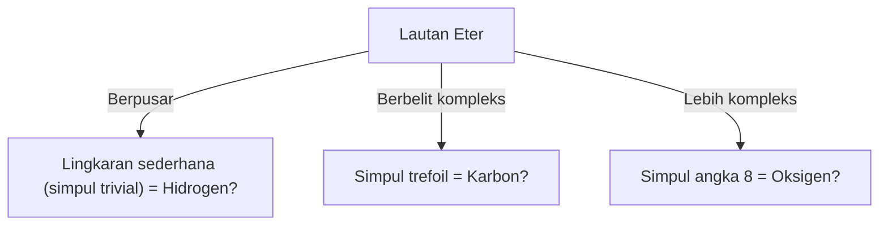
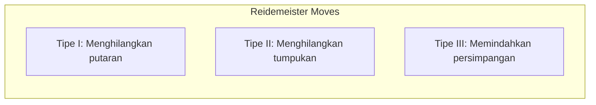

## Apa itu Teori Simpul?

Semua orang pasti pernah mengalami mengikat tali sepatu atau kabel earphone yang kusut dalam kehidupan sehari-hari. Namun, Anda mungkin akan terkejut jika mengetahui bahwa hal ini berkaitan erat dengan "matematika tingkat lanjut". "Teori Simpul (Knot Theory)", yang berada di dalam cabang matematika yang disebut "Topologi", adalah disiplin ilmu yang secara ketat mempelajari sifat "kekusutan" ini.

Perbedaan terbesar antara simpul biasa dan simpul matematis terletak pada kenyataan bahwa **kedua ujungnya menyatu (merupakan kurva tertutup)**. Jika ujungnya tidak diikat, simpul apa pun pada akhirnya akan terlepas dengan mudah. Tetapi jika kedua ujungnya dihubungkan menjadi sebuah lingkaran, cara berbelitnya ditetapkan, dan tidak dapat diubah menjadi bentuk kekusutan lain kecuali jika dipotong.

Mengklasifikasikan "kekusutan tali tertutup" yang tampaknya sederhana ini, dan bertanya "Apakah simpul ini sama dengan simpul yang lain?" atau "Bisakah simpul ini dilepaskan?" adalah proposisi dasar dari Teori Simpul.

## 'Hipotesis Atom Pusaran' Lord Kelvin: Asal Usul Romantis dari Fisika

Latar belakang Teori Simpul menjadi subjek studi matematika yang serius bermula dari hipotesis menarik oleh fisikawan abad ke-19, William Thomson (yang kemudian dikenal sebagai Lord Kelvin).

Pada tahun 1867, Lord Kelvin mengusulkan "Teori Atom Pusaran (Vortex Atom Theory)", yang menyatakan bahwa "atom adalah **simpul pusaran** yang terbentuk di dalam eter (medium yang pada saat itu diyakini mengisi alam semesta)".
Dia memperhatikan bahwa cincin asap (cincin pusaran) mempertahankan bentuknya secara stabil, dan bahkan jika bertabrakan, mereka hanya bergetar dan tidak pecah. Dia berpikir bahwa jika perbedaan antara berbagai unsur kimia dapat dijelaskan oleh "jenis simpul (perbedaan cara berbelit)" dari pusaran ini, maka dunia kimia mungkin dapat dideskripsikan sebagai geometri murni.

Pada akhirnya, keberadaan eter disangkal oleh eksperimen Michelson-Morley, dan hipotesis atom pusaran ditinggalkan dalam dunia fisika. Namun, terinspirasi oleh hipotesisnya, ahli matematika seperti Peter Tait memulai proyek besar untuk "mengklasifikasikan semua simpul dan membuat tabel". Ini adalah awal dari Teori Simpul sebagai bagian dari matematika.

## Gerakan Reidemeister: Aturan untuk 'Mengubah' Simpul

Tantangan terbesar dalam Teori Simpul adalah menentukan "apakah dua simpul yang pada pandangan pertama terlihat berbeda sebenarnya sama (akan cocok jika dideformasi tanpa memotong tali)".
Proyeksi simpul dari ruang 3 dimensi yang digambar di atas kertas (2 dimensi) disebut "diagram simpul".

Pada tahun 1926, Kurt Reidemeister membuktikan bahwa tidak peduli seberapa rumit deformasi sebuah simpul, hal itu dapat direpresentasikan pada diagram dengan kombinasi **hanya 3 jenis operasi lokal**. Ini disebut "Gerakan Reidemeister (Reidemeister Moves)".

1. **Tipe I (Type I)**: Operasi menambahkan atau menghilangkan putaran. (Membuat atau menghilangkan loop tali)
2. **Tipe II (Type II)**: Operasi menumpuk atau memisahkan dua tali.
3. **Tipe III (Type III)**: Operasi menggeser satu tali melewati persimpangan tali lainnya.

Jika dua diagram simpul dapat menjadi gambar yang sama dengan mengulangi 3 gerakan ini beberapa kali, mereka dapat dikatakan sebagai "simpul yang sama (ekuivalen)". Sebaliknya, jika dapat dibuktikan bahwa "tidak peduli berapa kali 3 operasi ini diulang, mereka tidak akan pernah cocok", maka sudah pasti bahwa mereka adalah simpul yang berbeda.

## Polinomial Jones: Penemuan Besar yang Mengguncang Dunia Matematika

Selama bertahun-tahun, ahli matematika mencari alat yang ampuh (invarian simpul) untuk membuktikan bahwa "dua simpul itu berbeda". Invarian adalah nilai atau rumus yang sama sekali tidak berubah bahkan jika gerakan Reidemeister diterapkan.

Polinomial Alexander ditemukan pada tahun 1928 dan digunakan sebagai alat standar untuk waktu yang lama, tetapi memiliki kelemahan seperti tidak dapat membedakan antara simpul dan bayangan cerminnya (citra cermin).

Pada tahun 1984, ahli matematika Selandia Baru Vaughan Jones tiba-tiba menemukan invarian simpul baru dari penelitian di bidang yang sama sekali berbeda yang disebut aljabar von Neumann. Ini adalah "Polinomial Jones (Jones Polynomial)".

Polinomial Jones $V(K)$ dihitung secara rekursif (relasi skein) menggunakan "tanda (positif atau negatif)" dari persimpangan simpul.

Penemuan polinomial Jones tidak hanya membangun jembatan yang dalam ke topologi, tetapi juga ke bidang fisika lain seperti mekanika statistik dan teori medan kuantum. Edward Witten menunjukkan bahwa polinomial Jones secara alami diturunkan dalam kerangka teori medan kuantum yang disebut teori Chern-Simons, memperkuat perpaduan matematika dan fisika. Jones dan Witten dianugerahi Fields Medal pada tahun 1990 atas pencapaian ini.

## Misteri Kehidupan dan Simpul: DNA dan Topoisomerase

Teori Simpul tidak hanya terbatas pada dunia matematika murni. Dalam memahami perilaku DNA di dalam sel kita, Teori Simpul memainkan peran yang sangat penting.

DNA memiliki struktur heliks ganda, tetapi untuk mereplikasi DNA selama pembelahan sel, heliks ini perlu diurai. Namun, karena untai DNA yang sangat panjang dan tipis dikemas dalam ruang sempit nukleus sel, mereka berputar keras dan kusut selama proses replikasi atau transkripsi, secara harfiah membentuk "simpul".
Jika kekusutan ini dibiarkan begitu saja, DNA akan putus dan sel akan mati.

Di sinilah enzim khusus yang disebut "Topoisomerase" berperan aktif.
Secara mengejutkan, topoisomerase melakukan operasi ajaib dengan **"memotong satu untai DNA seperti gunting, melewati untai lain melalui celah tersebut, lalu menyambungnya kembali"**.

- **Topoisomerase Tipe I**: Memotong hanya satu untai heliks ganda, membiarkan untai lainnya lewat, dan menyambung kembali. (Mengubah jumlah ikatan sebanyak 1)
- **Topoisomerase Tipe II**: Memotong kedua untai heliks ganda, melewatkan heliks ganda lainnya, dan menyambung kembali. (Membalikkan bagian atas dan bawah persimpangan)

Secara matematis, ini tidak lain adalah operasi membalikkan nilai positif/negatif dari persimpangan simpul secara artifisial. Ahli matematika dan biologi bekerja sama untuk menganalisis bagaimana topoisomerase melepaskan simpul DNA menggunakan Teori Simpul.

## Teknologi Masa Depan: Anyon dan Komputasi Kuantum Topologis

Dan di zaman modern, Teori Simpul telah menjadi salah satu tema paling penting menuju realisasi "komputer kuantum", [komputer generasi berikutnya](/id/p/technology-quantum-computer/).

Komputer kuantum biasa sangat rentan terhadap gangguan (panas atau gelombang elektromagnetik) dan memiliki kelemahan fatal yaitu rentan terhadap kesalahan perhitungan. Ide untuk mengatasi hal ini adalah "Komputasi Kuantum Topologis (Topological Quantum Computing)".

"Anyon", partikel khusus (atau kuasi-partikel) yang terkurung dalam ruang 2 dimensi, akan mengalami perubahan keadaan kuantum (fungsi gelombang) jika posisinya ditukar (terjerat seperti kepang).
Jika Anda menggambar lintasan anyon di sepanjang sumbu waktu (dimensi ke-3), lintasan "kepang (Braid)" akan tergambar secara harfiah.

Dalam komputasi kuantum topologis, "simpul kepang anyon" ini digunakan sebagai gerbang kuantum (operasi komputasi).
Sebuah simpul tidak akan berubah jenisnya kecuali jika dipotong (kecuali topologinya berubah), bahkan jika talinya sedikit ditarik atau diguncang (bahkan jika ada gangguan). Dengan kata lain, dengan merekam informasi dalam struktur simpul itu sendiri, menjadi mungkin untuk melakukan "komputasi kuantum bebas kesalahan" yang sangat kuat terhadap kebisingan lingkungan.

## Penutup: Tantangan Menuju Misteri yang Tak Terpecahkan

Dimulai dari model atom Lord Kelvin yang gagal, Teori Simpul telah melalui berabad-abad untuk menjadi dasar dalam memahami aktivitas kehidupan DNA dan merancang komputer kuantum masa depan.

"Kekusutan tali" yang sekilas tampak seperti permainan anak-anak, menyembunyikan kunci untuk mengungkap kebenaran alam semesta dan misteri kehidupan. Inilah pesona terbesar dari disiplin matematika, dan alasan mengapa Teori Simpul masih terus memikat banyak ilmuwan hingga saat ini.
