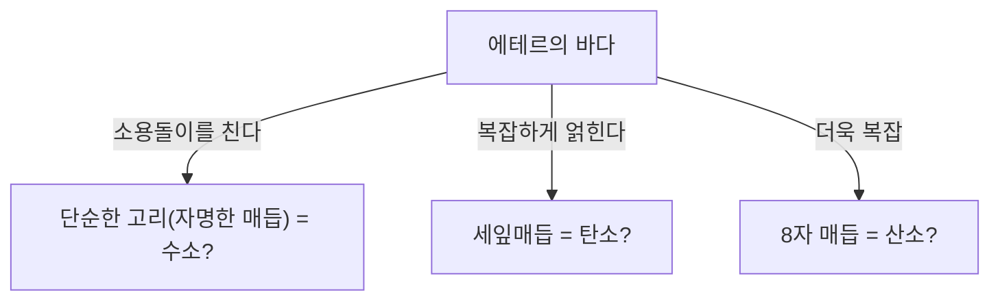
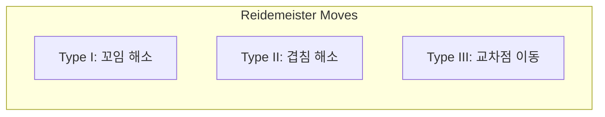

## 매듭 이론이란 무엇인가?

일상생활에서 신발 끈을 묶거나 이어폰 줄이 엉키는 경험은 누구나 있을 것입니다. 하지만 그것이 '수학의 최첨단'과 깊은 관련이 있다고 하면 놀랄지도 모릅니다. 수학의 한 분야인 '위상수학(Topology)'에 속하는 '매듭 이론(Knot Theory)'은 바로 이 '얽힘'의 성질을 엄밀하게 연구하는 학문입니다.

일반적인 매듭과 수학적 매듭의 가장 큰 차이점은 <strong>양끝이 붙어 있다는 점(폐곡선이라는 점)</strong>에 있습니다. 끝이 고정되어 있지 않다면 어떤 매듭도 결국에는 스르르 풀려버리고 맙니다. 하지만 양끝을 연결하여 고리로 만들면 그 '얽힌 방식'은 고정되며, 자르지 않는 이상 다른 얽힌 방식으로 변화시킬 수 없습니다.

이 언뜻 보기에 단순한 '닫힌 끈의 얽힘'을 분류하고, "어떤 매듭과 다른 매듭은 같은가?", "이 매듭은 풀 수 있는가?"를 묻는 것이 매듭 이론의 기본 명제입니다.

## 켈빈 경의 '소용돌이 원자 가설': 물리학에서 온 로맨틱한 기원

매듭 이론이 본격적으로 수학의 대상이 된 배경에는 19세기 물리학자 윌리엄 톰슨(후의 켈빈 경)의 매력적인 가설이 있습니다.

1867년, 켈빈 경은 "원자란 에테르(당시 존재한다고 여겨졌던 우주를 채우는 매질) 속에 생긴 **소용돌이의 매듭**이다"라는 '소용돌이 원자 가설(Vortex Atom Theory)'을 제창했습니다.
그는 연기 고리(소용돌이 고리)가 안정적으로 형태를 유지하며, 서로 부딪혀도 진동할 뿐 깨지지 않는 성질을 가진 것에 주목했습니다. 만약 다양한 원소의 차이가 이 소용돌이의 '매듭의 종류(얽힌 방식의 차이)'에 의해 설명될 수 있다면, 화학의 세계를 순수한 기하학으로 기술할 수 있지 않을까 생각했던 것입니다.

최종적으로 마이켈슨-몰리의 실험 등에 의해 에테르의 존재는 부정되었고, 소용돌이 원자 가설은 물리학으로서는 폐기되었습니다. 하지만 그의 가설에 자극을 받은 피터 테이트 등의 수학자들이 "모든 매듭을 분류하고 표를 작성한다"는 장대한 프로젝트를 시작했습니다. 이것이 수학으로서의 매듭 이론의 여명이 된 것입니다.

## 라이데마이스터 이동: 매듭을 '변형'하는 규칙

매듭 이론에 있어서 가장 큰 난제는 "언뜻 보기에 달라 보이는 두 개의 매듭이 사실은 같은 것(끈을 자르지 않고 변형시키면 일치하는 것)인가"를 판정하는 것입니다.
3차원 공간에 있는 매듭을 종이 위(2차원)에 투영하여 그린 것을 '매듭의 사영도'라고 부릅니다.

1926년, 쿠르트 라이데마이스터는 아무리 복잡한 매듭의 변형이라도 사영도 위에서는 **단 3가지의 국소적인 조작의 조합**으로 표현할 수 있다는 것을 증명했습니다. 이를 '라이데마이스터 이동(Reidemeister Moves)'이라고 부릅니다.

1. **타입 I (Type I)**: 꼬임을 더하거나 푸는 조작. (끈의 루프를 만들거나 없앤다)
2. **타입 II (Type II)**: 두 가닥의 끈을 겹치거나 떼어놓는 조작.
3. **타입 III (Type III)**: 끈의 교차점 위를 다른 끈이 미끄러져 지나가는 조작.

만약 두 매듭 사영도가 이 3가지 변형을 몇 번 반복하여 같은 그림이 된다면, 그것들은 '같은 매듭(동치)'이라고 할 수 있습니다. 반대로 말하면, "아무리 이 3가지 조작을 반복해도 결코 일치하지 않는다"는 것을 증명할 수 있다면, 그것들이 다른 매듭이라는 것이 확정됩니다.

## 존스 다항식: 수학계를 뒤흔든 대발견

오랜 세월 동안 수학자들은 '두 매듭이 다르다는 것'을 증명하기 위한 강력한 도구(매듭 불변량)를 찾아 헤맸습니다. 불변량이란 라이데마이스터 이동을 수행해도 절대 변하지 않는 값이나 수식을 말합니다.

1928년에 알렉산더 다항식이 발견되어 오랫동안 표준적인 도구로 사용되었으나, 거울에 비친 매듭(거울상)을 구별하지 못하는 등의 약점이 있었습니다.

1984년, 뉴질랜드의 수학자 본 존스는 폰 노이만 대수라는 전혀 다른 분야의 연구에서 돌연 새로운 매듭 불변량을 발견했습니다. 이것이 바로 '존스 다항식(Jones Polynomial)'입니다.

존스 다항식 $V(K)$ 는 매듭 교차점의 '부호(플러스인지 마이너스인지)'를 사용하여 재귀적으로 계산(스케인 관계식)됩니다.

존스 다항식의 발견은 위상수학뿐만 아니라 통계역학이나 양자장 이론 등 다른 물리학 분야와의 사이에 깊은 가교를 놓았습니다. 에드워드 위튼은 존스 다항식이 체른-사이먼스 이론이라는 양자장 이론의 틀에서 자연스럽게 도출된다는 것을 보여주었고, 수학과 물리학의 융합을 결정지었습니다. 존스와 위튼은 이 공로로 1990년에 필즈상을 수상했습니다.

## 생명의 신비와 매듭: DNA와 토포이소머라아제

매듭 이론은 순수 수학의 세계에만 머물지 않습니다. 우리 세포 속에 있는 DNA의 움직임을 이해하는 데 있어 매듭 이론은 필수불가결한 역할을 하고 있습니다.

DNA는 이중 나선 구조를 하고 있지만, 세포 분열 시에 DNA를 복제하기 위해서는 이 나선을 풀어야 합니다. 하지만 극도로 길고 가느다란 DNA 가닥은 세포핵이라는 좁은 공간에 채워져 있기 때문에 복제나 전사 과정에서 격렬하게 꼬이고 얽히며 말 그대로 '매듭'이 생기고 맙니다.
이 얽힘을 방치하면 DNA는 끊어지고 세포는 죽게 됩니다.

여기서 활약하는 것이 '토포이소머라아제(Topoisomerase)'라는 특수한 효소입니다.
토포이소머라아제는 놀랍게도 **"DNA 사슬을 한 번 가위처럼 자르고, 다른 사슬을 그 틈으로 통과시킨 후 다시 이어 붙이는"** 마술과도 같은 조작을 합니다.

- **타입 I 토포이소머라아제**: 이중 나선의 한쪽 사슬만 자르고 다른 쪽을 통과시켜 재결합한다. (얽힘 횟수를 1개 바꾼다)
- **타입 II 토포이소머라아제**: 이중 나선의 양쪽 사슬을 모두 자르고 다른 이중 나선을 통과시켜 재결합한다. (교차의 위아래를 반전시킨다)

이것은 수학적으로 보면 매듭 교차의 플러스 마이너스를 인위적으로 반전시키는 조작에 다름 아닙니다. 수학자와 생물학자는 협력하여 토포이소머라아제가 어떻게 DNA의 매듭을 풀고 있는지를 매듭 이론을 사용하여 분석하고 있습니다.

## 미래의 테크놀로지: 애니온과 위상 양자 계산

그리고 현대에 매듭 이론은 [차세대 컴퓨터](/ko/p/technology-quantum-computer/)인 '양자 컴퓨터'의 실현을 향한 가장 중요한 테마 중 하나가 되었습니다.

일반적인 양자 컴퓨터는 노이즈(열이나 전자기파)에 매우 약하여 계산 오류가 일어나기 쉽다는 치명적인 약점이 있습니다. 이를 극복하기 위한 아이디어가 '위상 양자 계산(Topological Quantum Computing)'입니다.

2차원 공간에 갇힌 특수한 입자(또는 준입자)인 '애니온(Anyon)'은 위치를 맞바꾸면(땋은 머리처럼 얽히게 하면) 입자의 양자 상태(파동 함수)가 변화합니다.
애니온의 궤적을 시간축(3차원)을 따라 그리면 말 그대로 '땋은 머리(Braid)'의 궤적이 그려집니다.

위상 양자 계산에서는 이 '애니온의 땋은 매듭'을 양자 게이트(계산 조작)로 이용합니다.
매듭은 다소 끈을 당기거나 흔들어도(노이즈가 가해져도) 끈을 자르지 않는 한(위상이 변하지 않는 한) 그 종류는 변하지 않습니다. 즉, 매듭의 구조 자체에 정보를 기록함으로써 환경 노이즈에 대해 지극히 견고한 '오류가 일어나지 않는 양자 계산'이 가능해지는 것입니다.

## 맺음말: 풀리지 않는 수수께끼에 대한 도전

켈빈 경의 실패한 원자 모형에서 시작된 매듭 이론은 수 세기의 시간을 거쳐 DNA의 생명 활동을 규명하고 미래의 양자 컴퓨터를 설계하기 위한 기반이 되었습니다.

언뜻 보면 아이들의 놀이처럼 보이는 '끈의 얽힘'에 우주의 진리나 생명의 수수께끼를 푸는 열쇠가 숨겨져 있다. 이것이야말로 수학이라는 학문이 가지는 가장 큰 매력이자 매듭 이론이 지금도 수많은 과학자들을 매료시켜 마지않는 이유인 것입니다.
